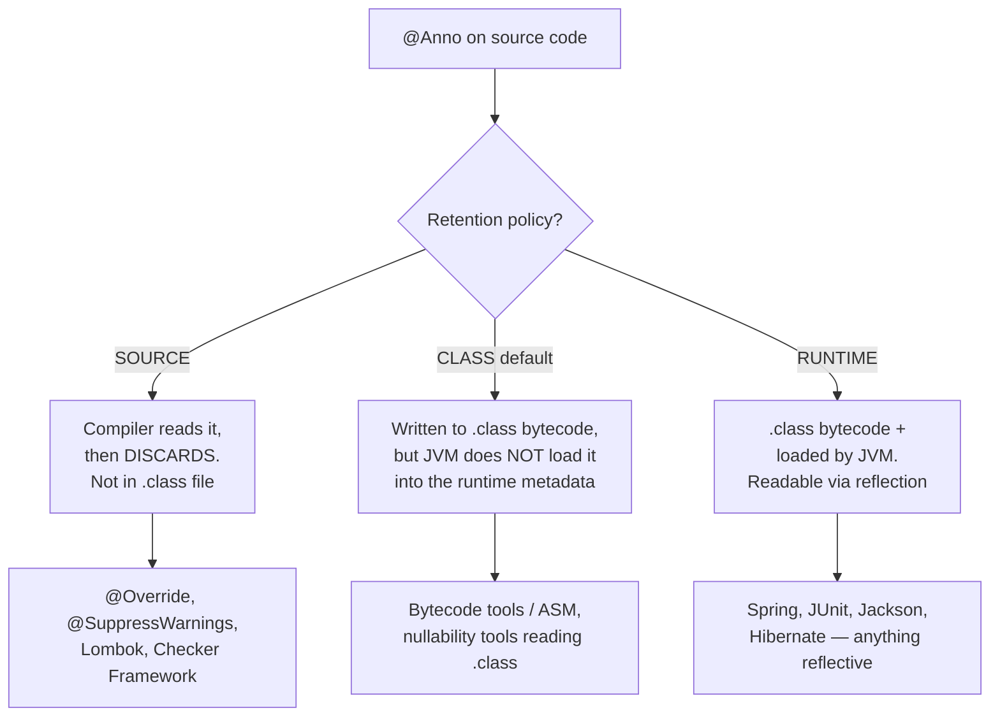
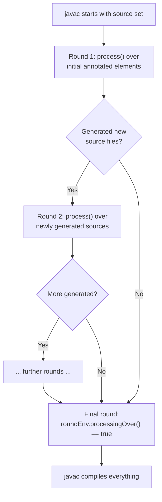

# Java Annotations & Annotation Processing

## 1. What

An annotation is **metadata attached to program elements** (types, methods, fields, parameters, local variables, type-uses) declared with the `@interface` keyword. An annotation does *nothing* on its own — it is inert syntax that changes no behavior. It only matters when a **consumer** reads it: the compiler (`@Override`), a compile-time annotation processor (Lombok, MapStruct, Dagger), or runtime code using reflection (Spring, JUnit, Jackson). The single most important property of an annotation is its **retention** — how far into the build/runtime pipeline the metadata survives — because that determines *which* consumer can even see it.

## 2. Why

- **Decouples declaration from wiring.** Instead of imperative registration code, you *tag* an element and a framework discovers it. `@Test`, `@Entity`, `@Autowired` all replace boilerplate config with declarative markers.
- **Retention is the killer interview concept.** Nearly every "why doesn't my custom annotation work with Spring/reflection?" bug is a `@Retention` mistake. Knowing SOURCE vs CLASS vs RUNTIME instantly separates a senior from a junior.
- **Two consumption models, very different cost.** Runtime reflection (flexible, but pays a per-lookup cost and defers errors to runtime) vs compile-time processing (generates code, zero runtime overhead, fails the build early). Interviewers probe whether you understand this trade-off — it underpins why Micronaut/Quarkus/Dagger chose codegen over Spring-style reflection.
- **Reflection API fluency.** `isAnnotationPresent` / `getAnnotation` / `getAnnotationsByType` are the exact methods you need to *build* a mini-framework in a live-coding round.
- **Type annotations & pluggable type systems** (Java 8+ `TYPE_USE`) show depth beyond the basics.

## 3. How

### 3.1 Declaring a custom annotation

You declare an annotation with `@interface`. Its members look like **abstract no-arg methods** — each defines an *element* whose return type is the element's type and whose (optional) `default` supplies a value when the user omits it.

```java
public @interface Loggable {
    String value();                 // required element, no default
    Level level() default Level.INFO;
    String[] tags() default {};     // array default is {} — never null
    boolean async() default false;
}

enum Level { DEBUG, INFO, WARN }
```

Usage. When the *only* element you set is named exactly `value`, you may drop `value =`:

```java
@Loggable("audit")                              // shorthand for value = "audit"
@Loggable(value = "audit", level = Level.WARN)  // explicit when setting others
```

**Allowed element types are restricted** — you cannot use arbitrary objects. Permitted:

| Category | Examples |
|---|---|
| Primitives | `int`, `long`, `boolean`, `double`, ... |
| `String` | `String name();` |
| `Class` | `Class<?> handler();` |
| Enum | `Level level();` |
| Another annotation | `Retry retry();` |
| Arrays of the above | `String[] tags();`, `Class<?>[] groups();` |

No `List`, no `Object`, no custom POJO, no generics on the value itself. Values must also be **compile-time constants**.

**Naming by member count:**

| Kind | Shape | Example |
|---|---|---|
| Marker | zero elements | `@Override`, `@Deprecated` |
| Single-element | one element named `value` | `@SuppressWarnings("unchecked")` |
| Multi-element | multiple elements | `@RequestMapping(path=..., method=...)` |

> [!WARNING]
> Element defaults **cannot be `null`**. `String name() default null;` fails to compile. Use an empty string `""` or an array `{}` as the "absent" sentinel, and let the consumer treat it as unset. This is why so many annotations use `""` to mean "derive it".

### 3.2 Meta-annotations

Meta-annotations are annotations you place **on an annotation declaration** to configure it.

| Meta-annotation | Purpose | Key detail |
|---|---|---|
| `@Retention` | How long the annotation is kept | `SOURCE` / `CLASS` (default) / `RUNTIME` |
| `@Target` | Which element kinds it may annotate | If absent, applicable everywhere |
| `@Inherited` | Subclasses inherit the annotation | **Class-level only**, class inheritance only |
| `@Documented` | Include in generated Javadoc | Purely cosmetic |
| `@Repeatable` | Allow the same annotation multiple times | Needs a container annotation |

#### @Retention — the concept that matters most

```java
@Retention(RetentionPolicy.RUNTIME)
public @interface Loggable { }
```



| Policy | In `.class`? | Loaded at runtime? | Reflection sees it? | Typical users |
|---|---|---|---|---|
| `SOURCE` | No | No | No | `@Override`, Lombok, APT-consumed markers |
| `CLASS` (**default**) | Yes | No | No | Bytecode-weaving / offline `.class` analysis |
| `RUNTIME` | Yes | Yes | **Yes** | Spring, JUnit, Jackson, Hibernate |

> [!IMPORTANT]
> If you do not specify `@Retention`, the default is `CLASS`, **not** `RUNTIME`. A custom annotation you want Spring/JUnit/Jackson to read at runtime **must** be `@Retention(RUNTIME)`, or `getAnnotation(...)` silently returns `null` and your framework never fires. This is the number-one gotcha.

#### @Target — where it can be applied

```java
@Target({ElementType.METHOD, ElementType.TYPE})
public @interface Loggable { }
```

Common `ElementType` values:

| ElementType | Applies to |
|---|---|
| `TYPE` | class, interface, enum, annotation |
| `METHOD` | methods |
| `FIELD` | fields (incl. enum constants) |
| `PARAMETER` | method/constructor parameters |
| `CONSTRUCTOR` | constructors |
| `LOCAL_VARIABLE` | local variables |
| `ANNOTATION_TYPE` | annotation declarations (i.e. meta-annotations) |
| `PACKAGE` | `package-info.java` |
| `TYPE_PARAMETER` | generic type params: `<@NonNull T>` (Java 8+) |
| `TYPE_USE` | *any use of a type*: `@NonNull String` (Java 8+) |

Applying an annotation to a disallowed target is a **compile error**. If `@Target` is omitted, the annotation is usable on any declaration context (but not `TYPE_USE`/`TYPE_PARAMETER` unless listed).

#### @Inherited — the subtle one

`@Inherited` means: if a **class** is annotated, its **subclasses** report that annotation via reflection even though they don't declare it themselves.

```java
@Inherited
@Retention(RetentionPolicy.RUNTIME)
@Target(ElementType.TYPE)
@interface Auditable { }

@Auditable class Base { }
class Child extends Base { }   // no annotation declared here

// Child.class.isAnnotationPresent(Auditable.class) == true  (inherited)
// Child.class.getDeclaredAnnotations() does NOT contain it  (not declared)
```

> [!WARNING]
> `@Inherited` has three hard limits people forget: (1) it works **only** on class-level (`TYPE`) annotations; (2) it follows **class** inheritance only — annotations on **interfaces are never inherited** by implementing classes; (3) it does **not** apply to method or field annotations — an overriding method does not inherit its parent method's annotations. Spring's own `@Transactional`-on-subclass behavior is provided by Spring's `AnnotatedElementUtils`, *not* by plain `@Inherited`.

#### @Documented and @Repeatable

`@Documented` just includes the annotation in generated Javadoc for the annotated element.

`@Repeatable` (Java 8) lets you apply the same annotation multiple times to one element. It requires a **container annotation** whose sole `value()` is an array of the repeatable type:

```java
@Repeatable(Schedules.class)
@Retention(RetentionPolicy.RUNTIME)
@Target(ElementType.METHOD)
@interface Schedule { String cron(); }

@Retention(RetentionPolicy.RUNTIME)   // container must retain at least as long
@Target(ElementType.METHOD)
@interface Schedules { Schedule[] value(); }   // holder array

@Schedule(cron = "0 0 * * *")
@Schedule(cron = "0 12 * * *")
void report() { }
```

Under the hood the compiler wraps the repeats into a single `@Schedules`. So `getAnnotation(Schedule.class)` returns `null` (there's only a `Schedules` present!) — you must use `getAnnotationsByType(Schedule.class)`, which is repeatable-aware and unwraps the container.

### 3.3 Why retention MUST be RUNTIME for frameworks

Frameworks like **Spring, JUnit, Jackson, Hibernate** never see your source code. At runtime they hold a `Class`/`Method`/`Field` object and ask "is this annotated?" via **reflection**. Reflection can only read annotations that the JVM loaded into runtime metadata — i.e. `RUNTIME` retention. Therefore:

- `@Test`, `@Autowired`, `@Entity`, `@JsonProperty`, `@RestController` are all `@Retention(RUNTIME)`. They *have* to be.
- `@Override`, `@SuppressWarnings`, `@FunctionalInterface` are `SOURCE` — they are checked by `javac` and thrown away; keeping them at runtime would be wasted metadata.
- **Lombok** annotations (`@Getter`, `@Data`) are `SOURCE`: consumed by a compile-time processor that injects code; nothing needs them afterward.

The mental model: **retention level == which consumer you're writing for.** Compiler/processor-consumed → SOURCE. Runtime-reflection-consumed → RUNTIME. CLASS is a niche middle ground for tools that read `.class` files offline (ASM, bytecode nullability analyzers) without loading them.

### 3.4 Reading annotations via reflection

The reflection surface lives on `java.lang.reflect.AnnotatedElement` (implemented by `Class`, `Method`, `Field`, `Constructor`, `Parameter`, ...):

| Method | Returns |
|---|---|
| `isAnnotationPresent(Class)` | `boolean` — is this annotation directly (or inherited) present |
| `getAnnotation(Class)` | the annotation instance, or `null` |
| `getAnnotations()` | all present annotations (incl. inherited) |
| `getDeclaredAnnotations()` | only annotations declared *directly* (ignores `@Inherited`) |
| `getAnnotationsByType(Class)` | repeatable-aware — unwraps container annotations |
| `getDeclaredAnnotationsByType(Class)` | repeatable-aware, direct only |

**Worked example — a `@Benchmark` runner.** Define a runtime annotation, then a reflective driver that finds annotated methods and times them:

```java
import java.lang.annotation.*;
import java.lang.reflect.Method;

@Retention(RetentionPolicy.RUNTIME)   // MUST be RUNTIME so reflection sees it
@Target(ElementType.METHOD)
@interface Benchmark {
    int iterations() default 1;
}

class Workloads {
    @Benchmark(iterations = 3)
    public void hashing() { for (int i = 0; i < 1_000_000; i++) Integer.toString(i).hashCode(); }

    public void notBenchmarked() { }   // no annotation -> skipped
}

class BenchmarkRunner {
    static void run(Object target) throws Exception {
        Class<?> clazz = target.getClass();
        for (Method m : clazz.getDeclaredMethods()) {
            if (!m.isAnnotationPresent(Benchmark.class)) continue;   // filter
            Benchmark cfg = m.getAnnotation(Benchmark.class);        // read elements
            m.setAccessible(true);
            long start = System.nanoTime();
            for (int i = 0; i < cfg.iterations(); i++) m.invoke(target);
            long ns = System.nanoTime() - start;
            System.out.printf("%s: %d iters in %.2f ms%n",
                    m.getName(), cfg.iterations(), ns / 1_000_000.0);
        }
    }

    public static void main(String[] args) throws Exception {
        run(new Workloads());
    }
}
```

This is literally a miniature JUnit. The annotation instance returned by `getAnnotation` is a **JDK dynamic proxy** implementing the annotation interface — calling `cfg.iterations()` returns the value you wrote (or the default).

### 3.5 Compile-time annotation processing (APT)

Annotation processing runs **inside `javac`** during compilation. A processor implements `javax.annotation.processing.Processor` (almost always by extending `AbstractProcessor`). The compiler discovers processors via the `META-INF/services/javax.annotation.processing.Processor` service file (Google's `@AutoService` generates it for you).

```java
import javax.annotation.processing.*;
import javax.lang.model.SourceVersion;
import javax.lang.model.element.*;
import java.util.Set;

@SupportedAnnotationTypes("com.example.Builderify")   // which annotations to handle
@SupportedSourceVersion(SourceVersion.RELEASE_17)
public class BuilderProcessor extends AbstractProcessor {

    @Override
    public boolean process(Set<? extends TypeElement> annotations,
                           RoundEnvironment roundEnv) {
        for (Element e : roundEnv.getElementsAnnotatedWith(Builderify.class)) {
            if (e.getKind() != ElementKind.CLASS) continue;
            TypeElement type = (TypeElement) e;
            try {
                // Filer creates NEW source files; it never edits existing ones.
                JavaFileObject file = processingEnv.getFiler()
                        .createSourceFile(type.getQualifiedName() + "Builder", type);
                try (var w = file.openWriter()) {
                    w.write("// generated builder for " + type.getSimpleName());
                }
            } catch (Exception ex) {
                processingEnv.getMessager()
                        .printMessage(Diagnostic.Kind.ERROR, ex.getMessage(), e);
            }
        }
        return true;   // true = these annotations are "claimed" by this processor
    }
}
```

**The rounds model.** Processing is iterative:



Because generated files can themselves contain annotations, `javac` re-runs `process()` in a new **round** over the freshly generated sources, until a round produces nothing new. The last call has `roundEnv.processingOver() == true` for cleanup.

Key APT pieces:

| Piece | Role |
|---|---|
| `AbstractProcessor.process(...)` | your entry point per round; return `true` to claim the annotations |
| `RoundEnvironment` | `getElementsAnnotatedWith(...)`, `processingOver()` |
| `Filer` | generate **new** `.java` / `.class` / resource files |
| `Messager` | emit compile errors/warnings tied to an `Element` (fail the build cleanly) |
| `Elements` / `Types` | utility APIs to inspect the model |
| `@SupportedAnnotationTypes` | annotations this processor handles |
| `@SupportedSourceVersion` | max source version supported |

> [!IMPORTANT]
> The **standard** processing API (`javax.annotation.processing`) is *generate-only* — via `Filer` you create new source files; you **cannot modify or mutate existing classes' ASTs** through the public API. Processors that appear to "edit" your class are doing something non-standard.

**Real-world processors:**

- **Lombok** — the famous hack: it reaches into `javac`'s **internal** compiler AST (`com.sun.tools.javac`) and mutates it, so `@Getter` really does add methods to *your* class. This is unsupported/internal API, which is why Lombok breaks on new JDKs and needs an IDE plugin.
- **MapStruct**, **Dagger**, **Google `@AutoValue`**, **Micronaut** — the clean approach: generate *separate* new source files (mappers, `_Factory`, `AutoValue_*` subclasses, bean definitions).

**Compile-time codegen vs runtime reflection:**

| | Compile-time processing | Runtime reflection |
|---|---|---|
| When it runs | during `javac` | during program execution |
| Runtime cost | none — code already generated | per-lookup reflection cost |
| Error timing | build fails early | fails at runtime |
| Startup | fast (no scanning) | slower (classpath scan) — matters for serverless/native |
| Examples | Dagger, MapStruct, Micronaut | Spring (classic), JUnit, Jackson |

This trade-off is exactly why Micronaut/Quarkus/Dagger favour codegen for fast startup and GraalVM native-image friendliness, whereas classic Spring leans on runtime reflection for flexibility.

### 3.6 Type annotations (Java 8+)

Before Java 8, annotations could only sit on *declarations*. `ElementType.TYPE_USE` (and `TYPE_PARAMETER`) let annotations attach to **any use of a type**:

```java
@Target(ElementType.TYPE_USE)
@Retention(RetentionPolicy.RUNTIME)
@interface NonNull { }

@NonNull String name;                       // the type of a field
List<@NonNull String> names;                // a type argument
String s = (@NonNull String) obj;           // a cast
void m() throws @Critical IOException { }    // a thrown type
```

These power **pluggable type systems** like the **Checker Framework**, which runs as a processor and statically verifies nullness, tainting, units, etc. — catching `NullPointerException`s at compile time. The annotations are typically `SOURCE`/`CLASS` retained because a compile-time checker consumes them.

### 3.7 Built-in annotations

| Annotation | Retention | Purpose |
|---|---|---|
| `@Override` | SOURCE | assert a method overrides/implements a supertype method; compile error if it doesn't |
| `@Deprecated` | RUNTIME | mark as obsolete; Java 9 added `forRemoval` and `since` |
| `@SuppressWarnings` | SOURCE | silence named compiler warnings, e.g. `"unchecked"`, `"deprecation"` |
| `@FunctionalInterface` | RUNTIME | assert exactly one abstract method; compile error otherwise |
| `@SafeVarargs` | RUNTIME | suppress unchecked-varargs warnings on a generic-varargs method |

```java
@Deprecated(since = "9", forRemoval = true)   // Java 9+: signals it will be deleted
public void legacy() { }
```

`@FunctionalInterface` is documentation-plus-enforcement: the interface still works as a lambda target without it, but the annotation makes `javac` reject a second abstract method.

### 3.8 Structural gotchas

> [!WARNING]
> **Annotation types have no inheritance.** You cannot write `@interface A extends B` — an `@interface` implicitly and only extends `java.lang.annotation.Annotation`. There is no way to share elements between annotations via inheritance. (Spring fakes "meta-annotations compose" behavior at runtime with its own `AnnotatedElementUtils`; the language does not.)

Other traps:

- **Element order** in the declaration is not semantically significant, but tools/Javadoc render them in declaration order — keep it stable.
- Array element defaults are `{}`; you provide values with `@Anno(tags = {"a", "b"})`, and a single value may drop the braces: `@Anno(tags = "a")`.
- All element values must be **compile-time constants** — no method calls, no `new`.
- `null` is never a legal element value or default; enums/Strings/`""`/`{}` are the "unset" idioms.
- An annotation with a **required** element (no default) forces callers to supply it — omitting is a compile error.

**Cross-reference:** the *applied Spring angle* — defining a custom `@interface`, retaining it at `RUNTIME`, and wiring it to behavior via an AOP `@Around("@annotation(...)")` pointcut — is covered in the Spring Boot notes. **This** note is the language-mechanics companion: it explains *why* that custom annotation needs `RUNTIME` retention and *how* the reflective read that Spring performs actually works.

## 4. Interview Angles

- **Q: What are the three retention policies and which one do frameworks need?** SOURCE (discarded by compiler — `@Override`, Lombok), CLASS (default; written to bytecode but not loaded at runtime), RUNTIME (loaded and readable via reflection). Frameworks (Spring/JUnit/Jackson) reflect at runtime, so their annotations and any custom annotation they must read need **RUNTIME**.

- **Q: I wrote a custom annotation and Spring/my reflective code ignores it. Why?** Almost certainly missing `@Retention(RetentionPolicy.RUNTIME)`. The default is CLASS, so `getAnnotation(...)` returns `null` at runtime and nothing fires.

- **Q: Does an annotation do anything by itself?** No. It's inert metadata. It only has effect when a consumer — compiler, annotation processor, or reflective runtime code — reads and acts on it.

- **Q: How do you read an annotation at runtime?** Via `AnnotatedElement` methods on `Class`/`Method`/`Field`: `isAnnotationPresent(...)`, `getAnnotation(...)` (returns a dynamic-proxy instance), `getAnnotationsByType(...)` for repeatables, `getDeclaredAnnotations()` for direct-only.

- **Q: What types can annotation elements be?** Primitives, `String`, `Class`, enums, other annotations, and arrays of those — all compile-time constants. Not arbitrary objects, collections, or `null`.

- **Q: How does `@Repeatable` work and why can `getAnnotation` return null for a repeated annotation?** You declare a container annotation holding an array `value()`. The compiler wraps repeats into the container, so only the container is "present" — use `getAnnotationsByType(X.class)` (repeatable-aware) instead of `getAnnotation(X.class)`.

- **Q: What are the limits of `@Inherited`?** Class-level annotations only, via class inheritance only. Interface annotations are never inherited, and method/field annotations are never inherited by overrides.

- **Q: Difference between compile-time annotation processing and runtime reflection?** APT runs inside `javac`, generates code with `Filer`, zero runtime cost, fails the build early (Dagger, MapStruct, Micronaut). Reflection reads annotations at runtime — flexible but pays a lookup cost and defers errors (classic Spring, JUnit). Codegen wins for startup/native-image.

- **Q: Can annotation processors modify existing classes?** Not through the standard API — `Filer` only *creates new* source/class files. Lombok mutates the compiler's internal AST via non-public `com.sun.tools.javac` APIs, which is why it's fragile across JDK versions.

- **Q: What is the rounds model in APT?** `process()` may run multiple rounds: generated sources can carry annotations, so `javac` re-invokes the processor over the new sources until no more are generated; the final round has `roundEnv.processingOver() == true`.

- **Q: What did `TYPE_USE` add in Java 8?** Annotations on any *use* of a type (`@NonNull String`, type arguments, casts, `throws`), enabling pluggable type checkers like the Checker Framework to verify nullness/etc. at compile time.

- **Q: Can one annotation extend another to share elements?** No — annotation types have no inheritance; they implicitly extend only `java.lang.annotation.Annotation`. "Meta-annotation composition" you see in Spring is a runtime convenience Spring implements itself, not a language feature.

- **Q: Why is `@Override` SOURCE but `@Deprecated` RUNTIME?** `@Override` is a compile-time correctness check with no runtime value, so it's discarded. `@Deprecated` needs to be visible to tools/IDEs and reflective callers at runtime (and drives runtime warnings), so it's retained.
