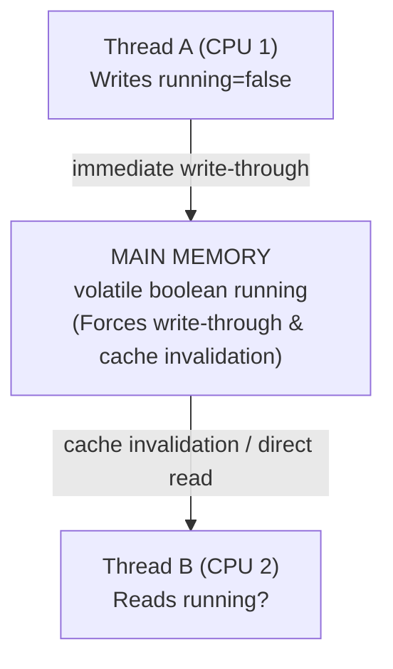
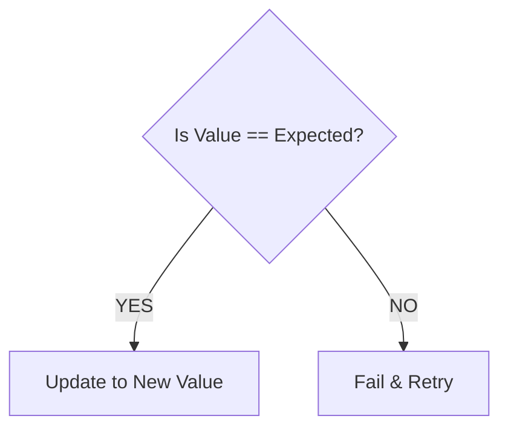
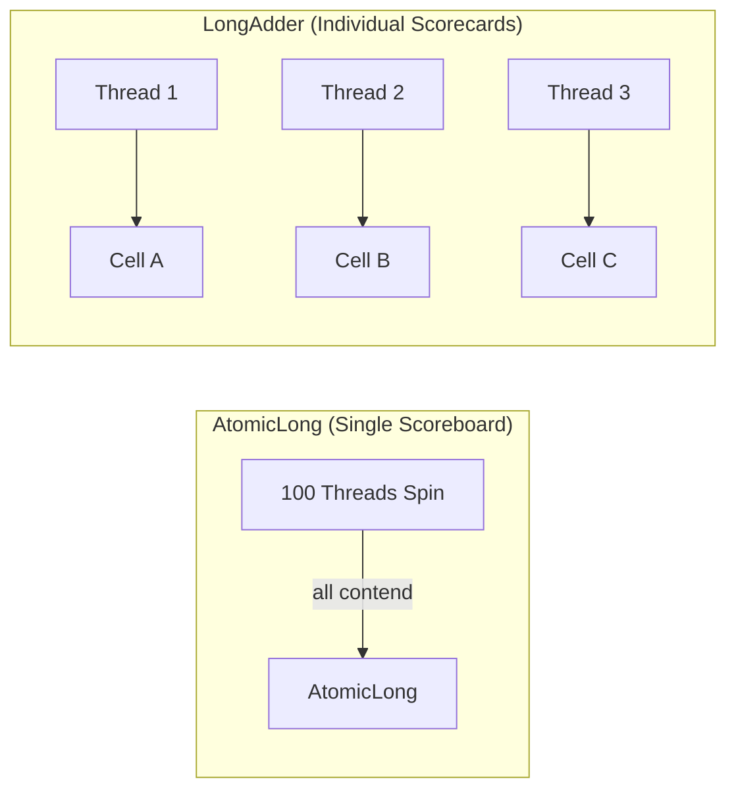

# CAS, Atomics, Volatile, and Concurrent Collections

If you write multithreaded code using only locks (`synchronized` or `ReentrantLock`), you are like a shopkeeper who lets only **one customer enter the shop at a time**. It is safe, but it causes long lines.

To speed things up, Java provides lock-free tools. This guide explains these tools from the ground up using simple analogies, helping you understand when and how to use them.

---

## 1. Volatile — *The Glass Box (Visibility)*

Every CPU core has its own high-speed cache memory. When a thread reads a variable, it often copies it from the main computer memory into its local CPU cache to work faster. 

* **The Problem**: If Thread A updates a shared variable in its local cache, Thread B (running on a different CPU core) might continue reading the old, cached value from its own cache. They are out of sync!
* **The Analogy**: Imagine writing a status note on a private notebook at your desk. Nobody else knows you updated it until you publish it on the **shared office whiteboard**.

`volatile` is a Java keyword that turns a variable into a **whiteboard** (or a **Glass Box**):



1. **Immediate Visibility**: When Thread A writes to a `volatile` variable, it is written directly back to main memory immediately.
2. **Instant Invalidation**: When Thread B reads a `volatile` variable, it is forced to ignore its CPU cache and read the latest value directly from main memory.

### The Big Trap: `volatile` is NOT enough for `count++`
A common beginner mistake is thinking `volatile` makes counter increments thread-safe. It does not!

```java
volatile int count = 0;

// Thread 1 and Thread 2 run this concurrently:
count++; 
```

Why is this unsafe? Because `count++` is a **compound operation** made of three separate steps:
1. **Read** `count` from memory (e.g., reads `5`).
2. **Modify** it in the CPU (adds `1` to get `6`).
3. **Write** it back to memory.

If Thread 1 and Thread 2 both read `5` at the same time, they will both write `6` back to memory. One increment is lost! `volatile` guarantees that they see the latest value during step 1, but it does **not** protect steps 2 and 3 from being interrupted.

### Instruction Reordering and Memory Barriers
CPUs and compilers often shuffle the order of code execution to run faster. For example, if you write:
```java
int x = 1;
int y = 2;
```
The CPU might execute `int y = 2` first. This is called **Instruction Reordering**.

* **The Analogy**: A cooking recipe says: *"1. Chop carrots, 2. Boil water."* You can chop carrots while waiting for the water to boil to save time. That is safe. But if the recipe says: *"1. Boil water, 2. Pour water into bowl,"* you cannot swap those steps!
* **Memory Barriers**: Declaring a variable `volatile` acts as a **Memory Barrier** (or fence). It tells the compiler and CPU: *"Do not move any reads or writes across this line."* This ensures that operations before a volatile write always happen before it, and operations after a volatile read always happen after it.

---

## 2. CAS (Compare-And-Swap) — *The Seat Booking Engine*

CAS is the core hardware-level trick that makes lock-free programming possible. 

* **The Analogy**: Imagine booking a seat on a flight. You see seat 12B is empty (Expected value = `Empty`). You click "Book". The server checks: *"Is seat 12B still empty?"* If yes, it reserves it for you (New value = `Booked`). If someone else booked it a millisecond before you, the check fails, your booking is rejected, and you must pick another seat.



### The ABA Problem
A classic interview question is the **ABA Problem**.

* **The Analogy**: You leave a briefcase filled with cash in a locker (Value = `A`). While you are gone, a thief opens the locker, takes the cash, fills the briefcase with paper (Value = `B`), and then decides that's too risky, so they put the cash back (Value = `A`) and close the locker. You return, open the locker, see the cash (Value = `A`), and assume nothing ever happened.

In Java:
1. Thread 1 reads value `A`.
2. Thread 1 gets paused by the CPU.
3. Thread 2 changes the value from `A` $\rightarrow$ `B` $\rightarrow$ `A`.
4. Thread 1 resumes and performs CAS: *"Is the value still `A`?"*
5. The CPU says: *"Yes, it is `A`!"* The CAS succeeds.

**Why is this a problem?** Even though the value is back to `A`, the state of your program might have changed in the background (e.g., node allocations in a linked list, causing memory leaks or corrupt pointers).

#### The Solution: `AtomicStampedReference`
To fix the ABA problem, Java provides `AtomicStampedReference`. It associates a **version stamp** (like a transaction number) with the variable.

```java
// Initialize with initial value "A" and stamp version 0
AtomicStampedReference<String> ref = new AtomicStampedReference<>("A", 0);

int[] stampHolder = new int[1];
String value = ref.get(stampHolder); // Get value ("A") and its stamp (0)

// CAS will only succeed if BOTH value matches "A" AND stamp matches 0
boolean success = ref.compareAndSet("A", "C", stampHolder[0], stampHolder[0] + 1);
```
If another thread changes the value `A` $\rightarrow$ `B` $\rightarrow$ `A`, the stamp increments to `2`. When Thread 1 tries to write, the stamp check (`0 != 2`) fails, preventing the ABA bug.

---

## 3. Atomic Variables — *The Ticket Dispenser*

Java's `java.util.concurrent.atomic` package provides classes like `AtomicInteger`, `AtomicLong`, `AtomicBoolean`, and `AtomicReference`. They wrap variables and use CAS internally to perform safe, atomic operations without locks.

* **The Analogy**: A deli counter uses a ticket dispenser. No matter how many customers pull tickets concurrently, the dispenser guarantees that each person gets a unique, incremented number. You don't need a bouncer (lock) to manage the line.

```java
AtomicInteger count = new AtomicInteger(0);

// Thread-safe! No locks needed.
int newValue = count.incrementAndGet(); // Safely increments and returns 1
```

### High Contention: `AtomicLong` vs. `LongAdder`
Under moderate thread activity, `AtomicLong` is extremely fast. However, under **heavy contention** (hundreds of threads trying to increment the same counter at once), it slows down.

* **Why?** Since only one thread can succeed in a CAS check at a time, the other 99 threads will fail, spin in a loop, try again, fail, and waste CPU cycles.
* **The Solution: `LongAdder`**: 



`LongAdder` maintains an internal array of counter cells (the `Striped64` machinery shared with `DoubleAdder`). 
* Instead of all threads fighting over a single variable, Thread 1 increments `Cell A`, Thread 2 increments `Cell B`, and Thread 3 increments `Cell C`. 
* A thread is mapped to a cell not by a static thread-ID, but by a per-thread `probe` hash (`Thread.threadLocalRandomProbe`). When a thread's CAS on its current cell fails (i.e. contention is detected), `Striped64` **rehashes the probe** so the thread retries against a different cell — the cell array also grows up to the number of CPUs. This dynamic remapping is what spreads contention out over time.
* When you call `longAdder.sum()`, it adds all cells together. 
* Use `LongAdder` for statistics, logging counters, or metrics where updates are frequent and reading the sum is less frequent. Use `AtomicLong` if you need an exact sequence counter (like database IDs).

---

## 4. Concurrent Collections — *Safe Shared Containers*

Standard collections like `HashMap` or `ArrayList` are **not thread-safe**. If one thread is reading while another is writing, the collection can get corrupted, throw a `ConcurrentModificationException`, or enter an infinite loop.

Older Java versions used `Collections.synchronizedMap()`, which locks the entire map for every operation. This is like locking the front door of a grocery store every time one customer wants to buy milk.

### 1. `ConcurrentHashMap` — *Desk-Level Locking*
Instead of locking the entire map, `ConcurrentHashMap` uses a highly optimized architecture:

* **Bucket-Level locking**: It only locks the specific bucket (hash node chain) you are editing. If Thread A is updating data in Bucket 1, and Thread B is reading from Bucket 2, they run completely in parallel with zero blocking.
* **Lock-Free Reads**: Reading data (`get()`) is usually completely lock-free using `volatile` reads.
* **Atomic Helpers**: It provides helper methods to perform checks and writes in one step:
  - `putIfAbsent(key, value)`: Adds only if key doesn't exist.
  - `computeIfAbsent(key, mappingFunction)`: Computes and adds a value only if the key is missing.

---

### 2. `CopyOnWriteArrayList` — *The Photocopy-and-Swap List*
`CopyOnWriteArrayList` is a thread-safe list designed for specific workloads.

* **The Analogy**: You are reading a guest list. If someone wants to add a guest, instead of writing on your paper, they make a photocopy of the list, write the new name on the copy, and then swap your copy with the new one.
* **The Benefit**: Readers never block. They can iterate over a stable snapshot of the list without worrying about other threads modifying it.
* **The Cost**: Every write operation (add, set, remove) copies the entire underlying array. This is extremely expensive if the list is large or writes are frequent.
* **When to use**: Highly read-heavy scenarios with rare writes, such as a list of event listeners, notification endpoints, or config routing rules.

---

### 3. `BlockingQueue` — *The Conveyor Belt*
A `BlockingQueue` coordinates threads by holding items in a FIFO queue. 

* **The Analogy**: A factory conveyor belt. If the belt is full, the producer blocks and waits until there is space. If the belt is empty, the consumer blocks and waits until a product arrives.
* **Key Implementations**:
  - `ArrayBlockingQueue`: Bounded queue backed by an array.
  - `LinkedBlockingQueue`: Optionally-bounded queue backed by linked nodes.

---

## 5. Summary: Visibility vs. Atomicity vs. Locks

| Concept / Tool | Does it guarantee Visibility? | Does it guarantee Atomicity? | Best Use Case |
| :--- | :--- | :--- | :--- |
| **`volatile`** | **Yes** | No | One-writer flags, status checks. |
| **Atomic Variables** | **Yes** | **Yes (single value)** | Counter metrics, single shared references. |
| **`LongAdder`** | **Yes** | **Yes (single counter)** | High-throughput statistics/accumulators. |
| **Concurrent Collections** | **Yes** | **Yes (container operations)** | Shared caches, producer-consumer queues. |
| **Locks / `synchronized`** | **Yes** | **Yes (multi-step blocks)** | Complex multi-variable business actions. |

---

## 6. Java Code Playground

Create and run this class to see these concepts working in real-time.

```java
import java.util.concurrent.*;
import java.util.concurrent.atomic.*;

public class LockFreePlayground {

    // 1. Volatile flag
    private static volatile boolean running = true;

    // 2. Atomic counter
    private static final AtomicInteger requestCounter = new AtomicInteger(0);

    // 3. High-throughput accumulator
    private static final LongAdder statisticAdder = new LongAdder();

    // 4. Concurrent Cache map
    private static final ConcurrentHashMap<String, String> cache = new ConcurrentHashMap<>();

    // 5. Copy-On-Write List (e.g. for event subscribers)
    private static final CopyOnWriteArrayList<String> listeners = new CopyOnWriteArrayList<>();

    public static void main(String[] args) throws InterruptedException {
        System.out.println("=== Starting Lock-Free playground ===");

        // Setup listeners
        listeners.add("LoggerListener");
        listeners.add("AlertListener");

        // Producer Thread
        Thread producer = new Thread(() -> {
            int taskCount = 1;
            while (running && taskCount <= 5) {
                // Perform thread-safe counter increments (Atomic & Adder)
                requestCounter.incrementAndGet();
                statisticAdder.increment();

                // Safe map operations
                cache.put("Task-" + taskCount, "Completed");

                // Safely iterate Copy-on-Write list (readers never block!)
                for (String listener : listeners) {
                    System.out.println("  [Producer] Notifying " + listener + " about Task-" + taskCount);
                }

                taskCount++;
                try { Thread.sleep(50); } catch (InterruptedException e) { break; }
            }
        });

        // Reader Thread
        Thread reader = new Thread(() -> {
            while (running) {
                // Volatile read ensures we see updates instantly
                System.out.println("  [Reader] Active counts observed: " + requestCounter.get());
                try { Thread.sleep(80); } catch (InterruptedException e) { break; }
            }
        });

        producer.start();
        reader.start();

        Thread.sleep(300);
        System.out.println("\n[Main] Setting volatile running flag to false...");
        running = false; // Volatile write is immediately visible to reader and producer

        producer.join();
        reader.join();

        // Print final status
        System.out.println("\n=== Final Summary ===");
        System.out.println("Atomic Counter: " + requestCounter.get());
        System.out.println("LongAdder Sum : " + statisticAdder.sum());
        System.out.println("Cache Map Size: " + cache.size());
    }
}
```

---

## 7. Top Interview Angles

### Q1: What is the difference between `volatile` and `synchronized`?
* `volatile` is a field-level keyword that guarantees visibility of writes across threads and prevents instruction reordering. It does **not** solve thread coordination or mutual exclusion.
* `synchronized` is a block/method-level keyword that guarantees both visibility and mutual exclusion (only one thread can execute the block at a time). It is a heavier pessimistic lock.

### Q2: What is the ABA problem in CAS, and how do you solve it?
* The ABA problem happens when a thread reads a value `A`, is suspended, and another thread changes the value to `B` and back to `A`. When the first thread resumes, CAS checks the value, sees it is `A`, and thinks it hasn't changed.
* To solve it, use `AtomicStampedReference`, which tracks both the object reference and an integer stamp (version counter). The CAS will fail if the stamp has changed, even if the value matches.

### Q3: Why is `LongAdder` preferred over `AtomicLong` for high-throughput counters?
* Under high thread contention, `AtomicLong` causes threads to repeatedly fail CAS checks and spin in CPU loops.
* `LongAdder` splits the counter into an array of cell values (`Striped64`). A thread picks a cell using a per-thread `probe` hash — **not** a static thread-ID→cell mapping. When a thread's CAS on its cell fails under contention, the probe is **dynamically rehashed** (and the cell array can grow up to the CPU count), steering the thread to a less-contended cell. When calling `sum()`, it aggregates the values of all cells.

### Q4: How does `ConcurrentHashMap` achieve high performance?
* Older synchronizations locked the entire map. `ConcurrentHashMap` locks only the specific hash bin (bucket node) during writes and uses lock-free CAS reads. Multiple threads can write to different buckets simultaneously without blocking.

### Q5: What is instruction reordering, and how does `volatile` affect it?
* Compilers and CPUs reorder instructions to improve processing execution speeds. 
* Declaring a variable `volatile` injects **Memory Barriers** (fences) into assembly instructions, preventing reads and writes from crossing the barrier. This ensures a strict sequence of memory actions.