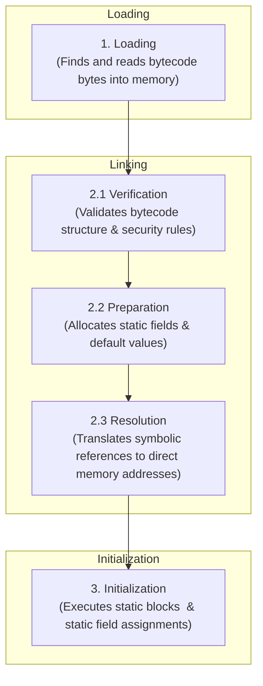
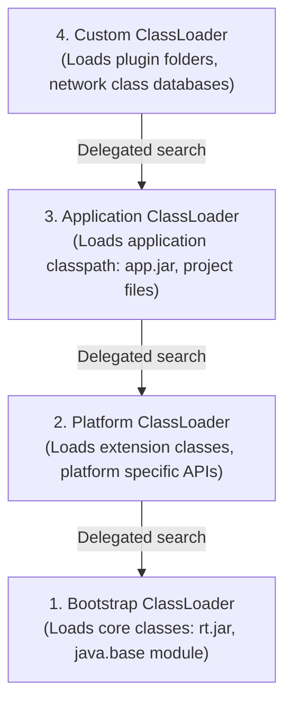
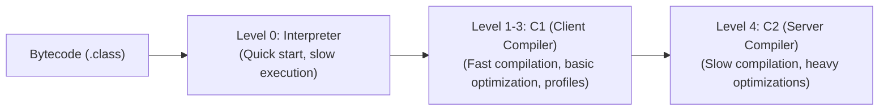

# Class Loading & JIT Compilation

## 1. What
This section details how JVM executes Java bytecode. It covers the Class Loading subsystem (loading, linking, initializing classes), the [ClassLoader](file:///Users/rohit.kumar.4/Documents/interview-prep/java/classloading-and-jit.md) hierarchy, custom class loader strategies, and the execution engine optimization techniques (JIT compiler, C1/C2 tiered compilation, and runtime profile optimizations).

## 2. Why
- **Production Diagnosis**: Knowing the loading phases helps diagnose `ClassNotFoundException`, `NoClassDefFoundError`, and `LinkageError` in multi-module applications.
- **Resource Profiling**: [ClassLoader](file:///Users/rohit.kumar.4/Documents/interview-prep/java/classloading-and-jit.md) memory leaks are typical in application containers where redeployments retain references to old class loaders.
- **High-Performance Coding**: Understanding JIT compiler optimizations like [escape analysis](file:///Users/rohit.kumar.4/Documents/interview-prep/java/classloading-and-jit.md), [lock elision](file:///Users/rohit.kumar.4/Documents/interview-prep/java/classloading-and-jit.md), and [method inlining](file:///Users/rohit.kumar.4/Documents/interview-prep/java/classloading-and-jit.md) enables writing code that aligns naturally with JVM hardware optimizations.

## 3. How

---

### 3.1 The Class Loading Lifecycle

When a class is first referenced in code, the JVM loads its bytecode, validates it, prepares runtime memory structures, and executes static initialization.



#### 1. Loading
- The ClassLoader reads binary stream representation of a class (from `.class` files, JARs, network bytes).
- Creates an instance of [Class](file:///Users/rohit.kumar.4/Documents/interview-prep/java/classloading-and-jit.md) in the JVM Metaspace to represent the class metadata.

#### 2. Linking
- **Verification**: Extremely strict check. Confirms the bytecode complies with the JVM specification, ensuring no stack overflows, type violations, or illegal class casts exist.
- **Preparation**: Allocates memory for static variables and initializes them to their **default values** (e.g., `int` to `0`, references to `null`). It does *not* execute initialization code here.
- **Resolution**: Replaces symbolic references in the constant pool (e.g., method names, class names) with direct references (actual memory addresses). Can happen lazily during execution.

#### 3. Initialization
- Executes the class static initializers (static blocks and static variable assignments in declaration order).
- Triggered by actions like `new`, invoking static methods, or referencing static variables.

---

### 3.2 ClassLoader Hierarchy & Delegation Model

#### Parent-Delegation Principle
Class Loaders follow a hierarchical model. When requested to load a class, a [ClassLoader](file:///Users/rohit.kumar.4/Documents/interview-prep/java/classloading-and-jit.md) delegates search to its parent first. It only attempts to load the class itself if the parent fails.



1. **Bootstrap ClassLoader**: Written in native code (C/C++). It has no corresponding [ClassLoader](file:///Users/rohit.kumar.4/Documents/interview-prep/java/classloading-and-jit.md) object. It loads core Java classes (like [Object](file:///Users/rohit.kumar.4/Documents/interview-prep/java/core-java-fundamentals.md), [String](file:///Users/rohit.kumar.4/Documents/interview-prep/java/core-java-fundamentals.md)).
2. **Platform ClassLoader**: (Formerly Extension ClassLoader) Loads platform-specific runtime classes and extension APIs.
3. **Application ClassLoader**: Loads libraries on the application classpath or modulepath.
4. **Custom ClassLoaders**: Implemented by developers for custom behaviors.

**Why Delegation?**
- **Security**: Prevents users from overriding core Java classes. If a user writes a custom `java.lang.String` and tries to load it, delegation ensures the Bootstrap ClassLoader loads the original JDK version instead.

#### Class Namespace Identity
Inside the JVM, a class is uniquely identified by its **Fully-Qualified Name AND the ClassLoader instance** that loaded it.
- If ClassLoader A and ClassLoader B both load the exact same `com.User` bytecode, they create two distinct [Class](file:///Users/rohit.kumar.4/Documents/interview-prep/java/classloading-and-jit.md) objects. Trying to cast an instance of one to the other will throw a `ClassCastException`.

#### Implementing Custom ClassLoaders
To implement a custom class loader:
- **Best Practice**: Override [findClass(String)](file:///Users/rohit.kumar.4/Documents/interview-prep/java/classloading-and-jit.md) method. This preserves the default parent-delegation behavior.
- **Bypassing Delegation**: Override [loadClass(String)](file:///Users/rohit.kumar.4/Documents/interview-prep/java/classloading-and-jit.md) method directly if child-first search is required (used by web servers like Tomcat to load webapp-specific JARs before shared system libraries).

```java
public class CustomClassLoader extends ClassLoader {
    private final String classDir;

    public CustomClassLoader(String classDir) {
        this.classDir = classDir;
    }

    @Override
    protected Class<?> findClass(String name) throws ClassNotFoundException {
        byte[] classData = loadClassData(name);
        if (classData == null) {
            throw new ClassNotFoundException();
        }
        return defineClass(name, classData, 0, classData.length);
    }

    private byte[] loadClassData(String className) {
        // Read file bytes from classDir
        // ...
        return null; 
    }
}
```

---

### 3.3 The JIT Compiler & Execution Engine

Java source is compiled to intermediate Bytecode. At runtime, the Execution Engine converts bytecode to machine code.

#### Tiered Compilation
The JVM execution engine uses both interpretation and dynamic compilation (Tiered Compilation, introduced in Java 7/8).



- **Interpreter (Level 0)**: Starts executing code immediately without compilation. It interprets bytecode instruction-by-instruction.
- **C1 Client Compiler (Levels 1-3)**: Compiles frequently-called methods (hotspots) quickly to native code. Level 2 & 3 collect runtime profiling data (counters for loops, branch conditions).
- **C2 Server Compiler (Level 4)**: Uses profile data collected by C1. Performs advanced, aggressive optimizations. If runtime assumptions fail (e.g. dynamic polymorphism changes), the JVM deoptimizes back to Level 0.

#### Critical JIT Optimizations

##### 1. Escape Analysis
Before allocating an object on the heap, the compiler performs [escape analysis](file:///Users/rohit.kumar.4/Documents/interview-prep/java/classloading-and-jit.md) to determine if the object's reference "escapes" the method scope or current thread.
- If it does **not** escape, the JVM optimizes:
  - **Scalar Replacement**: Deconstructs the object into its individual fields and stores them directly in the stack frames or CPU registers. Heap allocation and subsequent garbage collection are completely avoided.
  - **Lock Elision**: If an object is synchronized but escape analysis proves it never leaves the local thread, the synchronization overhead is stripped out.

```java
public void process() {
    // Point does not escape process()
    // JVM translates this to local primitive x & y variables on the stack
    Point p = new Point(10, 20); 
    System.out.println(p.getX() + p.getY());
}
```

##### 2. Method Inlining
The compiler replaces calls to small, frequently invoked methods directly with their code body using [method inlining](file:///Users/rohit.kumar.4/Documents/interview-prep/java/classloading-and-jit.md).
- Eliminates the call stack frame creation and lookup overhead.
- Enables downstream optimizations like constant folding and dead code elimination.

```java
// Original Code
public int add(int a, int b) { return a + b; }
public void run() { int sum = add(5, 10); }

// Inlined Code (JIT generated)
public void run() { int sum = 5 + 10; } // further optimized to 15
```

##### 3. Loop Unrolling
Replicates the body of a loop multiple times to reduce loop control statement evaluations and branch checks using loop unrolling.
