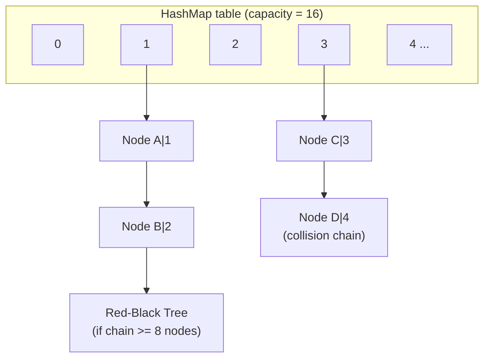
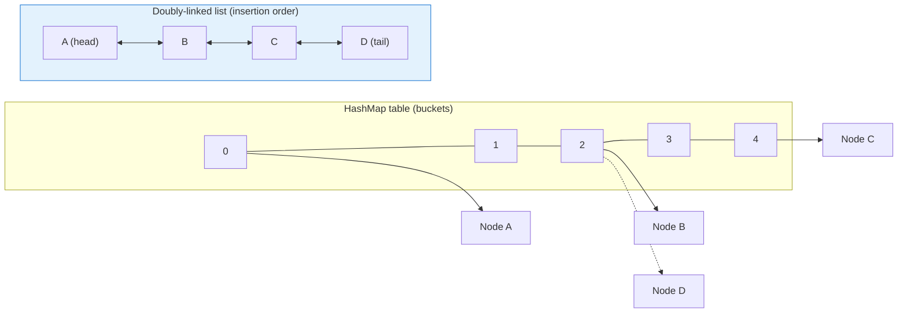
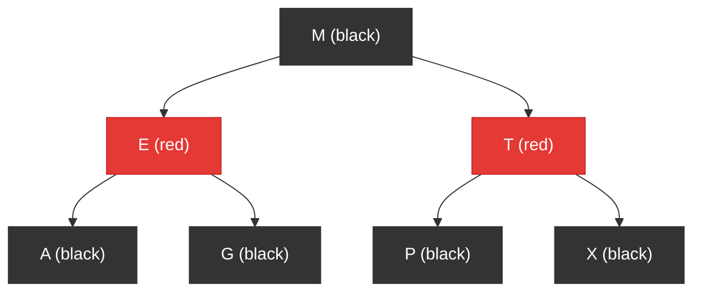
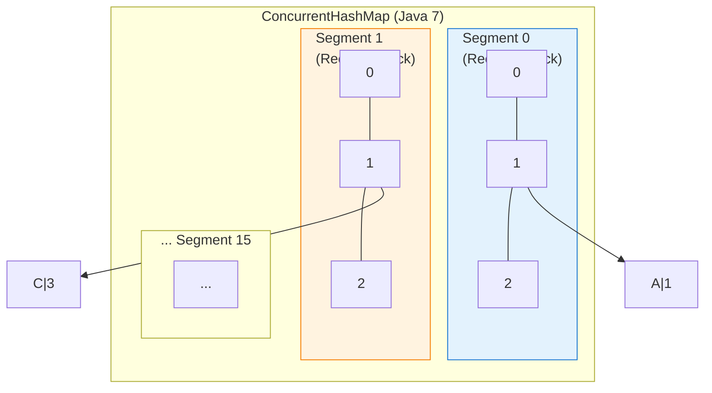
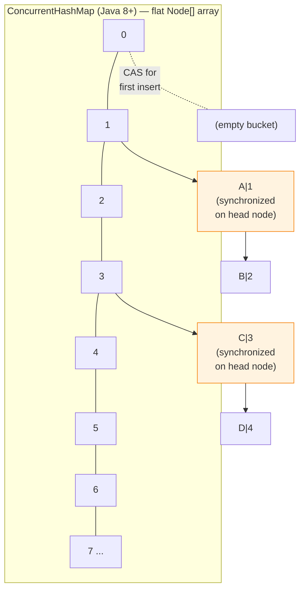
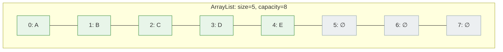
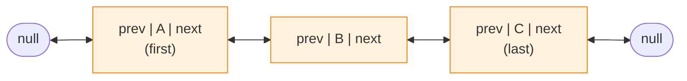
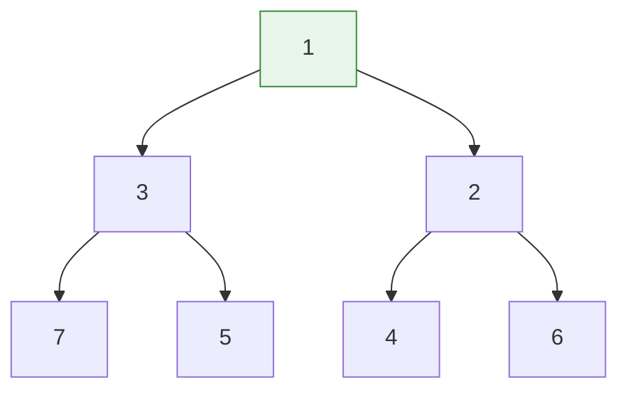
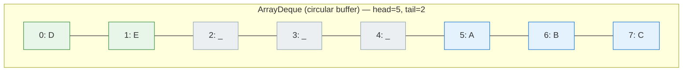

# Java Collections Internals

## 1. What

The Java Collections Framework provides data structures and algorithms for storing, retrieving, and manipulating groups of objects. Under the hood, each collection uses a specific internal data structure (hash tables, trees, arrays, linked lists, heaps) that determines its performance characteristics. Understanding these internals is critical for choosing the right collection and answering FAANG interview questions about time complexity, thread safety, and design trade-offs.

## 2. Why

- **Performance-critical decisions**: Choosing `HashMap` vs `TreeMap` vs `ConcurrentHashMap` depends entirely on understanding their internals.
- **Interview staple**: HashMap internals, ConcurrentHashMap evolution, and ArrayList vs LinkedList are among the most frequently asked Java questions at SDE-2 level.
- **Bug prevention**: Knowing how rehashing, iterator invalidation, and null handling work prevents subtle production bugs.
- **System design**: Understanding concurrent collections is essential for designing thread-safe services without external synchronization.

## 3. How

---

### 3.1 HashMap

**Internal structure**: An array of `Node<K,V>` buckets (called `table`). Each node holds `hash`, `key`, `value`, and `next` pointer.



**Hashing and bucket index**:
1. `hashCode()` is called on the key.
2. The hash is **spread** (perturbation): `h ^ (h >>> 16)` — mixes high bits into low bits to reduce collisions when capacity is small.
3. Bucket index = `(n - 1) & hash` where `n` is the table capacity. This works like modulo but is faster because `n` is always a power of 2.

**Why power-of-2 capacity**: The formula `(n - 1) & hash` only works correctly as a modulo substitute when `n` is a power of 2. For example, if `n = 16`, then `n - 1 = 15 = 0b1111`, and the bitwise AND cleanly extracts the lower 4 bits. If `n` were not a power of 2 (e.g., 17), some buckets would never be hit.

**Collision handling**:
- Collisions (same bucket index, different keys) form a **linked list** at that bucket.
- **Java 8 treeification**: When a single bucket's chain length reaches **8** (and table capacity >= 64), the linked list is converted to a **red-black tree**, improving worst-case lookup from O(n) to O(log n).
- When the tree shrinks to **6** nodes (due to removals), it is **untreeified** back to a linked list. The gap between 8 and 6 prevents thrashing between list and tree forms.

**Resize (rehash)**:
- Default initial capacity = 16, load factor = 0.75.
- When `size > capacity * loadFactor` (i.e., 12 for default), the table **doubles** in capacity.
- Every entry is rehashed: because capacity doubled, each entry either stays in the same bucket or moves to `oldIndex + oldCapacity`. Java 8 optimizes this by checking a single bit (`hash & oldCap`).

**Null key handling**: `HashMap` allows exactly one `null` key. It is always placed in bucket 0 (hash of null is treated as 0).

```java
Map<String, Integer> map = new HashMap<>();
map.put("apple", 1);    // hashCode("apple") → spread → bucket index
map.put(null, 0);        // always goes to bucket 0
map.get("apple");        // O(1) average, O(log n) worst case (treeified bucket)
```

---

### 3.2 LinkedHashMap

**Internal structure**: Extends `HashMap`. Each entry is a `LinkedHashMap.Entry` that adds `before` and `after` pointers, forming a **doubly-linked list** across all entries.



**Insertion order vs access order**:
- By default, iteration follows **insertion order**.
- Constructor `new LinkedHashMap<>(capacity, loadFactor, accessOrder=true)` switches to **access order** — every `get()` or `put()` of an existing key moves that entry to the tail of the linked list.

**LRU cache with `removeEldestEntry()`**:
```java
Map<String, String> lruCache = new LinkedHashMap<>(16, 0.75f, true) {
    @Override
    protected boolean removeEldestEntry(Map.Entry<String, String> eldest) {
        return size() > MAX_CACHE_SIZE;  // evict oldest on overflow
    }
};
```
This is called after every `put()`. When it returns `true`, the **head** of the linked list (least-recently-used entry) is removed.

---

### 3.3 TreeMap

**Internal structure**: A **red-black tree** (self-balancing BST). Every node holds key, value, left/right child, parent, and a color bit (red or black).



**Guarantees**:
- All operations (`get`, `put`, `remove`, `containsKey`) are **O(log n)**.
- Keys are stored in **sorted order** (natural ordering or custom `Comparator`).
- Does **not** allow `null` keys (throws `NullPointerException` when comparing).

**NavigableMap methods**:
```java
TreeMap<Integer, String> tm = new TreeMap<>();
tm.put(10, "A"); tm.put(20, "B"); tm.put(30, "C");

tm.ceilingKey(15);   // 20  — smallest key >= 15
tm.floorKey(25);     // 20  — largest key <= 25
tm.higherKey(20);    // 30  — smallest key strictly > 20
tm.lowerKey(20);     // 10  — largest key strictly < 20
tm.subMap(10, 30);   // {10=A, 20=B}  — [10, 30)
tm.descendingMap();  // {30=C, 20=B, 10=A}
```

**Custom Comparator**:
```java
TreeMap<String, Integer> caseInsensitive = new TreeMap<>(String.CASE_INSENSITIVE_ORDER);
caseInsensitive.put("Apple", 1);
caseInsensitive.get("apple");  // returns 1
```

---

### 3.4 ConcurrentHashMap

#### Java 7: Segment-based locking



- Default 16 segments, so up to **16 concurrent writers**.
- Reads are mostly lock-free (volatile reads).
- Segment count is fixed at creation — cannot grow.

#### Java 8+: Node-level CAS + synchronized



- **No segments**. The table is a flat `Node[]` array (same as `HashMap`).
- **Empty bucket**: First node inserted with **CAS** (lock-free).
- **Non-empty bucket**: `synchronized` block on the **head node** of that bucket.
- Treeification at threshold 8, same as `HashMap`.
- **Much finer granularity**: every bucket is an independent lock, vs 16 segments in Java 7.

**Why no null keys or values**: In concurrent contexts, `map.get(key)` returning `null` is ambiguous — does the key not exist, or is the value `null`? In single-threaded `HashMap` you can disambiguate with `containsKey()`, but in concurrent code another thread could modify the map between `get()` and `containsKey()`, making the check unreliable.

**Atomic compute methods**:
```java
ConcurrentHashMap<String, List<String>> map = new ConcurrentHashMap<>();

// computeIfAbsent is atomic — no race condition
map.computeIfAbsent("key", k -> new ArrayList<>()).add("value");

// compare: this is NOT safe (check-then-act race)
if (!map.containsKey("key")) {
    map.put("key", new ArrayList<>());  // another thread may put between check and put
}
```

---

### 3.5 HashSet

**Internal structure**: A `HashSet` is literally a `HashMap<E, Object>` where every value is a shared dummy constant:

```java
// Inside HashSet.java (simplified)
private transient HashMap<E, Object> map;
private static final Object PRESENT = new Object();

public boolean add(E e) {
    return map.put(e, PRESENT) == null;  // returns true if key was new
}

public boolean contains(Object o) {
    return map.containsKey(o);
}
```

All performance characteristics (O(1) average, hashing, collision handling, treeification) are inherited from `HashMap`. `LinkedHashSet` extends `HashSet` but uses `LinkedHashMap` internally to maintain insertion order.

---

### 3.6 ArrayList vs LinkedList

#### ArrayList — Dynamic array



- **Random access**: O(1) — direct array index.
- **Add at end**: Amortized O(1).
- **Insert/remove in middle**: O(n) — shifts elements.
- **Growth**: When full, capacity grows by **1.5x** (`newCapacity = oldCapacity + (oldCapacity >> 1)`).
- **Memory**: Contiguous array — CPU cache-friendly.

#### LinkedList — Doubly-linked list



- **Random access**: O(n) — must traverse from head or tail.
- **Add/remove at ends**: O(1) via `first`/`last` pointers.
- **Insert/remove at known position (via iterator)**: O(1) — pointer adjustment only.
- **Memory**: Each element needs a `Node` object (24+ bytes overhead) + two pointers.

#### Why LinkedList is almost never the right choice

1. **Cache misses**: Nodes are scattered in heap memory; ArrayList's contiguous array is CPU-cache-friendly.
2. **Traversal cost**: To insert at index `i`, LinkedList must first traverse O(n) nodes to find position `i`, negating the O(1) pointer-swap benefit.
3. **Memory overhead**: Each node costs ~40 bytes (object header + prev + next + element ref) vs 4-8 bytes per slot in ArrayList.
4. **Benchmarks**: In practice, `ArrayList` beats `LinkedList` in almost every operation except repeated `addFirst()` / `removeFirst()` — and `ArrayDeque` handles that case better.

```java
// ArrayList: prefer for almost all use cases
List<String> list = new ArrayList<>();

// LinkedList: only when you truly need a Deque with List interface
Deque<String> deque = new ArrayDeque<>();  // prefer this instead
```

---

### 3.7 PriorityQueue

**Internal structure**: A **binary min-heap** stored in a plain array.



**Array representation**: `[1, 3, 2, 7, 5, 4, 6]` (indices 0-6)

| Relationship | Formula |
|:---|:---|
| Parent of `i` | `(i - 1) / 2` |
| Left child of `i` | `2 * i + 1` |
| Right child of `i` | `2 * i + 2` |

- **offer() / add()**: O(log n) — appends at end, then **sift-up** (bubble up to restore heap property).
- **poll()**: O(log n) — removes root, moves last element to root, then **sift-down**.
- **peek()**: O(1) — returns root without removing.
- **remove(Object)**: O(n) — linear scan to find, then O(log n) to restructure.
- **No random access by priority**: Cannot get "3rd smallest" without polling three times.
- Default is min-heap; for max-heap use `Collections.reverseOrder()` or `Comparator.reverseOrder()`.

```java
// Min-heap (default)
PriorityQueue<Integer> minHeap = new PriorityQueue<>();
minHeap.offer(5); minHeap.offer(1); minHeap.offer(3);
minHeap.poll();  // returns 1

// Max-heap
PriorityQueue<Integer> maxHeap = new PriorityQueue<>(Comparator.reverseOrder());
maxHeap.offer(5); maxHeap.offer(1); maxHeap.offer(3);
maxHeap.poll();  // returns 5

// heapify: constructing from a collection is O(n), not O(n log n)
PriorityQueue<Integer> pq = new PriorityQueue<>(Arrays.asList(5, 1, 3, 7, 2));
```

---

### 3.8 ArrayDeque

**Internal structure**: A **circular buffer** (array with head and tail pointers that wrap around).



**Logical order**: A -> B -> C -> D -> E
- `addFirst`: put at `head - 1` (wraps around)
- `addLast`: put at `tail`, advance tail

- **addFirst / addLast / removeFirst / removeLast**: All O(1) amortized.
- **Growth**: Doubles capacity when full (copies to new array).
- **No null elements**: Uses `null` as a sentinel internally.
- **Not thread-safe**: Use `ConcurrentLinkedDeque` for concurrent access.

**Why prefer ArrayDeque over Stack and LinkedList**:

| | Stack | LinkedList | ArrayDeque |
|---|---|---|---|
| Implementation | extends Vector (synchronized) | Doubly-linked nodes | Circular array |
| Overhead | Lock on every operation | 40 bytes per node | Contiguous memory |
| Cache perf | Good (array-backed) | Poor (scattered nodes) | Excellent |
| Null support | Yes | Yes | No |
| Recommendation | Legacy, avoid | Avoid for stack/queue | Preferred |

```java
// Stack replacement
Deque<Integer> stack = new ArrayDeque<>();
stack.push(1);  // addFirst
stack.pop();    // removeFirst
stack.peek();   // peekFirst

// Queue replacement
Deque<Integer> queue = new ArrayDeque<>();
queue.offer(1);  // addLast
queue.poll();    // removeFirst
queue.peek();    // peekFirst
```

---

## 4. Interview Angles

### Q1: How does HashMap handle collisions, and what changed in Java 8?

In Java 7 and earlier, collisions in the same bucket form a singly-linked list, giving O(n) worst-case lookup. Java 8 introduced **treeification**: when a bucket's chain length reaches 8 (and table size >= 64), the linked list is converted to a red-black tree, reducing worst-case lookup to O(log n). When removals shrink the tree to 6 nodes, it converts back to a linked list. The gap between 8 and 6 (hysteresis) prevents rapid toggling between the two structures.

### Q2: Why must HashMap capacity always be a power of 2?

HashMap computes the bucket index as `(capacity - 1) & hash` instead of `hash % capacity` because bitwise AND is significantly faster than modulo. This only produces a correct uniform distribution when capacity is a power of 2, since `capacity - 1` yields a bitmask of all 1s (e.g., 15 = `0b1111` for capacity 16). If you supply a non-power-of-2 initial capacity, the constructor rounds it up to the next power of 2 automatically. Additionally, during resize, each entry either stays in the same bucket or moves to `oldIndex + oldCapacity`, which is efficiently determined by checking just one bit.

### Q3: How does ConcurrentHashMap differ between Java 7 and Java 8?

Java 7 used **segment-based locking** with 16 fixed `Segment` objects (each a `ReentrantLock` + mini-HashMap), allowing at most 16 concurrent writes. Java 8 removed segments entirely and uses a flat `Node[]` array: empty buckets use **CAS** for the first insert, and occupied buckets use **synchronized on the bucket head node**. This gives bucket-level granularity (potentially millions of independent locks), dramatically improving concurrency. Java 8 also added treeification for long chains, same as `HashMap`.

### Q4: Why does ConcurrentHashMap disallow null keys and values?

In a concurrent context, `map.get(key)` returning `null` is ambiguous: it could mean the key is absent or the value is genuinely `null`. With single-threaded `HashMap`, you can call `containsKey()` to disambiguate, but in concurrent code another thread could insert or remove the key between your `get()` and `containsKey()` calls, making the two-step check unreliable. Banning null eliminates this ambiguity entirely. Doug Lea (the author) has explicitly stated this was an intentional design decision to prevent subtle bugs.

### Q5: How would you implement an LRU cache using only JDK classes?

Use `LinkedHashMap` with `accessOrder = true` and override `removeEldestEntry()`. The access-order mode moves every accessed entry to the tail of its internal doubly-linked list, so the head is always the least-recently-used. When `removeEldestEntry()` returns `true` (e.g., `size() > maxCapacity`), the head entry is automatically evicted on each `put()`. For thread safety, wrap it with `Collections.synchronizedMap()` or use a `ReentrantReadWriteLock`. This is a common follow-up in LLD interviews.

### Q6: Why is LinkedList almost never the right choice over ArrayList?

ArrayList uses a contiguous array that is CPU cache-friendly, giving it a massive constant-factor advantage. LinkedList's theoretical O(1) insert/delete at a known position is negated by the O(n) traversal needed to reach that position. Each LinkedList node also carries ~40 bytes of overhead (object header + two pointers), compared to 4-8 bytes per ArrayList slot. Benchmarks consistently show ArrayList outperforming LinkedList in nearly all workloads. For deque operations (addFirst/removeLast), `ArrayDeque` is the correct choice, not LinkedList.

### Q7: How does PriorityQueue work internally, and can you get the k-th smallest element efficiently?

PriorityQueue is backed by a binary min-heap stored in an array. `offer()` appends the element and sift-ups in O(log n); `poll()` removes the root, replaces it with the last element, and sift-downs in O(log n). You cannot efficiently access the k-th smallest element without polling k times (each O(log n), so O(k log n) total), because the heap property only guarantees the root is the minimum — sibling ordering is not defined. Constructing a PriorityQueue from an existing collection uses Floyd's heapify algorithm in O(n) time, not O(n log n).

### Q8: Why is ArrayDeque preferred over Stack for stack operations?

`Stack` extends `Vector`, which synchronizes every method call — unnecessary overhead in single-threaded code. `Stack` also inherits `Vector`'s list methods (like `get(i)`, `add(i, e)`), breaking the stack abstraction and allowing misuse. `ArrayDeque` uses a resizable circular buffer with no synchronization, has excellent cache locality, and provides a clean Deque interface. The official Javadoc for `Stack` itself recommends using `ArrayDeque` as a replacement.

### Q9: What is the time complexity of HashMap's `get()` in the worst case, and when would you hit it?

In the average case, `get()` is O(1). In the worst case with Java 8+, it is O(log n) per bucket when the bucket has been treeified (8+ collisions). Before Java 8, the worst case was O(n) due to a pure linked list. You would hit the worst case if many keys have poorly distributed hash codes causing them to land in the same bucket — this can happen with adversarial input (hash-flooding attack) or a badly implemented `hashCode()`. The perturbation function `h ^ (h >>> 16)` helps distribute keys but cannot prevent intentional collisions.

### Q10: What happens during HashMap resize, and why is it expensive?

When the entry count exceeds `capacity * loadFactor`, HashMap allocates a new array of double the capacity and re-distributes every existing entry. Each entry's new bucket is determined by `hash & (newCapacity - 1)`, but Java 8 optimizes this: it checks `hash & oldCapacity` — if the bit is 0 the entry stays, if 1 it moves to `oldIndex + oldCapacity`. This avoids recomputing full hash values. Resize is O(n) and causes a latency spike, so if you know the expected size, pre-size with `new HashMap<>(expectedSize / 0.75 + 1)` to avoid unnecessary rehashes.
