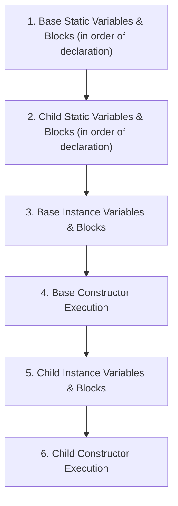

# Core Java & Object-Oriented Fundamentals

## 1. What
This section covers the foundational aspects of Java's object-oriented system, memory layout for core objects, standard lifecycle methods of `java.lang.Object`, and serialization mechanisms. Understanding these core APIs is essential for writing efficient, robust code and is a fundamental pillar of technical interviews.

## 2. Why
- **Contract Enforcement**: Violating the contract between [equals(Object)](file:///Users/rohit.kumar.4/Documents/interview-prep/java/core-java-fundamentals.md) and [hashCode()](file:///Users/rohit.kumar.4/Documents/interview-prep/java/core-java-fundamentals.md) breaks hashed collections like `HashMap` and `HashSet`.
- **Memory Efficiency**: String operations are performance-critical; improper use of concatenation or ignoring the String Pool leads to high garbage collection pressure.
- **System Design & Integration**: Serialization is the bridge for sending objects across network boundaries. Understanding its mechanisms and pitfalls prevents security vulnerabilities and data corruption.
- **Architectural Clarity**: Knowing when to use abstract classes, interface default methods, or static nested classes keeps codebase design clean and modular.

## 3. How

---

### 3.1 Object-Oriented Programming (OOP) in Java

#### Abstract Classes vs Interfaces
With Java 8 introduction of `default` and `static` methods, and Java 9 `private` methods, the functional gap between interfaces and abstract classes has narrowed, but the semantic difference remains:

| Feature | Interface | Abstract Class |
|---|---|---|
| **Multiple Inheritance** | A class can implement multiple interfaces. | A class can extend only one abstract class. |
| **State** | Cannot hold instance state. Fields are implicitly `public static final`. | Can hold instance state (fields can be non-final, private, protected). |
| **Constructors** | Cannot have constructors. | Can have constructors (called during subclass instantiation). |
| **Default Methods** | Can have default/static implementations (since Java 8) and private methods (since Java 9). | Can have all types of methods (abstract, concrete, final, static). |
| **Intent** | Defines a contract/role ("can-do" relationship). | Defines an identity/ancestry ("is-a" relationship). |

**Diamond Problem Resolution**: If a class implements two interfaces containing default methods with the exact same signature:
```java
interface InterfaceA {
    default void printInfo() { System.out.println("A"); }
}
interface InterfaceB {
    default void printInfo() { System.out.println("B"); }
}
// Compiler forces override to resolve ambiguity
class ImplClass implements InterfaceA, InterfaceB {
    @Override
    public void printInfo() {
        // Can explicitly delegate to a specific parent interface:
        InterfaceA.super.printInfo();
    }
}
```

#### Nested Classes
Java supports four types of nested classes. Understanding their scope and lifecycle prevents memory leaks:

1. **Static Nested Class**: Declared with `static` inside an outer class.
   - Has no reference to the outer class instance.
   - Can access only static members of the outer class.
   - Instantiated as `Outer.StaticNested nested = new Outer.StaticNested();`.
2. **Inner Class (Non-static)**: Declared without `static` inside an outer class.
   - Keeps an implicit reference to the outer class instance.
   - Can access all members of the outer class.
   - Instantiated as `Outer outer = new Outer(); Outer.Inner inner = outer.new Inner();`.
   - > [!WARNING]
     > Non-static inner classes can cause memory leaks if their lifetime exceeds that of the outer class instance, as the outer instance is kept reachable in memory.
3. **Local Class**: Defined inside a method block.
   - Visible only within the enclosing block.
   - Can access enclosing variables only if they are `final` or effectively final.
4. **Anonymous Class**: Inner class without a name, declared and instantiated in a single expression.
   - Often used for one-off implementations (e.g., event listeners), superseded by Lambdas.

#### Initialization Order
Understanding the order of class initialization is key to debugging static variables and constructor side-effects:



Example confirming execution hierarchy:
```java
class Base {
    static { System.out.println("Base static block"); }
    { System.out.println("Base instance block"); }
    public Base() { System.out.println("Base constructor"); }
}
class Child extends Base {
    static { System.out.println("Child static block"); }
    { System.out.println("Child instance block"); }
    public Child() { System.out.println("Child constructor"); }
}
// Creating 'new Child()' prints:
// 1. Base static block
// 2. Child static block
// 3. Base instance block
// 4. Base constructor
// 5. Child instance block
// 6. Child constructor
```

---

### 3.2 String Internals & Optimization

#### Immutability of String
The `String` class is final and immutable. Once created, its internal value (a `byte[]` in modern Java, previously `char[]`) cannot be modified.

**Why Immutability?**
1. **Security**: Strings are heavily used for file paths, network URLs, and database connection pools. Mutability would allow dynamic security compromises.
2. **String Pool Sharing**: Enables caching of identical string literals, saving massive heap space.
3. **Thread Safety**: Immutable objects are inherently thread-safe and can be shared freely without synchronization.
4. **Caching HashCodes**: The `hashCode` is calculated once and cached inside a private `hash` field. This makes `String` extremely fast as keys in hash maps.

#### String Pool & Interning
The String Pool is a special runtime table maintained inside the JVM Heap (since Java 7).
- When a literal is declared (e.g., `String s1 = "hello"`), the JVM searches the String Pool. If found, it returns the reference. If not, it creates a new String in the pool.
- When `new String("hello")` is called, two objects can be involved: one in the String Pool (if not already present), and a fresh instance on the heap.
- `String.intern()` can be called to manually add a heap-constructed string to the pool, or retrieve its pooled reference:

```java
String s1 = "hello"; // Pools and references "hello"
String s2 = new String("hello"); // Heap object referring to pooled literal value
String s3 = s2.intern(); // Retrieves reference from the pool

System.out.println(s1 == s2); // false (pool reference vs heap reference)
System.out.println(s1 == s3); // true (both refer to pool reference)
```

```mermaid
flowchart TD
    subgraph Heap
        subgraph StringPool["String Pool (Perm/Heap)"]
            P["'hello' object"]
        }
        H["new String('hello') object"]
    end
    s1["s1 literal"] --> P
    s2["s2 new String"] --> H
    s3["s3 interned"] --> P
    H -.-> P
```

#### StringBuilder, StringBuffer, and Concatenation
- **`String`**: Immutable. Concatenating strings in a loop generates intermediate garbage objects.
- **`StringBuffer`**: Mutable, thread-safe. All methods are `synchronized`, causing lock overhead.
- **`StringBuilder`**: Mutable, not thread-safe. Optimal performance for single-threaded string builders.

**Concatenation Compilation**:
- Pre-Java 9: Simple `+` concatenations (e.g. `s1 + s2`) were compiled to code using `StringBuilder`.
- Java 9+: Uses `invokedynamic` calling `StringConcatFactory.makeConcatWithTemplate()`. This optimizes allocation by computing length up-front and using VM-level tricks, avoiding overhead from multiple intermediate `StringBuilder` objects.

---

### 3.3 Object Methods Contracts

#### The equals() and hashCode() Contract
If two objects are equal according to the [equals(Object)](file:///Users/rohit.kumar.4/Documents/interview-prep/java/core-java-fundamentals.md) method, then calling [hashCode()](file:///Users/rohit.kumar.4/Documents/interview-prep/java/core-java-fundamentals.md) on both must yield the same integer result.
- **Consequence of violation**: If `equals()` is overridden but `hashCode()` is not, two logically equal objects will yield different hash codes. When placed in a `HashMap`, they will map to different buckets, causing lookup failures, key duplications, and memory leaks.

```java
public class User {
    private final int id;
    private final String name;

    public User(int id, String name) {
        this.id = id;
        this.name = name;
    }

    @Override
    public boolean equals(Object o) {
        if (this == o) return true;
        if (o == null || getClass() != o.getClass()) return false;
        User user = (User) o;
        return id == user.id && Objects.equals(name, user.name);
    }

    @Override
    public int hashCode() {
        return Objects.hash(id, name);
    }
}
```

#### Object Cloning and Deep vs Shallow Copies
- **Shallow Copy**: Copies the primitive fields and object references of the source object. Referencing mutable objects means both original and clone share the same instances.
- **Deep Copy**: Clones all referenced objects recursively, ensuring the clone has entirely independent fields.
- **Why `Cloneable` is Flawed**:
  - It does not define any methods. It is a marker interface that simply changes the behavior of `Object.clone()` (otherwise it throws `CloneNotSupportedException`).
  - `Object.clone()` returns a shallow copy by default and performs field-by-field assignment.
  - It does not invoke constructors, bypassing initialization logic.
  - **Modern Alternative**: Use a copy constructor or a static factory method:
    ```java
    public User(User other) {
        this.id = other.id;
        this.name = other.name; // Immutable, safe to reference directly
    }
    ```

#### The Deprecation of finalize()
- [Object.finalize()](file:///Users/rohit.kumar.4/Documents/interview-prep/java/core-java-fundamentals.md) was designed to clean up resources before garbage collection.
- **Why it failed**:
  - No guarantee of when or if it will run (GC might not run at all if memory is sufficient).
  - Can cause severe GC pauses (objects overriding `finalize()` must go through finalization queues, surviving at least one extra GC cycle).
  - Vulnerable to security exploits (an object can resurrect itself by saving its reference to a static variable inside `finalize()`).
- **Modern Clean-up**: Implement `AutoCloseable` with Try-with-resources or use `java.lang.ref.Cleaner` along with [PhantomReference](file:///Users/rohit.kumar.4/Documents/interview-prep/java/jvm-memory-and-gc.md).

---

### 3.4 Designing Immutable Classes & Defensive Copying

An object is **immutable** when its observable state cannot change after construction. `final` fields are necessary for most immutable designs, but they are not sufficient: a final reference can still point to a mutable object.

```java
final class UnsafeOrder {
    private final List<String> items;

    UnsafeOrder(List<String> items) {
        this.items = items; // Caller still owns and can mutate this list.
    }

    List<String> getItems() {
        return items; // Caller can mutate internal state through the getter.
    }
}
```

#### Immutable Class Checklist
1. Make the class `final`, or prevent subclasses from adding mutable behavior.
2. Make fields `private final`.
3. Do not provide mutator methods.
4. Validate constructor arguments before assigning them.
5. Defensively copy mutable inputs.
6. Do not expose mutable internals from accessors.
7. Ensure nested objects are immutable or copied as well.
8. Do not let `this` escape during construction.

```java
public final class Order {
    private final String orderId;
    private final List<String> items;
    private final Date createdAt; // Mutable legacy type, used here deliberately.

    public Order(String orderId, List<String> items, Date createdAt) {
        this.orderId = Objects.requireNonNull(orderId);
        this.items = List.copyOf(items);       // Immutable snapshot.
        this.createdAt = new Date(createdAt.getTime()); // Defensive copy.
    }

    public String getOrderId() {
        return orderId;
    }

    public List<String> getItems() {
        return items; // Safe because List.copyOf produced an immutable snapshot.
    }

    public Date getCreatedAt() {
        return new Date(createdAt.getTime()); // Never leak the mutable Date.
    }
}
```

#### Unmodifiable View vs Immutable Snapshot

```java
List<String> source = new ArrayList<>(List.of("A"));

List<String> view = Collections.unmodifiableList(source);
List<String> snapshot = List.copyOf(source);

source.add("B");
System.out.println(view);     // [A, B] - backing list changed
System.out.println(snapshot); // [A]    - independent snapshot
```

| API | Can mutate through result? | Reflects source mutations? | `null` elements? |
|---|---:|---:|---:|
| `Collections.unmodifiableList(source)` | No | **Yes** | Same as source |
| `List.copyOf(source)` | No | No | Rejects `null` |
| `List.of(...)` | No | No backing source | Rejects `null` |
| `new ArrayList<>(source)` | Yes | No | Allows `null` |

> [!IMPORTANT]
> These are **shallow** copies. `List.copyOf(users)` protects the list structure, but not a mutable `User` object inside it. Deep immutability requires immutable elements or element-by-element copies.

#### Records Are Only Shallowly Immutable
Record components are final references, but referenced objects can still mutate:

```java
public record Team(String name, List<String> members) {
    public Team {
        members = List.copyOf(members); // Compact constructor replaces input.
    }
}
```

Without `List.copyOf`, `team.members().add(...)` could mutate the record's observable state.

#### Safe Construction and `this` Escape
Never publish `this` from a constructor by registering a listener, starting a thread, or placing the object in a shared collection. Another thread could observe default or partially initialized fields before construction finishes.

```java
class UnsafeListener {
    UnsafeListener(EventBus bus) {
        bus.register(this); // this escapes before construction completes
    }
}
```

Prefer a static factory that constructs the object completely and registers it afterward.

---

### 3.5 `Comparable` vs `Comparator`

Both define ordering, but ownership differs:

| Feature | `Comparable<T>` | `Comparator<T>` |
|---|---|---|
| Method | `compareTo(T other)` | `compare(T left, T right)` |
| Ordering | One natural/default ordering | Many external orderings |
| Defined in | The domain class | Separate object/lambda |
| Typical example | Employee ID, chronological date | Sort employees by name, salary, or age |

```java
public final class Employee implements Comparable<Employee> {
    private final long id;
    private final String name;
    private final int age;

    @Override
    public int compareTo(Employee other) {
        return Long.compare(this.id, other.id);
    }
}

Comparator<Employee> byNameThenAge = Comparator
        .comparing(Employee::getName, String.CASE_INSENSITIVE_ORDER)
        .thenComparingInt(Employee::getAge)
        .thenComparingLong(Employee::getId);
```

#### Comparison Contract
For `compare(a, b)`, the result's sign must obey:
1. **Antisymmetry**: `sign(compare(a,b)) == -sign(compare(b,a))`.
2. **Transitivity**: if `a > b` and `b > c`, then `a > c`.
3. **Zero consistency**: if `compare(a,b) == 0`, comparisons against any `c` must have the same sign for both.
4. It is strongly recommended that `compare(a,b) == 0` agrees with `a.equals(b)`.

Never subtract to compare integers:

```java
return this.age - other.age;          // Wrong: integer overflow is possible.
return Integer.compare(age, other.age); // Correct.
```

#### The `TreeSet` / `TreeMap` Trap
Sorted collections use comparison equality, not `equals()`, to detect duplicate keys:

```java
record Person(long id, String name) {}

Comparator<Person> byName = Comparator.comparing(Person::name);
Set<Person> people = new TreeSet<>(byName);
people.add(new Person(1, "Sam"));
people.add(new Person(2, "Sam"));

System.out.println(people.size()); // 1: comparator says both are equal
```

Include a stable tie-breaker when distinct domain objects must coexist:

```java
Comparator<Person> byNameThenId = Comparator
        .comparing(Person::name)
        .thenComparingLong(Person::id);
```

Useful composition APIs include `comparing`, `comparingInt`, `thenComparing`, `reversed`, `nullsFirst`, and `nullsLast`.

---

### 3.6 Enum Internals & Object-Design Patterns

A Java enum is a special class whose instances are created once during class initialization. Each constant is a `public static final` instance, which makes enum constants safely published and identity-stable.

The compiler provides:
- `values()` - returns a new array containing constants in declaration order.
- `valueOf(String)` - exact, case-sensitive name lookup.
- `name()` - stable declared name.
- `ordinal()` - zero-based declaration position.
- Final identity-based `equals()` and `hashCode()` behavior.
- `Comparable<E>` ordering based on declaration order.

#### Enums Can Have State and Behavior

```java
enum PaymentStatus {
    PENDING {
        @Override boolean canTransitionTo(PaymentStatus next) {
            return next == SUCCESS || next == FAILED;
        }
    },
    SUCCESS {
        @Override boolean canTransitionTo(PaymentStatus next) {
            return next == REFUNDED;
        }
    },
    FAILED, REFUNDED;

    boolean canTransitionTo(PaymentStatus next) {
        return false;
    }
}
```

Constant-specific method bodies are anonymous subclasses generated by the compiler. This is useful for small, closed behavior sets; move large workflows into Strategy classes instead of turning an enum into a service container.

#### Never Persist `ordinal()`
Adding or reordering constants changes ordinals and corrupts persisted meanings. Persist a stable explicit code:

```java
enum Priority {
    LOW("L"), MEDIUM("M"), HIGH("H");

    private final String code;

    Priority(String code) {
        this.code = code;
    }

    String getCode() {
        return code;
    }
}
```

Likewise, avoid business logic coupled to `ordinal()` or declaration order unless that order is deliberately part of the contract.

#### `EnumSet` and `EnumMap`

```java
enum Permission { READ, WRITE, DELETE, ADMIN }

EnumSet<Permission> editor = EnumSet.of(Permission.READ, Permission.WRITE);
EnumMap<Permission, String> labels = new EnumMap<>(Permission.class);
labels.put(Permission.READ, "Can view records");
```

- `EnumSet` is implemented as a bit vector: compact and faster than a typical `HashSet<Enum>`.
- `EnumMap` uses an array indexed by ordinal internally: compact, ordered by enum declaration, and faster than `HashMap<Enum, V>`.
- Neither permits `null` keys/elements. `EnumMap` permits `null` values.
- Prefer these specialized collections whenever all keys/elements belong to one enum type.

#### Enum Singleton

```java
enum ApplicationRegistry {
    INSTANCE;
}
```

This is serialization-safe and reflection-resistant by JVM guarantee. Use it only when a global singleton is genuinely appropriate; dependency injection is usually easier to test.

---

### 3.7 Access Control & Encapsulation

| Modifier | Same class | Same package | Subclass in another package | Unrelated class in another package |
|---|---:|---:|---:|---:|
| `private` | Yes | No | No | No |
| package-private (no modifier) | Yes | Yes | No | No |
| `protected` | Yes | Yes | Yes, through inheritance rules | No |
| `public` | Yes | Yes | Yes | Yes |

#### The `protected` Cross-Package Trap
In another package, a subclass can access a protected instance member only through `this`, `super`, or a reference whose compile-time type is that subclass (or below). It cannot use an arbitrary parent instance.

```java
// package base;
public class Parent {
    protected int value;
}

// package child;
public class Child extends Parent {
    void valid(Child other) {
        this.value = 1;
        other.value = 2;
    }

    void invalid(Parent other) {
        // other.value = 3; // Compile error across package boundary.
    }
}
```

#### Top-Level and Nested Type Visibility
- A top-level class/interface can be only `public` or package-private.
- A source file can have at most one public top-level type, and its name must match the filename.
- Member nested types can use all four access levels.
- Interface fields are implicitly `public static final`; interface abstract methods are implicitly `public`.
- Since Java 9, interfaces may also contain `private` helper methods.

#### Overriding Visibility Rules
An overriding method may keep or widen visibility, but cannot narrow it:

```java
class Parent {
    protected Number value() { return 1; }
}

class Child extends Parent {
    @Override
    public Integer value() { return 2; } // Wider visibility + covariant return.
}
```

`private` methods are not overridden because subclasses cannot see them. Static methods are hidden, not overridden; field access is also resolved from the reference type, not polymorphically.

#### Encapsulation Guidelines
- Expose behavior, not internal representation (`account.withdraw(amount)` over `account.setBalance(...)`).
- Prefer the narrowest useful visibility.
- Keep implementation classes package-private when only an interface must be public.
- Use packages as module boundaries, not merely folders.
- Prefer composition over inheritance when the relationship is “uses-a” rather than a true substitutable “is-a.”

---

### 3.8 Java Serialization

#### Core Concept: Serializable vs Externalizable
Serialization transforms the state of an object into a byte stream for storage or transmission.

- **`java.io.Serializable`**:
  - A marker interface (no methods to implement).
  - JVM dynamically performs deep serialization using reflection. Slow, and uses metadata in output.
- **`java.io.Externalizable`**:
  - Extends `Serializable`.
  - Declares two methods: `writeExternal(ObjectOutput)` and `readExternal(ObjectInput)`.
  - The developer manually controls serialization. Fast, minimal metadata overhead, but requires maintaining serialization logic.

#### The role of `serialVersionUID`
- It is a 64-bit hash representing the version of the class structure.
- If not explicitly declared, the JVM compiler generates one dynamically.
- > [!IMPORTANT]
  > Always declare `serialVersionUID` explicitly. If a class structure changes (e.g., adding a field) and `serialVersionUID` is not declared, the generated value will change. Deserialization of old streams will immediately fail with an `InvalidClassException`.
```java
private static final long serialVersionUID = 1L;
```

#### Transient Keyword
- Fields marked `transient` are skipped during serialization.
- Useful for database connections, threads, passwords, and calculated fields that can be regenerated.
- **Note**: `static` fields are also not serialized as they belong to the class, not the instance.

#### Customizing Serialization: readObject and writeObject
For advanced control, a class implementing `Serializable` can declare private methods with these exact signatures to override standard JVM serialization:

```java
private void writeObject(ObjectOutputStream out) throws IOException {
    out.defaultWriteObject(); // Standard serialization
    out.writeInt(encryptData(this.sensitiveField)); // Custom handling
}

private void readObject(ObjectInputStream in) throws IOException, ClassNotFoundException {
    in.defaultReadObject(); // Standard deserialization
    this.sensitiveField = decryptData(in.readInt());
}
```

#### Singletons and Serialization
A standard singleton class can be compromised by serialization because deserialization always instantiates a new object via native JVM execution, bypassing the private constructor. To prevent this, implement `readResolve()`:

```java
public class SerializedSingleton implements Serializable {
    private static final long serialVersionUID = 1L;
    private static final SerializedSingleton INSTANCE = new SerializedSingleton();

    private SerializedSingleton() {}

    public static SerializedSingleton getInstance() { return INSTANCE; }

    // Replaces the deserialized object with the existing singleton instance
    protected Object readResolve() {
        return INSTANCE;
    }
}
```

#### Security Risks of Java Serialization
- Java Serialization is widely considered a security hazard. Deserialization of untrusted byte streams can invoke custom class methods (gadgets) that execute arbitrary commands on the system.
- **Best Practice**: Avoid default Java Serialization in new systems. Use JSON, XML, Protocol Buffers (protobuf), or Avro.
