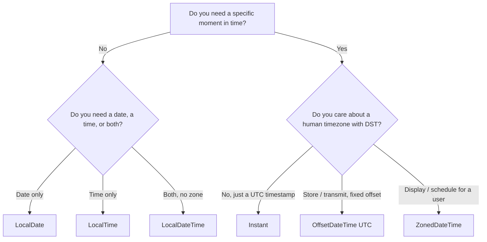

# Java Date/Time API (java.time / JSR-310)

## 1. What

`java.time` (JSR-310, introduced in Java 8, led by Stephen Colebourne of Joda-Time) is a comprehensive, **immutable**, **thread-safe** date/time library that replaces the broken `java.util.Date`, `Calendar`, and `SimpleDateFormat`. It models time with a clear separation of concerns: human "wall-clock" values (`LocalDate`/`LocalTime`/`LocalDateTime`), machine timeline points (`Instant`), zone-aware moments (`ZonedDateTime`/`OffsetDateTime`), and amounts of time (`Duration`/`Period`). The design forces you to be explicit about whether a value carries a timezone — the single most common source of date bugs in backend systems.

## 2. Why

- **Correctness over the timeline**: legacy `Date` conflates a machine instant with a human calendar view. `java.time` splits these so you cannot accidentally compare apples (wall-clock) to oranges (UTC instant).
- **Thread-safety by construction**: every type is immutable and final-ish; a `DateTimeFormatter` can be a shared static constant, unlike `SimpleDateFormat`, which corrupts data under concurrency (a real production bug — shown below).
- **Explicit timezone contract**: storing/serializing timestamps in a distributed backend (Kafka events, DB rows, REST payloads) demands an unambiguous instant. `Instant`/`OffsetDateTime` give you that; `LocalDateTime` deliberately does not.
- **DST-aware arithmetic**: `ZonedDateTime` applies real IANA zone rules, so "add 1 day" across a DST boundary behaves like a human expects, while "add 24 hours" behaves like a physicist expects — and the API makes the difference visible.
- **Fluent, testable code**: immutability enables safe method chaining; `Clock` lets you inject "now" so time-dependent logic is unit-testable without mocking statics.

## 3. How

### 3.1 Why the legacy API is broken

#### `java.util.Date` — mutable and misleading

```java
Date d = new Date(2024, 5, 15);      // NOT June 15, 2024!
// year is offset from 1900 -> 3924; month is 0-indexed -> month 5 = June
// Deprecated ctor. Actual value: year 3924, June 15.

Date now = new Date();
now.setTime(0);      // MUTABLE — anyone holding this reference is affected
// getYear()/getMonth()/getDate() all deprecated and 0/1900-based
```

`Date` is really just a wrapped `long` millis-since-epoch (a UTC instant) but exposes deprecated calendar-style getters that pretend it's a local calendar value. It is mutable, so it cannot be safely shared or used as a map key.

#### `Calendar` — clunky, mutable, error-prone

```java
Calendar c = Calendar.getInstance();
c.set(2024, Calendar.JUNE, 15);   // must use constants; Calendar.JUNE == 5
c.add(Calendar.MONTH, 1);         // mutates in place
```

#### `SimpleDateFormat` — NOT thread-safe (classic production bug)

`SimpleDateFormat` keeps mutable parsing state (`Calendar`) in an instance field. Sharing one instance across threads silently returns wrong dates or throws `NumberFormatException`/`ArrayIndexOutOfBoundsException`.

```java
// BROKEN: static shared formatter hit concurrently
static final SimpleDateFormat SDF = new SimpleDateFormat("yyyy-MM-dd");

// Thread A and Thread B both call SDF.parse(...) -> corrupted results,
// e.g. a date parsed as year 0022, or a random exception under load.
```

```java
// java.time fix: DateTimeFormatter is immutable + thread-safe.
static final DateTimeFormatter FMT = DateTimeFormatter.ofPattern("yyyy-MM-dd");
LocalDate d = LocalDate.parse("2024-06-15", FMT);   // safe from any thread
```

| Aspect            | Legacy (`Date`/`Calendar`/`SimpleDateFormat`) | `java.time`                     |
| ----------------- | --------------------------------------------- | ------------------------------- |
| Mutability        | Mutable                                       | Immutable                       |
| Thread-safety     | `SimpleDateFormat` unsafe                     | All types + `DateTimeFormatter` safe |
| Month indexing    | 0-based (`Calendar.JANUARY == 0`)             | 1-based (`Month.JANUARY == 1`)  |
| Zone clarity      | Ambiguous (`Date` = hidden UTC instant)       | Explicit per type               |
| API design        | Broken, deprecated methods                    | Fluent, self-documenting        |

### 3.2 The core types and when to use each

```java
LocalDate  date  = LocalDate.of(2024, 6, 15);        // 2024-06-15  (Month is 1-based!)
LocalTime  time  = LocalTime.of(14, 30, 0);          // 14:30
LocalDateTime ldt = LocalDateTime.of(2024, 6, 15, 14, 30); // wall clock, NO zone
Instant    ins   = Instant.now();                    // e.g. 2024-06-15T12:30:00Z (UTC point)
ZonedDateTime zdt = ZonedDateTime.now(ZoneId.of("Europe/London"));
OffsetDateTime odt = OffsetDateTime.now(ZoneOffset.UTC); // instant + fixed offset
Duration   dur   = Duration.ofHours(3);              // time amount (secs/nanos)
Period     per   = Period.ofDays(3);                 // date amount (Y/M/D)
Year       y     = Year.of(2024);
YearMonth  ym    = YearMonth.of(2024, 6);            // credit-card expiry, billing month
MonthDay   md    = MonthDay.of(6, 15);               // recurring birthday/anniversary
```

| Type             | Represents                                   | Has zone/offset? | A real moment? | Typical use                          |
| ---------------- | -------------------------------------------- | ---------------- | -------------- | ------------------------------------ |
| `LocalDate`      | Date only (Y-M-D)                            | No               | No             | Birthday, invoice date               |
| `LocalTime`      | Time only (H:M:S)                            | No               | No             | Store opening hours                  |
| `LocalDateTime`  | Date + time, "wall clock"                    | No               | **No**         | UI display, naive scheduling         |
| `Instant`        | Nanoseconds from epoch, on UTC line          | Implicit UTC     | **Yes**        | Machine timestamp, event time, logs  |
| `ZonedDateTime`  | Instant + full IANA zone (DST rules)         | Yes (`ZoneId`)   | **Yes**        | User-facing scheduling across zones  |
| `OffsetDateTime` | Instant + fixed offset from UTC              | Yes (`ZoneOffset`)| **Yes**       | DB storage, API payloads             |
| `Duration`       | Time-based amount (seconds/nanos)            | —                | —              | Timeouts, elapsed time               |
| `Period`         | Date-based amount (years/months/days)        | —                | —              | Age, subscription length             |
| `ZoneId`         | Region with rules, e.g. `Europe/London`      | —                | —              | DST-aware zone                       |
| `ZoneOffset`     | Fixed offset, e.g. `+05:30`, `Z`             | —                | —              | Offset without DST                   |

`ZoneId` vs `ZoneOffset`: `ZoneId.of("Europe/London")` knows that London is `+00:00` in winter and `+01:00` in summer (BST) — it carries the full ruleset. `ZoneOffset.of("+01:00")` is a dumb fixed number with no DST knowledge. `ZoneOffset` extends `ZoneId`.

### 3.3 The critical `Instant` vs `LocalDateTime` distinction (most-asked)

> [!IMPORTANT]
> `LocalDateTime` does **NOT** represent a point in time. It has no zone, so `2024-06-15T14:30` is a different physical moment in Tokyo than in New York. `Instant`, `ZonedDateTime`, and `OffsetDateTime` DO represent an unambiguous moment.

```java
LocalDateTime ldt = LocalDateTime.of(2024, 6, 15, 14, 30);
// "14:30 on June 15" — but WHERE? Unanswerable. Not a moment.

Instant ins = ldt.toInstant(ZoneOffset.UTC);   // must SUPPLY a zone to get a moment
ZonedDateTime nyc = ldt.atZone(ZoneId.of("America/New_York")); // 14:30 in NYC
ZonedDateTime tky = ldt.atZone(ZoneId.of("Asia/Tokyo"));       // 14:30 in Tokyo
System.out.println(nyc.toInstant().equals(tky.toInstant())); // false — different moments
```

**Decision tree — which type do I use?**



**Backend guidance**:
- **Store in DB as UTC**: prefer `Instant` or `OffsetDateTime` in UTC (`TIMESTAMP WITH TIME ZONE` / `timestamptz`). Never store a bare `LocalDateTime` for an event that happened — you lose the zone and the moment becomes ambiguous.
- **Send over APIs** as ISO-8601 with offset (`2024-06-15T12:30:00Z`). `OffsetDateTime` serializes cleanly and round-trips.
- Keep the **user's zone as separate metadata** and convert to `ZonedDateTime` only at the presentation edge.

### 3.4 Immutability

Every `java.time` type is immutable and final. Every "mutating" method returns a **new** instance; the original is unchanged.

```java
LocalDate d = LocalDate.of(2024, 6, 15);
d.plusDays(10);                       // return value IGNORED -> no effect
System.out.println(d);                // 2024-06-15 (unchanged!)

LocalDate later = d.plusDays(10).minusMonths(1).withYear(2025); // fluent chain
System.out.println(later);            // 2025-05-25
```

> [!WARNING]
> A classic mistake is calling `d.plusDays(1)` and expecting `d` to change. It doesn't — you must reassign. This is the flip side of the `Calendar.add()` habit.

Immutability means instances are inherently thread-safe and can be safely used as `HashMap` keys, cached, and shared as static constants.

### 3.5 `Duration` vs `Period`

- **`Duration`** = machine time, measured in **seconds and nanoseconds**. Pairs with `Instant`/`LocalTime`/`LocalDateTime`.
- **`Period`** = human calendar amount, measured in **years, months, days**. Pairs with `LocalDate`.

```java
Period p = Period.between(LocalDate.of(2024, 1, 15), LocalDate.of(2024, 3, 20));
System.out.println(p);            // P2M5D  (2 months, 5 days) — NOT 65 days

Duration dur = Duration.between(
        Instant.parse("2024-01-15T10:00:00Z"),
        Instant.parse("2024-01-15T13:30:00Z"));
System.out.println(dur);          // PT3H30M

// Whole-unit counts: use ChronoUnit
long days = ChronoUnit.DAYS.between(
        LocalDate.of(2024, 1, 15), LocalDate.of(2024, 3, 20));
System.out.println(days);         // 65
```

> [!WARNING]
> `Duration.ofDays(1)` is **exactly 24 hours**, which is NOT the same as "1 calendar day" across a DST boundary. Use `Period.ofDays(1)` (or `plusDays`) for calendar-day arithmetic on zoned values. See 3.6.

| Feature        | `Duration`                    | `Period`                       |
| -------------- | ----------------------------- | ------------------------------ |
| Unit basis     | Seconds / nanos (time)        | Years / months / days (date)   |
| Pairs with     | `Instant`, `LocalTime`        | `LocalDate`                    |
| `.between()`   | On temporal-with-time         | On dates                       |
| toString       | `PT3H30M`                     | `P2M5D`                        |
| DST-aware?     | No (fixed elapsed time)       | Yes, when applied to zoned     |

### 3.6 Time zones and DST

`ZonedDateTime` applies the full IANA ruleset, so adding a `Period` (calendar) versus a `Duration` (elapsed) across a DST transition gives **different** results. Spring-forward in `Europe/London` 2024 was 2024-03-31 01:00 → 02:00 (clocks jump, that day is 23 hours long).

```java
ZoneId london = ZoneId.of("Europe/London");
ZonedDateTime before = ZonedDateTime.of(2024, 3, 30, 12, 0, 0, 0, london);
System.out.println(before.getOffset());   // Z (i.e. +00:00, GMT)

// Add 1 calendar DAY (Period-style): same wall-clock time next day
ZonedDateTime plusDay = before.plusDays(1);
System.out.println(plusDay);               // 2024-03-31T12:00+01:00 (BST) — offset changed!

// Add 24 HOURS (Duration-style): fixed elapsed time
ZonedDateTime plus24h = before.plus(Duration.ofHours(24));
System.out.println(plus24h);               // 2024-03-31T13:00+01:00 — wall clock is 13:00!
// The day was 23 hours long, so 24 elapsed hours lands one hour "further".
```

DST **gaps** (spring-forward): a wall-clock time that doesn't exist is shifted forward. DST **overlaps** (fall-back): an ambiguous time defaults to the earlier offset; `withEarlierOffsetAtOverlap()` / `withLaterOffsetAtOverlap()` disambiguate.

```java
// 2024-03-31 01:30 does not exist in London (skipped) -> pushed to 02:30 BST
ZonedDateTime gap = ZonedDateTime.of(2024, 3, 31, 1, 30, 0, 0, london);
System.out.println(gap);                   // 2024-03-31T02:30+01:00
```

### 3.7 Formatting and parsing

`DateTimeFormatter` is immutable and thread-safe — declare it `static final` and reuse it.

```java
// Built-in ISO formatters
LocalDate.parse("2024-06-15");                     // ISO_LOCAL_DATE by default
Instant.parse("2024-06-15T12:30:00Z");             // ISO instant
OffsetDateTime.parse("2024-06-15T12:30:00+05:30"); // ISO offset

// Custom pattern
DateTimeFormatter f = DateTimeFormatter.ofPattern("dd/MM/yyyy HH:mm");
LocalDateTime ldt = LocalDateTime.of(2024, 6, 15, 14, 30);
System.out.println(ldt.format(f));                 // 15/06/2024 14:30
LocalDateTime back = LocalDateTime.parse("15/06/2024 14:30", f);

// Locale + zone-aware formatting
DateTimeFormatter human = DateTimeFormatter
        .ofPattern("EEE, d MMM yyyy HH:mm z", Locale.US);
System.out.println(ZonedDateTime.now(ZoneId.of("America/New_York")).format(human));
// e.g. "Sat, 15 Jun 2024 08:30 EDT"
```

> [!WARNING]
> Pattern letters are case-sensitive and easy to confuse: `yyyy` = year, `YYYY` = week-based year (wrong for normal dates), `MM` = month, `mm` = minutes, `DD` = day-of-year, `dd` = day-of-month, `hh` = 12-hour, `HH` = 24-hour. Using `YYYY-mm-DD` instead of `yyyy-MM-dd` is a common silent bug near year boundaries.

### 3.8 Interop — legacy ↔ java.time

Bridge at the edges of the codebase; keep the core on `java.time`.

```java
// java.util.Date <-> Instant
Date legacy = new Date();
Instant ins = legacy.toInstant();          // Date -> Instant
Date back   = Date.from(ins);              // Instant -> Date

// Instant -> zoned view
ZonedDateTime zdt = ins.atZone(ZoneId.systemDefault());
Instant round = zdt.toInstant();           // back to the moment

// java.sql.Timestamp <-> LocalDateTime / Instant
Timestamp ts = Timestamp.valueOf(LocalDateTime.of(2024, 6, 15, 14, 30));
LocalDateTime ldt = ts.toLocalDateTime();
Timestamp fromInstant = Timestamp.from(Instant.now());

// Calendar/GregorianCalendar
ZonedDateTime fromCal = ((GregorianCalendar) Calendar.getInstance()).toZonedDateTime();
```

> [!WARNING]
> `Date.toInstant()` on a `java.sql.Date` (date-only) throws `UnsupportedOperationException` — it has no time component. Use `sqlDate.toLocalDate()` instead.

### 3.9 `Clock` — testable "now"

`Clock` abstracts the source of the current instant + zone. Injecting a `Clock` makes time-dependent code deterministic in tests, without mocking static `now()` calls.

```java
class SubscriptionService {
    private final Clock clock;
    SubscriptionService(Clock clock) { this.clock = clock; }

    boolean isExpired(LocalDate end) {
        return LocalDate.now(clock).isAfter(end);   // uses injected clock
    }
}

// Production: real clock
new SubscriptionService(Clock.systemUTC());

// Test: pin time to a fixed instant -> deterministic
Clock fixed = Clock.fixed(Instant.parse("2024-06-15T00:00:00Z"), ZoneOffset.UTC);
SubscriptionService svc = new SubscriptionService(fixed);
assertTrue(svc.isExpired(LocalDate.of(2024, 6, 14)));

// Also: Clock.tick(...), Clock.offset(...) for controlled drift
```

`LocalDate.now(clock)` beats `LocalDate.now()` because the latter reads the system clock directly, making tests flaky and non-reproducible.

### 3.10 `TemporalAdjusters`

Reusable strategies for common calendar navigation, applied via `with(...)`.

```java
LocalDate d = LocalDate.of(2024, 6, 15);
d.with(TemporalAdjusters.firstDayOfMonth());     // 2024-06-01
d.with(TemporalAdjusters.lastDayOfMonth());      // 2024-06-30
d.with(TemporalAdjusters.next(DayOfWeek.MONDAY));// next Monday after the 15th
d.with(TemporalAdjusters.firstDayOfNextMonth()); // 2024-07-01
d.with(TemporalAdjusters.lastInMonth(DayOfWeek.FRIDAY)); // last Friday of June
```

### 3.11 Backend relevance

- **Store UTC**: persist `Instant`/`OffsetDateTime` (UTC) in `timestamptz` columns; convert to the user's zone only for display. This keeps ordering and comparisons correct across regions.
- **Event timestamps (Kafka)**: an event's occurrence time is a moment → `Instant`. Serialize as epoch-millis or ISO-8601 UTC in the payload so consumers in any zone agree on ordering.
- **Scheduling**: recurring jobs for humans ("9am local every weekday") need `ZonedDateTime` so DST is respected; fixed-delay/elapsed timers use `Duration`.
- **JPA mapping**: Hibernate 5.3+/JPA 2.2 map `Instant`, `LocalDate`, `LocalDateTime`, `OffsetDateTime` natively — `@Column private Instant createdAt;`. Prefer `Instant`/`OffsetDateTime` over `LocalDateTime` for audit/event columns.
- **Jackson**: register `JavaTimeModule` (`ObjectMapper.registerModule(new JavaTimeModule())`, or `jackson-datatype-jsr310` on the classpath with Spring Boot auto-config). Set `WRITE_DATES_AS_TIMESTAMPS=false` to emit ISO-8601 strings instead of numeric arrays.

```java
ObjectMapper mapper = new ObjectMapper()
        .registerModule(new JavaTimeModule())
        .disable(SerializationFeature.WRITE_DATES_AS_TIMESTAMPS);
mapper.writeValueAsString(Instant.parse("2024-06-15T12:30:00Z"));
// "2024-06-15T12:30:00Z"  (not [2024,6,15,12,30])
```

## 4. Interview Angles

- **Why is `java.time` preferred over `Date`/`Calendar`?** Immutable + thread-safe, unambiguous zone semantics, 1-based months, fluent API, and DST-correct arithmetic. Legacy types are mutable, `SimpleDateFormat` is not thread-safe, and `Date` conflates a UTC instant with a calendar view.

- **`Instant` vs `LocalDateTime` — which represents a real moment?** `Instant` (also `ZonedDateTime`/`OffsetDateTime`) does; `LocalDateTime` does NOT because it carries no zone. `LocalDateTime` is a wall-clock label that maps to a different physical moment in each zone.

- **What do you store in the database for an event timestamp?** UTC `Instant`/`OffsetDateTime` in a `timestamptz` column. Never a bare `LocalDateTime` for a real occurrence — you lose the zone and can't compare across regions. Keep the display zone as separate metadata.

- **`Duration` vs `Period`?** `Duration` = seconds/nanos (elapsed machine time, pairs with `Instant`); `Period` = years/months/days (calendar amount, pairs with `LocalDate`). `Period.between` for dates, `Duration.between` for instants; `ChronoUnit.DAYS.between` for whole-unit counts.

- **Does `Duration.ofDays(1)` equal one calendar day?** No — it's exactly 24 hours. Across a DST spring-forward (23-hour day), adding 24 hours lands an hour past the same wall-clock time, whereas `plusDays(1)` on a `ZonedDateTime` keeps the wall-clock time and changes the offset.

- **Why was `SimpleDateFormat` a production hazard?** It holds mutable `Calendar` state, so a shared instance across threads yields corrupted parses or random exceptions. `DateTimeFormatter` is immutable and safe as a static constant.

- **How do you make time-dependent code testable?** Inject a `Clock` and call `LocalDate.now(clock)` / `Instant.now(clock)`. In tests use `Clock.fixed(...)` for deterministic time; in prod use `Clock.systemUTC()`. Avoids mocking static `now()`.

- **`ZoneId` vs `ZoneOffset`?** `ZoneId` (e.g. `Europe/London`) carries the full DST ruleset and its offset varies by date; `ZoneOffset` (e.g. `+05:30`) is a fixed offset with no DST awareness. `ZoneOffset` is a subclass of `ZoneId`.

- **How does `ZonedDateTime` handle a non-existent wall-clock time (DST gap)?** It shifts the invalid local time forward by the gap (e.g. London 01:30 on spring-forward day → 02:30 +01:00). Overlaps (fall-back) default to the earlier offset; use `withLaterOffsetAtOverlap()` to pick the other.

- **How do you convert between legacy and new APIs?** `date.toInstant()` / `Date.from(instant)`, `instant.atZone(zone)` / `zdt.toInstant()`, `Timestamp.from(instant)` / `ts.toInstant()`, `ts.toLocalDateTime()`. Bridge only at edges; keep the core on `java.time`.

- **Are `java.time` objects safe as map keys / shared constants?** Yes — all immutable, with well-defined `equals`/`hashCode`, so they're safe as keys, cache values, and static fields.

- **Jackson emits `[2024,6,15,...]` for my `LocalDateTime` — why?** The `JavaTimeModule` isn't registered or `WRITE_DATES_AS_TIMESTAMPS` is enabled. Register the module and disable that feature to get ISO-8601 strings; Spring Boot does this automatically with `jackson-datatype-jsr310` on the classpath.
