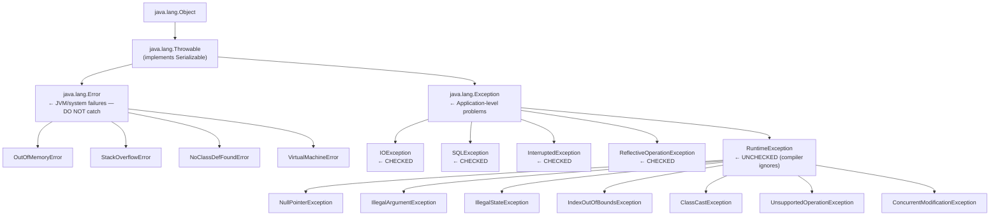

# Java Exception Handling

## 1. What

Exception handling is Java's mechanism for dealing with runtime errors and abnormal conditions. Java uses a class-based hierarchy rooted at `Throwable`, separating unrecoverable system errors (`Error`) from application-level problems (`Exception`), and further splitting exceptions into checked (compiler-enforced) and unchecked (runtime) categories.

### Exception Class Hierarchy



**Rule of thumb**: Everything under `RuntimeException` or `Error` is unchecked. Everything else under `Exception` is checked.

## 2. Why

- **Separation of error-handling code from normal logic** — cleaner than return-code checking (C-style).
- **Propagation up the call stack** — you don't have to handle errors at every layer; let them bubble to the appropriate handler.
- **Type-based dispatching** — different `catch` blocks for different failure modes.
- **Compiler enforcement** (checked exceptions) — forces callers to acknowledge possible failures like I/O or network errors.
- **Stack trace capture** — every exception records exactly where and how it was created, enabling fast debugging.

## 3. How

### 3.1 Checked vs Unchecked Exceptions

| Aspect | Checked | Unchecked |
|--------|---------|-----------|
| Superclass | `Exception` (not `RuntimeException`) | `RuntimeException` or `Error` |
| Compiler enforcement | Must `catch` or `throws` | No compiler requirement |
| Typical cause | External failure (I/O, network, DB) | Programming bug (null deref, bad cast) |
| When to use | Caller can reasonably recover | Caller cannot/should not recover |
| Examples | `IOException`, `SQLException` | `NullPointerException`, `IllegalArgumentException` |

**Why checked exceptions are controversial**:
- They leak implementation details into method signatures — changing an internal library forces signature changes up the call chain.
- They lead to boilerplate `try/catch` blocks where developers just swallow or wrap exceptions.
- Kotlin, C#, Scala, and Python all chose **not** to have checked exceptions. Kotlin treats all exceptions as unchecked; C# uses documentation-based contracts instead.
- Modern Java frameworks (Spring, JPA) wrap checked exceptions into unchecked ones (e.g., `DataAccessException`).

### 3.2 try-catch-finally

```java
try {
    riskyOperation();
} catch (SpecificException e) {
    // handle
} finally {
    // ALWAYS executes (even after return, break, or exception)
    cleanup();
}
```

**Execution order**: `try` block runs first. If an exception is thrown, the matching `catch` block runs. `finally` runs in all cases — whether the try completed normally, an exception was caught, or an uncaught exception is propagating.

**The finally + return gotcha**:

```java
// BAD — finally block overrides the return value
static int gotcha() {
    try {
        return 1;
    } finally {
        return 2; // ⚠ Compiler warning; method returns 2, NOT 1
    }
}
```

The `finally` block's `return` silently swallows any exception that was propagating. Never return from a finally block.

**finally vs try-with-resources**: `finally` blocks are error-prone — you can forget to null-check resources, and exceptions in `finally` can mask exceptions from `try`. Prefer `try-with-resources` for anything that implements `AutoCloseable`.

### 3.3 try-with-resources (Java 7+)

```java
try (var conn = dataSource.getConnection();
     var stmt = conn.prepareStatement(sql);
     var rs = stmt.executeQuery()) {

    while (rs.next()) {
        process(rs);
    }
} // conn, stmt, rs are all closed automatically in REVERSE order
```

**Key mechanics**:
- Resources must implement `AutoCloseable` (or the older `Closeable`).
- Resources are closed in **reverse declaration order**.
- If both `try` and `close()` throw, the `try` exception is the primary one and the `close()` exception becomes **suppressed**.

**Suppressed exceptions**:

```java
try (var res = new FaultyResource()) {
    throw new RuntimeException("from try");
}
// FaultyResource.close() also throws

// In the catch block:
catch (RuntimeException e) {
    System.out.println(e.getMessage());           // "from try"
    Throwable[] suppressed = e.getSuppressed();
    System.out.println(suppressed[0].getMessage()); // "from close"
}
```

**Custom AutoCloseable resource**:

```java
public class ManagedConnection implements AutoCloseable {
    private final Connection conn;

    public ManagedConnection(String url) throws SQLException {
        this.conn = DriverManager.getConnection(url);
    }

    @Override
    public void close() throws SQLException {
        if (conn != null && !conn.isClosed()) {
            conn.close();
        }
    }
}
```

### 3.4 Custom Exceptions

Create custom exceptions when standard ones don't convey enough meaning or you need to attach structured metadata.

```java
// Unchecked — for business rule violations
public class InsufficientBalanceException extends RuntimeException {
    private final String accountId;
    private final BigDecimal requested;
    private final BigDecimal available;

    public InsufficientBalanceException(String accountId,
                                        BigDecimal requested,
                                        BigDecimal available) {
        super(String.format("Account %s: requested=%s, available=%s",
                            accountId, requested, available));
        this.accountId = accountId;
        this.requested = requested;
        this.available = available;
    }

    // Getters for structured access by callers
    public String getAccountId() { return accountId; }
    public BigDecimal getRequested() { return requested; }
    public BigDecimal getAvailable() { return available; }
}
```

```java
// Checked — for recoverable integration failures
public class PaymentGatewayException extends Exception {
    private final int errorCode;

    public PaymentGatewayException(String message, int errorCode, Throwable cause) {
        super(message, cause);       // Always chain the original cause
        this.errorCode = errorCode;
    }

    public int getErrorCode() { return errorCode; }
}
```

**Guidelines**: Extend `RuntimeException` for programming errors or business rule violations. Extend `Exception` for recoverable, anticipated failures where the caller must act. Always accept a `Throwable cause` parameter to preserve the exception chain.

### 3.5 Multi-catch and Precise Re-throw (Java 7+)

**Multi-catch** — catch multiple unrelated exception types in a single block:

```java
try {
    reflectiveOperation();
} catch (ClassNotFoundException | NoSuchMethodException e) {
    // e is effectively final — cannot reassign
    log.error("Reflection failed", e);
    throw new ConfigurationException("Bad plugin config", e);
}
```

**Precise re-throw** — the compiler tracks which checked exceptions can actually be thrown:

```java
public void process() throws IOException, SQLException {
    try {
        mayThrowIOException();
        mayThrowSQLException();
    } catch (Exception e) {
        log.error("Processing failed", e);
        throw e; // Compiler knows only IOException or SQLException can reach here
    }
}
```

Before Java 7, the `throws` clause would need `throws Exception` because the compiler treated `e` as type `Exception`.

### 3.6 Exception Handling Patterns

**Catch-early-throw-late principle**:
- **Throw late**: Don't catch exceptions at low levels just to re-throw. Let them propagate to the layer that can make a meaningful recovery decision.
- **Catch early (validate early)**: Validate inputs at the boundary so exceptions don't occur deep inside business logic.

```java
// Good — validate at the boundary, throw late from the service
public Order createOrder(OrderRequest req) {
    Objects.requireNonNull(req.getCustomerId(), "customerId must not be null");
    if (req.getItems().isEmpty()) {
        throw new IllegalArgumentException("Order must have at least one item");
    }
    return orderRepository.save(toEntity(req)); // Let DB exceptions propagate
}
```

**Exception translation** (wrapping lower-level exceptions):

```java
public User findUser(String id) {
    try {
        return jdbcTemplate.queryForObject(SQL, mapper, id);
    } catch (DataAccessException e) {
        throw new UserNotFoundException("User not found: " + id, e); // Preserve cause
    }
}
```

This prevents leaking implementation details (JDBC, Hibernate) into your domain API.

**Global exception handling in Spring**:

```java
@RestControllerAdvice
public class GlobalExceptionHandler {

    @ExceptionHandler(UserNotFoundException.class)
    public ProblemDetail handleNotFound(UserNotFoundException ex) {
        ProblemDetail pd = ProblemDetail.forStatusAndDetail(
            HttpStatus.NOT_FOUND, ex.getMessage());
        pd.setTitle("User Not Found");
        pd.setProperty("userId", ex.getUserId());
        return pd;                    // Returns RFC 7807 JSON
    }

    @ExceptionHandler(MethodArgumentNotValidException.class)
    public ProblemDetail handleValidation(MethodArgumentNotValidException ex) {
        ProblemDetail pd = ProblemDetail.forStatus(HttpStatus.BAD_REQUEST);
        pd.setTitle("Validation Failed");
        pd.setProperty("errors", ex.getFieldErrors().stream()
            .map(f -> f.getField() + ": " + f.getDefaultMessage())
            .toList());
        return pd;
    }

    @ExceptionHandler(Exception.class)
    public ProblemDetail handleGeneric(Exception ex) {
        // Log full stack trace, return sanitized response
        log.error("Unhandled exception", ex);
        return ProblemDetail.forStatusAndDetail(
            HttpStatus.INTERNAL_SERVER_ERROR, "An unexpected error occurred");
    }
}
```

`ProblemDetail` (Spring 6+ / Boot 3+) implements RFC 7807 — a standard JSON structure for HTTP error responses with `type`, `title`, `status`, `detail`, and extensible properties.

### 3.7 Best Practices

1. **Never catch `Throwable` or `Error`** — `OutOfMemoryError`, `StackOverflowError` are unrecoverable. Catching them hides fatal problems.

2. **Never swallow exceptions**:
   ```java
   // TERRIBLE — silent failure
   try { riskyOp(); } catch (Exception e) { /* ignore */ }

   // If you genuinely expect it, document WHY:
   try { riskyOp(); } catch (ExpectedException e) {
       // Expected when X is not configured — safe to proceed with default
       log.debug("Using default, X not configured", e);
   }
   ```

3. **Log-and-rethrow anti-pattern** — avoid logging and then rethrowing the same exception; it produces duplicate log entries at every layer:
   ```java
   // BAD — every layer logs the same stack trace
   catch (IOException e) {
       log.error("Failed", e);
       throw e;
   }

   // GOOD — either log OR rethrow, not both
   // Let the top-level handler (e.g., @ControllerAdvice) do the logging
   ```

4. **Don't use exceptions for control flow**:
   ```java
   // BAD — using exception as a conditional
   try {
       int val = Integer.parseInt(input);
   } catch (NumberFormatException e) {
       val = defaultValue;
   }

   // BETTER — check first, or use Optional-based APIs
   OptionalInt parsed = tryParseInt(input);
   int val = parsed.orElse(defaultValue);
   ```

5. **Always include context** — include relevant IDs, parameters, and state in exception messages. The message should answer: "What were we trying to do, and with what data?"

6. **Prefer specific exception types** — catch `FileNotFoundException` before `IOException`. Throw `IllegalArgumentException` instead of generic `RuntimeException`.

7. **Always chain the cause** — when wrapping exceptions, pass the original as the `cause` parameter so the full stack trace is preserved.

### 3.8 Performance — Cost of Throwing Exceptions

Constructing an exception is expensive because `Throwable` captures the entire call stack via `fillInStackTrace()` (a native method that walks stack frames).

**Benchmark insight**: Throwing and catching an exception is 50-100x slower than a normal return. The cost is dominated by stack trace construction, not the throw/catch mechanism itself.

**Optimization — override `fillInStackTrace()`**:

```java
// For flow-control exceptions where you don't need the stack trace
public class ControlFlowException extends RuntimeException {
    public static final ControlFlowException INSTANCE = new ControlFlowException();

    private ControlFlowException() {
        super(null, null, true, false); // disable stack trace + suppression
    }

    @Override
    public synchronized Throwable fillInStackTrace() {
        return this; // no-op — avoids expensive native call
    }
}
```

The `Throwable(String, Throwable, boolean, boolean)` constructor (Java 7+) takes `enableSuppression` and `writableStackTrace` flags. Setting `writableStackTrace=false` skips stack trace capture entirely.

**When this matters**: High-throughput systems (e.g., parsing pipelines, validation engines) where exceptions might be thrown thousands of times per second. In typical business applications, exception performance is rarely a bottleneck.

## 4. Interview Angles

### Q1: What is the difference between checked and unchecked exceptions? When would you create each?

**Checked exceptions** extend `Exception` (but not `RuntimeException`) and must be declared in `throws` or caught. Use them for **recoverable, anticipated failures** — I/O errors, network timeouts, missing configuration. The compiler forces the caller to handle them. **Unchecked exceptions** extend `RuntimeException` and indicate **programming errors** (null dereference, illegal argument) or **business rule violations** that callers shouldn't be forced to catch. In modern Java, the trend leans toward unchecked exceptions (Spring wraps all data access exceptions as unchecked `DataAccessException`), reserving checked exceptions for truly recoverable scenarios.

### Q2: What happens if both the `try` block and `close()` throw exceptions in try-with-resources?

The exception from the `try` block becomes the **primary** exception that propagates. The exception from `close()` is added to it as a **suppressed exception**, accessible via `primary.getSuppressed()`. This is the opposite of `finally` behavior, where a `finally` exception would silently replace the `try` exception. This design ensures the original root cause is never lost.

### Q3: Can a `finally` block prevent an exception from propagating?

Yes. If a `finally` block executes a `return`, `break`, or `continue`, it will **silently swallow** any exception that was propagating from the `try` or `catch` block. Similarly, if `finally` throws a new exception, the original exception is lost entirely (no suppressed exception mechanism like try-with-resources). This is why you should never use control-flow statements in `finally`.

### Q4: How does `@ControllerAdvice` work for global exception handling?

`@ControllerAdvice` is a Spring stereotype annotation that marks a class as a cross-cutting concern for all controllers. Methods annotated with `@ExceptionHandler(SomeException.class)` inside it act as centralized catch blocks. When any controller throws `SomeException`, Spring's `ExceptionHandlerExceptionResolver` intercepts it and routes to the matching handler. Spring Boot 3+ supports `ProblemDetail` (RFC 7807) as a return type for standardized error responses. The resolution order is: specific exception type first, then parent types, then generic `Exception.class`.

### Q5: Why is catching `Throwable` dangerous?

`Throwable` is the superclass of both `Exception` and `Error`. `Error` subclasses (`OutOfMemoryError`, `StackOverflowError`, `InternalError`) represent **JVM-level failures** that the application cannot recover from. Catching them masks fatal conditions — for example, catching `OutOfMemoryError` might let a corrupted application continue running in an undefined state. The only acceptable scenario is a top-level thread handler that logs the error and terminates gracefully.

### Q6: What is exception translation and why is it important?

Exception translation means catching a low-level exception and throwing a higher-level, domain-specific one. For example, catching `SQLException` and throwing `UserNotFoundException`. This is important because (1) it prevents **leaking implementation details** — your API callers shouldn't know you use JDBC vs JPA, (2) it provides **meaningful context** at the right abstraction level, and (3) it allows you to change implementation without breaking callers' catch blocks. Always chain the original exception as the `cause`.

### Q7: What is the performance cost of exceptions, and how can you mitigate it?

The main cost is `fillInStackTrace()`, a native method that walks the entire call stack at construction time. Throwing an exception is roughly 50-100x more expensive than a normal return. Mitigation strategies: (1) **Override `fillInStackTrace()`** to return `this` (no-op) when the stack trace isn't needed. (2) Use the `Throwable(msg, cause, enableSuppression, writableStackTrace)` constructor with `writableStackTrace=false`. (3) **Cache a singleton exception instance** for high-frequency flow-control exceptions. (4) Avoid using exceptions for control flow entirely — prefer `Optional`, sentinel values, or result objects.

### Q8: What is the "log-and-rethrow" anti-pattern?

It occurs when code catches an exception, logs it, and immediately rethrows it. Every layer that does this produces a duplicate log entry for the same exception, creating noisy, misleading logs. The fix: **either** handle the exception (log + recover/translate) **or** let it propagate untouched. Centralize logging at the top-level handler (e.g., `@ControllerAdvice` in Spring, or `Thread.setUncaughtExceptionHandler` for background threads).
