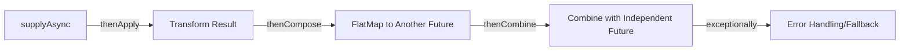

# Callable, Future, and `CompletableFuture` in Java

When writing concurrent code, we often need to run a task on a background thread and get a result back when it's done. Java provides three main tools for this: `Callable`, `Future`, and `CompletableFuture`.

Let's understand them using a restaurant analogy:

* **`Runnable` (Fire and Forget)**: You order a coffee at the counter, walk away, and don't care about a receipt or a result. You just trust that it gets brewed.
* **`Callable` & `Future` (The Pager/Receipt)**: You order a burger. The cashier gives you a pager (the **`Future`**). You can't eat the pager. To get the burger, you must stand at the counter and wait for the pager to vibrate. You are **blocked** from doing anything else while you wait (`future.get()`).
* **`CompletableFuture` (The Smart Delivery App)**: You order a complete meal on a delivery app. The app automatically chains the actions: Cook the meal $\rightarrow$ Assign a driver $\rightarrow$ Deliver to your door $\rightarrow$ Notify you when it arrives. You don't stand at the door waiting; you play video games, and the entire chain of events runs in the background.

---

## 1. `Runnable` vs. `Callable`

Both represent tasks designed to be executed by another thread. However, they have key differences:

| Feature | `Runnable` | `Callable<V>` |
| :--- | :--- | :--- |
| **Method** | `public void run()` | `public V call() throws Exception` |
| **Return Value** | None (`void`). | Returns a result of type `V`. |
| **Exception Handling** | Cannot throw checked exceptions (must use try-catch inside). | **Can throw checked exceptions** directly. |
| **Since Version** | Java 1.0 | Java 1.5 |

### Using `Callable` and `Future`

When you submit a `Callable` to an `ExecutorService`, it returns a `Future` object:

```java
import java.util.concurrent.*;

public class FutureDemo {
    public static void main(String[] args) throws Exception {
        ExecutorService executor = Executors.newSingleThreadExecutor();

        Callable<String> task = () -> {
            Thread.sleep(1000); // Simulate heavy computation
            return "Burger is ready!";
        };

        System.out.println("Ordering burger...");
        Future<String> future = executor.submit(task); // Returns the "Pager"

        // You can check if it's done without blocking:
        if (!future.isDone()) {
            System.out.println("Doing other work while burger cooks...");
        }

        // BLOCKING CALL: Your thread stops here until the result is ready!
        String result = future.get(); // Waits for task to complete
        System.out.println("Result: " + result);

        executor.shutdown();
    }
}
```

### Limitations of `Future`:
1. **It is Blocking**: You cannot get the result without calling `future.get()`, which halts the calling thread.
2. **No Callbacks**: You cannot say: *"When the future completes, automatically run this next function."*
3. **Cannot manually complete**: You cannot manually resolve a `Future` (e.g., hardcode a fallback value if something else fails).
4. **No combination**: You cannot easily combine multiple futures (e.g., run Task A and Task B in parallel, and run Task C only when both complete).

---

## 2. Enter `CompletableFuture`

Introduced in Java 8, `CompletableFuture` implements both `Future` and `CompletionStage`. It enables **non-blocking, callback-driven asynchronous programming**.

### Creating a `CompletableFuture`

* **`runAsync(Runnable)`**: Runs a task asynchronously that returns no result.
* **`supplyAsync(Supplier<U>)`**: Runs a task asynchronously and returns a result of type `U`.

> [!WARNING]
> **The Thread Pool Danger**
> By default, `CompletableFuture` runs tasks on the global **`ForkJoinPool.commonPool()`**. 
> If any task blocks (e.g., waiting for database queries or HTTP calls), it will starve the common pool and freeze other parallel streams or async tasks in your JVM. 
> **Always pass a custom Executor in production!**
> ```java
> Executor customExecutor = Executors.newFixedThreadPool(10);
> CompletableFuture.supplyAsync(() -> "Result", customExecutor);
> ```

---

## 3. Chaining & Transforming APIs

Chaining is where `CompletableFuture` shines. It allows you to build pipelines of execution.



### The Async Suffix Rule: Sync vs. Async
Every chaining method has an `Async` variant (e.g., `thenApply` vs `thenApplyAsync`):
* **Without `Async` suffix (e.g., `thenApply(fn)`)**: Executes `fn` on the **same thread** that finished the previous stage (or the calling thread if the previous stage was already complete).
* **With `Async` suffix (e.g., `thenApplyAsync(fn)`)**: Submits `fn` to a **different thread** in the executor pool to run asynchronously. Use this for heavy CPU tasks to avoid blocking the worker thread that completed the previous task.

---

### A. `thenApply` / `thenApplyAsync` — *The Transformer (Map)*
* **Used for**: Transforming the result of a previous future using a synchronous function.
* **Analogy**: You receive a baked pizza base, and you apply tomato sauce and cheese to it.
* **Type Signature**: Takes a `Function<T, U>` (takes `T` from previous future, returns `U`). Returns `CompletableFuture<U>`.

```java
CompletableFuture<String> pizzaBase = CompletableFuture.supplyAsync(() -> "Plain Dough");

CompletableFuture<String> toppedPizza = pizzaBase.thenApply(dough -> dough + " + Cheese + Tomato");
// Output: "Plain Dough + Cheese + Tomato"
```

---

### B. `thenCompose` / `thenComposeAsync` — *The Flattener (FlatMap)*
* **Used for**: Chaining two dependent futures where the second future *needs* the output of the first future to start.
* **Analogy**: You order a pizza. Once the pizza is ready, you call a delivery service API (which itself runs asynchronously and returns a `CompletableFuture<DeliveryStatus>`) to deliver it.
* **Why not `thenApply`?**: If you use `thenApply` here, you get a nested future: `CompletableFuture<CompletableFuture<DeliveryStatus>>`. `thenCompose` flattens this to `CompletableFuture<DeliveryStatus>`.

```java
CompletableFuture<String> getPizzaInfo = CompletableFuture.supplyAsync(() -> "Hot Pizza");

// A method that returns a future
public CompletableFuture<String> deliverPizza(String pizza) {
    return CompletableFuture.supplyAsync(() -> pizza + " delivered by Rider!");
}

// FlatMap / Flattening
CompletableFuture<String> deliveryResult = getPizzaInfo.thenCompose(pizza -> deliverPizza(pizza));
// Output: "Hot Pizza delivered by Rider!"
```

---

### C. `thenCombine` / `thenCombineAsync` — *The Combiner*
* **Used for**: Combining two **independent** futures that run in parallel. When both finish, a combining function runs.
* **Analogy**: You order a burger (Future A) and a cold drink (Future B) at the same time. Once *both* are ready, the server packs them together into one meal bag (BiFunction).

```java
CompletableFuture<String> burgerFuture = CompletableFuture.supplyAsync(() -> "Hot Burger");
CompletableFuture<String> drinkFuture = CompletableFuture.supplyAsync(() -> "Cold Cola");

CompletableFuture<String> mealFuture = burgerFuture.thenCombine(drinkFuture, (burger, drink) -> {
    return burger + " & " + drink + " packed in one bag!";
});
// Output: "Hot Burger & Cold Cola packed in one bag!"
```

---

## 4. Error Handling in Pipelines

Unlike standard futures, `CompletableFuture` allows you to handle exceptions inline within the pipeline.

### 1. `exceptionally` — *The Catch-Fallback*
Executes only if an exception is thrown in the pipeline. It allows you to catch the exception and return a default/fallback value.

```java
CompletableFuture.supplyAsync(() -> {
    if (true) throw new RuntimeException("Database down!");
    return "Sensitive Data";
})
.exceptionally(ex -> {
    System.out.println("Error: " + ex.getMessage());
    return "Fallback Safe Data"; // Recover with fallback
});
```

### 2. `handle` — *The Recover/Finally block*
Always runs, whether the previous stage completed successfully or threw an exception. It gives you both the result and the exception object.

```java
CompletableFuture.supplyAsync(() -> "Success Data")
.handle((result, exception) -> {
    if (exception != null) {
        return "Recovered from: " + exception.getMessage();
    }
    return result.toUpperCase(); // Transforms result if successful
});
```

---

## 5. Solving Interview Questions (From Noob to Pro)

### Q1: What is the difference between `thenApply` and `thenCompose`?
* **`thenApply(Function<T, R>)`**:
  * Used for basic transformations (like `map` in Java Streams).
  * The transformation function returns a raw value `R`.
  * Return type: `CompletableFuture<R>`.
* **`thenCompose(Function<T, CompletableFuture<R>>)`**:
  * Used for chaining dependent asynchronous tasks (like `flatMap` in Java Streams).
  * The transformation function returns a `CompletableFuture<R>`.
  * Return type: `CompletableFuture<R>` (automatically flattened).

---

### Q2: What is the difference between `thenApply` and `thenApplyAsync`?
* **`thenApply`**:
  * Runs on the thread that completed the previous future. If the previous future was already complete when `thenApply` was called, it will run on the main/caller thread.
* **`thenApplyAsync`**:
  * Always runs on a background thread from the executor pool (either `ForkJoinPool.commonPool()` or a passed custom executor), regardless of which thread finished the previous task or when it finished.

---

### Q3: What is the default thread pool for `CompletableFuture`, and why is it dangerous?
* **Answer**: It is `ForkJoinPool.commonPool()`.
* **Danger**: The common pool is shared across the entire JVM (by all parallel streams and other default CompletableFutures). If you run I/O-heavy operations (like REST calls or SQL queries) in it, all threads in the common pool will block waiting for responses. This starves other parts of the application that rely on parallel execution, causing severe performance degradation.
* **Fix**: Always instantiate and pass a custom `ThreadPoolExecutor` to the `Async` methods.

---

### Q4: How do you run multiple futures in parallel and wait for all of them to finish?
Use `CompletableFuture.allOf(...)`. It takes an array of futures and returns a `CompletableFuture<Void>` that completes only when *all* input futures are done.

```java
CompletableFuture<String> f1 = CompletableFuture.supplyAsync(() -> "A");
CompletableFuture<String> f2 = CompletableFuture.supplyAsync(() -> "B");
CompletableFuture<String> f3 = CompletableFuture.supplyAsync(() -> "C");

// Wait for all to finish
CompletableFuture<Void> allDone = CompletableFuture.allOf(f1, f2, f3);

// To get the results after all are done:
allDone.thenRun(() -> {
    try {
        String res1 = f1.get();
        String res2 = f2.get();
        String res3 = f3.get();
        System.out.println(res1 + res2 + res3);
    } catch (Exception e) {
        e.printStackTrace();
    }
});
```

---

### Q5: What is `CompletableFuture.anyOf(...)`?
It runs multiple futures in parallel and completes as soon as **any** of the futures complete (whichever is the fastest). It returns `CompletableFuture<Object>` representing the result of the fastest task.
* *Example use case*: Querying three different API mirrors for the same stock price, and using the fastest response.

---

### Q6: What happens if an exception is thrown inside a `CompletableFuture` pipeline, and you don't call `exceptionally()` or `handle()`?
The exception will be swallowed silently inside the pipeline. It will only be surfaced when you call terminal blocking methods like `.get()` or `.join()`, which will throw an `ExecutionException` or a `CompletionException` wrapping the original exception. 
* *Best Practice*: Always append `.exceptionally()` or `.handle()` to log the error or return a fallback value so the pipeline recovers gracefully.
