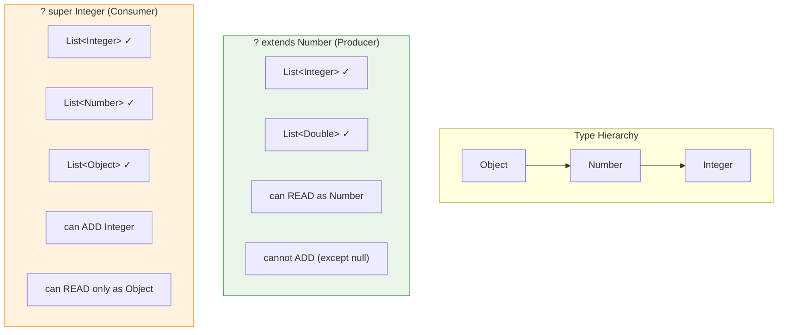
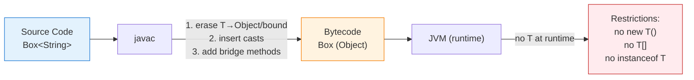

# Java Generics & Type Erasure

## 1. What
Generics allow types (classes, interfaces, methods) to be parameterized over other types, providing compile-time type safety while enabling code reuse. Type erasure is the mechanism by which the Java compiler removes all generic type information after compilation, replacing type parameters with their bounds (or `Object`) so the JVM bytecode remains backward-compatible with pre-generics code.

## 2. Why
- **Compile-time type safety** — catch `ClassCastException` at compile time instead of runtime.
- **Eliminate explicit casts** — `List<String> list; list.get(0)` returns `String` directly.
- **Enable generic algorithms** — write a single sort, search, or data-structure implementation that works for any type.
- **API clarity** — generic signatures document what types a method accepts and returns.

Without generics (pre-Java 5):
```java
List names = new ArrayList();
names.add("Alice");
String s = (String) names.get(0);   // manual cast
names.add(42);                      // compiles fine — blows up later
```

With generics:
```java
List<String> names = new ArrayList<>();
names.add("Alice");
String s = names.get(0);            // no cast needed
names.add(42);                      // compile-time error
```

## 3. How

### 3.1 Generic Classes & Methods

```java
// Generic class with single type parameter
public class Box<T> {
    private T value;
    public void set(T value) { this.value = value; }
    public T get() { return value; }
}

// Multiple type parameters
public class Pair<K, V> {
    private final K key;
    private final V value;
    public Pair(K key, V value) { this.key = key; this.value = value; }
    public K getKey()   { return key; }
    public V getValue() { return value; }
}

// Generic method — type parameter declared before return type
public class Util {
    public static <T> T firstNonNull(T first, T second) {
        return first != null ? first : second;
    }

    // Type parameter independent of class-level params
    public static <K, V> boolean compare(Pair<K, V> p1, Pair<K, V> p2) {
        return p1.getKey().equals(p2.getKey()) &&
               p1.getValue().equals(p2.getValue());
    }
}
```

### 3.2 Bounded Type Parameters

```java
// Upper bound — T must implement Comparable
public static <T extends Comparable<T>> T max(T a, T b) {
    return a.compareTo(b) >= 0 ? a : b;
}

// Multiple bounds — T must extend Number AND implement Comparable
// Class bound must come first, followed by interface bounds
public static <T extends Number & Comparable<T>> T clamp(T val, T lo, T hi) {
    if (val.compareTo(lo) < 0) return lo;
    if (val.compareTo(hi) > 0) return hi;
    return val;
}
```

### 3.3 Wildcards

```java
// Unbounded — accepts List of any type, read-only as Object
public static void printAll(List<?> list) {
    for (Object o : list) System.out.println(o);
}

// Upper bounded — accepts List<Integer>, List<Double>, etc.
public static double sum(List<? extends Number> list) {
    double total = 0;
    for (Number n : list) total += n.doubleValue();
    return total;
}

// Lower bounded — accepts List<Integer>, List<Number>, List<Object>
public static void addIntegers(List<? super Integer> list) {
    list.add(1);
    list.add(2);
}
```

### 3.4 PECS — Producer Extends, Consumer Super



The rule for deciding between `? extends T` and `? super T`:
- If the parameterized type **produces** values you read from it, use `extends` (covariance).
- If the parameterized type **consumes** values you write to it, use `super` (contravariance).
- If you both read and write, use neither — use an exact type.

```java
// Collections.copy signature — textbook PECS
public static <T> void copy(List<? super T> dest, List<? extends T> src) {
    for (int i = 0; i < src.size(); i++) {
        dest.set(i, src.get(i));  // src produces T, dest consumes T
    }
}

// Example usage
List<Number> numbers = new ArrayList<>(Arrays.asList(0, 0, 0));
List<Integer> ints = Arrays.asList(1, 2, 3);
Collections.copy(numbers, ints);  // dest=List<? super Integer>, src=List<? extends Integer>
```

Another example — `Comparator`:
```java
// A Comparator<Number> can compare Integers, so use ? super
public static <T> T max(Collection<? extends T> coll, Comparator<? super T> comp) {
    Iterator<? extends T> it = coll.iterator();
    T candidate = it.next();
    while (it.hasNext()) {
        T next = it.next();
        if (comp.compare(next, candidate) > 0) candidate = next;
    }
    return candidate;
}
```

### 3.5 Type Erasure — What the Compiler Does



The Java compiler applies type erasure to enforce generics only at compile time:

1. Replace all type parameters with their bounds (or `Object` if unbounded).
2. Insert casts where necessary to preserve type safety.
3. Generate **bridge methods** to maintain polymorphism in inheritance.

**Before erasure (source code):**
```java
public class Box<T> {
    private T value;
    public void set(T value) { this.value = value; }
    public T get() { return value; }
}

Box<String> box = new Box<>();
box.set("hello");
String s = box.get();
```

**After erasure (what the JVM sees):**
```java
public class Box {
    private Object value;
    public void set(Object value) { this.value = value; }
    public Object get() { return value; }
}

Box box = new Box();
box.set("hello");
String s = (String) box.get();  // compiler-inserted cast
```

**Bounded type parameter erasure:**
```java
// Source
public static <T extends Comparable<T>> T max(T a, T b) { ... }

// After erasure — T replaced with Comparable (the bound)
public static Comparable max(Comparable a, Comparable b) { ... }
```

**Bridge methods** — generated to preserve polymorphism:
```java
public class StringBox extends Box<String> {
    @Override
    public void set(String value) { super.set(value); }
}

// After erasure, Box.set expects Object. The compiler generates a bridge:
// synthetic bridge method (in bytecode)
public void set(Object value) {
    set((String) value);   // delegates to the actual set(String)
}
```

### 3.6 Restrictions Due to Type Erasure

```java
// 1. Cannot instantiate type parameter
public class Box<T> {
    // T item = new T();                // ILLEGAL — compiler doesn't know constructor
    // Workaround: pass a Supplier<T> or Class<T>
    public static <T> T create(Supplier<T> factory) {
        return factory.get();
    }
}

// 2. Cannot use instanceof with parameterized type
// if (obj instanceof List<String>) {}  // ILLEGAL — erased to List at runtime
   if (obj instanceof List<?>) {}       // OK — unbounded wildcard is allowed

// 3. Cannot create generic arrays
// T[] arr = new T[10];                 // ILLEGAL
// List<String>[] arr = new List<String>[10]; // ILLEGAL
   List<?>[] arr = new List<?>[10];     // OK but requires casts

// 4. Cannot use primitives as type arguments
// List<int> nums;                      // ILLEGAL — use List<Integer>

// 5. Cannot create, catch, or throw generic exception types
// class MyException<T> extends Exception {} // ILLEGAL

// 6. Cannot overload methods that erase to the same signature
// void process(List<String> list) {}
// void process(List<Integer> list) {}  // ILLEGAL — both erase to process(List)

// 7. Static fields cannot use the class's type parameter
public class Box<T> {
    // static T defaultValue;           // ILLEGAL — T is per-instance
    static int count;                   // OK — not type-dependent
}
```

### 3.7 Generic Patterns

**Generic Factory:**
```java
public interface Factory<T> {
    T create();
}

public class ServiceLocator {
    private final Map<Class<?>, Factory<?>> factories = new HashMap<>();

    public <T> void register(Class<T> type, Factory<T> factory) {
        factories.put(type, factory);
    }

    @SuppressWarnings("unchecked")
    public <T> T create(Class<T> type) {
        Factory<T> factory = (Factory<T>) factories.get(type);
        return factory.create();
    }
}
```

**Generic DAO / Repository:**
```java
public interface Repository<T, ID> {
    T findById(ID id);
    List<T> findAll();
    T save(T entity);
    void delete(ID id);
}

public class JpaRepository<T, ID extends Serializable>
        implements Repository<T, ID> {
    private final Class<T> entityClass;

    // Class<T> token needed because of erasure — can't do T.class at runtime
    public JpaRepository(Class<T> entityClass) {
        this.entityClass = entityClass;
    }

    @Override
    public T findById(ID id) {
        return entityManager.find(entityClass, id);
    }
    // ...
}
```

**Self-bounded types (`Enum<E extends Enum<E>>`):**
```java
// Java's Enum declaration — the "Curiously Recurring Template Pattern" (CRTP)
public abstract class Enum<E extends Enum<E>> implements Comparable<E> {
    public final int compareTo(E other) { /* compare ordinals */ }
}

// When you write:
public enum Color { RED, GREEN, BLUE }
// Compiler generates:
public final class Color extends Enum<Color> { ... }
// compareTo(Color other) — type-safe, no raw Enum comparison

// Your own self-bounded type — fluent builder pattern
public abstract class Builder<B extends Builder<B>> {
    public B withName(String name) {
        this.name = name;
        return self();
    }
    @SuppressWarnings("unchecked")
    protected B self() { return (B) this; }
}

public class UserBuilder extends Builder<UserBuilder> {
    public UserBuilder withEmail(String email) {
        this.email = email;
        return self();
    }
}

// Method chaining returns the concrete type, not the base type
UserBuilder builder = new UserBuilder()
    .withName("Alice")       // returns UserBuilder, not Builder
    .withEmail("a@b.com");   // still UserBuilder
```

### 3.8 Heap Pollution & @SafeVarargs

Heap pollution occurs when a variable of a parameterized type refers to an object that is not of that parameterized type.

```java
// Varargs + generics creates a generic array — compiler warns about heap pollution
@SafeVarargs
public static <T> List<T> listOf(T... elements) {
    return Arrays.asList(elements);  // safe — no modification of the varargs array
}

// UNSAFE — modifying the varargs array can cause heap pollution
public static <T> void unsafeMix(T... args) {
    Object[] objArray = args;      // legal — arrays are covariant
    objArray[0] = "string";       // if T is Integer, heap is polluted
    T first = args[0];            // ClassCastException at runtime
}
```

Rules for `@SafeVarargs`:
- Only applicable to methods that cannot be overridden (`static`, `final`, `private`, or constructors).
- Method must not store into or return the varargs array in a way that exposes the generic type unsafely.
- Suppresses both the caller-side "unchecked" warning and the callee-side "varargs" warning.

## 4. Interview Angles

### Q1: Why can't you do `new T()` or `new T[]` in Java generics?
Due to type erasure, the JVM has no knowledge of `T` at runtime. `new T()` would compile to `new Object()`, which is not the intended behavior. For arrays, `new T[]` is even more dangerous because Java arrays carry runtime type information and enforce type checks at the element level — creating an `Object[]` disguised as `T[]` would break the array store check. The workaround is to pass a `Class<T>` token or a `Supplier<T>` factory, or use `Array.newInstance(clazz, size)` for arrays.

### Q2: What is the difference between `List<Object>`, `List<?>`, and `List` (raw type)?
- **`List<Object>`** — a list that explicitly holds `Object`s. You can add anything to it, but a `List<String>` is NOT assignable to it (generics are invariant).
- **`List<?>`** — a list of unknown type. You can read elements as `Object` but cannot add anything except `null`. A `List<String>` IS assignable to it.
- **`List`** (raw) — opts out of generics entirely. No compile-time checking. Exists only for backward compatibility. You can add anything, but every `get` returns `Object`. Avoid in new code.

### Q3: Explain PECS with a real-world example.
PECS = Producer Extends, Consumer Super. In `Collections.copy(List<? super T> dest, List<? extends T> src)`: the source list **produces** elements (we read from it), so it uses `extends` — we know elements are at least `T`. The destination list **consumes** elements (we write to it), so it uses `super` — we know the list can accept at least `T`. This is the fundamental rule for designing flexible generic APIs.

### Q4: Why are generics invariant but arrays covariant? What problems does this cause?
Arrays are covariant: `Integer[]` is a subtype of `Number[]`. This was a pre-generics design decision to allow polymorphic code like `sort(Object[])`. But it leads to runtime failures — storing a `String` into a `Number[]` reference throws `ArrayStoreException`. Generics learned from this mistake and are invariant: `List<Integer>` is NOT a subtype of `List<Number>`. Wildcards (`? extends`, `? super`) provide controlled variance when needed.

### Q5: What are bridge methods? When does the compiler generate them?
Bridge methods are synthetic methods generated by the compiler to maintain polymorphism after type erasure. When a subclass overrides a method from a generic superclass with a more specific type, the erased signatures differ. For example, `StringBox.set(String)` overrides `Box<String>.set(T)`, but after erasure `Box.set(Object)` exists in bytecode. The compiler generates a bridge method `set(Object)` in `StringBox` that casts and delegates to `set(String)`. You can detect bridge methods via `Method.isBridge()` using reflection.

### Q6: Can you get generic type information at runtime? How do frameworks like Jackson/Spring do it?
Yes, partially. While type parameters on instances are erased, generic type information is preserved in class metadata for fields, method parameters, return types, and superclass declarations. `java.lang.reflect.ParameterizedType` can be used to inspect these. Frameworks exploit the "super type token" pattern — creating an anonymous subclass like `new TypeReference<List<String>>(){}` — because the generic argument of a superclass is stored in the class file and is accessible via `getGenericSuperclass()`.

### Q7: What is heap pollution and when should you use `@SafeVarargs`?
Heap pollution happens when a variable of a parameterized type holds a reference to an object of a different parameterized type — typically caused by mixing generics with raw types or varargs. Use `@SafeVarargs` on a varargs method when you can guarantee the method does not store anything into the varargs array and does not expose the array to untrusted code. The annotation can only be applied to methods that cannot be overridden (static, final, private, or constructors).

### Q8: How does `Enum<E extends Enum<E>>` work and why is it designed this way?
This self-bounded type (CRTP pattern) ensures that each enum subclass `E` carries its own type in the generic parameter. This enables `Comparable<E>` — so `Color.compareTo()` takes a `Color`, not a raw `Enum`. Without the self-bound, `compareTo` would accept any enum type, losing type safety. The constraint `E extends Enum<E>` guarantees that `E` is the enum class itself, preventing nonsensical declarations like `class Foo extends Enum<Bar>`. The same pattern is used in fluent builders to ensure method chaining returns the concrete subtype.
