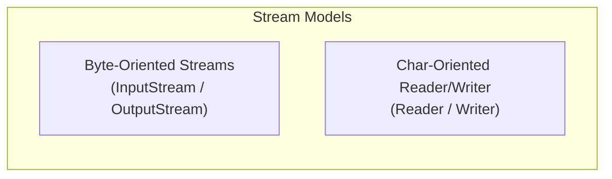
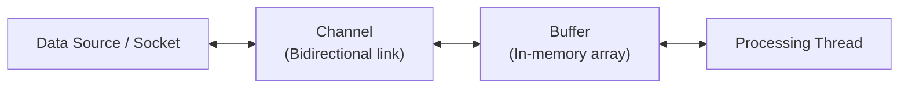

# Java I/O and NIO / NIO2

## 1. What
This section details Java's Input/Output systems. It covers the legacy stream-based blocking I/O (`java.io`), the modern non-blocking, buffer-oriented New I/O (`java.nio`) with I/O multiplexing via selectors, and the asynchronous file and filesystem API updates in NIO2 (`java.nio.file`).

## 2. Why
- **Performance at Scale**: High-concurrency network servers (like Netty, Tomcat, or API Gateways) require NIO [Selector](file:///Users/rohit.kumar.4/Documents/interview-prep/java/java-io-and-nio.md) architectures to manage thousands of active socket connections using a single thread.
- **System Design Trade-offs**: Choosing between heap buffers and direct buffers (`ByteBuffer.allocateDirect()`) impacts both raw performance (due to zero-copy) and GC memory overhead.
- **Modern File Handling**: NIO2 filesystem classes provide atomic actions, file attribute handling, and high-performance directory walking that legacy [File](file:///Users/rohit.kumar.4/Documents/interview-prep/java/java-io-and-nio.md) cannot do.

## 3. How

---

### 3.1 Legacy Java I/O (`java.io`)

#### Stream-Based & Blocking
Legacy Java I/O operates on a stream model: data is read or written byte-by-byte or char-by-char.
- **Blocking**: When a thread calls `read()` or `write()`, it blocks execution until data is fully available or written. During network reads, a thread must wait idle if the client is slow, leading to a "one thread per connection" design which scales poorly.
- **Byte vs Character**:
  - [InputStream](file:///Users/rohit.kumar.4/Documents/interview-prep/java/java-io-and-nio.md) / [OutputStream](file:///Users/rohit.kumar.4/Documents/interview-prep/java/java-io-and-nio.md): Raw binary data (e.g. images, files).
  - [Reader](file:///Users/rohit.kumar.4/Documents/interview-prep/java/java-io-and-nio.md) / [Writer](file:///Users/rohit.kumar.4/Documents/interview-prep/java/java-io-and-nio.md): Character-encoded textual data (automatically handles encodings like UTF-8/UTF-16).



#### Decorator Design Pattern
Legacy I/O relies heavily on the Decorator Pattern to add functionalities (like buffering, encoding, data types) to streams:
```java
// FileInputStream provides basic reading
// BufferedInputStream adds a 8KB memory buffer to reduce disk access calls
// DataInputStream allows reading primitive Java data types directly
DataInputStream dis = new DataInputStream(
    new BufferedInputStream(
        new FileInputStream("data.bin")
    )
);
```

---

### 3.2 Java NIO (Non-blocking I/O)

Introduced in Java 1.4, NIO shifts from streams to a **Buffer and Channel** oriented model.



#### Core Components
1. **Buffers**: Containers for data. In NIO, you read data from a [Channel](file:///Users/rohit.kumar.4/Documents/interview-prep/java/java-io-and-nio.md) into a [Buffer](file:///Users/rohit.kumar.4/Documents/interview-prep/java/java-io-and-nio.md), and write data from a [Buffer](file:///Users/rohit.kumar.4/Documents/interview-prep/java/java-io-and-nio.md) into a [Channel](file:///Users/rohit.kumar.4/Documents/interview-prep/java/java-io-and-nio.md).
2. **Channels**: A bidirectional open connection to a hardware device, file, or socket. Unlike streams (which are read-only or write-only), a [Channel](file:///Users/rohit.kumar.4/Documents/interview-prep/java/java-io-and-nio.md) can support both read and write operations.
3. **Selectors**: The key to non-blocking I/O. A [Selector](file:///Users/rohit.kumar.4/Documents/interview-prep/java/java-io-and-nio.md) monitors multiple registered channels for events (e.g., connection opened, data arrived, write ready). A single thread can manage thousands of network connections this way.

#### Selectors & I/O Multiplexing
Legacy blocking models scale at $O(N)$ threads for $N$ connections. [Selectors](file:///Users/rohit.kumar.4/Documents/interview-prep/java/java-io-and-nio.md) scale at $O(1)$ threads by leveraging OS-level system calls (such as `epoll` in Linux, `kqueue` in macOS).

```java
// Selector event-loop example
Selector selector = Selector.open();
ServerSocketChannel serverChannel = ServerSocketChannel.open();
serverChannel.bind(new InetSocketAddress(8080));
serverChannel.configureBlocking(false); // MUST be non-blocking to register with Selector

// Register channel with selector for accept connections
serverChannel.register(selector, SelectionKey.OP_ACCEPT);

while (true) {
    int readyChannels = selector.select(); // Blocks until at least one event occurs
    if (readyChannels == 0) continue;

    Set<SelectionKey> selectedKeys = selector.selectedKeys();
    Iterator<SelectionKey> keyIterator = selectedKeys.iterator();

    while (keyIterator.hasNext()) {
        SelectionKey key = keyIterator.next();
        if (key.isAcceptable()) {
            // Accept the new socket connection
        } else if (key.isReadable()) {
            // Read data from the client channel
        }
        keyIterator.remove(); // Remove key to avoid double-processing
    }
}
```

#### Heap Buffers vs Direct Buffers
When allocating buffers, you have two choices:

| Feature | Heap Buffer | Direct Buffer (`ByteBuffer.allocateDirect()`) |
|---|---|---|
| **Location** | Inside JVM heap memory. | Outside JVM heap (allocated via OS `malloc`). |
| **GC Impact** | Garbage collected by normal GC sweeps. | Not managed by generational GC. Freed dynamically. |
| **I/O Speed** | Moderate. Requires copy from Heap -> OS buffer. | Fast (Zero-Copy). Direct channel transfer to disk/socket. |
| **Allocation Cost** | Low. Standard array allocation. | High. Requires native system calls. |

**Zero-Copy with Direct Buffer**:
For heap buffers, when you write data to a socket, the JVM must copy the heap buffer data to a temporary native OS buffer before calling the OS write function. Direct Buffers bypass this, allowing the OS to read directly from JVM's off-heap memory address, achieving maximum throughput.

---

### 3.3 Java NIO2 (Asynchronous I/O)

Introduced in Java 7, NIO2 expands NIO to support asynchronous file/socket operations and modern filesystem paths.

#### Path and Files API
Replaces `java.io.File` which lacked support for atomic file moves, symbolic links, and had poor error reporting (mostly returning `false` instead of informative exceptions).

```java
Path source = Paths.get("/app/data/input.txt");
Path target = Paths.get("/app/data/output.txt");

try {
    // Atomic move operation
    Files.move(source, target, StandardCopyOption.ATOMIC_MOVE);
    
    // Modern streaming walk (lazy evaluation)
    try (Stream<Path> stream = Files.walk(Paths.get("/app/data"), 3)) {
        stream.filter(Files::isRegularFile)
              .forEach(System.out.println);
    }
} catch (IOException e) {
    // Explicit, precise error information
}
```

#### Asynchronous Channels (Proactor Pattern)
NIO2 introduces asynchronous channels (e.g. [AsynchronousFileChannel](file:///Users/rohit.kumar.4/Documents/interview-prep/java/java-io-and-nio.md), `AsynchronousServerSocketChannel`).
- **Reactor (NIO)**: Threads monitor events (e.g. ready to read) and perform the actual I/O operations themselves.
- **Proactor (NIO2 Asynchronous)**: Threads trigger I/O operations and immediately continue. The OS performs the I/O asynchronously and notifies a JVM threadpool using a callback when the operation completes.

##### CompletionHandler Callback Example:
```java
AsynchronousFileChannel asyncChannel = AsynchronousFileChannel.open(
    Paths.get("data.txt"), StandardOpenOption.READ
);

ByteBuffer buffer = ByteBuffer.allocate(1024);

asyncChannel.read(buffer, 0, buffer, new CompletionHandler<Integer, ByteBuffer>() {
    @Override
    public void completed(Integer resultBytesRead, ByteBuffer attachment) {
        System.out.println("Bytes read: " + resultBytesRead);
        attachment.flip();
        // Process read bytes...
    }

    @Override
    public void failed(Throwable exc, ByteBuffer attachment) {
        exc.printStackTrace();
    }
});
```
