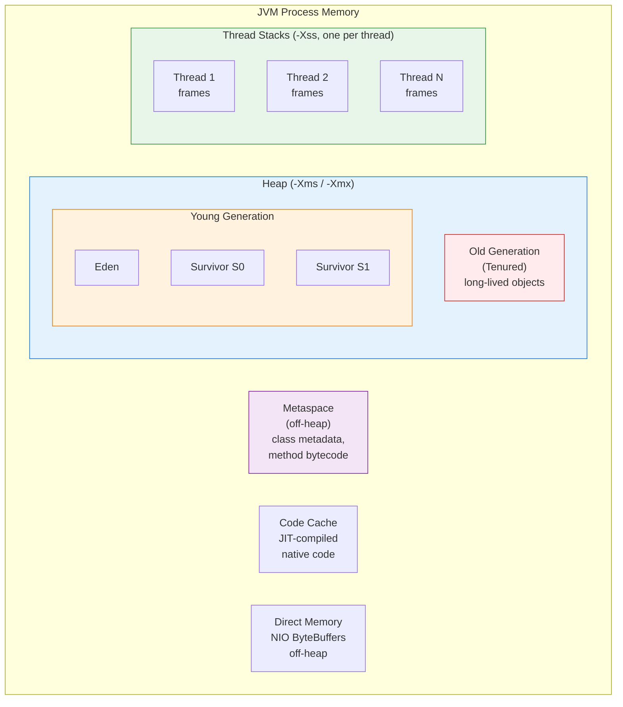
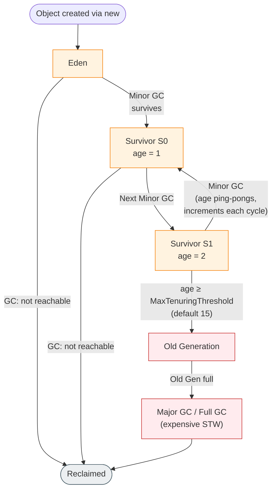

# JVM Memory Model & Garbage Collection

## 1. What

The Java Virtual Machine (JVM) manages memory automatically, dividing it into distinct areas with different purposes and lifetimes. Garbage Collection (GC) is the process by which the JVM identifies and reclaims memory occupied by objects that are no longer reachable from the application. Understanding JVM memory layout, object lifecycle, GC algorithms, and tuning is critical for writing performant, leak-free Java applications — and is a staple topic in SDE-2 interviews.

---

## 2. Why

- **No manual `free()`**: Java abstracts away manual memory management, but developers must still understand how it works to avoid memory leaks and performance issues.
- **GC Pauses Kill Latency**: Stop-the-world (STW) pauses can cause tail-latency spikes. Choosing the right collector and tuning it is essential for latency-sensitive systems.
- **OutOfMemoryError Debugging**: Without understanding heap structure, Metaspace, and object promotion, diagnosing OOM errors is nearly impossible.
- **Interview Relevance**: Questions on GC roots, reference types, collector differences, and memory leak patterns are extremely common at FAANG-level interviews.

---

## 3. How

### 3.1 JVM Memory Areas



| Memory Area | Contents | Size Control | Key Notes |
|:---|:---|:---|:---|
| **Heap** | All object instances and arrays | `-Xms` (initial), `-Xmx` (max) | Shared across all threads; GC operates here |
| **Young Gen** | Newly allocated objects | `-XX:NewRatio`, `-XX:NewSize` | Eden + two Survivor spaces (S0, S1) |
| **Old Gen** | Long-lived objects promoted from Young Gen | Remainder of heap after Young Gen | Major GC / Full GC collects here |
| **Thread Stack** | Stack frames (local vars, operand stack, return address) | `-Xss` (per thread) | Private to each thread; `StackOverflowError` if too deep |
| **Metaspace** | Class metadata, method bytecode, constant pool | `-XX:MetaspaceSize`, `-XX:MaxMetaspaceSize` | Replaced PermGen in Java 8; uses native memory, grows dynamically |
| **Code Cache** | JIT-compiled native code | `-XX:ReservedCodeCacheSize` | If full, JIT stops compiling — performance cliff |
| **Direct Memory** | NIO `ByteBuffer.allocateDirect()` buffers | `-XX:MaxDirectMemorySize` | Off-heap; avoids copying between Java heap and OS; not GC'd automatically |

---

### 3.2 Object Lifecycle



**Key rules:**
1. **New objects** are allocated in **Eden** (except humongous objects in G1, which go directly to Old Gen).
2. **Minor GC** collects Young Gen — very fast because most objects die young (the "generational hypothesis").
3. Survivors are copied between S0 and S1 (only one is active at a time); their age increments each cycle.
4. When age reaches the **tenuring threshold**, objects are **promoted** to Old Gen.
5. **Premature promotion** happens when Survivor spaces are too small — objects get pushed to Old Gen early, increasing Full GC frequency.

---

### 3.3 GC Roots & Reachability Analysis

The JVM uses **reachability analysis** (not reference counting) to determine which objects are alive.

**Why not reference counting?** Reference counting cannot handle **circular references**:
```java
// A → B and B → A — both have refcount=1, but neither is reachable
class Node {
    Node next;
}
Node a = new Node();
Node b = new Node();
a.next = b;
b.next = a;
a = null;  // refcount of original 'a' object = 1 (b.next still points to it)
b = null;  // refcount of original 'b' object = 1 (a.next still points to it)
// Both objects are unreachable but refcount > 0 → memory leak!
```

**GC Roots** — the starting points of reachability traversal:

| GC Root Type | Example |
|:---|:---|
| **Local variables** on thread stacks | A variable `obj` inside a method currently on the call stack |
| **Active threads** | `Thread` objects themselves are roots |
| **Static fields** of loaded classes | `static Map<String, Object> cache = ...` |
| **JNI references** | References created via native code (JNI global/local refs) |
| **Synchronization monitors** | Objects used as `synchronized` locks |
| **JVM internal references** | Class objects, classloaders, exception objects |

An object is **eligible for GC** if there is no path from any GC root to that object.

---

### 3.4 Reference Types

Java provides four reference types in `java.lang.ref`, giving developers control over GC behavior:

| Type | Cleared When | Typical Use Case | Example |
|:---|:---|:---|:---|
| **Strong** | Never (while reachable) | Normal variable assignment | `Object obj = new Object();` |
| **Soft** (`SoftReference`) | Before `OutOfMemoryError` is thrown | Memory-sensitive caches | `SoftReference<Bitmap> ref = new SoftReference<>(bitmap);` |
| **Weak** (`WeakReference`) | At the next GC cycle | Canonicalizing maps, metadata maps | `WeakHashMap<Key, Value>` — entries removed when key is GC'd |
| **Phantom** (`PhantomReference`) | After finalization, before reclamation | Resource cleanup (replacement for `finalize()`) | Used with `ReferenceQueue` to schedule native memory release |

**Key interview points:**
- `SoftReference` objects are only collected when the JVM is low on memory — they are ideal for caches that should shrink under memory pressure.
- `WeakReference` objects are collected eagerly at the next GC — `WeakHashMap` uses this for automatic eviction.
- `PhantomReference.get()` **always returns null** — you only use it with a `ReferenceQueue` to get notified after the referent is finalized. This is the preferred replacement for the deprecated `finalize()` method.
- Reachability order: Strong > Soft > Weak > Phantom > Unreachable.

---

### 3.5 Garbage Collectors

#### Serial GC (`-XX:+UseSerialGC`)
- **Single-threaded** for both Young and Old Gen.
- Full **Stop-the-World** (STW) during both minor and major GC.
- Best for: small heaps (< 100 MB), single-CPU machines, client-side applications.

#### Parallel GC (`-XX:+UseParallelGC`)
- **Multi-threaded** for both Young and Old Gen (a.k.a. "throughput collector").
- Still STW, but uses multiple GC threads to reduce pause duration.
- Best for: batch processing, throughput-oriented workloads where total GC time matters more than individual pause length.
- Default GC in Java 8.

#### G1 GC (`-XX:+UseG1GC`)
- **Region-based**: divides heap into ~2048 equal-sized regions, each of which can be Eden, Survivor, Old, or Humongous.
- **Mixed collections**: can collect a subset of Old Gen regions along with Young Gen (avoids full-heap Major GC).
- **Pause-time target**: `-XX:MaxGCPauseMillis=200` (default) — G1 intelligently selects which regions to collect to stay within the target.
- **Humongous objects**: objects larger than 50% of a region go into dedicated humongous regions, collected during cleanup or Full GC.
- Default GC since Java 9.
- Best for: heaps > 4 GB, applications needing predictable latency with good throughput.

#### ZGC (`-XX:+UseZGC`)
- **Sub-millisecond pauses** (typically < 1 ms), regardless of heap size.
- **Colored pointers**: metadata stored in unused bits of 64-bit object pointers (marking state, remapping).
- **Load barriers**: small check on every object reference load; if the pointer is stale (not yet remapped), the barrier fixes it.
- **Concurrent relocation**: objects are moved concurrently with application threads — no compaction pause.
- Handles heaps from 8 MB to **16 TB**.
- Production-ready since Java 15; generational ZGC since Java 21.
- Best for: ultra-low-latency systems, very large heaps.

#### Shenandoah GC (`-XX:+UseShenandoahGC`)
- Goals similar to ZGC: **concurrent compaction** with minimal STW pauses.
- Uses **Brooks forwarding pointers** (extra pointer per object) instead of colored pointers.
- Available in OpenJDK (not in Oracle JDK).
- Best for: latency-sensitive workloads on OpenJDK.

#### Collector Comparison Table

| Collector | Pause Time | Throughput | Heap Size Sweet Spot | Concurrent? | Default In |
|:---|:---|:---|:---|:---|:---|
| **Serial** | High (full STW) | Low | < 100 MB | No | — |
| **Parallel** | Medium | **Highest** | 1–4 GB | No | Java 8 |
| **G1** | ~200 ms target | High | 4–32 GB | Partially (marking) | Java 9–20 |
| **ZGC** | **< 1 ms** | High | 8 MB–16 TB | Yes (fully) | — (never default; opt-in via `-XX:+UseZGC`) |
| **Shenandoah** | **< 10 ms** | High | 1–32 GB | Yes (fully) | — (OpenJDK) |

---

### 3.6 Common Memory Leaks in Java

Even with GC, Java applications can "leak" memory when objects remain reachable but are no longer needed:

1. **`ThreadLocal` not removed**: Thread pool threads live forever. If you `set()` a `ThreadLocal` but never `remove()` it, the value stays alive for the lifetime of the thread.
   ```java
   // BAD — leaks in thread pools
   threadLocal.set(heavyObject);
   // ... use it ...
   // forgot threadLocal.remove() in finally block
   ```

2. **Static collections growing unbounded**: A `static List` or `static Map` that keeps accumulating entries without eviction.
   ```java
   private static final Map<String, Object> cache = new HashMap<>();
   // Entries added but never removed → heap grows until OOM
   ```

3. **Classloader leaks**: In application servers (Tomcat, etc.), redeployment creates a new classloader. If the old classloader is retained (e.g., via a `ThreadLocal`, static field, or JDBC driver registration), all classes and their static data stay in Metaspace.

4. **Unclosed resources**: `InputStream`, `Connection`, `ResultSet` — even though GC will eventually finalize them, the underlying native resources (file handles, sockets) leak in the meantime.

5. **Listeners/callbacks not deregistered**: Registering an observer but never calling `removeListener()` — the event source holds a strong reference to the listener.

6. **Non-static inner class holding outer reference**: Each instance of a non-static inner class implicitly holds a reference to its enclosing outer class instance.
   ```java
   class Outer {
       byte[] largeData = new byte[10_000_000];
       class Inner { /* holds implicit ref to Outer.this */ }
   }
   // If Inner escapes and is long-lived, Outer (and its 10 MB) cannot be GC'd
   ```

---

### 3.7 JVM Tuning Flags

| Flag | Purpose | Example |
|:---|:---|:---|
| `-Xms` | Initial heap size | `-Xms512m` |
| `-Xmx` | Maximum heap size | `-Xmx4g` |
| `-Xss` | Thread stack size | `-Xss512k` |
| `-XX:+UseG1GC` | Select G1 collector | — |
| `-XX:MaxGCPauseMillis` | G1 pause-time target | `-XX:MaxGCPauseMillis=100` |
| `-XX:NewRatio` | Ratio of Old:Young gen (e.g., 2 means Old is 2x Young) | `-XX:NewRatio=2` |
| `-XX:MaxTenuringThreshold` | Max age before promotion to Old Gen | `-XX:MaxTenuringThreshold=15` |
| `-XX:+HeapDumpOnOutOfMemoryError` | Auto-dump heap on OOM | — |
| `-XX:HeapDumpPath` | Path for heap dump file | `-XX:HeapDumpPath=/tmp/heapdump.hprof` |
| `-XX:MetaspaceSize` | Initial Metaspace size (triggers GC when crossed) | `-XX:MetaspaceSize=256m` |
| `-XX:MaxMetaspaceSize` | Hard cap on Metaspace | `-XX:MaxMetaspaceSize=512m` |
| `-Xlog:gc*` | Enable GC logging (Java 9+ unified logging) | `-Xlog:gc*:file=gc.log` |
| `-XX:+PrintGCDetails` | Detailed GC output (Java 8) | — |

**Rule of thumb**: Set `-Xms` = `-Xmx` in production to avoid heap resizing overhead. Size the heap so that after a Full GC, live data occupies no more than 30–40% of the total heap.

---

### 3.8 Diagnosing Memory Issues

| Tool | What It Does | Usage |
|:---|:---|:---|
| **`jmap`** | Dumps heap to a file for offline analysis | `jmap -dump:format=b,file=heap.hprof <pid>` |
| **Eclipse MAT** | Analyzes heap dumps — finds leak suspects, dominators, retained sizes | Open `.hprof` file in MAT → Leak Suspects Report |
| **`jstat`** | Monitors GC statistics in real time | `jstat -gcutil <pid> 1000` (prints every 1s) |
| **VisualVM** | GUI-based profiler — heap, threads, GC activity | Attach to running JVM → Monitor tab |
| **GC Logs** | Log every GC event with timestamps, sizes, durations | `-Xlog:gc*:file=gc.log:time,uptime,level,tags` |
| **`jcmd`** | Swiss-army knife for JVM diagnostics | `jcmd <pid> GC.heap_info`, `jcmd <pid> VM.flags` |
| **Async Profiler** | Low-overhead sampling profiler for CPU and allocation hotspots | `./profiler.sh -e alloc -d 30 <pid>` |

**Diagnostic workflow for a suspected memory leak:**
1. Enable GC logs and observe Old Gen occupancy trending upward after each Full GC.
2. Capture a heap dump (`jmap` or `-XX:+HeapDumpOnOutOfMemoryError`).
3. Open in Eclipse MAT → run "Leak Suspects" report.
4. Inspect the dominator tree to find which objects retain the most memory.
5. Trace the GC root path of the suspected leaking object to understand why it is still reachable.

---

## 4. Interview Angles

### Q1: Walk me through what happens when you create an object with `new`.
The JVM allocates memory in **Eden** (Young Gen). If Eden is full, a **Minor GC** is triggered first. Allocation typically uses **Thread-Local Allocation Buffers (TLABs)** — each thread has a private chunk of Eden, so allocation is a simple pointer bump without synchronization. If the object is larger than TLAB or Eden, it may go to Old Gen directly (or to a humongous region in G1).

### Q2: Why does Java use reachability analysis instead of reference counting?
Reference counting fails with **circular references**: two objects pointing to each other will both have `refcount > 0` even when neither is reachable from the application. Reachability analysis starts from known **GC roots** (stack variables, static fields, active threads, JNI refs) and marks everything transitively reachable. Anything not marked is garbage. This handles cycles correctly.

### Q3: What is the difference between Minor GC, Major GC, and Full GC?
- **Minor GC**: Collects only Young Gen (Eden + Survivors). Very fast because most young objects are already dead.
- **Major GC**: Collects Old Gen. Much slower because Old Gen is larger and objects there tend to be alive.
- **Full GC**: Collects the entire heap (Young + Old + Metaspace). This is the most expensive GC event and causes the longest STW pause. In G1, a Full GC is a fallback when mixed collections cannot free Old Gen fast enough.

### Q4: How does G1 GC achieve predictable pause times?
G1 divides the heap into equal-sized **regions** (~2048). During the marking phase, it tracks how much garbage each region contains. At collection time, it selects the regions with the most garbage (hence "Garbage-First") and evacuates live objects out of them. By controlling how many regions it collects, G1 can stay within the target set by `-XX:MaxGCPauseMillis`. If the target is too aggressive, G1 may fall behind and trigger a Full GC.

### Q5: When would you choose ZGC over G1?
Choose ZGC when:
- Your application needs **sub-millisecond GC pauses** (e.g., real-time trading, high-frequency APIs).
- You have a **very large heap** (tens of GBs or more) where G1 pauses would grow unacceptably.
- You can tolerate slightly lower throughput in exchange for consistently low latency.

G1 is still the better default for most workloads because it balances throughput and pause time well without the overhead of load barriers.

### Q6: How would you diagnose a memory leak in a production Java service?
1. **Observe symptoms**: GC logs show Old Gen not reclaiming space after Full GC; heap usage trends upward.
2. **Capture heap dump**: Use `jmap -dump:format=b,file=heap.hprof <pid>` or set `-XX:+HeapDumpOnOutOfMemoryError` proactively.
3. **Analyze with Eclipse MAT**: Run "Leak Suspects" report → inspect the dominator tree → find which objects retain the most memory.
4. **Trace to GC root**: Follow the "Path to GC Root" for the suspected objects to understand why they are still reachable (e.g., stuck in a static map, a `ThreadLocal`, or an event listener list).
5. **Fix**: Remove the retention path (e.g., call `ThreadLocal.remove()`, use weak references in caches, deregister listeners).

### Q7: What is a `SoftReference` good for? How is it different from `WeakReference`?
A `SoftReference` is cleared only when the JVM is about to throw `OutOfMemoryError` — making it ideal for **memory-sensitive caches** (cache image data, query results, etc.). A `WeakReference` is cleared at the **very next GC cycle**, regardless of memory pressure — making it suitable for metadata maps (`WeakHashMap`) where entries should be automatically removed when the key is no longer in use. The key difference is **retention strength**: soft references try to keep the object alive as long as memory allows; weak references do not.

### Q8: Explain the Generational Hypothesis and why GC uses generations.
The **Generational Hypothesis** states that most objects die young — they are created, used briefly, and become unreachable. Empirical data shows that 90–98% of objects in typical Java applications do not survive their first GC. By separating the heap into Young and Old generations, the GC can focus on the Young Gen (where most garbage is) with fast, frequent Minor GCs, and only occasionally collect the Old Gen. This dramatically reduces the total time spent in GC compared to scanning the entire heap every time.
