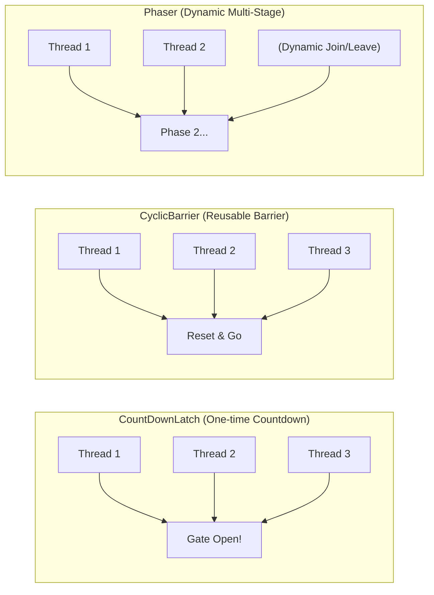
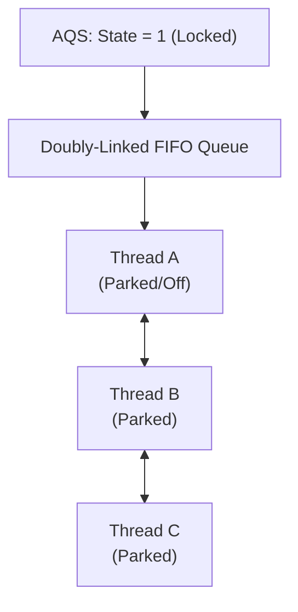
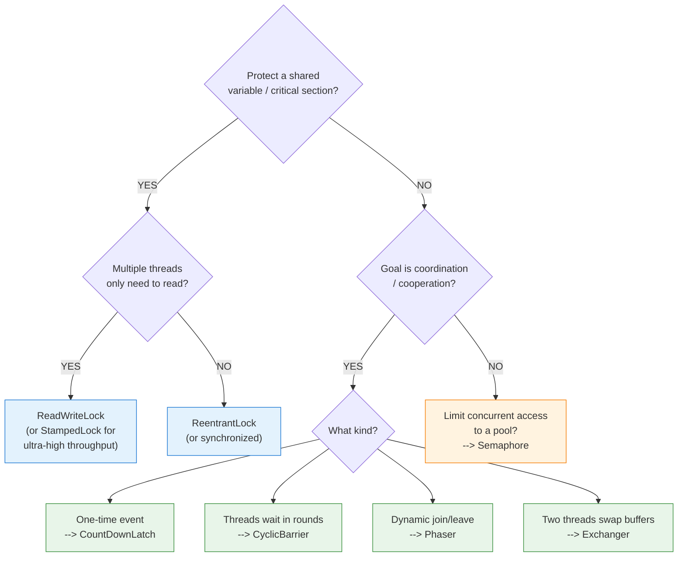

# Locks and Synchronizers (`java.util.concurrent.locks`)

Imagine you are managing a busy public library. If you only use Java's built-in `synchronized` keyword, you are like a very strict, rigid librarian: 
* *"Only one person can enter the library at a time. If you want to read, write, or just look around, you must wait in a single line. When the room becomes free, I will ring a giant bell, and everyone in line must scramble and run for the door at once."*

Java's `java.util.concurrent.locks` and synchronizers package gives you a set of professional tools instead. You get separate visitor counts, specialized read/write rooms, passcodes, walkie-talkies, and checkpoints. This guide breaks down these tools from the absolute ground up.

---

## 1. The Core Comparison: `synchronized` vs. Explicit Locks

Before we look at the tools, let's understand why we need them.

| Feature | `synchronized` (Intrinsic Monitor) | Explicit Locks (e.g., `ReentrantLock`) |
| :--- | :--- | :--- |
| **Control** | Automatic (managed by the JVM). | Manual (managed by you, the programmer). |
| **Lock Attempt (`tryLock`)** | No. A thread blocks forever until it gets the lock. | Yes. You can try to acquire a lock and walk away if it is busy. |
| **Timeouts** | No. If a resource is blocked, the thread waits indefinitely. | Yes. You can say: *"Wait for 2 seconds; if still locked, give up."* |
| **Interruption** | No. You cannot wake up or cancel a thread blocked in `synchronized`. | Yes. A thread waiting for a lock can be interrupted/cancelled. |
| **Fairness** | No. The JVM decides who gets the lock next (often random). | Yes. You can force a FIFO order (First-In, First-Out) to prevent starvation. |
| **Wait Queues** | Only **one** wait-set per object. | **Multiple** separate wait-sets (`Condition` objects) per lock. |

---

## 2. The "Flexible Lock" Trio

### 1. `ReentrantLock` — *The Smart Manual Padlock*
`ReentrantLock` behaves like a physical padlock that you lock and unlock manually. 

* **Analogy**: You have a key to a private room. If you enter the room, you lock the door behind you. Because the lock is **reentrant**, if you decide to enter an inner closet inside that room (a nested method call) that requires the *same* key, you can do so without locking yourself out. You just have to make sure that you unlock the door the same number of times you locked it when leaving.

#### Key Powers
* **Reentrancy**: A single thread can acquire the same lock multiple times. A counter tracks how many times the thread holds the lock.
* **`tryLock()`**: Non-blocking lock attempt. If the lock is free, it takes it and returns `true`. If busy, it returns `false` instantly instead of putting the thread to sleep.
* **`lockInterruptibly()`**: Acquires the lock unless the thread is interrupted. Allows you to cancel waiting threads.
* **Fairness Mode**: You can initialize it with `new ReentrantLock(true)`. The lock will be given to the thread that has been waiting the longest. *(Note: Fair mode reduces overall performance/throughput because of the extra bookkeeping).*

> [!CAUTION]
> **Always unlock in a `finally` block!**
> With `synchronized`, Java releases the lock automatically. With `ReentrantLock`, you must release it manually. If you forget or if an exception is thrown before release, the lock stays locked forever, causing a deadlock!
> ```java
> ReentrantLock lock = new ReentrantLock();
> lock.lock(); // 1. Acquire the lock
> try {
>     // 2. Perform safe operations here
> } finally {
>     lock.unlock(); // 3. Guaranteed to release even if an exception occurs
> }
> ```

---

### 2. `ReadWriteLock` (`ReentrantReadWriteLock`) — *The Shared Study Room*
In many applications, threads read data much more often than they write or modify it (e.g., reading a product catalog or a configuration cache).

* **Analogy**: Multiple students can read books in the same study room simultaneously without bothering each other. But if a writer wants to paint the room, everyone else must leave. 

`ReadWriteLock` maintains two separate locks that are internally connected:
1. **Read Lock (Shared)**: Multiple threads can hold it at the exact same time, as long as no thread holds the write lock.
2. **Write Lock (Exclusive)**: Only one thread can hold it. No readers or other writers are allowed.

```
Lock State   | Readers Allowed? | Writers Allowed?
-------------|------------------|-----------------
Unlocked     | Yes              | Yes
Read-Locked  | Yes (multiple)   | No (must wait)
Write-Locked | No               | No
```

> [!WARNING]
> **Write Starvation**: If readers are constantly entering the room, a waiting writer might block forever because the room is never completely empty. This is called *write starvation*.

* **Lock Downgrading**: You can acquire the Write Lock, acquire the Read Lock, and then release the Write Lock. This downgrades your status to reader safely.
* **Lock Upgrading**: Upgrading (Read Lock $\rightarrow$ Write Lock) is **not supported** and will cause an instant deadlock if two threads try it at the same time.

---

### 3. `StampedLock` — *The High-Speed Toll Gate (Optimistic Reading)*
Introduced in Java 8, `StampedLock` is a high-performance alternative to `ReadWriteLock`. It uses a `long` value called a **stamp** (like a transaction receipt number) to manage locks.

* **Analogy**: Imagine checking a train schedule on a digital board. Instead of booking a lock on the board while you read, you just look at the board and remember the version number (stamp). Once you've read the schedule, you check if the version number changed. If it didn't, your reading was successful! If it did change (a writer modified it while you looked), you simply look again, or request a real lock.

#### Three Modes of `StampedLock`
1. **Write Mode**: Traditional exclusive lock (returns a stamp).
2. **Read Mode**: Traditional shared lock (returns a stamp).
3. **Optimistic Read Mode**: Does **not** acquire a lock at all! It returns a stamp immediately. You read the data, and then check `stampedLock.validate(stamp)`. If it returns `true`, no write happened during your read. If it returns `false`, you fallback to a traditional Read Lock.

```java
StampedLock sl = new StampedLock();

// 1. Try to read optimistically (fast, no blocking!)
long stamp = sl.tryOptimisticRead();
int currentX = x; // Copy shared variables

// 2. Validate: Did anyone write since we grabbed the stamp?
if (!sl.validate(stamp)) {
    // 3. Fallback: Someone modified it! Get a real read lock.
    stamp = sl.readLock();
    try {
        currentX = x;
    } finally {
        sl.unlockRead(stamp); // Always release using the acquired stamp
    }
}
// Now currentX is safe to use!
```

> [!IMPORTANT]
> - **Not Reentrant**: `StampedLock` is **not reentrant**! If a thread holds it and tries to acquire it again, it will deadlock itself.
> - **No `Condition` Support**: It does not support `Condition` objects.
> - **No Interruption Recovery**: Calling `lockInterruptibly()` on StampedLock is tricky; a thread blocked inside StampedLock CPU spins heavily if interrupted. Use `readLockInterruptibly` or `writeLockInterruptibly` with caution.

---

## 3. Coordination Primitives

### 1. `Condition` — *The Restaurant Pagers*
A `Condition` replaces the old `Object.wait()` and `Object.notify()` methods and is always bound to a specific `Lock`.

* **Analogy**: Imagine a busy restaurant. Instead of putting hungry customers waiting for tables and delivery drivers waiting for food in the exact same lobby line, the restaurant gives them two different types of pagers: **Table-Pager** (Condition: `tableAvailable`) and **Food-Pager** (Condition: `foodReady`). When a table opens, the hostess rings the `tableAvailable` pager. This avoids waking up the delivery drivers by mistake.

#### API Mapping

| Traditional Object Monitor | Modern `Condition` Equivalent |
| :--- | :--- |
| `object.wait()` | `condition.await()` |
| `object.notify()` | `condition.signal()` |
| `object.notifyAll()` | `condition.signalAll()` |

#### Standard Usage Pattern
Always check the condition inside a `while` loop (to protect against **spurious wakeups**—where threads occasionally wake up for no reason), and always call it while holding the lock.

```java
ReentrantLock lock = new ReentrantLock();
Condition condition = lock.newCondition();

// Waiter Thread
lock.lock();
try {
    while (!isReady) {
        condition.await(); // Releases lock, sleeps, and re-acquires lock upon waking
    }
    // Proceed with action
} finally {
    lock.unlock();
}

// Signaller Thread
lock.lock();
try {
    isReady = true;
    condition.signal(); // Wakes up one waiting thread
} finally {
    lock.unlock();
}
```

---

### 2. `Semaphore` — *The Club Bouncer*
A `Semaphore` maintains a count of **permits**. It limits how many threads can access a resource or block of code concurrently.

* **Analogy**: A nightclub has a capacity limit of 50 people. The bouncer (`Semaphore`) checks people in. If 50 people are inside, new arrivals must wait in line. When someone leaves, a permit is released, and the next person in line enters.

```java
Semaphore semaphore = new Semaphore(3); // Allow up to 3 threads at once

semaphore.acquire(); // Decrements permit count. Blocks if count is 0.
try {
    // Critical Section: at most 3 threads are here simultaneously
} finally {
    semaphore.release(); // Increments permit count, waking up a waiting thread
}
```

#### Key Differences: `Semaphore` vs. `Lock`
1. **Ownership**: A lock belongs to the thread that acquired it. A Semaphore does **not** keep track of ownership. Thread A can call `acquire()`, and Thread B can call `release()`.
2. **Reentrancy**: A Semaphore is **not reentrant**. If you initialize it with 1 permit (`Semaphore(1)`) and a thread calls `acquire()` twice, it will block itself forever.
3. **Usage**: Use Locks for mutual exclusion (protecting variables). Use Semaphores for throttling (rate limiting, database connection pools).

---

## 4. The Collective Coordinators (Multi-Thread Handshakes)

These synchronizers let multiple threads cooperate, align, and sync up.



### 1. `CountDownLatch` — *The Rollercoaster Gate*
A `CountDownLatch` allows one or more threads to wait until a set of operations performed in other threads completes.

* **Analogy**: A rollercoaster train requires 10 passengers to buckle up before it starts. The operator waits (`await()`). As each passenger buckles up, the count decreases (`countDown()`). Once the count hits 0, the gate opens, and the train departs.
* **Key Detail**: It is **one-time use**. Once the count hits 0, the latch remains open forever. You cannot reset it.
* **Interview Use Case**: Starting a complex microservice. The main server thread waits (`await()`) until the Database Connection Thread, Cache Initializer Thread, and Config Reader Thread all finish (`countDown()`).

---

### 2. `CyclicBarrier` — *The Multiplayer Game Lobby*
A `CyclicBarrier` forces a fixed number of threads to wait for each other at a common barrier point before continuing.

* **Analogy**: In a multiplayer online game, a match cannot begin until exactly 4 players join the lobby. As each player joins, they wait (`await()`). Once the 4th player arrives, the barrier trips, they all enter the match together, and the lobby **resets** (is cyclic) for the next match.
* **Key Detail**: It is **reusable**. Once the barrier is released, it resets back to its initial count. It also allows a custom **barrier action** (a `Runnable` that runs automatically when all threads arrive, right before they are released).
* **Difference from Latch**: A Latch waits for *events* (countDowns) and is one-off. A Barrier waits for *threads* and is reusable.

---

### 3. `Phaser` — *The Multi-Stage Tour Group*
Introduced in Java 7, `Phaser` is a more flexible, dynamic version of `CyclicBarrier` and `CountDownLatch`.

* **Analogy**: A tour guide leads a group on a 3-day trek. On Day 1, 5 hikers start. At the end of Day 1, they wait at Camp 1 (`arriveAndAwaitAdvance()`). Some hikers decide to quit the tour (`arriveAndDeregister()`), and new hikers join (`register()`). The group proceeds to Day 2 with a new count.
* **Key Detail**: The number of threads registered to wait at the barrier can **change dynamically** at runtime. It tracks work in sequential "phases" (rounds).

---

### 4. `Exchanger` — *The Secret Spy Swap*
An `Exchanger` represents a rendezvous point where exactly two threads can exchange data safely.

* **Analogy**: Two spies meet in a park. Spy A has a briefcase of cash, Spy B has a folder of secrets. They meet, exchange items simultaneously, and walk away.
* **Key Detail**: It is bidirectional. Thread A calls `exchange(dataA)`, blocking until Thread B calls `exchange(dataB)`. The method returns the other thread's data.

---

## 5. Under the Hood: AQS (AbstractQueuedSynchronizer)

If you want to ace senior Java interviews, you need to know how these classes work internally. The backbone of almost all Java synchronizers (`ReentrantLock`, `Semaphore`, `CountDownLatch`, `ReentrantReadWriteLock`) is a single helper class: **`AbstractQueuedSynchronizer` (AQS)**.

Think of AQS as **The Booking Agent** behind the scenes. It manages three things:



1. **State**: A single `volatile` integer representing the synchronization state (e.g., `0` for unlocked, `1` for locked, or `N` for semaphore permits).
2. **FIFO Queue**: A doubly-linked queue of waiting threads. Threads that fail to acquire the lock are wrapped in "Node" objects and queued.
3. **LockSupport (`park` / `unpark`)**: A low-level system call that tells the operating system to put a thread to sleep (`park()`) and wake it up (`unpark()`).

### How a Thread acquires a Lock via AQS:
1. Thread A calls `lock()`.
2. AQS checks the `state` variable. It uses **CAS (Compare-And-Swap)**, an atomic hardware CPU command, to attempt to swap `state` from `0` to `1`.
3. If CAS succeeds, Thread A owns the lock.
4. If CAS fails (because Thread B already holds the lock), AQS appends Thread A to its FIFO queue and calls `LockSupport.park(Thread A)`. This suspends Thread A's execution, saving CPU cycles.
5. When Thread B calls `unlock()`, it changes the `state` back to `0` and invokes `LockSupport.unpark(Thread A)` to wake up the next thread in the queue.

---

## 6. Decision Tree: Which Tool Should I Use?



---

## 7. Java Code Playground

Here is a complete, runnable Java class demonstrating all these concepts. Copy and run this file to see how these threads interact.

```java
import java.util.concurrent.*;
import java.util.concurrent.locks.*;
import java.util.ArrayList;
import java.util.List;

public class ConcurrencyPlayground {

    public static void main(String[] args) throws Exception {
        System.out.println("=== Starting Java Concurrency Playground ===\n");
        
        demoReentrantLock();
        demoReadWriteLock();
        demoStampedLock();
        demoCondition();
        demoSemaphore();
        demoCountDownLatch();
        demoCyclicBarrier();
        demoPhaser();
        demoExchanger();
        
        System.out.println("\n=== All Demos Completed Successfully ===");
    }

    // 1. REENTRANT LOCK DEMO
    private static void demoReentrantLock() throws InterruptedException {
        System.out.println("--- 1. ReentrantLock Demo ---");
        ReentrantLock lock = new ReentrantLock();
        
        Thread t1 = new Thread(() -> {
            lock.lock();
            try {
                System.out.println("  [T1] Secured lock. Working...");
                Thread.sleep(100);
            } catch (InterruptedException e) {
                Thread.currentThread().interrupt();
            } finally {
                lock.unlock();
                System.out.println("  [T1] Released lock.");
            }
        });

        Thread t2 = new Thread(() -> {
            try {
                Thread.sleep(20); // Let T1 acquire lock first
                System.out.println("  [T2] Trying to acquire lock non-blockingly...");
                if (!lock.tryLock()) {
                    System.out.println("  [T2] Lock was busy! Doing other work instead.");
                }
            } catch (InterruptedException e) {
                Thread.currentThread().interrupt();
            }
        });

        t1.start();
        t2.start();
        t1.join();
        t2.join();
        System.out.println();
    }

    // 2. READ-WRITE LOCK DEMO
    private static void demoReadWriteLock() throws InterruptedException {
        System.out.println("--- 2. ReadWriteLock Demo ---");
        ReentrantReadWriteLock rwLock = new ReentrantReadWriteLock();
        List<String> sharedList = new ArrayList<>();

        Runnable readTask = () -> {
            rwLock.readLock().lock();
            try {
                System.out.println("  " + Thread.currentThread().getName() + " reading list: " + sharedList);
                Thread.sleep(50);
            } catch (InterruptedException e) {
                Thread.currentThread().interrupt();
            } finally {
                rwLock.readLock().unlock();
            }
        };

        Runnable writeTask = () -> {
            rwLock.writeLock().lock();
            try {
                System.out.println("  [Writer] Exclusive access secured! Adding element.");
                sharedList.add("Data-" + sharedList.size());
            } finally {
                rwLock.writeLock().unlock();
            }
        };

        // Start multiple reads concurrently, then one write
        Thread r1 = new Thread(readTask, "Reader-1");
        Thread r2 = new Thread(readTask, "Reader-2");
        Thread w1 = new Thread(writeTask);

        r1.start();
        r2.start();
        w1.start();
        r1.join();
        r2.join();
        w1.join();
        System.out.println();
    }

    // 3. STAMPED LOCK DEMO
    private static void demoStampedLock() throws InterruptedException {
        System.out.println("--- 3. StampedLock Demo ---");
        StampedLock stampedLock = new StampedLock();
        final int[] sharedData = {42};

        // Optimistic Read Thread
        Thread reader = new Thread(() -> {
            long stamp = stampedLock.tryOptimisticRead();
            int localValue = sharedData[0];
            System.out.println("  [OptimisticReader] Read value: " + localValue);
            
            try { Thread.sleep(50); } catch (InterruptedException ignored) {}
            
            // Check if a writer intervened
            if (stampedLock.validate(stamp)) {
                System.out.println("  [OptimisticReader] Stamp is valid! Value used: " + localValue);
            } else {
                System.out.println("  [OptimisticReader] Stamp INVALID! Falling back to read lock.");
                long readStamp = stampedLock.readLock();
                try {
                    localValue = sharedData[0];
                    System.out.println("  [OptimisticReader] Secure Read Lock value: " + localValue);
                } finally {
                    stampedLock.unlockRead(readStamp);
                }
            }
        });

        // Writer Thread
        Thread writer = new Thread(() -> {
            try { Thread.sleep(10); } catch (InterruptedException ignored) {}
            long stamp = stampedLock.writeLock();
            try {
                System.out.println("  [Writer] Modifying shared data...");
                sharedData[0] = 99;
            } finally {
                stampedLock.unlockWrite(stamp);
            }
        });

        reader.start();
        writer.start();
        reader.join();
        writer.join();
        System.out.println();
    }

    // 4. CONDITION DEMO
    private static class SharedBuffer {
        private final ReentrantLock lock = new ReentrantLock();
        private final Condition hasItems = lock.newCondition();
        private String item = null;

        public void put(String newItem) {
            lock.lock();
            try {
                item = newItem;
                hasItems.signal(); // Wakes up waiter
            } finally {
                lock.unlock();
            }
        }

        public String take() throws InterruptedException {
            lock.lock();
            try {
                while (item == null) {
                    System.out.println("  [Consumer] Buffer empty, waiting...");
                    hasItems.await(); // releases lock and sleeps
                }
                String temp = item;
                item = null;
                return temp;
            } finally {
                lock.unlock();
            }
        }
    }

    private static void demoCondition() throws InterruptedException {
        System.out.println("--- 4. Condition Demo ---");
        SharedBuffer buffer = new SharedBuffer();

        Thread consumer = new Thread(() -> {
            try {
                String val = buffer.take();
                System.out.println("  [Consumer] Successfully consumed: " + val);
            } catch (InterruptedException e) {
                Thread.currentThread().interrupt();
            }
        });

        Thread producer = new Thread(() -> {
            try {
                Thread.sleep(100);
                System.out.println("  [Producer] Created item.");
                buffer.put("Fresh Donut");
            } catch (InterruptedException ignored) {}
        });

        consumer.start();
        producer.start();
        consumer.join();
        producer.join();
        System.out.println();
    }

    // 5. SEMAPHORE DEMO
    private static void demoSemaphore() throws InterruptedException {
        System.out.println("--- 5. Semaphore Demo ---");
        Semaphore semaphore = new Semaphore(2); // Only allow 2 threads

        Runnable task = () -> {
            try {
                semaphore.acquire();
                System.out.println("  [" + Thread.currentThread().getName() + "] Entered critical zone.");
                Thread.sleep(100);
            } catch (InterruptedException e) {
                Thread.currentThread().interrupt();
            } finally {
                System.out.println("  [" + Thread.currentThread().getName() + "] Leaving critical zone.");
                semaphore.release();
            }
        };

        Thread t1 = new Thread(task, "Thread-1");
        Thread t2 = new Thread(task, "Thread-2");
        Thread t3 = new Thread(task, "Thread-3");

        t1.start(); t2.start(); t3.start();
        t1.join(); t2.join(); t3.join();
        System.out.println();
    }

    // 6. COUNT DOWN LATCH DEMO
    private static void demoCountDownLatch() throws InterruptedException {
        System.out.println("--- 6. CountDownLatch Demo ---");
        CountDownLatch latch = new CountDownLatch(3); // Wait for 3 initialization steps

        Runnable initStep = () -> {
            try {
                Thread.sleep(50);
                System.out.println("  [Service] Started one subsystem.");
            } catch (InterruptedException ignored) {} finally {
                latch.countDown();
            }
        };

        new Thread(initStep).start();
        new Thread(initStep).start();
        new Thread(initStep).start();

        System.out.println("  [Main Server] Waiting for subsystems to start...");
        latch.await(); // Blocks until count is 0
        System.out.println("  [Main Server] All systems green! Main server running.");
        System.out.println();
    }

    // 7. CYCLIC BARRIER DEMO
    private static void demoCyclicBarrier() throws InterruptedException {
        System.out.println("--- 7. CyclicBarrier Demo ---");
        CyclicBarrier barrier = new CyclicBarrier(3, () -> {
            System.out.println("  [Barrier Action] Everyone arrived! Starting match.");
        });

        Runnable player = () -> {
            try {
                System.out.println("  [" + Thread.currentThread().getName() + "] Connected, waiting in lobby.");
                barrier.await(); // Wait for all 3 players
                System.out.println("  [" + Thread.currentThread().getName() + "] Playing...");
            } catch (Exception e) {
                Thread.currentThread().interrupt();
            }
        };

        new Thread(player, "Player-1").start();
        new Thread(player, "Player-2").start();
        Thread.sleep(50); // Delay last player
        new Thread(player, "Player-3").start();

        Thread.sleep(200); // Give threads time to run
        System.out.println();
    }

    // 8. PHASER DEMO
    private static void demoPhaser() throws InterruptedException {
        System.out.println("--- 8. Phaser Demo ---");
        Phaser phaser = new Phaser(1); // Register main thread

        Runnable task = () -> {
            phaser.register(); // Register dynamic thread
            try {
                System.out.println("  [" + Thread.currentThread().getName() + "] Finished Phase 0.");
                phaser.arriveAndAwaitAdvance(); // Arrive and wait for others
                
                System.out.println("  [" + Thread.currentThread().getName() + "] Finished Phase 1.");
                phaser.arriveAndDeregister(); // Arrive and exit phase 2
            } catch (Exception e) {
                Thread.currentThread().interrupt();
            }
        };

        new Thread(task, "Task-A").start();
        new Thread(task, "Task-B").start();

        System.out.println("  [Main] Arriving and waiting for A & B to complete Phase 0...");
        phaser.arriveAndAwaitAdvance(); // Main advances to Phase 1
        
        System.out.println("  [Main] Phase 0 completed. Initiating Phase 1...");
        phaser.arriveAndAwaitAdvance(); // Main advances to Phase 2
        
        System.out.println("  [Main] Phaser Demo complete.");
        phaser.forceTermination();
        System.out.println();
    }

    // 9. EXCHANGER DEMO
    private static void demoExchanger() throws InterruptedException {
        System.out.println("--- 9. Exchanger Demo ---");
        Exchanger<String> exchanger = new Exchanger<>();

        Thread producer = new Thread(() -> {
            try {
                String packet = "Secret Coordinates";
                System.out.println("  [Producer] Prepared: " + packet);
                String response = exchanger.exchange(packet); // send coordinates, receive keys
                System.out.println("  [Producer] Received back: " + response);
            } catch (InterruptedException e) {
                Thread.currentThread().interrupt();
            }
        });

        Thread consumer = new Thread(() -> {
            try {
                String packet = "Encryption Key";
                System.out.println("  [Consumer] Prepared: " + packet);
                String response = exchanger.exchange(packet); // send keys, receive coordinates
                System.out.println("  [Consumer] Received back: " + response);
            } catch (InterruptedException e) {
                Thread.currentThread().interrupt();
            }
        });

        producer.start();
        consumer.start();
        producer.join();
        consumer.join();
    }
}
```

---

## 8. Top Interview Angles

### Q1: Why is `Semaphore(1)` not the same as a `ReentrantLock`?
* **Ownership**: A `ReentrantLock` remembers which thread holds it. Only that thread can unlock it. A `Semaphore` has no owner; any thread can release a permit.
* **Reentrancy**: A `ReentrantLock` is reentrant. A binary `Semaphore` is **not**. If the same thread attempts to acquire it twice, it will self-deadlock.

### Q2: What is Lock Downgrading vs Upgrading?
* **Downgrading (Safe)**: Going from a Write Lock to a Read Lock. A thread holds the write lock, acquires the read lock, and then releases the write lock. At no point is the lock completely released, so no writer can sneak in and modify data.
* **Upgrading (Unsafe/Not Supported)**: Going from a Read Lock to a Write Lock. If two threads hold read locks and both try to upgrade to a write lock, both will wait for the other to release the read lock. This causes an **instant deadlock**. You must release your read lock first, then request the write lock.

### Q3: How do `CountDownLatch` and `CyclicBarrier` differ in interview scenarios?
* **CountDownLatch**: Counts down *events*. It is a one-way street; once it hits 0, it stays at 0. Waiting threads (`await()`) are blocked until other threads call `countDown()`.
* **CyclicBarrier**: Counts down *threads*. All threads call `await()` and block until the required count is met. Once met, the barrier is tripped, all threads proceed, and it immediately resets for future reuse.

### Q4: Explain AQS in simple terms.
* AQS (AbstractQueuedSynchronizer) is a base framework for creating locks. 
* It uses a single **`volatile int state`** to track status (e.g. 0 = free, 1 = locked).
* It uses **CAS (Compare-And-Swap)** instructions to modify the state without locking.
* If a thread fails to acquire a state change, AQS stores that thread inside a **FIFO (First-In-First-Out) Doubly-Linked Wait Queue** and puts it to sleep using **`LockSupport.park()`**. When unlocked, the thread at the head is woken up using **`LockSupport.unpark()`**.

### Q5: What is the risk of using fair locks?
* Fair locks guarantee that threads acquire the lock in FIFO order. While this prevents thread starvation, it causes a significant drop in throughput. The CPU must repeatedly context-switch and wake up specific threads rather than letting currently active threads run when a lock is released. Always use unfair locks (default) unless fairness is a hard requirement.
