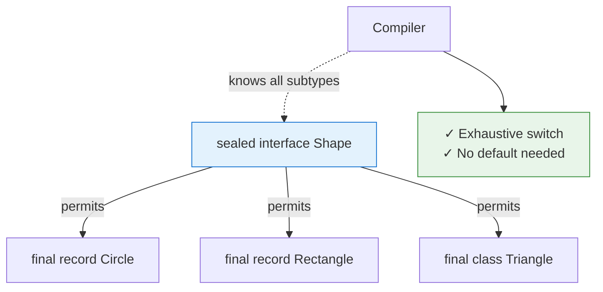
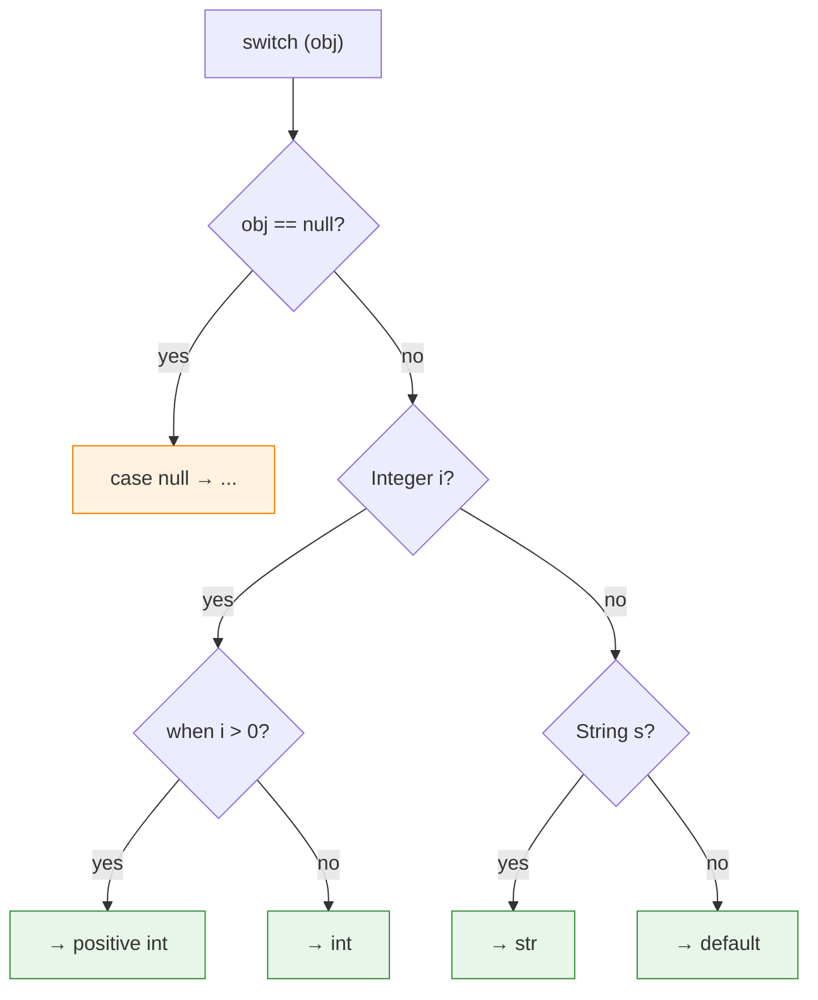

# Modern Java Features (Java 10-21)

A deep dive into language and API improvements from Java 10 through 21 — the features most likely to come up in SDE-2 interviews and the ones that signal you stay current with the platform.

---

## 1. Records (Java 16)

### What
A `record` is a special class declaration that acts as a transparent, immutable data carrier. The compiler auto-generates `equals()`, `hashCode()`, `toString()`, a canonical constructor, and accessor methods.

### Why
- Eliminates 50+ lines of boilerplate for simple data-holding classes.
- Enforces immutability by design — all fields are `private final`.
- Provides a language-level signal: "this type exists only to carry data."

### Code Example

**Before (old way):**
```java
public final class Point {
    private final int x;
    private final int y;

    public Point(int x, int y) {
        this.x = x;
        this.y = y;
    }

    public int getX() { return x; }
    public int getY() { return y; }

    @Override
    public boolean equals(Object o) {
        if (this == o) return true;
        if (!(o instanceof Point)) return false;
        Point p = (Point) o;
        return x == p.x && y == p.y;
    }

    @Override
    public int hashCode() { return Objects.hash(x, y); }

    @Override
    public String toString() { return "Point[x=" + x + ", y=" + y + "]"; }
}
```

**After (new way):**
```java
public record Point(int x, int y) { }
```

**Compact constructor for validation:**
```java
public record Range(int lo, int hi) {
    public Range {                        // compact constructor — no parameter list
        if (lo > hi) throw new IllegalArgumentException("lo > hi");
    }
}
```

**Key constraints:**
- Cannot extend another class (implicitly extends `java.lang.Record`).
- Cannot declare mutable instance fields.
- Can implement interfaces, define static fields/methods, and override accessors.

---

## 2. Sealed Classes (Java 17)

### What
`sealed` restricts which classes or interfaces can extend/implement a type. The permitted subtypes are declared explicitly with `permits`.

### Why
- Enables **exhaustive** pattern matching — the compiler knows all subtypes.
- Makes domain models closed and precise (e.g., `Shape` can only be `Circle`, `Rectangle`, `Triangle`).
- Bridges the gap between `final` (no extension) and open inheritance (anyone can extend).

### Code Example

**Before (old way):**
```java
// Anyone can add a new Shape subclass — switch statements may silently miss it.
public abstract class Shape { }
public class Circle extends Shape { double radius; }
public class Rectangle extends Shape { double w, h; }
```

**After (new way):**
```java
public sealed interface Shape permits Circle, Rectangle, Triangle { }

public record Circle(double radius) implements Shape { }
public record Rectangle(double w, double h) implements Shape { }
public final class Triangle implements Shape {
    double a, b, c;
    // ...
}
```



**Exhaustive switch (Java 21):**
```java
double area(Shape s) {
    return switch (s) {
        case Circle c    -> Math.PI * c.radius() * c.radius();
        case Rectangle r -> r.w() * r.h();
        case Triangle t  -> computeTriangleArea(t);
        // no default needed — compiler verifies exhaustiveness
    };
}
```

**Permitted subtypes must be one of:**
- `final` — no further extension.
- `sealed` — another layer of restriction.
- `non-sealed` — opens the hierarchy back up (escape hatch).

---

## 3. Pattern Matching for `instanceof` (Java 16)

### What
Combines the `instanceof` check and the cast into a single expression, binding the result to a new variable.

### Why
- Eliminates the redundant cast that always follows an `instanceof` check.
- Reduces visual clutter and potential for `ClassCastException` from stale casts.

### Code Example

**Before (old way):**
```java
if (obj instanceof String) {
    String s = (String) obj;       // redundant cast
    System.out.println(s.length());
}
```

**After (new way):**
```java
if (obj instanceof String s) {     // test + bind in one step
    System.out.println(s.length());
}
```

**Works with logical operators:**
```java
if (obj instanceof String s && s.length() > 5) {
    // s is in scope and guaranteed non-null
}

// BUT — this does NOT compile:
if (obj instanceof String s || s.isEmpty()) {
    // s might not be bound on the || branch
}
```

---

## 4. Pattern Matching for `switch` (Java 21)

### What
Extends `switch` to match on types, deconstruct records, apply guard clauses (`when`), and handle `null` — all in a single construct.

### Why
- Replaces long `if-else instanceof` chains with a single, readable `switch`.
- Combined with sealed classes, the compiler enforces exhaustiveness.
- `null` can be handled directly instead of throwing `NullPointerException` before the switch.

### Code Example

**Before (old way):**
```java
String format(Object obj) {
    if (obj == null)               return "null";
    if (obj instanceof Integer i)  return String.format("int %d", i);
    if (obj instanceof String s)   return String.format("str %s", s);
    return obj.toString();
}
```

**After (new way):**
```java
String format(Object obj) {
    return switch (obj) {
        case null            -> "null";
        case Integer i when i > 0 -> "positive int " + i;   // guarded pattern
        case Integer i       -> "int " + i;
        case String s        -> "str " + s;
        default              -> obj.toString();
    };
}
```

**Record deconstruction (Java 21):**
```java
record Point(int x, int y) { }

String describe(Object obj) {
    return switch (obj) {
        case Point(int x, int y) when x == 0 && y == 0 -> "origin";
        case Point(int x, int y) -> "(%d,%d)".formatted(x, y);
        default -> "unknown";
    };
}
```



**Key rules:**
- Guarded patterns (`when`) are evaluated top-down; order matters.
- `case null` is opt-in; without it, `null` still throws NPE.
- Dominance checking: the compiler rejects unreachable cases (e.g., `case Object o` before `case String s`).

---

## 5. Text Blocks (Java 15)

### What
Multi-line string literals delimited by `"""`. The compiler strips incidental leading whitespace based on the position of the closing `"""`.

### Why
- Makes embedded JSON, SQL, HTML, and XML readable without concatenation or `\n`.
- Incidental whitespace stripping means indentation in source code does not leak into the string value.

### Code Example

**Before (old way):**
```java
String json = "{\n" +
              "  \"name\": \"Alice\",\n" +
              "  \"age\": 30\n" +
              "}";
```

**After (new way):**
```java
String json = """
        {
          "name": "Alice",
          "age": 30
        }
        """;
```

**Useful escape sequences inside text blocks:**
- `\s` — explicit space (prevents trailing whitespace stripping).
- `\` at end of line — line continuation (no newline inserted).

```java
String singleLine = """
        This is a very long \
        single logical line.\
        """;
// Result: "This is a very long single logical line."
```

---

## 6. Switch Expressions (Java 14)

### What
`switch` can now be used as an expression that returns a value. Arrow syntax (`->`) eliminates fall-through, and `yield` returns a value from a statement block.

### Why
- Eliminates accidental fall-through bugs.
- Reduces boilerplate: no need for a mutable variable + `break` in every branch.
- Compiler enforces exhaustiveness when used as an expression.

### Code Example

**Before (old way):**
```java
String label;
switch (day) {
    case MONDAY:
    case FRIDAY:
        label = "Work hard";
        break;
    case SATURDAY:
    case SUNDAY:
        label = "Relax";
        break;
    default:
        label = "Normal";
        break;
}
```

**After (new way):**
```java
String label = switch (day) {
    case MONDAY, FRIDAY -> "Work hard";
    case SATURDAY, SUNDAY -> "Relax";
    default -> "Normal";
};
```

**`yield` for multi-statement blocks:**
```java
String label = switch (day) {
    case MONDAY, FRIDAY -> {
        log("Start of work");
        yield "Work hard";           // yield returns the value
    }
    case SATURDAY, SUNDAY -> "Relax";
    default -> "Normal";
};
```

---

## 7. `var` — Local Variable Type Inference (Java 10)

### What
The `var` keyword lets the compiler infer the type of a local variable from its initializer. It is syntactic sugar — the bytecode is fully typed.

### Why
- Reduces repetition when the type is already obvious from the right-hand side.
- Especially useful with complex generic types.

### Code Example

**Before (old way):**
```java
Map<String, List<Employee>> grouped =
    employees.stream().collect(Collectors.groupingBy(Employee::department));
```

**After (new way):**
```java
var grouped = employees.stream().collect(Collectors.groupingBy(Employee::department));
```

**When to use:**
```java
var list = new ArrayList<String>();       // type is clear from constructor
var stream = list.stream();               // type is clear from context
var response = client.send(request);      // avoids verbose HttpResponse<String>

try (var in = new FileInputStream("f")) { // works in try-with-resources
    // ...
}
```

**When NOT to use:**
```java
var result = calculate();     // BAD — what does calculate() return? Type is hidden.
var x = 42;                   // DEBATABLE — int is obvious, but var adds no value.
var items = List.of();        // BAD — infers List<Object>, not what you want.
```

**Rules:**
- Only for local variables with initializers. Not for fields, method params, or return types.
- Cannot use with `null` initializer (`var x = null;` does not compile).
- Not a keyword — `var` is a reserved type name, so `int var = 1;` is illegal but `var var = 1;` compiles (don't do this).

---

## 8. New String Methods (Java 11-15)

### What
A set of utility methods added to `java.lang.String` across several releases that eliminate the need for external libraries like Apache Commons or Guava for common operations.

### Why
- `isBlank()`, `strip()`, and `lines()` handle Unicode whitespace correctly (unlike `trim()`).
- `repeat()`, `indent()`, and `formatted()` replace common helper patterns.

### Code Example

**Before (old way):**
```java
// Check blank
boolean blank = str == null || str.trim().isEmpty();

// Repeat
StringBuilder sb = new StringBuilder();
for (int i = 0; i < 3; i++) sb.append("ha");
String laughs = sb.toString();

// Multi-line processing
String[] lines = text.split("\\R");
```

**After (new way):**
```java
// Java 11
"  ".isBlank();                     // true (works with Unicode whitespace)
"  hello  ".strip();                // "hello" (Unicode-aware, unlike trim())
"  hello  ".stripLeading();         // "hello  "
"  hello  ".stripTrailing();        // "  hello"
"line1\nline2\n".lines()            // Stream<String> of ["line1", "line2"]
    .collect(Collectors.toList());

// Java 11
"ha".repeat(3);                     // "hahaha"

// Java 12
"hello".indent(4);                  // "    hello\n" (adds indent, ensures trailing \n)
"    hello\n".indent(-2);           // "  hello\n"

// Java 15
"Hello %s, age %d".formatted("Bob", 25);  // "Hello Bob, age 25"
// equivalent to String.format(...) but instance method
```

**`strip()` vs `trim()` — interview favorite:**
- `trim()` removes only characters `<= ' '` (everything up to and including ASCII 32 / ` `).
- `strip()` removes all Unicode whitespace as defined by `Character.isWhitespace()`, e.g. `\u2003` (em space) or `\u3000` (ideographic space).
- Caveat: `Character.isWhitespace()` **explicitly excludes** non-breaking spaces (`\u00A0`, `\u2007`, `\u202F`), so neither `trim()` nor `strip()` removes them. Use `Character.isSpaceChar()` or an explicit `replace` if you need to strip those.

---

## 9. Collection Factory Methods (Java 9+)

### What
Static factory methods on `List`, `Set`, and `Map` that create compact, unmodifiable collections in one line.

### Why
- Replaces verbose multi-line creation + `Collections.unmodifiableList()` wrapping.
- The returned collections are truly **structurally immutable** — no add/remove/set.
- Optimized internal implementations (field-based for small sizes, array-based for larger).

### Code Example

**Before (old way):**
```java
List<String> list = Collections.unmodifiableList(Arrays.asList("a", "b", "c"));
Set<String> set = Collections.unmodifiableSet(new HashSet<>(Arrays.asList("a", "b")));
Map<String, Integer> map = Collections.unmodifiableMap(new HashMap<>() {{
    put("a", 1);
    put("b", 2);
}});
```

**After (new way):**
```java
List<String> list = List.of("a", "b", "c");
Set<String> set = Set.of("a", "b", "c");
Map<String, Integer> map = Map.of("a", 1, "b", 2);

// For more than 10 entries:
Map<String, Integer> bigMap = Map.ofEntries(
    Map.entry("a", 1),
    Map.entry("b", 2),
    Map.entry("c", 3)
);

// Copy into modifiable + immutable snapshot:
List<String> copy = List.copyOf(mutableList);   // Java 10
```

**Key behaviors:**
- `null` elements/keys/values are **not allowed** (throws `NullPointerException`).
- Duplicate keys in `Map.of()` throw `IllegalArgumentException`.
- Duplicate elements in `Set.of()` throw `IllegalArgumentException`.
- Iteration order of `Set.of()` and `Map.of()` is **deliberately randomized** per JVM run (to prevent order-dependent bugs).

**Unmodifiable vs Immutable:**
- `Collections.unmodifiableList(original)` is a **view** — if `original` is mutated, the view reflects changes.
- `List.of(...)` and `List.copyOf(...)` are **truly immutable** — no backing collection can mutate them.

---

## 10. Helpful NullPointerExceptions (Java 14)

### What
When a `NullPointerException` is thrown, the JVM now pinpoints **exactly which reference** was null in the expression, rather than just reporting the line number.

### Why
- Complex chained expressions like `a.getB().getC().name` previously gave only a line number, making it impossible to know which call returned null without a debugger.
- Enabled by default since Java 15 (opt-in via `-XX:+ShowCodeDetailsInExceptionMessages` in Java 14).

### Code Example

**Before (old way — Java 13):**
```
Exception in thread "main" java.lang.NullPointerException
    at App.main(App.java:7)
```

**After (new way — Java 14+):**
```
Exception in thread "main" java.lang.NullPointerException:
    Cannot invoke "Address.getCity()" because the return value of
    "Employee.getAddress()" is null
    at App.main(App.java:7)
```

```java
Employee emp = new Employee(null);
String city = emp.getAddress().getCity();
// NPE message: Cannot invoke "Address.getCity()" because the return value
//              of "Employee.getAddress()" is null
```

**Also works for:**
- Array access: `a[i][j]` — tells you if `a` or `a[i]` was null.
- Field access: `a.b.c` — tells you if `a` or `a.b` was null.
- Unboxing: `int x = integerRef;` — tells you the reference being unboxed was null.

---

## 11. Stream API Additions (Java 16-22)

### What
New terminal/intermediate operations added to the Stream API across recent releases: `toList()`, `mapMulti()`, and the preview `Gatherers` API.

### Why
- `toList()` replaces the verbose `.collect(Collectors.toList())`.
- `mapMulti()` handles one-to-many mappings more efficiently than `flatMap()` in certain cases.
- `Gatherers` (preview in Java 22) bring user-defined intermediate operations — the missing extensibility point.

### Code Example

### `toList()` (Java 16)

**Before (old way):**
```java
List<String> names = employees.stream()
    .map(Employee::name)
    .collect(Collectors.toList());           // verbose
```

**After (new way):**
```java
List<String> names = employees.stream()
    .map(Employee::name)
    .toList();                               // returns unmodifiable List
```

**Key difference:** `Collectors.toList()` returns a mutable `ArrayList`. `Stream.toList()` returns an **unmodifiable** list. Choose accordingly.

### `mapMulti()` (Java 16)

**Before — `flatMap()` approach:**
```java
List<Integer> result = numbers.stream()
    .flatMap(n -> n % 2 == 0
        ? Stream.of(n, n * 2)               // creates intermediate Stream objects
        : Stream.empty())
    .toList();
```

**After — `mapMulti()` approach:**
```java
List<Integer> result = numbers.stream()
    .<Integer>mapMulti((n, consumer) -> {
        if (n % 2 == 0) {
            consumer.accept(n);              // push elements imperatively
            consumer.accept(n * 2);          // no intermediate Stream creation
        }
    })
    .toList();
```

**When to prefer `mapMulti()` over `flatMap()`:**
- When each element maps to 0 or a small number of results (avoids Stream object overhead).
- When the mapping logic is imperative/conditional.

### `Gatherers` (Java 22 — Preview)

```java
// Sliding window of size 3
List<List<Integer>> windows = Stream.of(1, 2, 3, 4, 5)
    .gather(Gatherers.windowSliding(3))
    .toList();
// [[1,2,3], [2,3,4], [3,4,5]]

// Fixed-size groups
List<List<Integer>> groups = Stream.of(1, 2, 3, 4, 5)
    .gather(Gatherers.windowFixed(2))
    .toList();
// [[1,2], [3,4], [5]]
```

**Gatherers are to intermediate operations what Collectors are to terminal operations** — a user-extensible SPI.

---

## Interview Angles

### Records vs Lombok `@Value` — when do you pick which?

| Aspect | Record | Lombok `@Value` |
|--------|--------|-----------------|
| Language level | Built into javac | Annotation processor (compile-time dependency) |
| Mutability | Always immutable | Always immutable (but Lombok also has `@Data` for mutable) |
| Inheritance | Cannot extend other classes | Cannot extend (class is `final`) |
| Custom fields | Cannot add mutable instance fields | Can add extra fields via `@With`, etc. |
| Builder pattern | No built-in builder | `@Builder` out of the box |
| Accessors | `x()` style (no `get` prefix) | `getX()` style |
| Serialization | Works natively with Jackson 2.12+ | Needs Lombok plugin + `@Jacksonized` |
| Recommendation | Prefer for new code on Java 16+; cleaner, no dependency | Use when stuck on Java 8-15 or when you need builders / `@With` / `@Slf4j` on the same class |

### When do sealed classes add value over plain inheritance?

1. **Exhaustive switch** — the compiler guarantees all subtypes are handled; adding a new subtype forces updates everywhere. Without `sealed`, a `default` branch silently swallows new subtypes.
2. **Domain modeling** — express closed algebras: `Result = Success | Failure`, `PaymentMethod = Card | Bank | Wallet`. This is the algebraic data type (ADT) pattern from functional languages.
3. **Library evolution** — sealed lets you add methods to a base type without worrying about unknown external implementations breaking invariants.
4. **Serialization safety** — frameworks (Jackson, serialization) can enumerate all subtypes at compile time.

### `var` — what are the controversies and what guidelines do teams adopt?

**Arguments for `var`:**
- Reduces noise in generic-heavy code (`Map<String, List<Map<K, V>>>` becomes `var`).
- Encourages better variable naming (the name carries the meaning, not the type).

**Arguments against `var`:**
- Hides return types, making code harder to read without IDE support.
- Can mislead: `var items = getItems()` — is it a `List`, `Set`, or `Collection`?

**Common team guidelines:**
1. Use `var` when the type is obvious from the RHS: `var list = new ArrayList<String>()`.
2. Avoid `var` when the RHS is a method call and the return type is not obvious.
3. Never use `var` for diamond + var together: `var list = new ArrayList<>()` infers `ArrayList<Object>`.
4. Some teams ban `var` entirely in library/API boundary code for clarity.

### Java version adoption strategy in enterprises — what should you know?

- Most enterprises run on **LTS releases**: Java 8, 11, 17, or 21. Non-LTS versions (12-16, 18-20) are rarely used in production.
- **Java 17** is the current sweet spot — it includes records, sealed classes, pattern matching for instanceof, text blocks, and switch expressions.
- **Java 21** is the latest LTS (Sep 2023) and adds virtual threads, pattern matching for switch, and record patterns.
- Migration blockers: removed APIs (`javax.xml.bind` in Java 11), strong encapsulation of JDK internals (`--add-opens` flags), and library compatibility (older Lombok/Spring versions).
- **Interview signal**: mentioning specific migration pain points (Unsafe access, reflection restrictions, module system) shows real-world experience.

### What is the difference between `Stream.toList()` and `Collectors.toList()`?

| Aspect | `Stream.toList()` (Java 16) | `Collectors.toList()` |
|--------|-----------------------------|-----------------------|
| Mutability | **Unmodifiable** | Mutable (`ArrayList`) |
| Null elements | Allowed | Allowed |
| Specification | Well-defined: unmodifiable, allows nulls | Loosely specified: "no guarantees on type, mutability, serializability" |
| Use when | You want a read-only snapshot | You need to modify the list later |

### How does pattern matching for `switch` handle `null`?

Before Java 21, passing `null` to a switch always threw `NullPointerException` before entering the switch body. With pattern matching:
- You can add an explicit `case null ->` branch to handle it.
- You can combine it: `case null, default ->` for a catch-all.
- If no `case null` is present, the old NPE behavior is preserved (backward compatible).
- `case null` must appear as a top-level case — it cannot be combined with type patterns like `case null, String s`.

### What makes `strip()` better than `trim()`?

`trim()` only removes characters `<= '\u0020'` (legacy ASCII whitespace). `strip()` uses `Character.isWhitespace()`, which covers Unicode whitespace like the em space (`\u2003`) and ideographic space (`\u3000`). Important: `Character.isWhitespace()` **explicitly excludes** non-breaking spaces (`\u00A0`, `\u2007`, `\u202F`) — so `strip()` does *not* remove them either. In any application dealing with international text or web input, `strip()` is still the correct choice over `trim()`.

### Can a record implement an interface? Can it extend a class?

A record **can** implement any number of interfaces. A record **cannot** extend any class — it implicitly extends `java.lang.Record`. This is a hard constraint. If you need inheritance, records are not the right tool; use sealed classes with regular classes instead.
