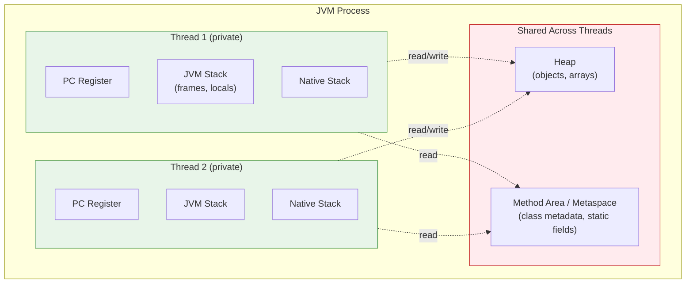
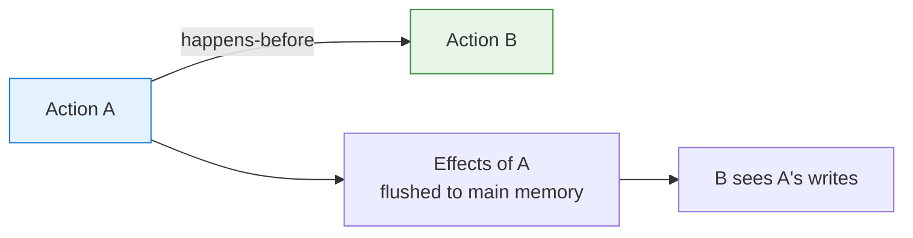

# Multithreading in Java

## 1. What
Multithreading is the ability of a program to execute multiple threads (independent paths of execution) concurrently within the same process.

- A **process** is an independent program with its own memory space.
- A **thread** is the smallest unit of execution inside a process.
- In Java, each thread maps to a native OS thread in modern JVM implementations.

## 2. Why
Multithreading improves performance and responsiveness when tasks can run independently.

### Benefits
- **Better CPU utilization**: Multiple cores can execute multiple threads in parallel.
- **Improved responsiveness**: UI or request-handling thread stays responsive while background work continues.
- **Higher throughput**: Server apps can process many requests at the same time.
- **Resource sharing**: Threads in the same process share memory, so communication is faster than inter-process communication.

### Challenges
- **Race conditions**: Two threads modify shared state at the same time.
- **Deadlocks**: Threads wait forever for each other’s locks.
- **Starvation**: Some threads may not get CPU/lock access.
- **Visibility issues**: One thread’s updates are not immediately visible to others without proper synchronization.
- **Debugging complexity**: Concurrency bugs are often intermittent and hard to reproduce.

## 3. How

### Processes vs Threads
- **Memory**:
  - Process: Separate memory space.
  - Thread: Shares process memory (heap), has its own stack.
- **Creation cost**:
  - Process: Heavyweight.
  - Thread: Lightweight compared to process creation.
- **Communication**:
  - Process: IPC mechanisms (pipes, sockets, etc.).
  - Thread: Shared variables/objects.
- **Fault isolation**:
  - Process: Better isolation (one process crash may not kill others).
  - Thread: Crash in one thread can affect whole process.

### Java Memory Model (JMM) in Detail
JMM defines how threads interact through memory and what values reads/writes are allowed to observe in multithreaded Java programs.

JMM is mainly about three guarantees:
- **Atomicity**: Whether an operation happens as one indivisible step.
- **Visibility**: Whether one thread's write becomes visible to another thread.
- **Ordering**: Whether operations can be reordered by compiler/JIT/CPU.

### JVM Memory Parts (What Is Shared vs Thread-Private)



#### Thread-Private Memory
- **PC Register (Program Counter)**:
  - Each thread has its own PC register.
  - It points to the next JVM bytecode instruction to execute.
  - Because each thread executes independently, each needs its own instruction pointer.
- **JVM Stack**:
  - Each thread has its own stack.
  - Every method call creates a stack frame containing local variables, operand stack, and return info.
  - Local variables inside a frame are not directly shared with other threads.
- **Native Method Stack**:
  - Used when executing native (JNI) methods.
  - Also thread-private.

#### Shared Memory
- **Heap**:
  - Objects and arrays live here.
  - All threads can access heap objects, so this is where data races usually happen.
- **Method Area / Metaspace**:
  - Stores class metadata, runtime constant pool, static fields, and method bytecode metadata.
  - Shared across threads.

### CPU Registers/Cache vs JMM "Main Memory"
At hardware level, CPUs use registers, L1/L2/L3 caches, store buffers, etc. JMM abstracts this using:
- **Main memory**: Shared memory (roughly heap/static shared state).
- **Working memory**: Per-thread temporary copies (conceptually registers/caches).

Important idea:
- A thread may read a shared variable into working memory and keep using that cached value.
- Another thread may update the same variable, but the first thread may not see it immediately unless proper synchronization is used.

### How Threads Share Data Safely
Without synchronization, updates to shared data may be stale or reordered.

Use these tools to create safe sharing:
- `synchronized`:
  - Entering/exiting monitor creates a **happens-before** relationship.
  - Ensures visibility + mutual exclusion.
- `volatile`:
  - Guarantees visibility of latest write to all threads.
  - Prevents certain reorderings around the volatile variable.
  - Does not make compound actions (like `count++`) atomic.
- `java.util.concurrent` atomics (for example, `AtomicInteger`):
  - Provides atomic read-modify-write operations.
- Locks (`ReentrantLock`) and higher-level utilities:
  - Explicit locking and coordination primitives.

### Happens-Before Rules (Most Asked)
If A happens-before B, then B is guaranteed to see effects of A.



Common rules:
- Program order rule: earlier statements in same thread happen-before later statements.
- Monitor lock rule: unlock on a monitor happens-before next lock on same monitor.
- Volatile rule: write to volatile happens-before subsequent read of same volatile.
- Thread start rule: actions before `thread.start()` happen-before actions in started thread.
- Thread join rule: actions in thread happen-before another thread returns from `thread.join()`.

### Multithreading in Java
Common ways to create and manage threads:
1. **Extend `Thread`** (simple but less flexible).
2. **Implement `Runnable`** (preferred for task-oriented design).
3. **Use `Callable` + `Future`** (returns a value and can throw checked exceptions).
4. **Use `ExecutorService` / Thread pools** (recommended for production).

Core concurrency tools:
- `synchronized`, `volatile`
- `Lock` (`ReentrantLock`)
- Atomic classes (`AtomicInteger`, etc.)
- Utilities from `java.util.concurrent` (`CountDownLatch`, `Semaphore`, `ConcurrentHashMap`)

## 4. Code Example

### Using ExecutorService (Recommended)
```java
import java.util.concurrent.ExecutorService;
import java.util.concurrent.Executors;
import java.util.concurrent.TimeUnit;

public class MultithreadingDemo {
    public static void main(String[] args) throws InterruptedException {
        ExecutorService pool = Executors.newFixedThreadPool(3);

        for (int i = 1; i <= 5; i++) {
            int taskId = i;
            pool.submit(() -> {
                String threadName = Thread.currentThread().getName();
                System.out.println("Task " + taskId + " started on " + threadName);
                try {
                    Thread.sleep(500);
                } catch (InterruptedException e) {
                    Thread.currentThread().interrupt();
                }
                System.out.println("Task " + taskId + " finished on " + threadName);
            });
        }

        pool.shutdown();
        pool.awaitTermination(5, TimeUnit.SECONDS);
    }
}
```

### Shared Counter Bug vs Correct Approaches
```java
import java.util.concurrent.atomic.AtomicInteger;

class CounterDemo {
  // Not safe: count++ is read + add + write (3 steps)
  private int unsafeCount = 0;

  // Safe option 1: atomic operations
  private final AtomicInteger safeAtomicCount = new AtomicInteger(0);

  // Safe option 2: synchronized method
  private int safeSynchronizedCount = 0;

  public void incrementUnsafe() {
    unsafeCount++;
  }

  public void incrementAtomic() {
    safeAtomicCount.incrementAndGet();
  }

  public synchronized void incrementSynchronized() {
    safeSynchronizedCount++;
  }
}
```

## 5. Interview Angles

### Difference between concurrency and parallelism?
- **Concurrency**: Multiple tasks make progress during overlapping time.
- **Parallelism**: Multiple tasks run literally at the same instant (usually on multiple CPU cores).

### `start()` vs `run()` in `Thread`?
- `start()` creates a new thread and then calls `run()` on that new thread.
- Calling `run()` directly executes like a normal method call on the current thread.

### Why prefer ExecutorService over creating threads manually?
- Thread reuse, better lifecycle management, queueing, bounded resources, cleaner shutdown.

### What is race condition?
When output depends on unpredictable thread scheduling because shared mutable state is accessed without proper synchronization.

### What does `volatile` guarantee?
- **Visibility** of latest value across threads.
- Prevents certain instruction reordering.
- It does **not** make compound operations (like `count++`) atomic.

### What is the PC register in Java threads?
- Each thread has its own Program Counter to track the next bytecode instruction.
- It is thread-private, so it is not a data-sharing mechanism.

### Which memory is shared and which is private?
- Shared: Heap, Method Area/Metaspace, static fields.
- Thread-private: PC register, JVM stack, native method stack.

### Why is `count++` unsafe in multithreading?
Because it is not a single atomic step; it performs read, modify, write. Interleaving across threads causes lost updates.

### `volatile` vs `synchronized`?
- `volatile`: visibility + ordering for a single variable, no locking.
- `synchronized`: visibility + ordering + mutual exclusion (critical section protection).

### Common deadlock prevention strategies
- Acquire locks in a fixed global order.
- Avoid nested locks when possible.
- Use timed lock attempts (`tryLock`).
