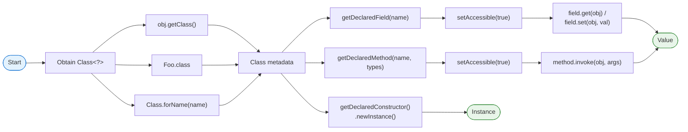

# Java Reflection API

## 1. What
Java Reflection is an API that allows a program to inspect and modify its own structure and behavior at runtime. It enables access to classes, interfaces, fields, and methods without knowing their names at compile time.

## 2. Why
- **Framework Development**: Used by Spring (Dependency Injection), Hibernate (ORM), and JUnit (Test discovery).
- **Generic Tools**: Serialization/Deserialization libraries (Jackson, GSON).
- **Dynamic Behavior**: Invoking methods or accessing fields dynamically based on runtime configuration.
- **Extensibility**: Allowing applications to load and use third-party plugins or modules at runtime.

## 3. How
The API is primarily contained in `java.lang.reflect` and the `java.lang.Class` class.



### Key Operations:
1.  **Obtaining Class**: `obj.getClass()`, `ClassName.class`, or `Class.forName("com.example.MyClass")`.
2.  **Instantiating**: `clazz.getDeclaredConstructor().newInstance()`.
3.  **Accessing Fields**: `clazz.getDeclaredField("name")` + `field.setAccessible(true)`.
4.  **Invoking Methods**: `clazz.getDeclaredMethod("myMethod", String.class).invoke(instance, "arg")`.

## 4. Code Example

### Accessing Private Field & Method
```java
Class<?> clazz = Person.class;
Object personInstance = clazz.getDeclaredConstructor().newInstance();

// Accessing private field
Field nameField = clazz.getDeclaredField("name");
nameField.setAccessible(true);
nameField.set(personInstance, "John Doe");

// Invoking private method
Method greetMethod = clazz.getDeclaredMethod("secretGreet");
greetMethod.setAccessible(true);
greetMethod.invoke(personInstance);
```

## 5. Interview Angles

### `getMethods()` vs `getDeclaredMethods()`?
- **`getMethods()`**: Returns all **public** methods (including inherited ones).
- **`getDeclaredMethods()`**: Returns **all** methods (private, protected, public) of the **current class only**.

### How does Reflection break Singleton?
By calling `setAccessible(true)` on a private constructor, reflection can create multiple instances of a singleton class. *Prevention: Use Enum Singletons.*

### Performance Overhead?
Reflection is slower than direct calls because:
1.  **Dynamic Resolution**: JVM must search for members by name.
2.  **Access Checks**: Security and visibility checks are performed at runtime.
3.  **Inlining Hindrance**: JIT compiler cannot optimize/inline reflective calls as easily.

### Dynamic Proxies?
`java.lang.reflect.Proxy` allows creating objects that implement interfaces at runtime. This is the core of **Spring AOP** (intercepting method calls for transactions, logging, etc.).

### Common Exceptions?
- `ClassNotFoundException`: Class name string is incorrect.
- `NoSuchMethodException` / `NoSuchFieldException`: Member doesn't exist.
- `IllegalAccessException`: Trying to access a private member without `setAccessible(true)`.
- `InvocationTargetException`: The invoked method itself threw an exception.
