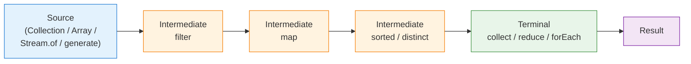
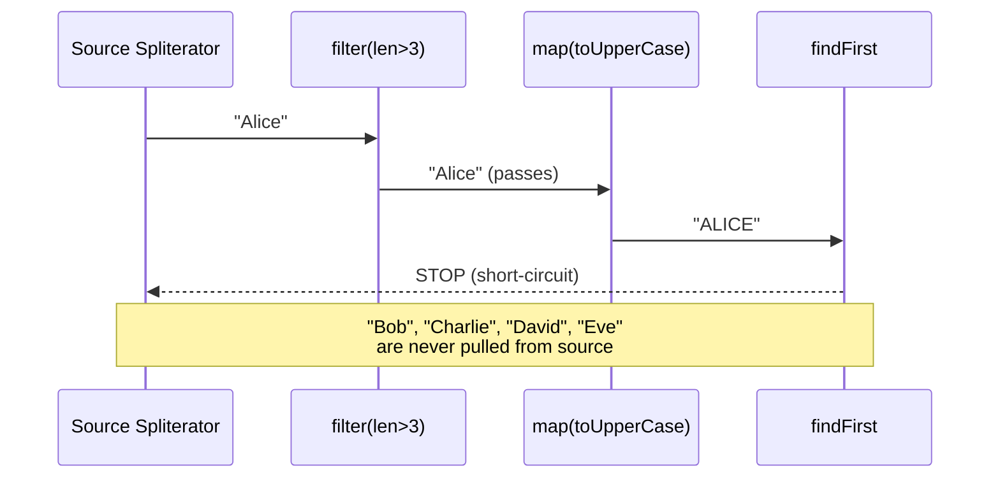
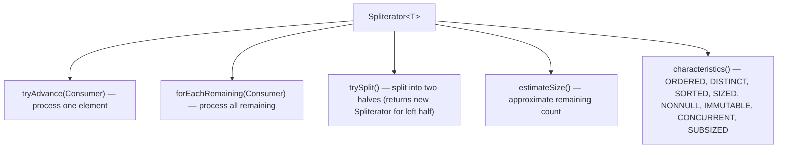
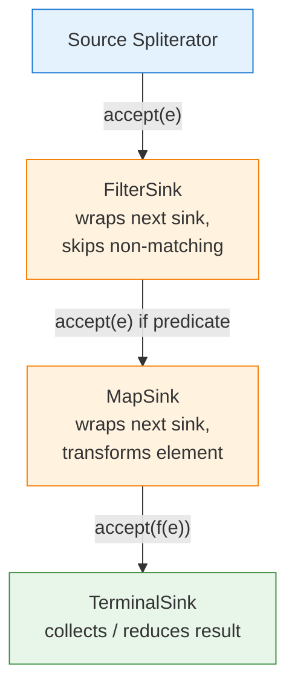
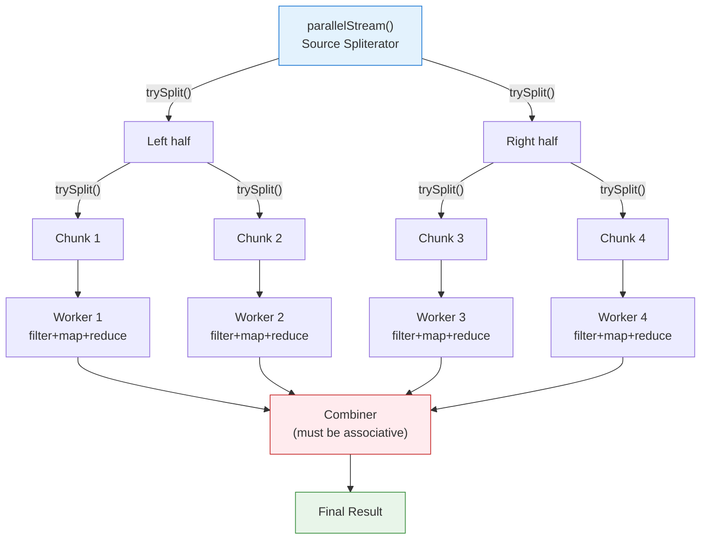
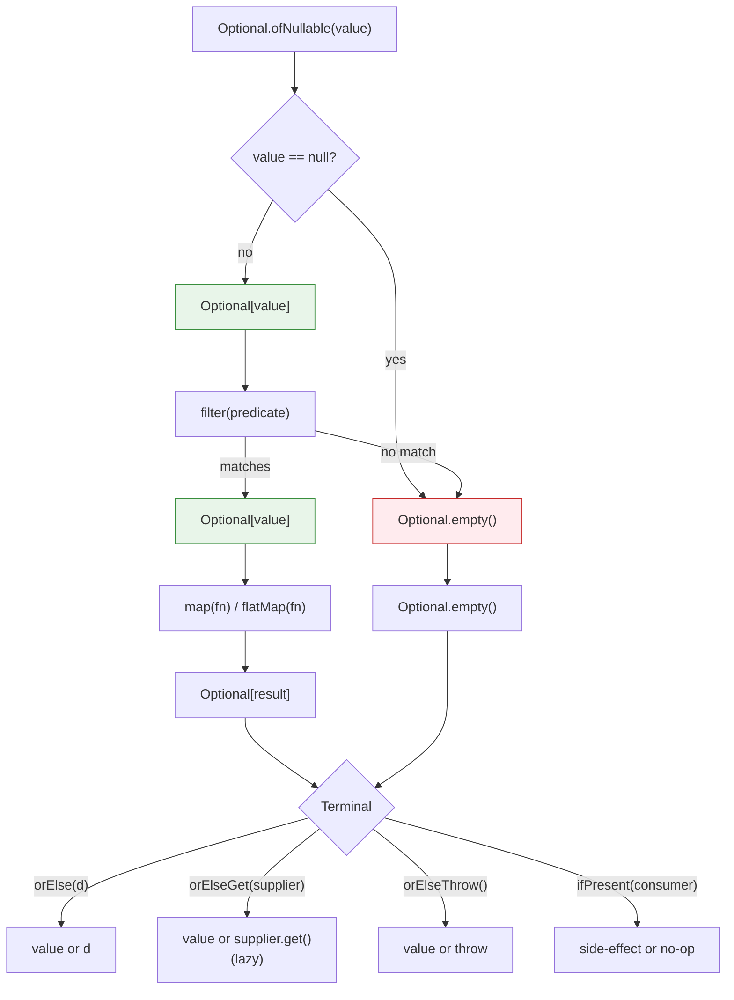

# Java Streams & Functional Programming

## 1. What

Java Streams (introduced in Java 8) provide a declarative, pipeline-based API for processing collections of data. Combined with **lambda expressions**, **method references**, and **functional interfaces**, they enable a functional programming style in Java: transforming, filtering, and aggregating data without explicit loops or mutable accumulators.

A stream pipeline consists of three parts: a **source** (collection, array, generator), zero or more **intermediate operations** (lazy, return a new stream), and a **terminal operation** (triggers execution, produces a result or side effect).



## 2. Why

- **Readability**: Declarative pipelines replace verbose loop-based code.
- **Composability**: Small, reusable functions are chained into complex transformations.
- **Lazy Evaluation**: Intermediate operations are not executed until a terminal operation is invoked, enabling optimizations like short-circuiting and pipeline fusion.
- **Parallelism**: Switching from sequential to parallel execution is a single method call (`.parallelStream()` or `.parallel()`), leveraging the `ForkJoinPool`.
- **Ubiquity in interviews**: Stream-based solutions are expected for data-transformation questions at FAANG-level interviews.

## 3. How

---

### 3.1 Functional Interfaces

A **functional interface** has exactly one abstract method. The `@FunctionalInterface` annotation is optional but recommended — it makes the compiler enforce the single-abstract-method constraint.

| Interface | Signature | Use |
|---|---|---|
| `Function<T,R>` | `R apply(T t)` | Transform T to R |
| `Predicate<T>` | `boolean test(T t)` | Condition / filter |
| `Consumer<T>` | `void accept(T t)` | Side-effect (e.g., print) |
| `Supplier<T>` | `T get()` | Lazy value factory |
| `BiFunction<T,U,R>` | `R apply(T t, U u)` | Two-arg transformation |
| `UnaryOperator<T>` | `T apply(T t)` | Special `Function<T,T>` |
| `BinaryOperator<T>` | `T apply(T t1, T t2)` | Special `BiFunction<T,T,T>` |

#### Lambda Syntax

```java
// No params
Runnable r = () -> System.out.println("hello");

// Single param (parentheses optional)
Predicate<String> notEmpty = s -> !s.isEmpty();

// Multiple params
BiFunction<Integer, Integer, Integer> add = (a, b) -> a + b;

// Block body (explicit return)
Function<String, Integer> parse = s -> {
    int val = Integer.parseInt(s);
    return val * 2;
};
```

#### Method References (4 types)

```java
// 1. Static method reference
Function<String, Integer> parser = Integer::parseInt;

// 2. Instance method of a particular object
String prefix = "Hello";
Predicate<String> startsWithHello = prefix::startsWith; // prefix.startsWith(arg)

// 3. Instance method of an arbitrary object of a given type
Function<String, String> upper = String::toUpperCase;  // arg.toUpperCase()

// 4. Constructor reference
Supplier<ArrayList<String>> listFactory = ArrayList::new;
```

---

### 3.2 Stream Pipeline — Lazy Evaluation & Short-Circuiting



```java
List<String> names = List.of("Alice", "Bob", "Charlie", "David", "Eve");

String result = names.stream()           // source
    .filter(n -> n.length() > 3)         // intermediate (lazy)
    .map(String::toUpperCase)            // intermediate (lazy)
    .findFirst()                         // terminal (short-circuiting)
    .orElse("NONE");
// Only "Alice" is processed through filter+map; "Bob" is filtered out;
// pipeline stops after "ALICE" is found. "Charlie", "David", "Eve" are never touched.
```

**Key insight**: Intermediate operations return a new `Stream` object but do nothing until a terminal operation pulls data through the pipeline. The JVM fuses the intermediate steps into a single pass over the data (pipeline fusion via a **Sink chain**).

---

### 3.3 Intermediate Operations

All intermediate operations are **lazy** and return a `Stream`.

```java
List<String> words = List.of("hello", "world", "hello", "java", "stream");

// map — transform each element
words.stream().map(String::toUpperCase);             // [HELLO, WORLD, HELLO, JAVA, STREAM]

// filter — keep elements matching predicate
words.stream().filter(w -> w.length() > 4);          // [hello, world, hello, stream]

// distinct — remove duplicates (uses equals/hashCode)
words.stream().distinct();                           // [hello, world, java, stream]

// sorted — natural order or custom comparator
words.stream().sorted();                             // [hello, hello, java, stream, world]
words.stream().sorted(Comparator.comparingInt(String::length));

// peek — inspect without modifying (debugging only)
words.stream().peek(System.out::println).count();

// limit / skip — truncate or skip first N elements
words.stream().skip(2).limit(2);                     // [hello, java]
```

#### flatMap — Flattening nested structures

```java
List<List<Integer>> nested = List.of(List.of(1,2), List.of(3,4), List.of(5));
List<Integer> flat = nested.stream()
    .flatMap(Collection::stream)   // Stream<List<Integer>> -> Stream<Integer>
    .collect(Collectors.toList()); // [1, 2, 3, 4, 5]

// Common use: splitting words
List<String> sentences = List.of("hello world", "foo bar");
List<String> allWords = sentences.stream()
    .flatMap(s -> Arrays.stream(s.split(" ")))
    .collect(Collectors.toList()); // [hello, world, foo, bar]
```

---

### 3.4 Terminal Operations

Terminal operations trigger pipeline execution and produce a result.

```java
List<Integer> nums = List.of(3, 1, 4, 1, 5, 9, 2, 6);

// collect — accumulate into a collection or other container
List<Integer> sorted = nums.stream().sorted().collect(Collectors.toList());

// reduce — combine elements into a single value
int sum = nums.stream().reduce(0, Integer::sum);             // 31
Optional<Integer> max = nums.stream().reduce(Integer::max);  // Optional[9]

// forEach — side-effect for each element (no guaranteed order in parallel)
nums.stream().forEach(System.out::println);

// count
long count = nums.stream().filter(n -> n > 3).count();      // 4

// findFirst / findAny (short-circuiting)
Optional<Integer> first = nums.stream().filter(n -> n > 4).findFirst(); // Optional[5]

// anyMatch / allMatch / noneMatch (short-circuiting)
boolean hasNegative = nums.stream().anyMatch(n -> n < 0);   // false

// toArray
Integer[] arr = nums.stream().toArray(Integer[]::new);
```

---

### 3.5 Collectors

`java.util.stream.Collectors` provides factory methods for common reductions.

```java
List<Employee> employees = getEmployees();

// toList, toSet, toUnmodifiableList (Java 10+)
List<String> names = employees.stream()
    .map(Employee::getName)
    .collect(Collectors.toList());

// toMap — key mapper, value mapper
Map<Integer, String> idToName = employees.stream()
    .collect(Collectors.toMap(Employee::getId, Employee::getName));

// toMap with merge function (handle duplicate keys)
Map<String, Integer> nameToBestSalary = employees.stream()
    .collect(Collectors.toMap(Employee::getName, Employee::getSalary, Integer::max));

// groupingBy — SQL GROUP BY equivalent
Map<String, List<Employee>> byDept = employees.stream()
    .collect(Collectors.groupingBy(Employee::getDepartment));

// groupingBy with downstream collector
Map<String, Long> countByDept = employees.stream()
    .collect(Collectors.groupingBy(Employee::getDepartment, Collectors.counting()));

Map<String, Double> avgSalaryByDept = employees.stream()
    .collect(Collectors.groupingBy(
        Employee::getDepartment,
        Collectors.averagingInt(Employee::getSalary)
    ));

// partitioningBy — split into true/false groups
Map<Boolean, List<Employee>> highEarners = employees.stream()
    .collect(Collectors.partitioningBy(e -> e.getSalary() > 100_000));

// joining
String csv = employees.stream()
    .map(Employee::getName)
    .collect(Collectors.joining(", "));   // "Alice, Bob, Charlie"

// summarizingInt — count, sum, min, max, average in one pass
IntSummaryStatistics stats = employees.stream()
    .collect(Collectors.summarizingInt(Employee::getSalary));
// stats.getAverage(), stats.getMax(), etc.
```

#### Custom Collector

```java
// Collector<T, A, R>: T = input element type, A = accumulator type, R = result type
Collector<String, StringBuilder, String> commaSeparated = Collector.of(
    StringBuilder::new,                    // supplier
    (sb, s) -> {                           // accumulator
        if (sb.length() > 0) sb.append(", ");
        sb.append(s);
    },
    (sb1, sb2) -> {                        // combiner (for parallel)
        if (sb1.length() > 0) sb1.append(", ");
        sb1.append(sb2);
        return sb1;
    },
    StringBuilder::toString                // finisher
);
```

---

### 3.6 Stream Internals

#### Spliterator

Every stream source has a `Spliterator` — an object that knows how to traverse elements and, critically, how to **split** them for parallel processing.



Characteristics enable optimizations: e.g., if a source is `SIZED`, `count()` returns immediately without iterating. If `DISTINCT`, the `.distinct()` operation is a no-op.

#### Pipeline Fusion — the Sink Chain

Internally, Java does **not** create a temporary collection between each intermediate operation. Instead, it builds a chain of `Sink` objects:



When the terminal operation triggers, the spliterator pushes each element through the entire sink chain in one pass. This is why streams are efficient despite looking like multiple passes.

#### Loop Fusion vs. Short-Circuiting

- **Loop fusion**: `filter` + `map` + `forEach` are fused into a single loop.
- **Short-circuiting**: `findFirst`, `anyMatch`, `limit` terminate the loop early by signalling cancellation up the sink chain.

---

### 3.7 Parallel Streams



```java
long count = list.parallelStream()
    .filter(x -> x > 10)
    .count();
```

Parallel streams use the **common ForkJoinPool** (default: `Runtime.getRuntime().availableProcessors() - 1` threads).

#### When to Use

- Large data sets (tens of thousands+).
- CPU-bound operations (no I/O, no synchronization).
- The source spliterator splits cheaply (e.g., `ArrayList`, arrays — *not* `LinkedList`).

#### When NOT to Use

- Small collections (parallelization overhead > gain).
- I/O-bound work (threads block, starving the common pool).
- Order-dependent operations or side-effects.

#### Pitfalls

```java
// 1. Shared mutable state — BROKEN
List<Integer> results = new ArrayList<>(); // not thread-safe
stream.parallel().forEach(results::add);   // race condition!
// Fix: use .collect(Collectors.toList())

// 2. Non-associative reduce — WRONG RESULTS
// reduce requires an associative function: (a op b) op c == a op (b op c)
stream.parallel().reduce(0, (a, b) -> a - b); // subtraction is non-associative!

// 3. Ordering cost
// parallel + sorted/distinct/limit forces coordination between threads
list.parallelStream().sorted().limit(10); // expensive ordering barrier

// 4. Custom ForkJoinPool (workaround for isolation)
ForkJoinPool custom = new ForkJoinPool(4);
custom.submit(() ->
    list.parallelStream().forEach(/* ... */)
).get();
```

---

### 3.8 Optional

`Optional<T>` is a container that may or may not hold a non-null value. It replaces `null` returns and makes the absence of a value explicit in the type system.



```java
// Creation
Optional<String> present   = Optional.of("hello");       // throws NPE if null
Optional<String> maybe     = Optional.ofNullable(name);   // wraps or empty
Optional<String> absent    = Optional.empty();

// Chaining
String upper = Optional.ofNullable(getName())
    .filter(n -> n.length() > 2)
    .map(String::toUpperCase)
    .orElse("DEFAULT");

// flatMap — when the mapping function itself returns Optional
Optional<String> city = getUser()
    .flatMap(User::getAddress)       // User::getAddress returns Optional<Address>
    .flatMap(Address::getCity);      // Address::getCity returns Optional<String>

// orElseGet — lazy default (Supplier evaluated only if empty)
String name = maybeName.orElseGet(() -> expensiveLookup());

// orElseThrow (Java 10+ no-arg version)
String name = maybeName.orElseThrow();                         // NoSuchElementException
String name = maybeName.orElseThrow(() -> new NotFoundException("not found"));
```

#### Anti-Patterns

- **Optional as a field**: Adds memory overhead (extra object), not `Serializable`. Use `null` + getter returning `Optional`.
- **Optional as a method parameter**: Callers are forced to wrap values. Accept `@Nullable` parameter instead.
- **`optional.get()` without `isPresent()`**: Defeats the purpose — prefer `orElse`/`map`/`ifPresent`.
- **`optional.isPresent()` + `optional.get()`**: Use `ifPresent`, `map`, or `orElseGet` instead.

---

### 3.9 Common Patterns

#### Infinite Streams

```java
// iterate — seed + unary operator
Stream<Integer> naturals = Stream.iterate(1, n -> n + 1);       // 1, 2, 3, ...
Stream<Integer> evens    = Stream.iterate(0, n -> n < 100, n -> n + 2); // Java 9: bounded

// generate — Supplier
Stream<Double> randoms = Stream.generate(Math::random);

// Always use limit() to prevent infinite execution
List<Integer> first10 = Stream.iterate(1, n -> n + 1).limit(10).toList();
```

#### Collecting to Map with Merge Function

```java
// Count word frequency
Map<String, Long> freq = words.stream()
    .collect(Collectors.groupingBy(Function.identity(), Collectors.counting()));

// Alternative using toMap
Map<String, Integer> freq2 = words.stream()
    .collect(Collectors.toMap(w -> w, w -> 1, Integer::sum));
```

#### Grouping and Multi-level Aggregation

```java
// Two-level grouping: department -> job title -> list of employees
Map<String, Map<String, List<Employee>>> nested = employees.stream()
    .collect(Collectors.groupingBy(
        Employee::getDepartment,
        Collectors.groupingBy(Employee::getJobTitle)
    ));
```

#### Stream of Streams (flatMap)

```java
// Find all unique characters from a list of words
Set<Character> chars = words.stream()
    .flatMap(w -> w.chars().mapToObj(c -> (char) c))
    .collect(Collectors.toSet());
```

---

## 4. Common Mistakes & Pitfalls

| Mistake | Why it is wrong | Fix |
|---|---|---|
| Reusing a stream | Streams are single-use; terminal op closes the pipeline | Create a new stream each time |
| Using `peek` for mutations | `peek` exists for debugging; behavior is undefined if used to mutate | Use `map` for transformations |
| `forEach` + external mutable state | Not thread-safe in parallel; hard to reason about | Use `collect` or `reduce` |
| `stream.sorted().findFirst()` | Sorts entire stream just to find min | Use `stream.min(comparator)` |
| Ignoring primitive streams | Boxing overhead with `Stream<Integer>` | Use `IntStream`, `LongStream`, `DoubleStream` |
| `toMap` without merge on duplicate keys | Throws `IllegalStateException` | Always provide merge function if keys may collide |
| `orElse(expensiveCall())` | Called even when Optional is present | Use `orElseGet(() -> expensiveCall())` |
| Parallel stream on `LinkedList` | `trySplit()` is O(n) — no efficient splitting | Use `ArrayList` or array-backed sources |

---

## 5. Interview Angles

### Q1: How does lazy evaluation work internally in Java Streams?

When you chain intermediate operations like `filter` and `map`, no processing occurs. Instead, each operation wraps the previous stage in a new `AbstractPipeline` object, recording the operation. When a terminal operation is invoked, the pipeline is "baked": each stage creates a **Sink** that wraps the downstream Sink. The source `Spliterator` then pushes elements through this fused Sink chain. This means elements flow through all stages one-by-one rather than completing one stage for all elements before moving to the next. Short-circuiting terminal ops (like `findFirst`) signal cancellation through the Sink chain, stopping the Spliterator early.

### Q2: What is the difference between `map` and `flatMap`?

`map` applies a one-to-one transformation: each input element produces exactly one output element. `flatMap` applies a one-to-many transformation: each input element produces a stream of output elements, and all those streams are flattened into a single stream. Use `flatMap` when the mapper function returns a `Stream`, `Optional`, or collection. Example: `stream.map(line -> line.split(" "))` produces `Stream<String[]>`, whereas `stream.flatMap(line -> Arrays.stream(line.split(" ")))` produces `Stream<String>`.

### Q3: Why is `reduce` required to be associative for parallel streams?

In parallel execution, the stream is split into segments processed by different threads. Each segment produces a partial result via the accumulator. These partial results are then merged using the combiner. If the operation is non-associative (like subtraction), the order in which partial results are combined affects the final answer, leading to **non-deterministic results**. Associativity guarantees `(a op b) op c == a op (b op c)`, making the result independent of how the work is partitioned.

### Q4: What is the difference between `orElse` and `orElseGet`?

`orElse(defaultValue)` **always evaluates** the default value, even when the Optional is present. `orElseGet(supplier)` evaluates the Supplier **only when** the Optional is empty. This matters when the default involves an expensive computation, a database call, or a side effect. Always prefer `orElseGet` for non-trivial defaults.

### Q5: When should you NOT use parallel streams?

Avoid parallel streams when: (1) the data set is small (overhead of splitting and thread coordination exceeds the gain), (2) the operation is I/O-bound (threads block, starving the shared ForkJoinPool), (3) the source does not split efficiently (e.g., `LinkedList`, `Stream.iterate`), (4) the pipeline has ordering-sensitive operations like `sorted` or `limit` that force synchronization barriers, or (5) the operations have side effects or shared mutable state. Benchmark before assuming parallel is faster.

### Q6: How does `Collectors.groupingBy` work and how do you perform multi-level grouping?

`groupingBy(classifier)` partitions elements into a `Map<K, List<T>>` based on the classifier function. It accepts an optional downstream collector for further aggregation: `groupingBy(classifier, counting())` gives counts per group, `groupingBy(classifier, averagingInt(...))` gives averages. For multi-level grouping, nest `groupingBy` calls: `groupingBy(Employee::getDept, groupingBy(Employee::getTitle))` produces `Map<String, Map<String, List<Employee>>>`.

### Q7: What is a Spliterator and why does it matter?

A `Spliterator` (splittable iterator) is the underlying mechanism that enables both sequential and parallel stream traversal. It defines how to iterate elements (`tryAdvance`), how to split the source into two halves for parallel processing (`trySplit`), and reports characteristics (`SIZED`, `ORDERED`, `SORTED`, etc.) that the pipeline uses for optimizations. For example, calling `count()` on a `SIZED` stream returns immediately without iterating. A poor `trySplit` implementation (like `LinkedList`'s) makes parallel streams inefficient because work cannot be evenly distributed.

### Q8: Can you reuse a Stream? What happens if you try?

No. A stream can be consumed only once. After a terminal operation is invoked, the stream is considered closed. Attempting to invoke another terminal operation on the same stream throws `IllegalStateException: stream has already been operated upon or closed`. If you need to apply multiple terminal operations to the same data, either create a new stream from the source each time or collect intermediate results into a collection first.
