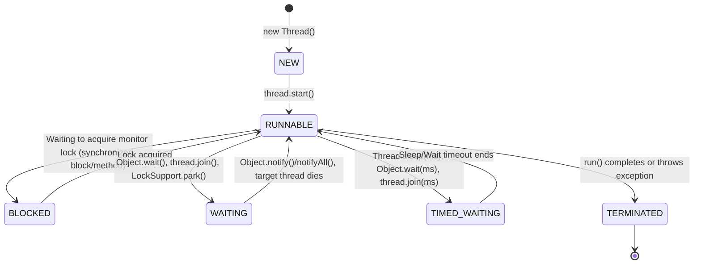

# Basics of Threads (Part 1)

## 1. What
In Java, a **thread** is the smallest unit of execution inside a process. Java provides built-in support for multithreading through the `java.lang.Thread` class and the `java.lang.Runnable` interface.

This note covers:
- **Thread Creation**: The two fundamental ways to define and run a thread (extending `Thread` vs. implementing `Runnable`).
- **Thread Lifecycle**: The six distinct lifecycle states a Java thread can transition through, defined in the `Thread.State` enum.

---

## 2. Why
Understanding thread creation and lifecycle states is essential for:
- **Resource Management**: Choosing the right creation pattern avoids unnecessary class inheritance limitations.
- **Troubleshooting & Debugging**: Knowing the difference between states (e.g., `BLOCKED` vs. `WAITING`) is critical for diagnosing thread contention, deadlocks, and performance bottlenecks via thread dumps.
- **Architectural Design**: Decoupling tasks (Runnables) from their execution mechanism (Threads/ExecutorServices) allows for clean, reusable, and scalable code.

---

## 3. How

### Creating Threads: Inheritance vs. Composition

| Feature | Extending `Thread` (Inheritance) | Implementing `Runnable` (Composition) |
|---|---|---|
| **Inheritance limit** | Cannot inherit any other class (Java is single-inheritance). | Can inherit another class and implement other interfaces. |
| **Object Sharing** | Each thread is a separate object; harder to share resources. | Multiple threads can share the same `Runnable` instance. |
| **Task Decoupling** | Task logic and execution mechanism are tightly coupled. | Decouples the task definition (`Runnable`) from execution (`Thread`). |
| **Industry Practice** | **Discouraged** (unless customizing thread behavior). | **Recommended** (fits perfectly with thread pools and executors). |

---

### The 6 Thread States (`Thread.State`)



#### 1. NEW
- **Definition**: The thread has been instantiated, but `start()` has not been invoked yet.
- **Transition**: Call `thread.start()` to transition to `RUNNABLE`. Calling `run()` directly will **not** transition the state to `RUNNABLE` or start a new thread.

#### 2. RUNNABLE
- **Definition**: The thread is active in the JVM. It may be actively executing, or it may be ready and waiting for OS resource allocation (CPU scheduling).
- **Transition**: It goes to `BLOCKED`, `WAITING`, or `TIMED_WAITING` depending on lock acquisition or sleep/wait operations.

#### 3. BLOCKED
- **Definition**: The thread is waiting to acquire a monitor lock.
- **When**: Occurs when a thread attempts to enter a `synchronized` block or method that is already held by another thread, or re-enters after calling `Object.wait()`.

#### 4. WAITING
- **Definition**: The thread is waiting indefinitely for another thread to perform a specific action.
- **When**: 
  - `Object.wait()` (without timeout) — waiting for `notify()` or `notifyAll()`.
  - `Thread.join()` (without timeout) — waiting for the target thread to die.
  - `LockSupport.park()`.

#### 5. TIMED_WAITING
- **Definition**: The thread is waiting for a specified timeout period.
- **When**:
  - `Thread.sleep(long millis)`.
  - `Object.wait(long timeout)`.
  - `Thread.join(long millis)`.
  - `LockSupport.parkNanos()` / `LockSupport.parkUntil()`.

#### 6. TERMINATED
- **Definition**: The thread has completed execution.
- **When**: The `run()` method exits normally or throws an uncaught exception. Once terminated, a thread cannot be restarted (`IllegalThreadStateException` will be thrown).

---

## 4. Code Example

The following code demonstrates how to create threads using both methods and captures all six thread states in action:

```java
import java.util.concurrent.locks.Lock;
import java.util.concurrent.locks.ReentrantLock;

public class ThreadLifecycleDemo {

    // 1. Thread creation via inheritance
    static class CustomThread extends Thread {
        @Override
        public void run() {
            System.out.println("CustomThread (extending Thread) is running.");
        }
    }

    // 2. Thread creation via composition/Runnable
    static class CustomRunnable implements Runnable {
        private final Object lock;

        public CustomRunnable(Object lock) {
            this.lock = lock;
        }

        @Override
        public void run() {
            try {
                // Introduce TIMED_WAITING state
                Thread.sleep(100);

                // Introduce BLOCKED state (waiting for parent thread to release monitor lock)
                synchronized (lock) {
                    // Introduce WAITING state (waiting for parent to call notify())
                    lock.wait();
                }
            } catch (InterruptedException e) {
                Thread.currentThread().interrupt();
            }
        }
    }

    public static void main(String[] args) throws InterruptedException {
        // Quick run of Thread subclass
        CustomThread threadSubclass = new CustomThread();
        threadSubclass.start();
        threadSubclass.join();

        // Demonstrating the 6 Thread States
        Object monitor = new Object();
        Thread target = new Thread(new CustomRunnable(monitor));

        // State 1: NEW
        System.out.println("State after instantiation: " + target.getState()); // NEW

        // Acquire lock on monitor before starting target to force BLOCKED state later
        synchronized (monitor) {
            // State 2: RUNNABLE
            target.start();
            System.out.println("State after calling start(): " + target.getState()); // RUNNABLE

            // Let target run until it hits Thread.sleep()
            Thread.sleep(50);
            // State 3: TIMED_WAITING (due to Thread.sleep)
            System.out.println("State during Thread.sleep(): " + target.getState()); // TIMED_WAITING
        } // monitor lock released here

        // Let target execute and attempt to enter synchronized block.
        // If we acquire lock here again, target will block.
        synchronized (monitor) {
            Thread.sleep(80); // Wait a bit for target to try entering lock
            // State 4: BLOCKED (waiting for monitor lock)
            System.out.println("State when blocked on monitor: " + target.getState()); // BLOCKED
        } // monitor lock released, target enters synchronized block and calls lock.wait()

        Thread.sleep(50); // Let target transition to wait()
        // State 5: WAITING (due to lock.wait())
        System.out.println("State when waiting on wait(): " + target.getState()); // WAITING

        // Wake up target thread
        synchronized (monitor) {
            monitor.notify();
        }

        target.join(); // Wait for target to finish
        // State 6: TERMINATED
        System.out.println("State after termination: " + target.getState()); // TERMINATED
    }
}
```

---

## 5. Interview Angles

### 1. What is the difference between `start()` and `run()`?
- `start()`: Registers the thread with the thread scheduler, creates a new operating system thread of execution, and asynchronously invokes the `run()` method.
- `run()`: Executes the task synchronously in the **current thread** as a regular method call. No new thread is spawned.

### 2. Why is implementing `Runnable` preferred over extending `Thread`?
- **Single Inheritance**: Java classes can only extend one class. Extending `Thread` wastes this slot.
- **Separation of Concerns**: `Runnable` represents the task itself, while `Thread` represents the execution engine.
- **Integration with Executor Framework**: Thread Pools (`ExecutorService`) accept `Runnable`/`Callable` tasks, not `Thread` instances.

### 3. What is the difference between `BLOCKED` and `WAITING` states?
- **BLOCKED**: The thread is waiting to acquire a monitor lock (`synchronized` block/method) that is currently held by another thread. It will automatically become `RUNNABLE` once the lock is released.
- **WAITING**: The thread has explicitly paused its execution (e.g., via `wait()` or `join()`) and is waiting for a notification or signal from another thread. It will not wake up automatically when locks are freed; it needs a specific action (like `notify()`, `notifyAll()`, or the joined thread terminating).

### 4. Can a terminated thread be restarted?
No. Once a thread reaches the `TERMINATED` state, calling `start()` on it again will throw an `IllegalThreadStateException`. If you need to run the task again, a new thread instance must be created.
