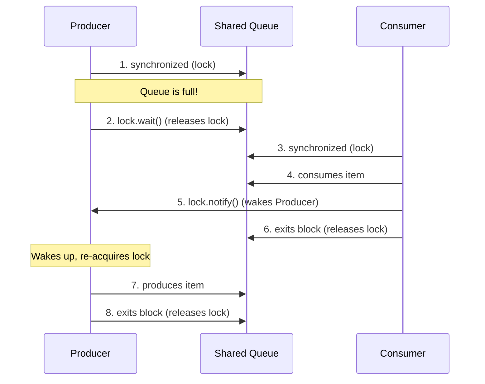

# Basics of Threads (Part 2)

## 1. What
This chapter covers intermediate synchronization mechanisms and thread control capabilities in Java:
- **Producer-Consumer Problem**: A classic concurrency challenge where threads must coordinate access to a bounded queue.
- **Why `stop()` and `suspend()` are Deprecated**: The dangers of abrupt thread termination and suspension.
- **Thread Joining (`join()`)**: Coordination mechanism to wait for thread execution to finish.
- **Thread Priority**: Giving execution hints to the OS/JVM thread scheduler.
- **Daemon Threads**: Background helper threads that do not prevent the JVM from exiting.

---

## 2. Why
- **Coordinated Inter-Thread Communication**: Using standard Java monitor locks (`wait()` and `notify()`) ensures threads don't waste CPU resources (busy-waiting) when waiting for conditions to change.
- **Preventing Deadlocks and Corruption**: Understanding why legacy APIs are deprecated prevents writing unstable applications that corrupt memory or deadlock JVM processes.
- **Controlled Concurrency Flow**: Utilizing `join()` ensures synchronous dependencies (e.g., waiting for data loading before starting UI) are handled cleanly.
- **Interruption-Aware Code**: Knowing how blocking methods react to interruption is essential for graceful shutdown and responsive multithreaded code.
- **Resource Management**: Leveraging Daemon threads allows background maintenance tasks to clean up automatically without stalling the application shutdown process.
- **Choosing the Right Abstraction**: Interviews often start with low-level primitives like `wait()`/`notify()` and then test whether you know when to replace them with higher-level concurrency utilities.

---

## 3. How

### 1. Producer-Consumer Coordination
The Producer-Consumer pattern requires synchronization on a shared buffer:
- **Condition Checking in Loops**: Always check wait conditions in a `while` loop (e.g., `while (queue.isFull())`) rather than an `if` block to handle **spurious wakeups** (where a thread wakes up without `notify()` being called).
- **Monitor Lock Behavior**: 
  - Calling `wait()` releases the monitor lock and puts the thread in `WAITING` or `TIMED_WAITING` state.
  - Calling `notify()` or `notifyAll()` wakes up waiting threads, but they cannot proceed until they re-acquire the monitor lock.
- **Real-World Preference**: In production code, prefer higher-level constructs when possible:
    - `BlockingQueue` for producer-consumer pipelines.
    - `ExecutorService` or thread pools for task execution.
    - `ReentrantLock` with `Condition` when you need multiple explicit wait-sets or more flexible lock behavior.



---

### 2. Deprecation of `stop()`, `suspend()`, and `resume()`
These legacy methods on `java.lang.Thread` have been deprecated since Java 1.2 and are marked for removal or disabled in modern Java versions because they violate core multithreading safety principles.

#### Why `stop()` is Deprecated: The Danger of **Object/Data Corruption**
- **How it works**: Calling `thread.stop()` forces the target thread to immediately throw a `ThreadDeath` error (a subclass of `Error`) at whatever point it is executing in its instruction cycle.
- **Lock Release Behavior**: As the `ThreadDeath` error propagates up the thread's call stack, it unwinds the stack and exits all `synchronized` blocks or methods the thread was executing. As a consequence, **all monitor locks held by that thread are automatically and immediately released**.
- **The Core Issue (Corruption)**: If the thread was in the middle of executing a critical section that modifies a shared object's state to maintain an invariant (for example: moving $100 from Account A to Account B, or inserting a node into a doubly-linked list), the abrupt termination stops the thread mid-operation. Because locks are released instantly, the half-modified, **inconsistent (corrupted) state** of the object is immediately exposed to other threads.
- **Alternative**: Use a cooperative mechanism such as a `volatile boolean` shutdown flag or check the thread's interrupt status (`Thread.currentThread().isInterrupted()`) to let the thread exit its `run()` method cleanly.

#### Why `suspend()` and `resume()` are Deprecated: The Danger of **Deadlocks**
- **How it works**: Calling `thread.suspend()` halts the execution of the target thread. The thread remains suspended until another thread invokes `thread.resume()`.
- **Lock Retention Behavior**: Unlike `stop()`, a suspended thread **does not release any locks** (monitors) it has acquired. It goes to sleep holding onto all of them.
- **The Core Issue (Deadlock)**: If the thread responsible for calling `resume()` on the suspended thread needs to acquire any of those same locks *before* it can call `resume()`, the application will enter a permanent deadlock:
  1. The suspended thread cannot resume and release its locks because it is waiting for `resume()`.
  2. The resuming thread cannot call `resume()` because it is blocked waiting for the locks held by the suspended thread.
- **Alternative**: Use structured coordination mechanisms like `wait()` and `notify()` or lock conditions (`java.util.concurrent.locks.Condition`), which naturally suspend a thread *while* releasing its monitor locks.

#### Lock Behavior Summary Table

| Method | State Transition | Releases Monitor Locks? | Primary Vulnerability | Consequence |
|---|---|---|---|---|
| `Thread.stop()` | Forced `TERMINATED` (via `ThreadDeath` exception) | **Yes** (Automatically as stack unwinds) | **Inconsistent State Exposure** | Data/Object Corruption |
| `Thread.suspend()` | Paused execution indefinitely | **No** (Holds all locks while sleeping) | **Permanent Resource Contention** | Application Deadlock |
| `Object.wait()` | Enters `WAITING`/`TIMED_WAITING` state | **Yes** (Releases the specific lock it waits on) | *None (Designed for safe coordination)* | Safe Inter-Thread Communication |

---

### 3. Thread Joining (`join()`)
- `thread.join()` blocks the current executing thread (e.g., `main`) until the thread object it is called on finishes execution (`TERMINATED` state).
- **Internally**: It uses `wait()` internally on the `Thread` object. When the thread terminates, the JVM calls `notifyAll()` on the thread object to wake up all joining threads.
- **Interruptibility**: `join()` throws `InterruptedException`. If the waiting thread is interrupted, the join ends early and the interrupted status is cleared when the exception is thrown, so callers usually either propagate the exception or restore the flag with `Thread.currentThread().interrupt()`.
- **Timeout Variant**: `join(long millis)` lets the caller stop waiting after a bounded time and then check `thread.isAlive()`.

---

### 4. Thread Priority
- Thread priorities are integers ranging from `Thread.MIN_PRIORITY` (1) to `Thread.MAX_PRIORITY` (10). The default is `Thread.NORM_PRIORITY` (5).
- **Scheduler Hint Only**: Priority is merely a hint to the operating system's thread scheduler. There is **no guarantee** of execution order, and it behaves differently across operating systems (some OS schedulers ignore it entirely).

---

### 5. Daemon Threads
- **Definition**: Daemon threads are background helper threads that run in the background (e.g., Garbage Collection, event listeners).
- **JVM Exit Condition**: The JVM will terminate as soon as all **non-daemon** threads have finished. Any remaining daemon threads are abruptly killed when the JVM exits.
- **Configuration**: Must be set via `thread.setDaemon(true)` **before** calling `thread.start()`.
- **Important Limitation**: Do not use daemon threads for critical work like flushing files, committing transactions, or persisting final logs, because the JVM does not wait for them to complete during shutdown.

---

## 4. Code Example

The code below implements a clean Producer-Consumer buffer using `wait()` and `notify()`, coordinate startup and teardown using `join()`, and illustrates background execution with a `Daemon` thread.

```java
import java.util.LinkedList;
import java.util.Queue;

public class ThreadBasicsPart2Demo {

    // Shared bounded buffer for Producer-Consumer
    static class BoundedBuffer {
        private final Queue<Integer> queue = new LinkedList<>();
        private final int capacity;

        public BoundedBuffer(int capacity) {
            this.capacity = capacity;
        }

        // Producer method
        public synchronized void produce(int value) throws InterruptedException {
            // Check condition in a while loop to handle spurious wakeups
            while (queue.size() == capacity) {
                System.out.println("Buffer full. Producer is waiting...");
                wait(); // Releases monitor lock
            }

            queue.add(value);
            System.out.println("Produced: " + value);

            // Notify waiting consumers
            notifyAll();
        }

        // Consumer method
        public synchronized int consume() throws InterruptedException {
            // Check condition in a while loop
            while (queue.isEmpty()) {
                System.out.println("Buffer empty. Consumer is waiting...");
                wait(); // Releases monitor lock
            }

            int value = queue.poll();
            System.out.println("Consumed: " + value);

            // Notify waiting producers
            notifyAll();
            return value;
        }
    }

    public static void main(String[] args) throws InterruptedException {
        BoundedBuffer buffer = new BoundedBuffer(2);

        // 1. Daemon Thread Example
        Thread daemonThread = new Thread(() -> {
            while (true) {
                try {
                    System.out.println("[Daemon] Background monitoring active...");
                    Thread.sleep(500);
                } catch (InterruptedException e) {
                    System.out.println("[Daemon] Interrupted.");
                    break;
                }
            }
        });
        daemonThread.setDaemon(true); // Must be set BEFORE start()
        daemonThread.start();

        // 2. Producer & Consumer Threads
        Thread producer = new Thread(() -> {
            try {
                for (int i = 1; i <= 5; i++) {
                    buffer.produce(i);
                    Thread.sleep(100); // Simulate production delay
                }
            } catch (InterruptedException e) {
                Thread.currentThread().interrupt();
            }
        }, "Producer-Thread");

        Thread consumer = new Thread(() -> {
            try {
                for (int i = 1; i <= 5; i++) {
                    buffer.consume();
                    Thread.sleep(300); // Simulate slow consumer
                }
            } catch (InterruptedException e) {
                Thread.currentThread().interrupt();
            }
        }, "Consumer-Thread");

        // 3. Setting Thread Priorities
        producer.setPriority(Thread.MAX_PRIORITY); // Hint for higher preference
        consumer.setPriority(Thread.MIN_PRIORITY);

        System.out.println("Starting threads...");
        producer.start();
        consumer.start();

        // 4. Thread Joining Example
        // Wait for both producer and consumer to complete execution
        producer.join();
        consumer.join();

        System.out.println("Producer and Consumer have finished their work.");
        System.out.println("Main thread exiting. JVM will now close (terminating the daemon thread).");
    }
}
```

---

## 5. Interview Angles

### 1. Why must `wait()`, `notify()`, and `notifyAll()` be called from a synchronized context?
If called outside a synchronized context, the thread throws an `IllegalMonitorStateException`. These methods require ownership of the object's monitor lock to coordinate state and ensure atomicity of the wait/notify signal. Without synchronization, a race condition (called the **lost wake-up problem**) can occur where the notification is sent before the receiver starts waiting, causing the receiver to sleep indefinitely.

### 2. Why should `wait()` always be called inside a `while` loop instead of an `if` block?
- **Spurious Wakeups**: A thread can occasionally wake up without any `notify()` signal being sent.
- **Race Conditions**: In a multi-consumer setup, by the time a thread wakes up after `notify()`, another thread might have run first and emptied the buffer. A `while` loop re-checks the condition before proceeding.

### 3. What happens if we call `setDaemon(true)` after a thread has started?
It will throw an `IllegalThreadStateException` at runtime. The daemon status of a thread must be set before invoking the `start()` method.

### 4. How do you stop a thread safely in Java?
You should use a **cooperative shutdown** approach:
1. Define a volatile cancellation flag (e.g. `volatile boolean running`) that the thread checks periodically.
2. Use Java's interruption mechanism: call `thread.interrupt()` and check `Thread.currentThread().isInterrupted()` or catch `InterruptedException` inside the thread's run method to exit gracefully.

### 5. What happens to the interrupt flag when `wait()`, `sleep()`, or `join()` throws `InterruptedException`?
These blocking methods throw `InterruptedException` and **clear the interrupted status** before control reaches the `catch` block. That is why production code often either:
- propagates the exception upward, or
- restores the flag with `Thread.currentThread().interrupt()` if it cannot rethrow.

This is a common interview trap: swallowing the exception without restoring the flag can break cancellation and shutdown logic.

### 6. Compare the lock release behavior of `Thread.stop()`, `Thread.suspend()`, and `Object.wait()`.
- **`Thread.stop()`**: **Releases all locks immediately**. It forces the thread to throw a `ThreadDeath` error, which unwinds the call stack and releases every monitor lock held by the thread. This is unsafe because it exposes half-modified, corrupted states of shared resources.
- **`Thread.suspend()`**: **Does not release any locks**. The thread is paused indefinitely but continues to hold all monitor locks it has acquired. This is dangerous because it easily causes permanent deadlocks.
- **`Object.wait()`**: **Releases the specific lock it is waiting on**. The thread is suspended, but it releases the monitor lock of the object on which `wait()` was called (allowing other threads to acquire that lock and notify it). It does *not* release locks on any other objects it might hold.

### 7. When should you use `notify()` vs `notifyAll()`?
- **`notify()`** wakes up **one** arbitrary thread from the wait set. Prefer it only when:
  - All waiting threads are functionally identical (they check the same condition and perform the same work), **and**
  - Exactly one waiting thread can make progress at a time.
- **`notifyAll()`** wakes up **all** waiting threads, each of which re-checks its condition in a `while` loop and goes back to waiting if the condition is not met. Prefer `notifyAll()` when:
  - Threads wait on different conditions (e.g., producers wait for "not full", consumers wait for "not empty" — both share the same lock object). A `notify()` here could accidentally wake the wrong type of thread, causing it to do nothing useful and re-sleep, while the correct thread stays stuck.
  - **Rule of thumb**: Default to `notifyAll()`. It is always safe (just less efficient). Use `notify()` only when you can reason precisely that waking one is correct.

### 8. What is the difference between `Thread.sleep()` and `Object.wait()`?

| | `Thread.sleep(millis)` | `Object.wait()` |
|---|---|---|
| **Defined on** | `Thread` (static method) | `Object` (instance method) |
| **Releases monitor lock?** | **No** — holds all locks while sleeping | **Yes** — releases the lock of the object it waits on |
| **Requires synchronized block?** | No | **Yes** — throws `IllegalMonitorStateException` otherwise |
| **Woken up by** | Timeout expiry or `interrupt()` | `notify()` / `notifyAll()` / timeout / `interrupt()` |
| **Use case** | Pause execution for a fixed time | Inter-thread coordination on a shared condition |

**Key interview punchline**: `sleep()` is a simple pause — it keeps all locks and is not meant for coordination. `wait()` is a coordination primitive — it voluntarily gives up the lock to let other threads make progress.

### 9. Can `join()` time out? What state is the joining thread in after `join()` returns?
Yes. `thread.join(long millis)` waits at most the given number of milliseconds. It returns even if the target thread has not yet finished.

After `join()` (or `join(millis)`) returns, the **calling thread** transitions from `WAITING` / `TIMED_WAITING` back to `RUNNABLE`. To distinguish whether the target finished or the timeout expired, check `thread.isAlive()` after `join()` returns — `true` means the timeout fired before the thread terminated.

### 10. In real applications, what would you use instead of manually writing `wait()` / `notify()`?
Usually one of Java's higher-level concurrency utilities:
- `BlockingQueue` for producer-consumer workflows.
- `CountDownLatch` when one or more threads must wait for a fixed number of events.
- `Semaphore` for bounded concurrent access.
- `ExecutorService` or `CompletableFuture` for task orchestration.

Interview punchline: `wait()` / `notify()` proves you understand monitor mechanics; higher-level utilities are what you typically choose for production code because they are clearer and less error-prone.

### 11. Can thread priorities cause starvation? How do you mitigate it?
Yes. If many high-priority threads continuously occupy the CPU, low-priority threads may never get scheduled — this is **starvation**. It is OS-scheduler dependent (e.g., Linux's CFS largely ignores Java thread priorities; Windows honors them more).

Mitigations:
- Avoid relying on priority for correctness. Use explicit coordination (`wait/notify`, `BlockingQueue`, `Semaphore`) instead.
- Use a fair locking policy via `ReentrantLock(true)` (fair mode), which grants the lock in FIFO order regardless of priority.
- In thread pools, avoid mixing drastically different priorities on the same pool.

### 12. Does a daemon thread's child thread inherit daemon status?
**Yes.** A newly created thread inherits the daemon status of its parent thread. If the thread that calls `new Thread(...)` is a daemon, the new thread is also a daemon by default — unless explicitly set otherwise with `setDaemon(false)` before `start()`.

This is an easy source of bugs: a thread-pool created inside a daemon thread will spawn daemon worker threads, which means they can be abruptly killed when the JVM exits, potentially dropping in-flight work silently.

### 13. When is it a mistake to use a daemon thread?
It is a mistake whenever the work must finish reliably before process exit. Examples include writing final audit logs, flushing buffered data, finishing payment processing, or closing external resources in a guaranteed order.

Daemon threads are best suited for background helpers, not business-critical completion paths.

