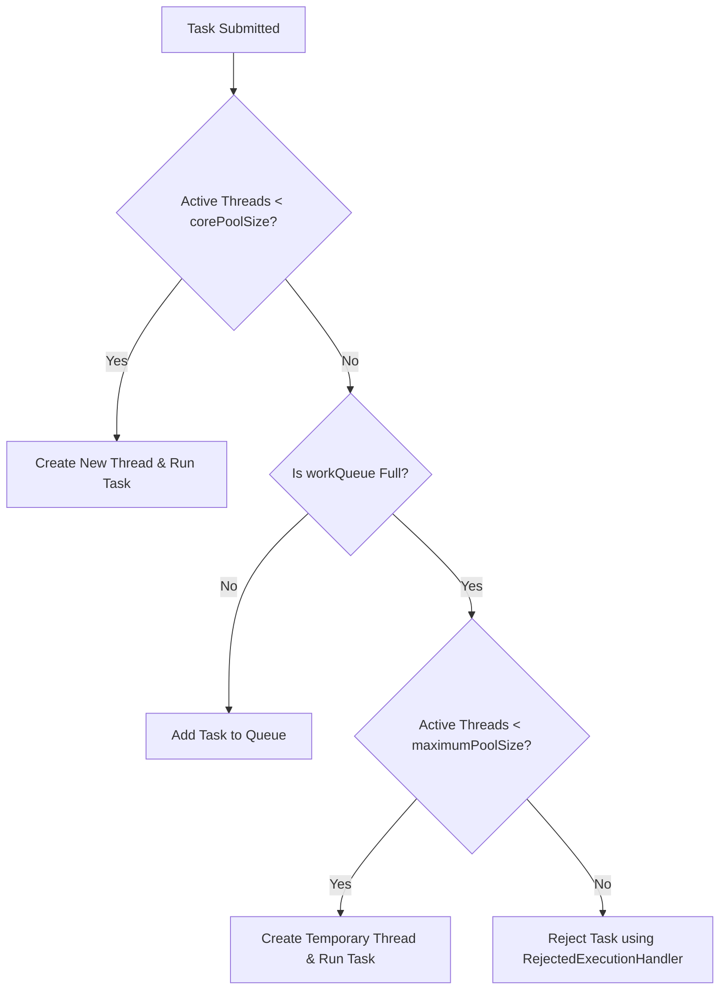
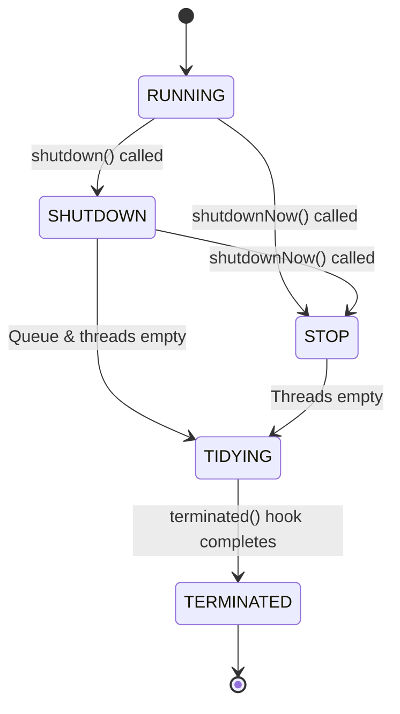

# Thread Pools & `ThreadPoolExecutor` in Java

Imagine you are running a busy pizza delivery restaurant. 

* **Without a Thread Pool (Raw Threads)**: Every time a customer orders a pizza, you hire a brand-new delivery driver. The driver receives the order, drives to the customer, delivers the pizza, and then you immediately fire them. If 500 customers order pizzas at the exact same time, you hire 500 drivers. Your kitchen becomes extremely crowded, you run out of money paying for hiring/firing administration, and the entire restaurant crashes due to chaos.
* **With a Thread Pool (`ThreadPoolExecutor`)**: You hire a fixed team of 5 delivery drivers (your **core pool**). When orders come in, you put them in a physical order-box (the **work queue**). The drivers pull orders from the box one by one, deliver them, and return to the restaurant to grab the next order. If the order-box fills up completely because it's a Friday night, you hire up to 10 temporary drivers (your **maximum pool**). If even they can't keep up, you start refusing new orders (the **rejection policy**).

This guide covers everything you need to know about Java's thread pools, from basic concepts to advanced interview questions.

---

## 1. Why Use Thread Pools?

Creating and destroying threads in Java is expensive. Each thread requires memory (usually 1MB for its call stack) and requires operating system (OS) kernel calls to initialize.

### Key Benefits:
* **Resource Reuse**: Reuses existing threads instead of creating new ones, reducing thread creation/teardown overhead.
* **Faster Response Time**: When a task arrives, it is executed immediately by an already-active thread without waiting for a thread to spawn.
* **Resource Control (Throttling)**: Limits the number of concurrent threads to prevent the system from running out of memory (OOM) under heavy load.

---

## 2. Deep Dive: `ThreadPoolExecutor`

In Java, the core implementation of a thread pool is `java.util.concurrent.ThreadPoolExecutor`. Understanding its constructor parameters is a top interview requirement.

### The Constructor Parameters

```java
public ThreadPoolExecutor(
    int corePoolSize,
    int maximumPoolSize,
    long keepAliveTime,
    TimeUnit unit,
    BlockingQueue<Runnable> workQueue,
    ThreadFactory threadFactory,
    RejectedExecutionHandler handler
)
```

| Parameter | Meaning | Analogy |
| :--- | :--- | :--- |
| **`corePoolSize`** | The number of permanent worker threads to keep active, even if they are idle. | Your permanent, full-time delivery drivers. |
| **`maximumPoolSize`** | The absolute maximum number of threads allowed in the pool. | The maximum drivers (permanent + temporary) you can support. |
| **`keepAliveTime`** | How long temporary idle threads (above `corePoolSize`) will wait for new tasks before dying. | How long temporary drivers wait for orders before being sent home. |
| **`unit`** | The time unit for `keepAliveTime` (e.g., `TimeUnit.SECONDS`). | The unit of time (minutes, seconds). |
| **`workQueue`** | The queue used to hold tasks before they are executed. | The order-box where pending orders wait. |
| **`threadFactory`** | The factory used to create new threads (e.g., to set custom names or mark as daemon). | The HR agency that hires and names the drivers. |
| **`handler`** | The policy used when a task is rejected (e.g., when the queue is full and threads reach maximum). | The protocol for what to do when you can't accept any more orders. |

---

### How Tasks Flow Through the Executor (The Submission Logic)

> [!IMPORTANT]
> **This is the #1 Trick Question in Interviews!**
> Beginners often assume the pool grows to `maximumPoolSize` *before* tasks are put in the queue. **This is false.** The pool only grows beyond `corePoolSize` if the queue is already full!



#### Step-by-Step Breakdown:
1. **Core Check**: If the number of running threads is less than `corePoolSize`, a new thread is created to run the task immediately (even if other core threads are idle).
2. **Queue Check**: If running threads $\ge$ `corePoolSize`, the task is offered to the `workQueue`.
3. **Max Pool Check**: If the queue is full, and running threads < `maximumPoolSize`, a new temporary thread is spawned to run the task immediately.
4. **Rejection**: If the queue is full and running threads $\ge$ `maximumPoolSize`, the task is passed to the `RejectedExecutionHandler`.

---

### Choosing the Right Queue (`workQueue`)

The behavior of the pool depends heavily on the type of `BlockingQueue` you choose:

1. **`LinkedBlockingQueue`**
   * **Unbounded** (by default, size is `Integer.MAX_VALUE`).
   * **Tradeoff**: Since the queue never fills up, the pool will **never** spawn more than `corePoolSize` threads. `maximumPoolSize` is completely ignored!
   * **Risk**: If tasks arrive faster than they are processed, they will pile up in memory, leading to an `OutOfMemoryError` (OOM).

2. **`ArrayBlockingQueue`**
   * **Bounded** (you must specify a fixed size, e.g., 100).
   * **Tradeoff**: Forces the pool to spawn temporary threads and apply rejection policies when the queue is full. This prevents memory issues.

3. **`SynchronousQueue`**
   * **Zero Capacity** (it does not hold tasks; it immediately hands them off to a worker thread).
   * **Tradeoff**: If a worker thread is not immediately available to take the task, the executor is forced to spawn a new thread (up to `maximumPoolSize`). If maximum is reached, it rejects the task.
   * **Used by**: `Executors.newCachedThreadPool()`.

---

### Rejection Policies (`RejectedExecutionHandler`)

When the executor cannot accept a task, it triggers one of four standard policies:

* **`AbortPolicy`** (Default): Throws a `RejectedExecutionException`. Good for catching bugs early in development.
* **`CallerRunsPolicy`**: The thread that submitted the task (e.g., the web server's request thread) runs the task itself. 
  * *Why this is useful*: It slows down the incoming rate of tasks (creating natural backpressure) since the submitter is busy running the task and cannot submit more.
* **`DiscardPolicy`**: Silently drops the rejected task. Use with extreme caution.
* **`DiscardOldestPolicy`**: Discards the oldest unhandled task in the queue and retries submitting the new task.

---

## 3. The ThreadPool Lifecycle

A `ThreadPoolExecutor` has 5 internal lifecycle states managed by the JVM:



1. **`RUNNING`**: Accepting new tasks and processing queued tasks.
2. **`SHUTDOWN`**: **Not** accepting new tasks, but will finish already-queued tasks.
3. **`STOP`**: **Not** accepting new tasks, clears the queue, and interrupts active workers.
4. **`TIDYING`**: All tasks terminated, worker count is 0. Transitions to `TERMINATED` after calling the `terminated()` callback method.
5. **`TERMINATED`**: `terminated()` callback has completed.

### shutdown() vs shutdownNow()

| Feature | `shutdown()` | `shutdownNow()` |
| :--- | :--- | :--- |
| **New Tasks** | Rejected. | Rejected. |
| **Queued Tasks** | **Will be executed** until queue is empty. | **Discarded** (returned as a `List<Runnable>`). |
| **Active Tasks** | Allowed to run to completion. | **Interrupted** (thread gets interrupted flag). |
| **Speed** | Slow (waits for graceful completion). | Fast (forceful shutdown). |

---

## 4. Code Implementation

### The Bad Way: Standard Factory Methods
Java provides the `Executors` class to quickly create pools. **However, using these in high-load production is discouraged by top companies.**

```java
// DANGER: Uses an unbounded LinkedBlockingQueue. 
// If your server gets overloaded, tasks pile up and trigger OOM.
ExecutorService fixedPool = Executors.newFixedThreadPool(10);

// DANGER: Uses SynchronousQueue but has maximumPoolSize = Integer.MAX_VALUE.
// If tasks arrive quickly, it will spawn thousands of threads, crash the OS, or hit OOM.
ExecutorService cachedPool = Executors.newCachedThreadPool();
```

### The Good Way: Custom Bounded `ThreadPoolExecutor`
Here is a complete, production-ready thread pool implementation:

```java
import java.util.concurrent.*;
import java.util.concurrent.atomic.AtomicInteger;

public class CustomThreadPoolDemo {

    public static void main(String[] args) {
        
        // 1. Define custom naming and daemon status using a ThreadFactory
        ThreadFactory customThreadFactory = new ThreadFactory() {
            private final AtomicInteger threadNumber = new AtomicInteger(1);
            
            @Override
            public Thread newThread(Runnable r) {
                Thread t = new Thread(r, "my-pool-worker-" + threadNumber.getAndIncrement());
                t.setDaemon(false); // Make sure it's a user thread, not daemon
                t.setPriority(Thread.NORM_PRIORITY);
                return t;
            }
        };

        // 2. Build the ThreadPoolExecutor manually
        ThreadPoolExecutor pool = new ThreadPoolExecutor(
            3,                                  // corePoolSize (3 permanent workers)
            6,                                  // maximumPoolSize (up to 3 temp workers)
            60L, TimeUnit.SECONDS,              // Keep-alive time for temp workers
            new ArrayBlockingQueue<>(5),        // Bounded queue (capacity 5)
            customThreadFactory,                // Custom thread factory
            new ThreadPoolExecutor.CallerRunsPolicy() // Backpressure rejection policy
        );

        // 3. Submit 12 tasks to see how core, queue, max, and rejection react
        for (int i = 1; i <= 12; i++) {
            final int taskId = i;
            pool.submit(() -> {
                System.out.println(Thread.currentThread().getName() + " is executing Task " + taskId);
                try {
                    Thread.sleep(1000); // Simulate some work
                } catch (InterruptedException e) {
                    Thread.currentThread().interrupt();
                }
            });
        }

        // 4. Gracefully shutdown the pool
        pool.shutdown();
        try {
            if (!pool.awaitTermination(10, TimeUnit.SECONDS)) {
                pool.shutdownNow();
            }
        } catch (InterruptedException e) {
            pool.shutdownNow();
        }
    }
}
```

---

## 5. Solving Interview Questions (From Noob to Pro)

### Q1: How do you size a thread pool? (CPU-bound vs. I/O-bound)
* **CPU-Bound Tasks** (e.g., matrix multiplication, video encoding, parsing JSON):
  * These tasks keep the CPU active 100% of the time.
  * **Sizing**: `N_threads = N_cores + 1`. Spawning more threads than CPU cores just causes wasteful context switching. The `+1` serves as a backup thread in case of page faults.
* **I/O-Bound Tasks** (e.g., database queries, calling external microservices, reading files):
  * The thread is blocked waiting for network/disk response while the CPU is idle.
  * **Sizing Formula**: 
    $$N_{threads} = N_{cores} \times U_{cpu} \times \left(1 + \frac{W}{C}\right)$$
    Where:
    * $N_{cores}$ = Number of available CPU cores.
    * $U_{cpu}$ = Target CPU utilization (between $0.0$ and $1.0$).
    * $W/C$ = Ratio of Wait time to Compute time. (If a thread waits for 90ms and computes for 10ms, $W/C = 9/1 = 9$. For a 4-core machine at 100% CPU target, we get $4 \times 1 \times (1 + 9) = 40$ threads).

---

### Q2: What is the difference between `execute()` and `submit()`?
* **`execute(Runnable)`**:
  * Returns: `void`.
  * Exception Handling: If the task throws a runtime exception, the thread dies, and the exception is printed immediately to the console/uncaught exception handler.
* **`submit(Runnable)` or `submit(Callable<T>)`**:
  * Returns: A `Future<?>` object representing the pending result.
  * Exception Handling: If the task throws an exception, it is **swallowed** by the executor. It is only thrown (wrapped in an `ExecutionException`) when you call `future.get()` on the returned `Future`.

---

### Q3: What happens when a thread inside a ThreadPool throws an exception? Does the thread die?
Yes, the thread will die. 
* If you used `execute()`, the JVM terminates that specific thread.
* If the number of running threads falls below `corePoolSize` (or is insufficient for current demands), the `ThreadPoolExecutor` will spawn a new worker thread to replace it.
* *Best Practice*: Always catch exceptions inside your `Runnable`'s `run()` method using a `try-catch` block to prevent thread death and ensure correct logging/metrics.

---

### Q4: How does `ThreadPoolExecutor` reuse threads under the hood?
This is a common "in-depth" question. Threads are restarted under the hood? **No!** A Java thread cannot be started twice (doing so throws `IllegalThreadStateException`). 

Instead, the worker threads inside the pool run an internal loop (`runWorker()`) that looks like this:

```java
// Conceptual code of how worker threads run in a loop
public void run() {
    Runnable task;
    // Worker keeps blocking on the work queue to take tasks
    while ((task = getTask()) != null) { 
        try {
            task.run(); // Runs the user's task on this same thread!
        } catch (Exception e) {
            // handle exception
        }
    }
}
```

* **`getTask()` logic**:
  * If the pool size is $\le$ `corePoolSize`, it calls `workQueue.take()`. This method **blocks indefinitely** if the queue is empty, keeping the thread alive and asleep.
  * If the pool size is > `corePoolSize`, it calls `workQueue.poll(keepAliveTime, unit)`. If no task arrives within the timeout, `getTask()` returns `null`, and the loop exits, destroying the temporary thread.
