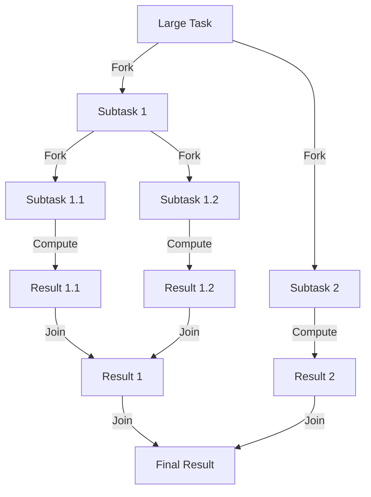

# Standard Executors & ForkJoinPool in Java

When managing concurrent execution, Java provides several built-in thread pool implementations through the `Executors` factory class. Additionally, for parallel divide-and-conquer workloads, Java offers the specialized `ForkJoinPool` backed by the **Work-Stealing** algorithm.

Let's understand them using simple analogies:

* **`FixedThreadPool` (The Fixed Assembly Line)**: A factory with exactly 5 worker slots. No matter how many tasks arrive, there are only 5 workers. Tasks queue up in a warehouse (work queue).
* **`CachedThreadPool` (The Gig-Economy Fleet)**: A delivery app that hires drivers on-demand. If all drivers are busy when a new order arrives, it instantly hires a new driver. If a driver sits idle for 60 seconds, they are terminated.
* **`SingleThreadExecutor` (The Single Artisan)**: A workshop with exactly one worker executing tasks sequentially, guaranteeing task order.
* **`ForkJoinPool` & Work-Stealing (The Group Project)**: A large team dividing a massive report. The report is split into chapters, then sections, then pages (Forking). Each writer has their own inbox of sections to write. If Writer A finishes their sections early, they don't sit idle—they go to the bottom of Writer B's inbox and "steal" some sections to help complete the project faster.

---

## 1. The Three Standard Executors

The `Executors` utility class provides factory methods to quickly instantiate thread pools. However, each comes with internal configurations that have severe trade-offs under high production loads.

### Internal Configurations & Comparison

| Executor | `corePoolSize` | `maximumPoolSize` | `workQueue` | Production Risk |
| :--- | :--- | :--- | :--- | :--- |
| **`newFixedThreadPool(n)`** | `n` | `n` | `LinkedBlockingQueue` (Unbounded) | **OutOfMemoryError (OOM)** if tasks pile up in the queue faster than they are processed. |
| **`newCachedThreadPool()`** | `0` | `Integer.MAX_VALUE` | `SynchronousQueue` (Zero capacity) | **OS Thread Exhaustion** (CPU/Memory spike) if tasks arrive fast and it spawns thousands of threads. |
| **`newSingleThreadExecutor()`** | `1` | `1` | `LinkedBlockingQueue` (Unbounded) | **OOM** (similar to Fixed Pool) if tasks build up in the queue. |

---

### Interview Question: `newSingleThreadExecutor()` vs. `newFixedThreadPool(1)`

While they behave similarly (running tasks one by one), they have a key architectural difference:

* **`newFixedThreadPool(1)`**: Returns a standard `ThreadPoolExecutor`. If needed, you can cast it back to a `ThreadPoolExecutor` and change its thread pool size dynamically:
  ```java
  ExecutorService pool = Executors.newFixedThreadPool(1);
  ((ThreadPoolExecutor) pool).setCorePoolSize(5); // Now it has 5 threads!
  ```
* **`newSingleThreadExecutor()`**: Wraps the pool in an internal, non-configurable wrapper class (`FinalizableDelegatedExecutorService`). It hides the configuration methods so it **can never be resized**. This guarantees that it remains a single-threaded executor for its entire lifetime.

---

## 2. ForkJoinPool & Work-Stealing (Under the Hood)

Introduced in Java 7, `ForkJoinPool` is a specialized implementation of `ExecutorService`. It is designed to handle CPU-bound, recursive, divide-and-conquer tasks efficiently.



### The Work-Stealing Algorithm
In a traditional `ThreadPoolExecutor`, all threads pull tasks from a single, shared global queue. This causes thread contention (threads locking each other out while trying to fetch tasks).

`ForkJoinPool` solves this with **Work-Stealing**:

1. **Private Deques**: Every worker thread in the pool has its own double-ended queue (Deque) to store its subtasks.
2. **LIFO for the Owner (Head)**: When a thread forks a new subtask, it pushes it to the **head (top)** of its *own* Deque. The thread always pulls its next task from the **head** (Last-In, First-Out). 
   * *Benefit*: This maximizes CPU cache locality because the most recently created subtask (which likely operates on the same memory block) is executed next.
3. **FIFO for the Thief (Tail)**: If a worker thread finishes its tasks and its Deque becomes empty, it becomes a "thief". It looks at another thread's Deque and steals a task from the **tail (bottom)** of that queue (First-In, First-Out).
   * *Benefit*: Since the owner thread is working at the **head** and the thief steals from the **tail**, they access opposite ends of the queue. This minimizes locking and lock contention.

---

## 3. How to Divide Tasks (RecursiveAction vs. RecursiveTask)

To submit tasks to a `ForkJoinPool`, you subclass one of two classes:

* **`RecursiveAction`**: For recursive tasks that do **not** return a value (e.g., sorting an array in-place).
* **`RecursiveTask<V>`**: For recursive tasks that return a value of type `V` (e.g., calculating a sum, Fibonacci).

---

### The Golden Pattern: Avoid the Fork-Join Anti-Pattern!

When dividing a task into two subtasks, beginners often write:
```java
// ANTI-PATTERN: Wastes a thread!
subtask1.fork(); 
subtask2.fork(); // Creating two async tasks
V res2 = subtask2.join();
V res1 = subtask1.join();
```
* **Why this is bad**: The calling thread just blocks on `.join()`, doing nothing while waiting for other threads to finish `subtask2`.
* **The Correct Way (Fork-Compute-Join)**:
  ```java
  subtask1.fork();          // 1. Run subtask1 asynchronously in the queue
  V res2 = subtask2.compute(); // 2. Compute subtask2 directly on the current thread!
  V res1 = subtask1.join();    // 3. Block and wait for subtask1
  return res1 + res2;          // 4. Merge results
  ```
  By calling `.compute()` synchronously on the second subtask, the current thread continues executing the work itself instead of idling.

---

### Code Example: Parallel Summation using `RecursiveTask`

```java
import java.util.concurrent.ForkJoinPool;
import java.util.concurrent.RecursiveTask;

public class ForkJoinSumDemo {

    // Threshold: If the sub-array has <= 1000 items, compute it sequentially
    private static final int THRESHOLD = 1000;

    static class SumTask extends RecursiveTask<Long> {
        private final int[] array;
        private final int start;
        private final int end;

        public SumTask(int[] array, int start, int end) {
            this.array = array;
            this.start = start;
            this.end = end;
        }

        @Override
        protected Long compute() {
            int length = end - start;
            
            // Base Case: Sequential Computation
            if (length <= THRESHOLD) {
                long sum = 0;
                for (int i = start; i < end; i++) {
                    sum += array[i];
                }
                return sum;
            }

            // Recursive Case: Divide and Conquer
            int mid = start + (length / 2);
            SumTask leftTask = new SumTask(array, start, mid);
            SumTask rightTask = new SumTask(array, mid, end);

            // 1. Fork the left task (pushes it to the thread's deque for async work)
            leftTask.fork();

            // 2. Compute the right task synchronously on the current thread
            long rightResult = rightTask.compute();

            // 3. Join the left task (blocks until leftResult is ready)
            long leftResult = leftTask.join();

            // 4. Merge results
            return leftResult + rightResult;
        }
    }

    public static void main(String[] args) {
        // Create an array with 10,000 numbers (1 to 10,000)
        int[] array = new int[10_000];
        for (int i = 0; i < array.length; i++) {
            array[i] = i + 1;
        }

        // Initialize the ForkJoinPool (by default, concurrency = number of CPU cores)
        ForkJoinPool pool = new ForkJoinPool();

        // Submit the main task
        SumTask mainTask = new SumTask(array, 0, array.length);
        long totalSum = pool.invoke(mainTask);

        System.out.println("Total Sum of 1 to 10,000: " + totalSum);
        // Sum formula: (N * (N + 1)) / 2 -> (10000 * 10001) / 2 = 50,005,000
    }
}
```

---

## 4. Solving Interview Questions (From Noob to Pro)

### Q1: What is the risk of using `Executors.newCachedThreadPool()` in a production environment?
* **Answer**: `newCachedThreadPool()` uses a `SynchronousQueue` and allows the thread count to grow up to `Integer.MAX_VALUE`. Under a sudden spike in requests (e.g., a DDoS attack or flash sale), the pool will attempt to create thousands of threads concurrently. This can exhaust the OS memory limits, spike CPU context-switching overhead, and cause the JVM to crash with an OutOfMemoryError (`Unable to create new native thread`).

---

### Q2: What is the default work queue for `Executors.newFixedThreadPool(n)` and why can it be dangerous?
* **Answer**: It uses `LinkedBlockingQueue` without a capacity limit (effectively `Integer.MAX_VALUE`). If downstream dependencies (like a database) slow down, tasks will accumulate in the queue. Since the queue has no bounds, the JVM will continuously allocate memory for new tasks until it runs out of memory, causing an OOM.

---

### Q3: How does the Work-Stealing algorithm minimize thread contention?
* **Answer**: In work-stealing, worker threads pull from opposite ends of the Double-Ended Queues (Deques). 
  * The **owner thread** operates on the **head** (top) in a LIFO manner.
  * A **stealing thread (thief)** pulls from the **tail** (bottom) in a FIFO manner.
  Since they access opposite ends of the queue, lock contention is highly minimized, allowing threads to run concurrently without blocking each other.

---

### Q4: Why does a thief steal from the tail (FIFO) instead of the head (LIFO) in ForkJoinPool?
* **Answer**: Two reasons:
  1. **Contention Reduction**: Accessing the tail prevents the thief from colliding with the owner thread operating on the head.
  2. **Efficiency/Size of Task**: Since tasks are subdivided recursively, the tasks near the tail (older tasks) represent larger chunks of work (e.g., the original divided halves). Stealing a larger chunk means the thief can process it and split it further on its own queue, reducing the frequency of future thefts.

---

### Q5: What is the difference between `RecursiveTask` and `RecursiveAction`?
* **Answer**: Both represent subtasks in a `ForkJoinPool`.
  * `RecursiveTask<V>` returns a result of type `V` through its `compute()` method.
  * `RecursiveAction` returns no result (`void`) and is used for side-effect-only tasks (e.g., sorting an array in place, writing output to files).

---

### Q6: Why is calling `left.fork(); right.fork(); left.join(); right.join();` an anti-pattern?
* **Answer**: If you fork both tasks, you submit both to the pool. When the current thread calls `left.join()`, it blocks waiting for `left` to complete. This means the current thread is idling instead of actively executing `right`. 
* **The fix**: Fork the `left` task to let another thread process it, but call `.compute()` synchronously on the `right` task inside the current thread. This keeps all threads fully utilized.
