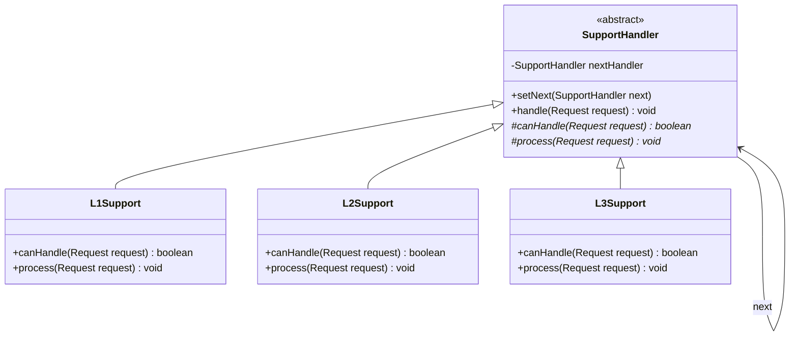
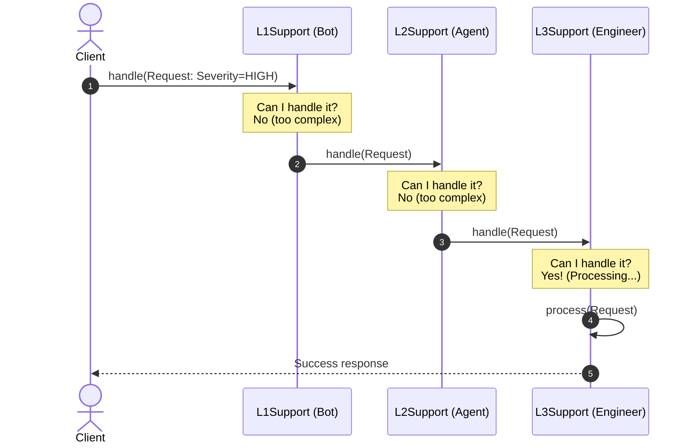

# Chain of Responsibility Design Pattern (LLD)

## Quick Summary (TL;DR)
* **Goal**: Avoid coupling the sender of a request to its receiver by giving more than one object a chance to handle the request. **Chain the receiving objects** and pass the request along the chain until an object handles it.
* **Key implementation**: Handlers implement a common interface/abstract class, and each handler holds a reference to the **next** handler in the chain.
* **Best overall**: Great for pipelines like request validation, API gateway middleware, logger hierarchies, or ATM cash dispensers.
* **Key Rule**: A handler in the chain can either process the request and stop the chain, or forward the request to the next handler in the chain.

---

## 1. What is the Chain of Responsibility Pattern?

Imagine you call your internet service provider because your Wi-Fi is down. 
1. First, you talk to an **Automated Bot (L1)**. If it is a simple query (e.g., "how to pay my bill?"), the bot handles it and the call ends.
2. If the bot cannot solve it (e.g., your router is broken), the bot escalates the call to a **Customer Support Agent (L2)**.
3. If the agent cannot solve it (e.g., area-wide fiber outage), the agent escalates the call to a **Network Engineer (L3)**.

You (the sender) didn't have to know exactly which engineer or bot was going to solve your issue. You just spoke to the "Support Entrypoint", and the system routed your request along a chain of handlers until it got resolved.

### When to use it:
* Multiple objects can handle a request, and the handler isn't known beforehand (determined dynamically at runtime).
* You want to issue a request to one of several objects without specifying the receiver explicitly.
* The set of objects that can handle the request should be configured dynamically (e.g., you can add, remove, or reorder handlers in the chain).

---

## 2. Structure (Mermaid Diagrams)

### Class Diagram
The abstract handler defines the contract for handling requests and holds a reference to the `next` handler.



### Sequence Diagram
Watch how a request moves from handler to handler until someone processes it.



---

## 3. How to Implement It (Support Escalation Example)

Here is a step-by-step breakdown of how to build a Support Ticket Escalation chain in Java.

### Step 1: The Request Object
The request contains a priority level (severity) and description.

```java
public class Request {
    public enum Priority { LOW, MEDIUM, HIGH, CRITICAL }

    private final Priority priority;
    private final String description;

    public Request(Priority priority, String description) {
        this.priority = priority;
        this.description = description;
    }

    public Priority getPriority() { return priority; }
    public String getDescription() { return description; }
}
```

### Step 2: The Abstract Handler Class
The abstract class manages the chain linkage (`next`) and implements the standard routing logic.

```java
public abstract class SupportHandler {
    private SupportHandler nextHandler;

    // Sets the next handler in the chain (returns it for builder-like chaining)
    public SupportHandler setNext(SupportHandler nextHandler) {
        this.nextHandler = nextHandler;
        return nextHandler;
    }

    // Template method for handling request
    public void handle(Request request) {
        if (canHandle(request)) {
            process(request);
        } else if (nextHandler != null) {
            System.out.println(getClass().getSimpleName() + " cannot handle. Escalating...");
            nextHandler.handle(request);
        } else {
            System.out.println("No handler found in the chain to process: " + request.getDescription());
        }
    }

    protected abstract boolean canHandle(Request request);
    protected abstract void process(Request request);
}
```

### Step 3: The Concrete Handlers
Each concrete handler decides if it can handle the request based on its priority level.

```java
// Handles LOW priority issues (Bots)
public class L1Support extends SupportHandler {
    @Override
    protected boolean canHandle(Request request) {
        return request.getPriority() == Request.Priority.LOW;
    }

    @Override
    protected void process(Request request) {
        System.out.println("L1Support (Bot) resolved issue: '" + request.getDescription() + "'");
    }
}

// Handles MEDIUM priority issues (Agents)
public class L2Support extends SupportHandler {
    @Override
    protected boolean canHandle(Request request) {
        return request.getPriority() == Request.Priority.MEDIUM;
    }

    @Override
    protected void process(Request request) {
        System.out.println("L2Support (Agent) resolved issue: '" + request.getDescription() + "'");
    }
}

// Handles HIGH priority issues (Engineers)
public class L3Support extends SupportHandler {
    @Override
    protected boolean canHandle(Request request) {
        return request.getPriority() == Request.Priority.HIGH;
    }

    @Override
    protected void process(Request request) {
        System.out.println("L3Support (Engineer) resolved issue: '" + request.getDescription() + "'");
    }
}
```

### Step 4: The Client Program (Linking the Chain)
The client links the handlers together: `L1 -> L2 -> L3`.

```java
public class ChainOfResponsibilityDemo {
    public static void main(String[] args) {
        // 1. Create concrete handlers
        SupportHandler l1 = new L1Support();
        SupportHandler l2 = new L2Support();
        SupportHandler l3 = new L3Support();

        // 2. Link them together (L1 -> L2 -> L3)
        l1.setNext(l2).setNext(l3);

        // 3. Send requests of varying priorities to the entry point (L1)
        System.out.println("--- Sending Request 1 ---");
        l1.handle(new Request(Request.Priority.LOW, "Reset password"));

        System.out.println("\n--- Sending Request 2 ---");
        l1.handle(new Request(Request.Priority.MEDIUM, "Cannot access account dashboard"));

        System.out.println("\n--- Sending Request 3 ---");
        l1.handle(new Request(Request.Priority.HIGH, "Database throwing connection pool timeout"));

        System.out.println("\n--- Sending Request 4 ---");
        l1.handle(new Request(Request.Priority.CRITICAL, "Security breach detected!"));
    }
}
```

---

## 4. Pros and Cons

### Pros
* **Reduced Coupling**: The sender of a request does not know which object is handling the request.
* **Single Responsibility Principle**: You can decouple classes that invoke operations from classes that perform operations.
* **Open/Closed Principle**: You can introduce new handlers into the chain without modifying existing code or client logic.
* **Dynamic Flexibility**: You can dynamically rearrange the chain, or change the priority/types of handlers at runtime.

### Cons
* **No Guarantee of Handling**: A request can fall off the end of the chain if no concrete handler is configured to handle it (must implement a default fallback handler).
* **Performance Overhead**: If the chain is very long, a request might traverse many handlers before finding one that can handle it (or finding none). This can add latency.
* **Debugging Complexity**: It can be harder to debug and step through execution since the flow is not explicitly hardcoded.

---

## 5. Key Design Questions (Interview Insights)

### Q1: What happens if no handler can process the request?
* **Problem**: In our basic example, a `CRITICAL` request prints "No handler found...". In a production system, this could lead to silent failures.
* **Fix**: Always configure a **default / fallback handler** at the very end of the chain. This handler can log an error, alert administrators, or raise a generic exception to avoid silent failures.

### Q2: What is the difference between Chain of Responsibility, Decorator, and Strategy?
* **Strategy**: You configure a client with exactly *one* strategy object at a time. The client executes that specific strategy.
* **Decorator**: Every decorator in the wrapper chain performs some action *and* passes the call to the next wrapped object. **All** decorators execute in order.
* **Chain of Responsibility**: A request is passed down the chain, but typically **only one handler** in the chain ultimately processes it. Once handled, execution stops (though some variations, like Servlet Filters, execute all handlers in the chain).

### Q3: Where is this pattern used in famous libraries?
1. **Java Servlet Filter (`FilterChain`)**: In web apps, requests go through filters (Authentication Filter -> Compression Filter -> Logging Filter).
2. **Spring Security**: Filter chains process incoming HTTP requests to check for CSRF tokens, session timeouts, and authorization.
3. **Logback / Log4j Logger Levels**: Logging a message triggers a chain check where the log level (DEBUG, INFO, WARN, ERROR) determines if it is logged by a console appender, file appender, or email appender.
