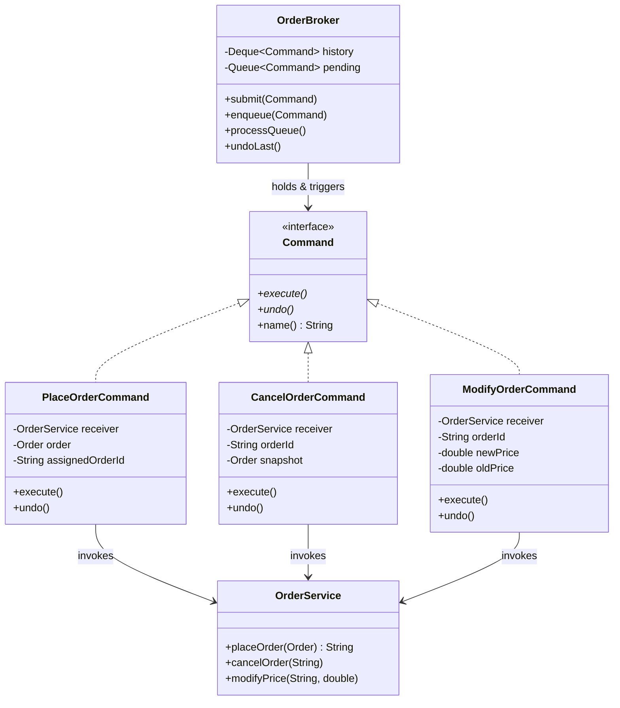

# Command Design Pattern (LLD)

## Quick Summary (TL;DR)
- **Goal**: Encapsulate a request as a standalone object. This lets you parameterize clients with different requests, queue or log requests, and support undoable operations.
- **Key Principle**: **Decouple the object that invokes an operation (Invoker) from the object that knows how to perform it (Receiver).** A request becomes a first-class object you can pass around, store, and replay.
- **Signs you need it**:
  - The invoker has a giant `if-else`/`switch` deciding *what* to do for each request type.
  - You need **undo/redo**, **audit logging**, **retry**, or a **queue/scheduler** of operations.
  - You want to treat "do X" as data — store it, serialize it, replay it later.
- **Core components**:
  1. **Command Interface**: Declares `execute()` (and usually `undo()`).
  2. **ConcreteCommand**: Binds a Receiver to an action; stores the parameters/state needed to run (and to undo).
  3. **Receiver**: The object that actually does the work (knows the business logic).
  4. **Invoker**: Triggers the command (`execute()`), but doesn't know what the command does. Often holds a history/queue.
  5. **Client**: Creates ConcreteCommands and wires them to Receivers, then hands them to the Invoker.

---

## 1. What is the Command Pattern?
The Command pattern is a **Behavioral Design Pattern** that turns a request into a self-contained object. That object carries everything needed to perform the action *later*: which receiver to call, which method, and the arguments.

Because the request is now an object, you can do things you simply can't do with a plain method call:
- **store** it in a list (history, queue, scheduler),
- **log/serialize** it (audit trail, write-ahead log),
- **undo** it (it remembers the state it changed),
- **retry** it (re-run a failed command),
- **pass it around** as a parameter (callbacks, task workers).

---

## 2. Why to Use It (The Pain Point)

Imagine a stock-broker **Order Management System (OMS)**. A trading terminal sends actions — place an order, cancel it, modify it. The naive approach puts all the logic in the invoker:

```java
// The "God invoker" anti-pattern
class TradingTerminal {
    void onUserAction(String action, Order order) {
        switch (action) {
            case "PLACE":
                // validate, check margin, push to exchange, persist...
                break;
            case "CANCEL":
                // look up order, send cancel to exchange, refund margin...
                break;
            case "MODIFY":
                // diff old vs new, re-validate margin, amend on exchange...
                break;
            // ... every new action = edit this switch
        }
    }
}
```

### Why this sucks:
* **Tight coupling**: `TradingTerminal` (the invoker) must know the internals of margin engines, the exchange gateway, and persistence. The thing triggering the action and the thing performing it are welded together.
* **A giant switch that never shrinks**: every new action type forces you to edit the invoker — a direct **Open/Closed Principle** violation.
* **No undo**: there's no object remembering *what changed*, so "undo last action" is impossible without bespoke, scattered code.
* **No queuing/auditing/retry**: you can't easily put "place this order" on a queue, write it to an audit log, or retry it if the exchange times out, because the request isn't a thing you can hold.

The Command pattern fixes this by making each action — `PlaceOrderCommand`, `CancelOrderCommand`, `ModifyOrderCommand` — its own object with a uniform `execute()`/`undo()` contract.

---

## 3. How It Works

We extract each request into a Command object that wires an **action** to a **Receiver** (here, an `OrderService`/exchange gateway). The **Invoker** (an `OrderBroker`) just calls `execute()` and keeps a history stack for undo and a queue for deferred/retryable execution.



### The Command Pattern Structure:
1. **Command Interface (`Command`)**: Declares `execute()`, `undo()`, and `name()`.
2. **Concrete Commands (`PlaceOrderCommand`, `CancelOrderCommand`, `ModifyOrderCommand`)**: Each holds a reference to the `OrderService` (Receiver) plus the parameters and the **state captured for undo** (e.g. the old price, the assigned order id, a snapshot).
3. **Receiver (`OrderService`)**: Knows the real business logic — placing/cancelling/amending orders on the exchange.
4. **Invoker (`OrderBroker`)**: Pushes executed commands onto a **history** stack (for undo) and supports a **pending queue** (for deferred/retried execution). It never inspects what a command does.
5. **Client (`main`)**: Builds the commands, wires them to the receiver, and feeds them to the invoker.

**The killer feature — undo**: undo works because each command captures the state it mutated *before* `execute()`. `CancelOrderCommand` keeps a snapshot of the cancelled order so it can re-place it; `ModifyOrderCommand` keeps the old price so it can restore it; `PlaceOrderCommand` remembers the id it created so it can cancel it.

**Real-world uses of this exact shape**:
- **Undo/redo**: text editors, drawing tools, OMS "reverse last action".
- **Transactional queuing**: put commands on a queue and drain them in order (task workers, job schedulers).
- **Request logging / write-ahead log**: persist each command before executing → crash recovery by replay.
- **Retry of failed commands**: a command that throws can be re-`execute()`d, or dead-lettered, because it's a self-contained, replayable object.

---

## 4. Code walkthrough

See [`CommandPatternDemo.java`](./CommandPatternDemo.java) for the full runnable demo. Compile and run:

```bash
# run from the repo root so the package path lld/behavioral/command resolves
javac -d out lld/behavioral/command/CommandPatternDemo.java
java -cp out lld.behavioral.command.CommandPatternDemo
```

What the demo demonstrates, mapped to the components above:

- **`Command`** — the interface with `execute()`, `undo()`, `name()`.
- **`OrderService`** (Receiver) — an in-memory book that places/cancels/modifies orders and prints what the exchange does.
- **`PlaceOrderCommand` / `CancelOrderCommand` / `ModifyOrderCommand`** (ConcreteCommands) — each captures the state needed to undo itself.
- **`OrderBroker`** (Invoker) — `submit()` runs a command now and records it in history; `enqueue()` + `processQueue()` show **transactional/deferred queuing**; `undoLast()` pops history and reverses the action.
- **`main()`** (Client) — wires everything and runs three flows:
  1. **Execute** a place + modify, then **undo** the modify (price restored) — undo in action.
  2. **Queue** several commands and drain them in order — the queuing/scheduler use case.
  3. **Retry**: a command whose first `execute()` fails is re-run and succeeds — the retry use case.

---

## 5. Interview Angles (How to handle SDE-2 discussions)

### Question 1: "Command vs Strategy — what's the difference? They both wrap behavior in an object."
- **Structurally** similar (both delegate to an injected object), but the **intent differs**:
  - **Strategy** answers *"how do I do this one thing?"* — it's interchangeable **algorithms** for a single, well-defined operation (e.g. *which* sorting/pricing algorithm). The context calls it immediately; there's usually no history.
  - **Command** answers *"what request should I perform, and when?"* — it packages a **whole request** (receiver + action + args + undo state) so it can be **stored, queued, logged, undone, and replayed later**. Time-decoupling and reversibility are the point.
- Rule of thumb: if you need **undo, queue, or audit**, it's Command. If you're swapping a pluggable computation, it's Strategy.

### Question 2: "How does undo work, and what state must a command capture?"
- A command must be **self-sufficient to reverse itself**. Before/at `execute()` it captures the **pre-state** of whatever it mutates:
  - `ModifyOrderCommand` stores the **old price** → undo restores it.
  - `CancelOrderCommand` stores a **snapshot** of the order → undo re-places it.
  - `PlaceOrderCommand` stores the **assigned order id** → undo cancels that order.
- The invoker keeps a **history stack** (LIFO). Undo = pop the last command and call `undo()`. Redo = a second stack you push popped commands onto.
- Gotcha to mention: undo must be **idempotent/symmetric** — if you re-`execute()` after undo, you should get the same id/state, or you need to re-capture state. Don't capture references to mutable objects you'll mutate later; **snapshot** them.

### Question 3: "How does Command enable queuing, retry, and audit-logging in a distributed system?"
- Because the request is an **object**, the invoker can:
  - **Queue** commands and drain them with a worker pool → natural fit for **task queues / job schedulers** (Kafka consumer, Sidekiq-style workers).
  - **Serialize** a command to a **write-ahead log** *before* executing → on crash, replay the log to recover (this is essentially how DB redo logs and event sourcing work).
  - **Retry** a failed command by re-calling `execute()`, or push it to a **dead-letter queue** after N attempts. Pair with idempotency keys so retries don't double-place orders on the exchange.
- This is the bridge from the GoF pattern to real backend infra: **Command == a serializable, replayable unit of work.**

### Question 4: "Isn't Command overkill for simple cases?"
- Yes — for a single straight-line call with no undo/queue/log requirement, a plain method call or a lambda (`Runnable`) is fine and Command just adds a class per action (**class explosion**).
- Reach for it when **at least one** of {undo/redo, queuing/scheduling, audit/replay, retry, macro-commands} is a real requirement. In an OMS that's almost always true, which is why brokers use it.
- Note: in Java, a `Command` with only `execute()` and no state *is* just a `Runnable`/lambda. The pattern earns its keep precisely when you add `undo()` + captured state + an invoker with history/queue.

---

## Summary Comparison

| Metric | "God Invoker" (switch) | Command Pattern |
| :--- | :--- | :--- |
| **Coupling** | Invoker knows every receiver's internals. | Invoker only knows `execute()`/`undo()`. |
| **Add a new action** | Edit the central switch (breaks OCP). | Add one new Command class (OCP-friendly). |
| **Undo / redo** | Bespoke, scattered, error-prone. | Built-in via history stack + captured state. |
| **Queue / log / retry** | Hard — the request isn't an object. | Trivial — the request *is* a storable object. |

---

## One-line recall cards
- **Command** = turn a request into an object so you can store, queue, log, undo, and replay it.
- **Invoker** triggers `execute()` but never knows what the command does.
- **Undo** works because the command snapshots the state it changed before executing.
- **Command vs Strategy**: Command packages a *whole request* for later (undo/queue/log); Strategy swaps an *algorithm* for now.
- A stateless Command with only `execute()` is just a `Runnable` — the pattern pays off when you add `undo()` + history.
