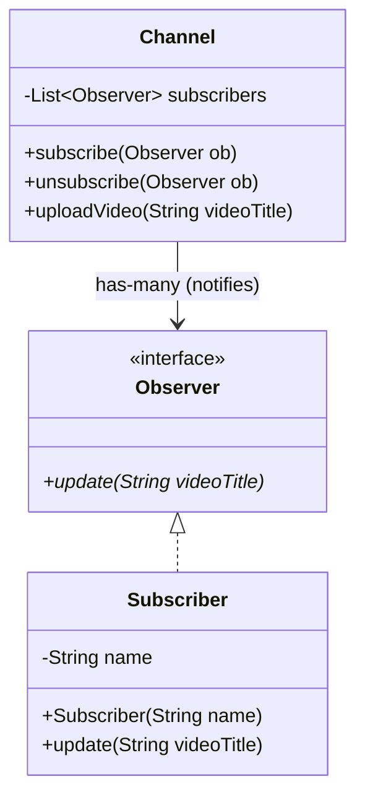

# Observer Design Pattern (LLD)

## Quick Summary (TL;DR)
- **Goal**: Define a one-to-many dependency between objects so that when one object changes state, all its dependents are notified automatically.
- **Key Principle**: **Loose Coupling** between the Subject (Publisher) and Observers (Subscribers).
- **Core Components**:
  1. **Subject**: Holds list of Observers, provides `subscribe()`, `unsubscribe()`, and `notifyObservers()`.
  2. **Observer Interface**: Defines the `update()` method contract.
  3. **Concrete Observers**: Real classes implementing `Observer` to act on notifications.

---

## 1. What is the Observer Pattern?
The Observer pattern is a **Behavioral Design Pattern** used to build event-driven subscription models. The Subject doesn't need to know the concrete classes of the Observers; it only interacts with them via the `Observer` interface.

---

## 2. Why to Use It (The Pull/Poll vs Push Problem)
Imagine a weather station checking for changes. Without the Observer pattern:
* Observers would have to periodically **poll** (query) the Weather Station to see if the temperature changed (waste of CPU resources, delay in updates).
* With the Observer pattern, the Weather Station **pushes** notifications directly to all subscribed displays only when a change occurs.

---

## 3. How It Works (Mermaid Class Diagram)

Here is how the YouTube Channel (Subject) and User Subscribers (Observers) relate to each other:



---

## 4. Code Example (Java)

Implemented in [ObserverPatternDemo.java](file:///Users/rohit.kumar.4/Documents/interview-prep/lld/behavioral/observer/ObserverPatternDemo.java).

### Interface & Subscriber (Observer)
```java
interface Observer {
    void update(String videoTitle);
}

class Subscriber implements Observer {
    private String name;
    public Subscriber(String name) { this.name = name; }
    
    public void update(String videoTitle) {
        System.out.println(name + " received: " + videoTitle);
    }
}
```

### Channel (Subject)
```java
class Channel {
    private List<Observer> subscribers = new ArrayList<>();
    
    public void subscribe(Observer sub) { subscribers.add(sub); }
    public void unsubscribe(Observer sub) { subscribers.remove(sub); }
    
    public void uploadVideo(String title) {
        for(Observer sub : subscribers) {
            sub.update(title); // Notify
        }
    }
}
```

---

## 5. Interview Angles (How to handle SDE-2 discussions)

### Question 1: "Is the Observer Pattern synchronous or asynchronous?"
- **Answer**: In its standard GoF implementation, it is **synchronous**. The Subject loops through the observer list and calls `update()` on the caller's thread sequentially. If one observer blocks or throws an exception, it slows down or breaks the notification process for the remaining observers.
- **SDE-2 level resolution**: Explain that in production environments, notifications are often offloaded asynchronously using executor threads (thread pools) or message queues (like RabbitMQ/Kafka).

### Question 2: "How do we prevent Memory Leaks in this pattern?"
- **Answer**: Known as the **Lapsed Listener Problem**. If a subscriber is registered but not unsubscribed when it is no longer needed, the Subject continues to hold a reference to it. This prevents the Garbage Collector from cleaning up the subscriber.
- **Fix**: Use **WeakReferences** to store observers in the Subject list so they can be garbage collected if no other hard references exist.
