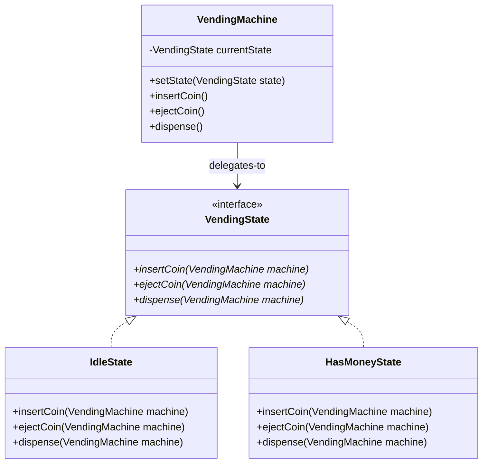
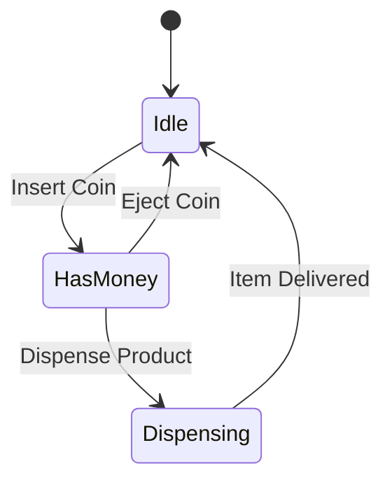

# State Design Pattern (LLD)

## Quick Summary (TL;DR)
- **Goal**: Allow an object to alter its behavior when its internal state changes. The object will appear to change its class.
- **Key Problem Solved**: Eliminates massive, nested `if-else` or `switch-case` blocks that check state variables inside a class (which violates the Open/Closed Principle).
- **Core Principle**: Encapsulate each state as a separate class implementing a common `State` interface, and delegate state-specific actions to the current state object.
- **Signs you need it**:
  - You see a class with state variables (e.g. `int state = IDLE;`) and methods filled with `if (state == HAS_MONEY) { ... } else if (state == DISPENSING) { ... }`.

---

## 1. What is the State Pattern?
The State pattern is a **Behavioral Design Pattern** that models a Finite State Machine (FSM). Instead of having one massive class manage all state rules, we create separate classes for each state. The context object holds a reference to a `State` object and delegates actions to it.

---

## 2. Why to Use It (The Switch-Case Nightmare)

### The Problem: Vending Machine States
Imagine a Vending Machine with 3 states: `Idle`, `HasMoney`, `Dispensing`, and actions like `insertMoney()`, `ejectMoney()`, `pressButton()`, `dispense()`.

If we use a simple state variable and conditionals:
```java
public class VendingMachine {
    private static final int IDLE = 0;
    private static final int HAS_MONEY = 1;
    private static final int DISPENSING = 2;
    private int currentState = IDLE;

    public void insertMoney() {
        if (currentState == IDLE) {
            currentState = HAS_MONEY;
            System.out.println("Money inserted.");
        } else if (currentState == HAS_MONEY) {
            System.out.println("Money already inserted!");
        } else if (currentState == DISPENSING) {
            System.out.println("Please wait, dispensing in progress.");
        }
    }
    // Repeat similar if-else structures for ejectMoney(), pressButton(), etc.
}
```
#### Why this sucks:
* **Violates Open/Closed Principle**: If you add a new state (e.g. `OutOfStock`), you must modify the `if-else` logic inside **every single method** of the class.
* **Complex and Fragile**: Easy to introduce bugs in state transitions as the number of states and actions increases.

---

## 3. How It Works (The State Solution)

We define a `VendingState` interface that declares all actions. Each state becomes a concrete class implementing these actions and managing the transitions.

### Class Diagram


### State Transitions (State Machine Diagram)


---

## 4. Code Example (Java)

Implemented in [StatePatternDemo.java](file:///Users/rohit.kumar.4/Documents/interview-prep/lld/behavioral/state/StatePatternDemo.java).

### The State Interface
```java
public interface VendingState {
    void insertCoin(VendingMachine machine);
    void ejectCoin(VendingMachine machine);
    void dispense(VendingMachine machine);
}
```

### Context Class (Delegates actions to state)
```java
public class VendingMachine {
    private VendingState currentState;

    public VendingMachine() {
        this.currentState = new IdleState(); // Initial State
    }

    public void setState(VendingState state) {
        this.currentState = state;
    }

    public void insertCoin() { currentState.insertCoin(this); }
    public void ejectCoin() { currentState.ejectCoin(this); }
    public void dispense() { currentState.dispense(this); }
}
```

---

## 5. Interview Angles (How to handle SDE-2 discussions)

### Question 1: "Who should handle state transitions: Context class or State classes?"
- **State Classes**: (Recommended in most LLD) State classes handle transitions by calling `machine.setState(new NextState())`. This is dynamic and encapsulates the transition logic inside the states, keeping the Context clean.
- **Context Class**: The Context defines the transitions. This is preferred when the state changes follow a strict, linear flow, or if states shouldn't know about each other (reducing coupling between state classes).

### Question 2: "What is the difference between State Pattern and Strategy Pattern?"
- **Structure**: Both use composition (Context has a reference to an interface) and delegation.
- **Intent**:
  - **Strategy**: The client chooses an algorithm *upfront* (e.g., sort using QuickSort vs. MergeSort). Strategies are independent and do not know about each other.
  - **State**: The context's behavior changes *automatically* depending on its internal state. The state objects typically know about other states to perform transitions dynamically.

### Question 3: "How does the State Pattern handle shared state or singleton states?"
- State objects don't always need to store instance variables. If they are stateless (e.g. `IdleState` is just logic), we can use a **Singleton Pattern** or flyweight pool to reuse the same state objects across multiple machine instances, saving memory.
