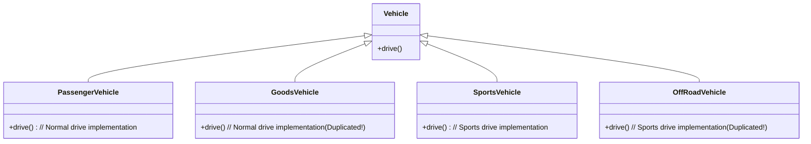
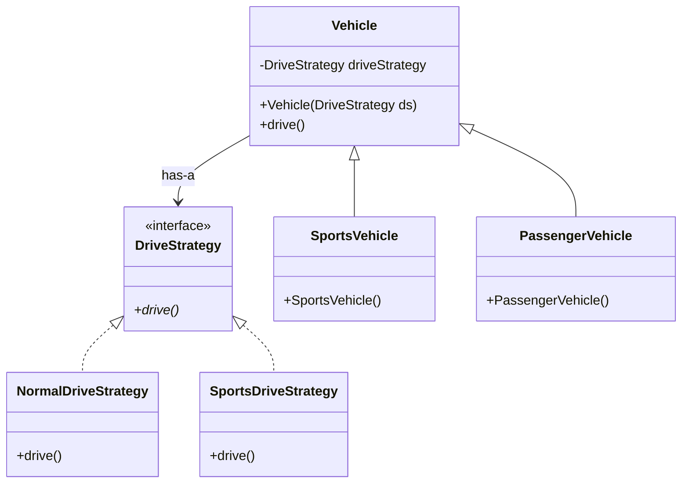

# Strategy Design Pattern (LLD)

## Quick Summary (TL;DR)
- **Goal**: Define a family of algorithms, encapsulate each one, and make them interchangeable. It lets the behavior vary independently from the clients that use it.
- **Key Principle**: **Composition over Inheritance** & **Program to an interface, not an implementation**.
- **Signs you need it**: 
  - Multiple subclasses share the exact same duplicate code for some behaviors, but not others.
  - You see a giant `if-else` or `switch` statement checking a type/mode to perform a specific algorithm.
- **Core components**: 
  1. **Strategy Interface**: Defines the contract for all supported algorithms.
  2. **Concrete Strategies**: Classes implementing the interface with specific algorithms.
  3. **Context Class**: Maintains a reference to a Strategy object and delegates the behavior.

---

## 1. What is the Strategy Pattern?
The Strategy pattern is a **Behavioral Design Pattern** that lets you select an algorithm's behavior at runtime. Instead of implementing a single algorithm directly in the class, the class receives the algorithm dynamically.

---

## 2. Why to Use It (The Pain Points of Inheritance)
To understand why we need the Strategy pattern, let's look at how standard class inheritance breaks down.

### The Problem: Vehicle Drive Capabilities
Imagine you are building a simulator with various types of vehicles:
1. `PassengerVehicle` (normal drive)
2. `SportsVehicle` (special sports drive)
3. `OffRoadVehicle` (special sports drive)
4. `GoodsVehicle` (normal drive)

If we use standard inheritance:


#### Why this sucks:
* **Code Duplication**: Both `SportsVehicle` and `OffRoadVehicle` need the exact same special "sports drive" logic. We have to duplicate that logic in both classes.
* **Maintenance Nightmare**: If we want to change how "sports drive" works, we have to update it in multiple places.
* **Violates DRY (Don't Repeat Yourself)**: As the number of vehicles and drive behaviors grow (e.g., hybrid drive, electric drive, flight drive), the duplication explodes.

---

## 3. How It Works (The Strategy Solution)
Instead of inheriting the behavior, we **compose** it. We extract the driving behavior into its own interface hierarchy.



### The Strategy Pattern Structure:
1. **Strategy Interface (`DriveStrategy`)**: Defines the `drive()` method.
2. **Concrete Strategies (`NormalDriveStrategy`, `SportsDriveStrategy`)**: Implement the specific drive behavior.
3. **Context (`Vehicle`)**: Contains a reference to `DriveStrategy`. When `drive()` is called on `Vehicle`, it delegates to the injected strategy: `driveStrategy.drive()`.
4. **Concrete Contexts (`SportsVehicle`, `PassengerVehicle`)**: Just pass the appropriate strategy to the parent `Vehicle` constructor.

---

## 4. Code Example (Java)

Here is how to implement this cleanly in Java.

### Step 1: Create the Strategy Interface
```java
public interface DriveStrategy {
    void drive();
}
```

### Step 2: Implement Concrete Strategies
```java
public class NormalDriveStrategy implements DriveStrategy {
    @Override
    public void drive() {
        System.out.println("Driving with normal capabilities (smooth and eco-friendly).");
    }
}

public class SportsDriveStrategy implements DriveStrategy {
    @Override
    public void drive() {
        System.out.println("Driving with high-performance sports capabilities (aggressive acceleration!).");
    }
}
```

### Step 3: Create the Context Class (Vehicle)
```java
public class Vehicle {
    // Composition: Vehicle "has-a" DriveStrategy
    private final DriveStrategy driveStrategy;

    // Dependency Injection via Constructor
    public Vehicle(DriveStrategy driveStrategy) {
        this.driveStrategy = driveStrategy;
    }

    public void drive() {
        // Delegation
        driveStrategy.drive();
    }
}
```

### Step 4: Create Concrete Vehicles
```java
public class SportsVehicle extends Vehicle {
    public SportsVehicle() {
        super(new SportsDriveStrategy()); // Injecting sports drive behavior
    }
}

public class OffRoadVehicle extends Vehicle {
    public OffRoadVehicle() {
        super(new SportsDriveStrategy()); // Injecting sports drive behavior (reused cleanly!)
    }
}

public class PassengerVehicle extends Vehicle {
    public PassengerVehicle() {
        super(new NormalDriveStrategy()); // Injecting normal drive behavior
    }
}
```

---

## 5. Interview Angles (How to handle SDE-2 discussions)

If an interviewer asks about class design or requests code, watch for these patterns:

### Question 1: "How does the Strategy Pattern relate to SOLID principles?"
- **Single Responsibility Principle (SRP)**: The context (`Vehicle`) is responsible only for vehicle-related properties. The algorithms for driving are separated into individual strategy classes.
- **Open/Closed Principle (OCP)**: You can add new drive strategies (e.g., `FlyingDriveStrategy`) without modifying `Vehicle` or any existing strategy classes.
- **Dependency Inversion Principle (DIP)**: `Vehicle` depends on the high-level abstraction `DriveStrategy`, not on concrete implementations like `NormalDriveStrategy`.

### Question 2: "When should we use Strategy Pattern vs State Pattern?"
- **Structure-wise**: They look identical. Both rely on composition and delegation to an interface.
- **Intent-wise**:
  - **Strategy Pattern**: The client typically configures the context with a strategy *once* (or changes it explicitly). The strategies are independent algorithms.
  - **State Pattern**: The context changes its state *internally* at runtime depending on its circumstances (e.g., a Vending Machine transitioning from `HasMoneyState` to `DispensingState`). The states usually know about each other to trigger transitions.

### Question 3: "Is there any drawback to Strategy Pattern?"
- **Class Explosion**: Creating many strategies can lead to a lot of small classes.
- **Client overhead**: The client code must understand the differences between strategies to choose the correct one (though this can be mitigated using a Factory Pattern to instantiate them).

---

## Summary Comparison

| Metric | Inheritance Approach | Strategy Pattern Approach |
| :--- | :--- | :--- |
| **Code Reuse** | Hard to reuse across unrelated branches (leads to copy-paste). | High. Any class can reuse a Strategy via composition. |
| **Extensibility** | Bad. Modifying a base class risk breaking subclasses. | Excellent. Simply write a new Strategy class. |
| **Runtime Behavior**| Fixed at compile-time. | Dynamic. Can change strategies at runtime via setters. |
