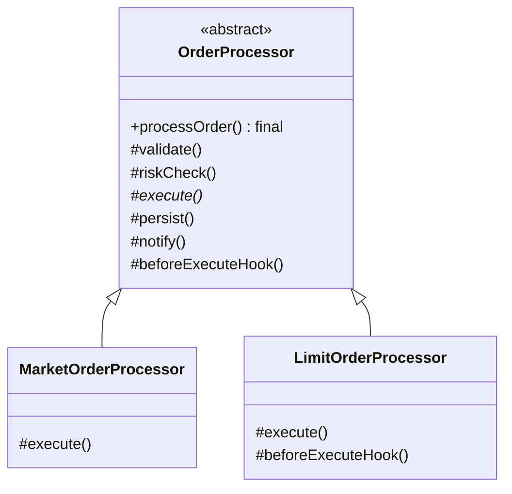

# Template Method Design Pattern (LLD)

## Quick Summary (TL;DR)
- **Goal**: Define the **skeleton of an algorithm in a base class**, but let subclasses override specific steps without changing the algorithm's overall structure or the order of steps.
- **Key Principle**: The **Hollywood Principle** — *"Don't call us, we'll call you."* The base class calls the subclass's steps, not the other way around. This is **Inversion of Control via inheritance**.
- **Signs you need it**:
  - Several classes run the **same sequence of steps in the same order**, but a few steps differ per class.
  - You find yourself copy-pasting the same orchestration/skeleton code into every subclass and only tweaking one or two methods.
- **Core components**:
  1. **AbstractClass**: Defines the `final` **template method** that fixes the order of steps. Declares **abstract primitive operations** subclasses must implement, plus optional **hook** methods with default (often empty) bodies.
  2. **ConcreteClasses**: Override only the steps that differ; inherit the fixed skeleton.

---

## 1. What is the Template Method Pattern?
The Template Method pattern is a **Behavioral Design Pattern** that defines the **skeleton of an algorithm** in a method of a base class and defers some steps to subclasses. The structure and ordering of steps are locked down once in the base class; subclasses redefine the variable steps without altering the algorithm's structure.

The "template" is a single method (usually `final`) that calls the steps in a fixed sequence. Some steps are concrete (shared by all), some are **abstract** (each subclass must supply them), and some are **hooks** (default behavior the subclass may optionally override).

---

## 2. Why to Use It (The Pain Point)
Imagine you process two kinds of stock orders in a broker backend: a **Market Order** and a **Limit Order**. Both follow the exact same pipeline:

```
validate -> riskCheck -> execute -> persist -> notify
```

The **order of steps is identical and non-negotiable** (you must risk-check before you execute, persist before you notify). Only a couple of steps actually differ — a market order executes immediately at the best available price, while a limit order parks on the book until the price is hit.

### The Problem: Duplicated skeletons
Without Template Method, each order class re-implements the whole pipeline:

```java
class MarketOrderProcessor {
    void process() {
        validate();      // same
        riskCheck();     // same
        executeMarket(); // DIFFERENT
        persist();       // same
        notifyUser();    // same
    }
}

class LimitOrderProcessor {
    void process() {
        validate();      // same (copy-pasted!)
        riskCheck();     // same (copy-pasted!)
        executeLimit();  // DIFFERENT
        persist();       // same (copy-pasted!)
        notifyUser();    // same (copy-pasted!)
    }
}
```

#### Why this sucks:
* **Skeleton duplication**: The `validate -> riskCheck -> ... -> notify` orchestration is copy-pasted into every order type.
* **Order can drift**: A junior dev adds a new order type and accidentally calls `persist()` *before* `riskCheck()`. Nothing stops them — the sequence isn't enforced anywhere.
* **Maintenance nightmare**: Add an `audit()` step to the pipeline and you must edit every processor by hand.

---

## 3. How It Works (The Template Method Solution)
Pull the fixed sequence into a single `final` template method in an abstract base class. Subclasses only fill in the steps that vary.



### The Template Method Pattern Structure:
1. **Template method (`processOrder()`)**: Declared `final` so subclasses cannot reorder or skip steps. It calls each step in the locked sequence.
2. **Concrete steps (`validate`, `riskCheck`, `persist`, `notify`)**: Shared by all order types, implemented once in the base class.
3. **Abstract step (`execute()`)**: Each concrete order type *must* implement this — it's the genuinely variable part of the algorithm.
4. **Hook (`beforeExecuteHook()`)**: A method with an empty/default body in the base class. Subclasses *may* override it to plug into the algorithm (e.g., a limit order logs that it is being parked on the book), but they aren't forced to.

### Hooks vs Abstract steps
- **Abstract step** = "you MUST fill this in" (no default; subclass forced to implement).
- **Hook** = "you MAY plug in here" (has a default, usually empty; optional override). Hooks are how the base class offers optional extension points without requiring every subclass to care.

### Real-world Template Method
- **`HttpServlet.service()`** calls `doGet()` / `doPost()` — `service()` fixes the dispatch skeleton; you override the verb handlers.
- **Spring `JdbcTemplate.execute()`** owns the open-connection → execute → close-connection → translate-exception skeleton; your callback supplies only the SQL/row-mapping step.
- **`java.util.AbstractList`** implements `iterator()`, `indexOf()`, etc. in terms of the abstract `get(int)` and `size()` you provide.
- **`java.io.InputStream.read(byte[])`** is implemented in terms of the abstract single-byte `read()`.

---

## 4. Code Walkthrough (Java)

### Step 1: Abstract class with the `final` template method
```java
public abstract class OrderProcessor {

    // The TEMPLATE METHOD — final so the skeleton/order can't be changed.
    public final void processOrder(Order order) {
        validate(order);
        riskCheck(order);
        beforeExecuteHook(order); // optional extension point
        execute(order);           // the step that actually varies
        persist(order);
        notifyUser(order);
    }

    // Concrete steps — shared by ALL order types.
    protected void validate(Order order) { /* common validation */ }
    protected void riskCheck(Order order) { /* common margin/risk check */ }
    protected void persist(Order order) { /* write to DB */ }
    protected void notifyUser(Order order) { /* push/email confirmation */ }

    // Abstract step — every concrete order type MUST implement this.
    protected abstract void execute(Order order);

    // Hook — default no-op; subclasses MAY override.
    protected void beforeExecuteHook(Order order) { /* default: do nothing */ }
}
```

### Step 2: Concrete classes override only what differs
```java
public class MarketOrderProcessor extends OrderProcessor {
    @Override
    protected void execute(Order order) {
        // fill immediately at best available price
    }
    // No hook override needed.
}

public class LimitOrderProcessor extends OrderProcessor {
    @Override
    protected void execute(Order order) {
        // park on the order book until limit price is reached
    }

    @Override
    protected void beforeExecuteHook(Order order) {
        // opt into the extension point: log that we're resting on the book
    }
}
```

The client just calls `processor.processOrder(order)`. The sequence — and any new step added later to `processOrder()` — is guaranteed for every order type.

---

## 5. Interview Angles (How to handle SDE-2 discussions)

### Question 1: "Template Method vs Strategy — what's the difference?"
This is the classic follow-up. They solve a similar problem (vary part of an algorithm) but differently:

| | **Template Method** | **Strategy** |
| :--- | :--- | :--- |
| **Mechanism** | **Inheritance** (subclass overrides steps) | **Composition** (context holds a strategy object) |
| **Binding time** | **Compile-time** — the variant is fixed by which subclass you instantiate | **Runtime** — you can swap the strategy via a setter |
| **What varies** | A **few steps** inside a fixed skeleton | The **whole algorithm** |
| **Who owns the skeleton** | The base class owns and enforces the step order | There is no fixed skeleton; the context just delegates |
| **Reuse** | Base class reuses common steps for free | A strategy can be reused by any unrelated context |

One-liner: **Template Method fixes the skeleton and lets subclasses fill in steps via inheritance; Strategy swaps the entire algorithm at runtime via composition.**

### Question 2: "What is a hook method?"
A **hook** is a method in the abstract class with a **default (usually empty) implementation**. The template method calls it at a defined point, but subclasses are *not required* to override it. It gives subclasses an **optional** place to extend or react to the algorithm (e.g., `beforeExecuteHook` to log a limit order resting on the book). Contrast with an **abstract step**, which has no default and *must* be implemented.

### Question 3: "Why is the template method usually `final`?"
To **protect the algorithm's structure**. If subclasses could override `processOrder()`, they could reorder steps, skip the risk check, or drop the audit step — defeating the whole point of centralizing the skeleton. Making it `final` enforces the contract: *"you may change the steps, never the sequence."*

### Question 4: "Any downsides?"
- **Inheritance coupling**: Subclasses are tightly bound to the base class's structure. A change to the protected step signatures ripples into every subclass. Strategy (composition) is looser.
- **LSP risk**: A subclass overriding a step in a way that breaks the base class's assumptions (e.g., `execute()` that quietly swallows an order) can violate the **Liskov Substitution Principle** — callers expecting `processOrder()` to behave consistently get surprised.
- **Limited flexibility**: The variant is chosen at compile time (which subclass). You can't swap behavior on a live object the way Strategy lets you.
- **Single inheritance ceiling (Java)**: A class can extend only one template base, so you can't easily mix two templates.

---

## Recall Cards
- **Template Method** = *"base class owns the skeleton (a `final` method), subclasses fill in the steps."*
- **Hollywood Principle** = *"Don't call us, we'll call you"* — the base calls the subclass's steps (inversion of control via inheritance).
- **Abstract step** = MUST override; **Hook** = MAY override.
- **Template Method (inheritance, compile-time, fixes skeleton)** vs **Strategy (composition, runtime, swaps whole algorithm)**.
- Real-world: `HttpServlet.service()`→`doGet/doPost`, Spring `JdbcTemplate`, `AbstractList`, `InputStream`.
