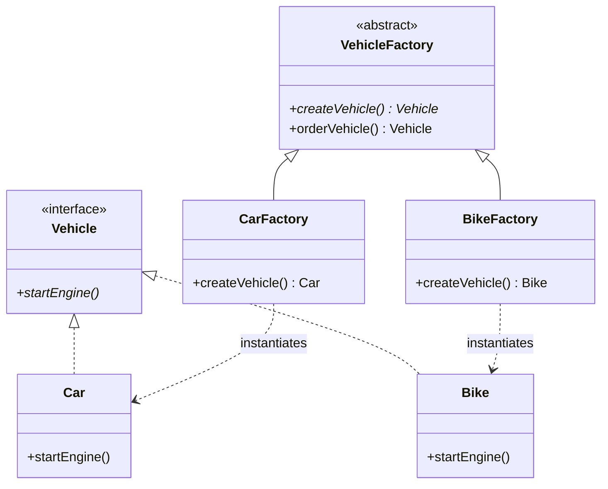
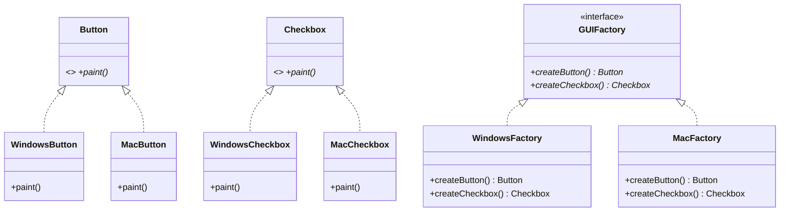

# Factory Design Pattern (LLD)

## Quick Summary (TL;DR)
- **Goal**: Delegate object creation logic to separate classes to decouple the client code from concrete implementations.
- **The Three Flavors**:
  1. **Simple Factory (Idiom)**: A helper class containing a `switch/if` statement to create objects. (Violates Open/Closed Principle).
  2. **Factory Method (GoF)**: Defines an abstract method in a parent class/interface, letting subclasses decide which concrete object to instantiate. (Adheres to Open/Closed Principle).
  3. **Abstract Factory (GoF)**: A factory of factories. Provides an interface to create families of related/dependent objects (e.g., Windows UI components vs Mac UI components).

---

## 1. What is the Factory Pattern?
The Factory pattern is a **Creational Design Pattern** that abstracts the instantiation logic of objects. 
Instead of the client doing `new ConcreteClass()`, the client calls a factory to get the object, depending only on interfaces.

---

## 2. Why to Use It (The Three Flavors Explained)

Let's look at the evolution of the Factory pattern to understand why the GoF patterns exist beyond the Simple Factory.

### Flavor 1: Simple Factory
This is a standard helper class that contains creation logic.

```java
// Client code
Vehicle vehicle = SimpleVehicleFactory.createVehicle("car");
```

#### The Problem:
If we need to support a new vehicle type (e.g., `Truck`), we must modify `SimpleVehicleFactory` to add a new `case "truck":`. This **violates the Open/Closed Principle** (closed for modification, open for extension).

---

### Flavor 2: Factory Method (GoF)
Instead of a single factory class with conditional statements, we define an interface/abstract creator and let subclasses handle instantiation.



#### Why it's better:
If we add a new vehicle `Truck`, we write two new classes: `Truck` and `TruckFactory`. **Existing code remains untouched!**

---

### Flavor 3: Abstract Factory (GoF)
This provides an interface for creating **families of related or dependent objects**.

Imagine you are building a UI library that supports both Windows and Mac styling. You have two families of products:
* **Windows Family**: `WindowsButton`, `WindowsCheckbox`
* **Mac Family**: `MacButton`, `MacCheckbox`

An Abstract Factory ensures the client doesn't mix Windows buttons with Mac checkboxes.



---

## 3. Code Example (Java)

Let's implement the **Factory Method** and **Abstract Factory** in a single runnable Java file.

### Factory Method Code Snippet:
```java
// Product
public interface Vehicle {
    void drive();
}

// Concrete Products
public class Car implements Vehicle {
    public void drive() { System.out.println("Driving a Car!"); }
}
public class Bike implements Vehicle {
    public void drive() { System.out.println("Riding a Bike!"); }
}

// Creator
public abstract class VehicleFactory {
    public abstract Vehicle createVehicle(); // Factory Method

    // Core business logic using the product
    public void testDrive() {
        Vehicle v = createVehicle();
        v.drive();
    }
}

// Concrete Creators
public class CarFactory extends VehicleFactory {
    public Vehicle createVehicle() { return new Car(); }
}
public class BikeFactory extends VehicleFactory {
    public Vehicle createVehicle() { return new Bike(); }
}
```

---

## 4. Interview Angles (How to handle SDE-2 discussions)

### Question 1: "Why shouldn't I just use `new`?"
- **Tightly Coupled**: If the constructor of `Car` changes (e.g., requires a new parameter), you have to change it in every client class that does `new Car()`. With a Factory, you only change it inside the Factory class.
- **Testability**: It is difficult to mock dependencies when classes instantiate their own sub-objects. Factories allow injecting mocks.

### Question 2: "When should we choose Factory Method vs Abstract Factory?"
- **Factory Method**: Focuses on creating a single product. The factory is defined by a single method (e.g., `createVehicle()`).
- **Abstract Factory**: Focuses on creating families of related products (e.g., a theme factory creating buttons, menus, and scrollbars that all belong to the "Dark Theme" or "Light Theme").

### Question 3: "How does Factory Pattern relate to Dependency Inversion?"
- DIP states that high-level modules should not depend on low-level modules; both should depend on abstractions.
- The client code depends only on the `Vehicle` interface and the abstract `VehicleFactory` class. It has no idea about the existence of the concrete classes `Car`, `Bike`, `CarFactory`, or `BikeFactory`.

---

## Summary Comparison

| Factory Type | Level of Abstraction | Adheres to Open/Closed Principle? | Best Used For |
| :--- | :--- | :--- | :--- |
| **Simple Factory** | Low (single concrete class) | No | Simple applications where product types change rarely. |
| **Factory Method** | Medium (inheritance-based) | Yes | Creating single products that can be extended easily. |
| **Abstract Factory** | High (composition of factories) | Yes | Creating sets/families of related, dependent objects. |
