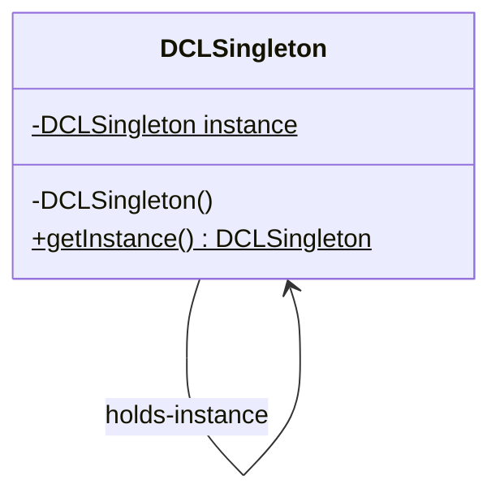
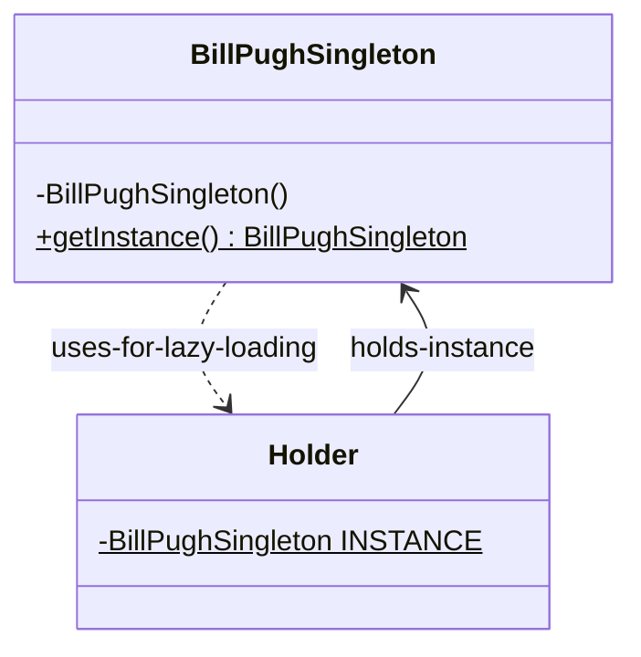
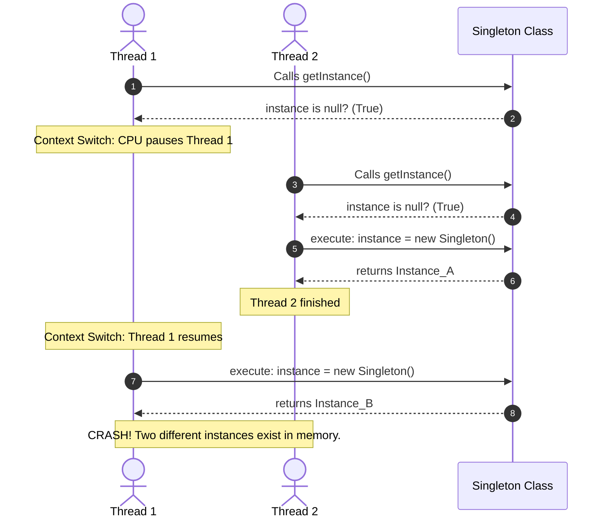

# Singleton Design Pattern (LLD)

## Quick Summary (TL;DR)
- **Goal**: Ensure a class has only **one instance** in memory and provides a **global point of access** to it.
- **Key implementation**: Private constructor + Static instance field + Public static getter method.
- **Best overall**: **Bill Pugh (Static Inner Class)** for standard lazy loading; **Enum** for absolute safety against reflection and serialization.
- **DCL**: Double-checked locking needs `volatile` to prevent instruction reordering where a thread accesses a half-initialized object.

---

## 1. What is the Singleton Pattern?

Imagine you are running a large office building. You have many employees, but there is only **one main entrance gate** with a badge scanner. You don't want every employee to create their own entrance gate because it would cause security issues and waste resources. Everyone must share the single, same entrance gate.

In software, a **Singleton** is a class that guarantees only **one object instance** exists in memory. Any code that needs it must call a global getter method to get the same shared instance.

### When to use it:
* Shared resources: database connection pool, configuration manager, logging service, caching system.
* Objects where creating multiple copies is heavy or causes conflicts.

---

## 2. Structure (Mermaid Class Diagrams)

### Standard Singleton Class Diagram
The Singleton class holds a static, private reference to its own type and exposes a global public static getter method.



### Bill Pugh Lazy Loading Class Diagram
Uses a nested static helper class loaded by the JVM ClassLoader lazily.



---

## 3. How Lazy Singleton Breaks in Multithreading

If two threads execute the lazy check simultaneously, both can see `instance == null` and instantiate two separate objects. Here is a sequence diagram of the failure:



---

## 4. The 7 Different Implementations (From Beginner to Expert)

Here is every single way to write a Singleton, explaining how they work and their drawbacks.

### 1. Eager Initialization
The instance is created at the time of class loading, before anyone even calls `getInstance()`.

```java
public class EagerSingleton {
    // Created as soon as the class is loaded in memory
    private static final EagerSingleton instance = new EagerSingleton();

    private EagerSingleton() {} // Private constructor

    public static EagerSingleton getInstance() {
        return instance;
    }
}
```
* **Pros**: Simple, thread-safe (class loading is handled by the JVM sequentially).
* **Cons**: Waste of resources if the object is heavy and never used.

---

### 2. Simple Lazy Initialization (Not Thread-Safe)
The instance is created only when requested for the first time.

```java
public class LazySingleton {
    private static LazySingleton instance;

    private LazySingleton() {}

    public static LazySingleton getInstance() {
        if (instance == null) {
            instance = new LazySingleton(); // Lazy creation
        }
        return instance;
    }
}
```
* **Pros**: Saves memory (lazy creation).
* **Cons**: **NOT thread-safe** (as shown in the sequence diagram above).

---

### 3. Synchronized Method (Thread-Safe, Slow)
We make the getter method `synchronized` to ensure only one thread can execute it at a time.

```java
public class SynchronizedSingleton {
    private static SynchronizedSingleton instance;

    private SynchronizedSingleton() {}

    // synchronized locks the entire method
    public static synchronized SynchronizedSingleton getInstance() {
        if (instance == null) {
            instance = new SynchronizedSingleton();
        }
        return instance;
    }
}
```
* **Pros**: Thread-safe.
* **Cons**: Heavy performance penalty. Every thread has to wait for a lock just to read the instance, even after it is already initialized.

---

### 4. Double-Checked Locking (DCL) with `volatile` (High Performance)
To avoid locking on every call, we lock only the block where creation happens, using a double check.

```java
public class DCLSingleton {
    // volatile is CRITICAL here!
    private static volatile DCLSingleton instance;

    private DCLSingleton() {}

    public static DCLSingleton getInstance() {
        if (instance == null) { // 1st Check (No lock: fast!)
            synchronized (DCLSingleton.class) { // Lock only if instance is null
                if (instance == null) { // 2nd Check (Inside lock: safe!)
                    instance = new DCLSingleton();
                }
            }
        }
        return instance;
    }
}
```
#### Why `volatile` is mandatory:
Creating an object (`new DCLSingleton()`) is not atomic. The CPU does it in 3 steps:
1. **Allocate Memory**
2. **Initialize Object** (call constructor)
3. **Reference Assignment** (point `instance` variable to the memory address)

The compiler/CPU can reorder these steps to `1 -> 3 -> 2`. If Thread 1 finishes step 3 (assignment) but hasn't run step 2 (constructor), Thread 2 will see `instance != null` in the 1st check, grab the half-initialized object, and crash when calling its methods. `volatile` prevents instruction reordering.

---

### 5. Explicit Lock-Based Singleton (ReentrantLock)
Instead of using Java's implicit `synchronized` keyword, we can use Java's `ReentrantLock` from `java.util.concurrent.locks`.

```java
import java.util.concurrent.locks.Lock;
import java.util.concurrent.locks.ReentrantLock;

public class LockSingleton {
    private static volatile LockSingleton instance;
    private static final Lock lock = new ReentrantLock(); // Explicit Lock object

    private LockSingleton() {}

    public static LockSingleton getInstance() {
        if (instance == null) {
            lock.lock(); // Explicitly acquire the lock
            try {
                if (instance == null) {
                    instance = new LockSingleton();
                }
            } finally {
                lock.unlock(); // Always release lock in finally block!
                // If we don't unlock, other threads will block forever.
            }
        }
        return instance;
    }
}
```
* **Why use this?**: `ReentrantLock` offers advanced features compared to `synchronized`, such as setting a timeout to acquire a lock (`tryLock()`) or interrupting threads waiting for a lock.

---

### 6. Bill Pugh Singleton (Static Inner Class)
This uses Java's class loading rules to guarantee thread-safety and lazy loading without any synchronization overhead.

```java
public class BillPughSingleton {
    private BillPughSingleton() {}

    // Static nested class is NOT loaded when BillPughSingleton is loaded.
    // It is loaded ONLY when someone calls getInstance().
    private static class Holder {
        private static final BillPughSingleton INSTANCE = new BillPughSingleton();
    }

    public static BillPughSingleton getInstance() {
        return Holder.INSTANCE;
    }
}
```
* **Pros**: Highly recommended. Lazy initialization, thread-safe, and high performance (handled directly by JVM ClassLoader).

---

### 7. Enum Singleton (The Ultimate Defense)
Java guarantees that enum instances are created only once and cannot be broken by reflection or serialization.

```java
public enum EnumSingleton {
    INSTANCE;
    
    public void performAction() {
        System.out.println("Enum Singleton operation!");
    }
}
```
* **Pros**: Inherently thread-safe, 100% immune to reflection and serialization attacks.
* **Cons**: Eagerly loaded. Cannot extend other classes.

---

## 5. How to Break a Singleton (and how to fix it)

Interviewers love to ask: **"Can you break a Singleton?"** Yes, in 3 ways:

### 1. Reflection
Reflection lets you access `private` constructors.
```java
Constructor<DCLSingleton> constructor = DCLSingleton.class.getDeclaredConstructor();
constructor.setAccessible(true); // Bypass private modifier!
DCLSingleton brokenInstance = constructor.newInstance(); 
```
* **Fix**: Throw an exception in the constructor if an instance already exists.
```java
private DCLSingleton() {
    if (instance != null) {
        throw new RuntimeException("Instance already exists. Use getInstance().");
    }
}
```

### 2. Serialization/Deserialization
Converting an object to bytes and restoring it creates a brand new instance.
* **Fix**: Implement the `readResolve()` method. The JVM will call this during deserialization, and we return the existing instance.
```java
protected Object readResolve() {
    return getInstance(); // Returns the original singleton instance
}
```

### 3. Cloning
If a singleton class extends a class that implements `Cloneable`, calling `clone()` creates a copy.
* **Fix**: Override `clone()` and throw an exception.
```java
@Override
protected Object clone() throws CloneNotSupportedException {
    throw new CloneNotSupportedException("Singleton cloning is not allowed.");
}
```

---

## 6. Comparison Cheat Sheet

| Implementation | Lazy Loading? | Thread-Safe? | Performance | Immune to Reflection? | Immune to Serialization? |
| :--- | :--- | :--- | :--- | :--- | :--- |
| **Eager** | No | Yes | High | No | No |
| **Simple Lazy** | Yes | No | High | No | No |
| **Synchronized** | Yes | Yes | Low (Locks every call) | No | No |
| **DCL (Volatile)** | Yes | Yes | High (Locks only 1st call)| No | No |
| **Lock (Reentrant)**| Yes | Yes | High (Locks only 1st call)| No | No |
| **Bill Pugh** | **Yes** | **Yes** | **High** | No | No |
| **Enum** | **No** | **Yes** | **High** | **Yes** | **Yes** |
