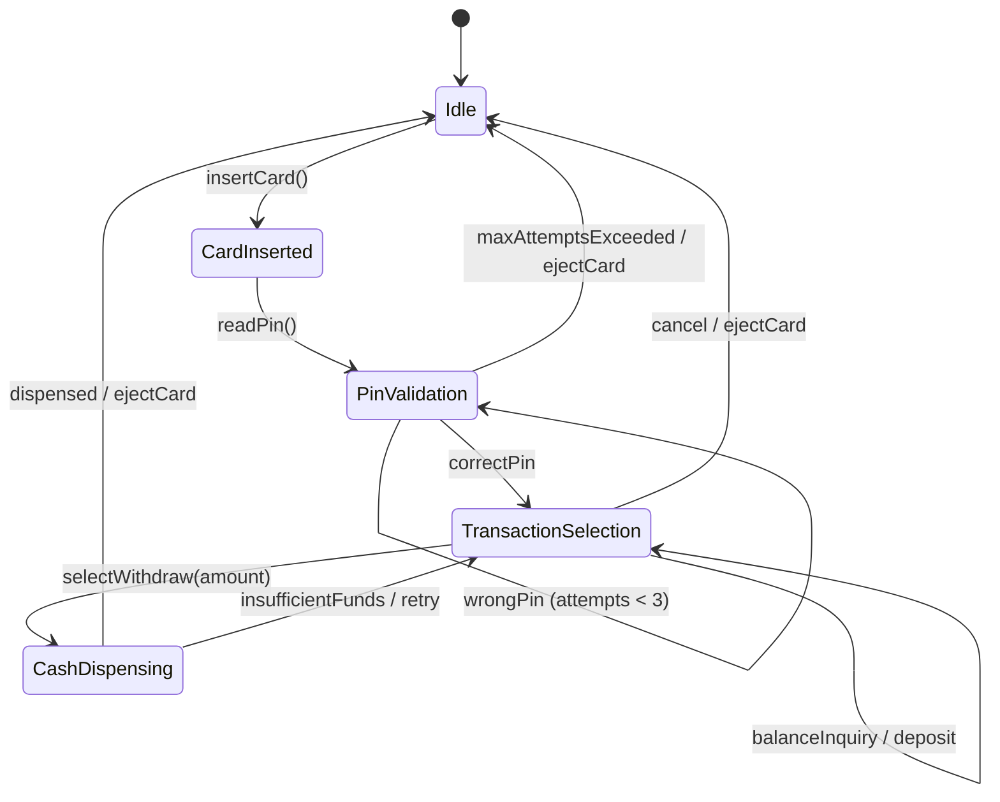
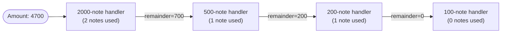
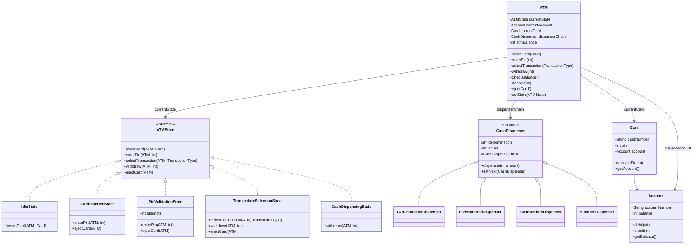

# Machine Coding: Design an ATM Machine (LLD)

## Quick Summary (TL;DR)

| Aspect | Detail |
|--------|--------|
| **Goal** | Design an ATM system that handles card insertion, PIN validation, transaction selection, and cash dispensing with proper state management |
| **Design Patterns** | **State Pattern** (ATM lifecycle states), **Chain of Responsibility** (denomination-based cash dispensing) |
| **Core Principle** | Each ATM state encapsulates its own behavior and legal transitions; the cash dispenser chain handles denomination breakdown without the ATM knowing how |

---

## Noob Jargon Buster

| Term | Plain English |
|------|---------------|
| **State Machine** | The ATM is always in exactly one state (Idle, CardInserted, PinValidation, etc.). Each state decides what actions are valid and what state comes next. Think of it like a flowchart where you can only be at one box at a time. |
| **Cash Dispenser Chain** | A linked list of handlers, each responsible for one denomination (2000 -> 500 -> 200 -> 100). Each handler dispenses as many notes of its denomination as possible, then passes the remaining amount to the next handler. |
| **Denomination** | The face value of a bank note (e.g., 2000, 500, 200, 100). The ATM holds a finite number of notes of each denomination. |
| **Session** | The lifecycle from card insertion to card ejection. Each session is stateful and isolated. |

---

## 1. Problem Statement & Requirements

### Functional Requirements

1. **Card Handling** -- Accept a card, validate it, and eject it after transaction or cancellation.
2. **PIN Validation** -- Authenticate the user with a 4-digit PIN (max 3 attempts).
3. **Transaction Types** -- Support Withdraw, Balance Inquiry, and Deposit.
4. **Cash Dispensing** -- Dispense cash using available denominations (2000, 500, 200, 100) with optimal breakdown.
5. **Balance Management** -- Debit/credit the user's account atomically.
6. **Cancellation** -- Allow the user to cancel at any state and return to Idle.

### Non-Functional Requirements

- Thread-safe for concurrent ATM instances (each ATM is single-user at a time).
- Extensible -- adding a new transaction type should not require modifying existing states.
- Auditable -- every state transition and transaction should be loggable.

---

## 2. State Machine Transitions




---

## 3. Cash Dispensing Chain

The **Chain of Responsibility** pattern decouples the ATM from denomination logic. Each `CashDispenser` node handles one denomination and passes the remainder down the chain.

### How It Works

1. User requests Rs. 4700.
2. Chain starts at the **2000-note handler**: dispenses 2 notes (4000), remainder = 700.
3. Passes 700 to the **500-note handler**: dispenses 1 note (500), remainder = 200.
4. Passes 200 to the **200-note handler**: dispenses 1 note (200), remainder = 0.
5. Done. Total: 2x2000 + 1x500 + 1x200.

### Dispenser Chain Diagram



### What if a denomination is unavailable?

If the 500-note handler has zero notes, it passes the full remaining amount to the next handler. The 200-note handler would then try to cover it (e.g., 3x200 = 600, but 700 is not divisible by 200 cleanly). If the chain cannot fulfill the amount exactly, the transaction is rejected and the user is notified.

---

## 4. Class Design & Architecture



---

## 5. Key Java Implementation

### ATMState Interface

```java
interface ATMState {
    default void insertCard(ATM atm, Card card)          { System.out.println("Invalid action in current state."); }
    default void enterPin(ATM atm, int pin)              { System.out.println("Invalid action in current state."); }
    default void selectTransaction(ATM atm, String type) { System.out.println("Invalid action in current state."); }
    default void withdraw(ATM atm, int amount)           { System.out.println("Invalid action in current state."); }
    default void ejectCard(ATM atm)                      { System.out.println("Invalid action in current state."); }
}
```

> Default methods mean each concrete state only overrides what is valid for that state. Invalid actions get a safe no-op message instead of a crash.

### State Transition Example (IdleState -> CardInsertedState)

```java
class IdleState implements ATMState {
    @Override
    public void insertCard(ATM atm, Card card) {
        System.out.println("Card inserted: " + card.getCardNumber());
        atm.setCurrentCard(card);
        atm.setCurrentAccount(card.getAccount());
        atm.setState(new CardInsertedState());
    }
}
```

### Cash Dispenser Chain

```java
abstract class CashDispenser {
    protected int denomination;
    protected int count;             // notes available
    protected CashDispenser next;

    public void dispense(int amount) {
        int notesNeeded = amount / denomination;
        int notesUsed   = Math.min(notesNeeded, count);
        int remainder   = amount - (notesUsed * denomination);
        if (notesUsed > 0) {
            count -= notesUsed;
            System.out.printf("  %d x Rs.%d%n", notesUsed, denomination);
        }
        if (remainder > 0 && next != null) {
            next.dispense(remainder);
        } else if (remainder > 0) {
            System.out.println("  ATM cannot dispense Rs." + remainder + " (no suitable denominations).");
        }
    }
}
```

---

## 6. SDE-2 Interview Angles

### Q1: State Pattern vs switch-case -- why bother?

**Answer:** A switch-case approach puts all state logic in one massive method. As states grow (maintenance mode, out-of-service, receipt printing), the switch becomes unmaintainable. The State pattern gives each state its own class, so:

- **Open/Closed Principle** -- adding a new state (e.g., `ReceiptPrintingState`) means adding a new class, not touching existing ones.
- **Single Responsibility** -- each state class is small and testable.
- **Compile-time safety** -- invalid transitions throw clear errors rather than falling through a default case.

Compared to the Vending Machine (another State pattern classic), the ATM is deeper because it has authentication states (PIN validation with retry logic) and a security lifecycle, not just item selection.

---

### Q2: Thread-safety for concurrent ATM access

**Answer:** A physical ATM is single-user (one card slot), but the backend account might be accessed by multiple ATMs or online banking simultaneously. Thread-safety strategy:

- **ATM level** -- The ATM object itself does not need synchronization because only one user session exists at a time. Use a `ReentrantLock` or `synchronized` on `insertCard()` to prevent two cards from being inserted.
- **Account level** -- `debit()` and `credit()` must be thread-safe since multiple channels can access the same account. Use `synchronized` on the Account object, or better yet, use **optimistic locking** (version field) at the database layer.
- **State transitions** -- Mark `setState()` as `synchronized` or use `AtomicReference<ATMState>` to prevent race conditions during state changes.

```java
// Account-level thread safety
public synchronized boolean debit(int amount) {
    if (balance >= amount) {
        balance -= amount;
        return true;
    }
    return false;
}
```

---

### Q3: What if the ATM runs out of a specific denomination mid-transaction?

**Answer:** The Chain of Responsibility handles this gracefully. If a handler has zero notes, it passes the full remaining amount to the next handler. However, problems arise when the remaining amount is not divisible by any available denomination.

**Strategy:**
1. **Pre-check before dispensing** -- Walk the chain in a dry-run mode to verify the amount is dispensable before debiting the account.
2. **Rollback** -- If dispensing fails mid-chain, reverse the account debit (compensating transaction).
3. **Denomination availability broadcast** -- The ATM can advertise its minimum dispensable amount and available denominations to the UI, so users only request valid amounts.

---

### Q4: How to add a new transaction type (e.g., Fund Transfer) without modifying existing code?

**Answer:** Use the **Strategy pattern** layered on top of the State pattern:

1. Define a `TransactionStrategy` interface with `execute(ATM atm, Account account)`.
2. Each transaction type (Withdraw, BalanceInquiry, Deposit, Transfer) implements it.
3. `TransactionSelectionState` accepts a `TransactionStrategy` and delegates to it.

This way, adding Fund Transfer means:
- Create `FundTransferStrategy implements TransactionStrategy`.
- Register it in the transaction menu.
- No existing state class changes.

```java
interface TransactionStrategy {
    void execute(ATM atm, Account account);
}
```

---

### Q5: Security considerations -- PIN encryption and session timeout

**Answer:**

- **PIN handling** -- Never store PINs in plaintext. In a real system, the PIN is hashed (e.g., bcrypt/PBKDF2) and compared against the stored hash. In our demo we use plaintext for simplicity, but call it out.
- **Session timeout** -- After card insertion, start a countdown timer (e.g., 30 seconds of inactivity). If no action occurs, auto-eject the card and return to Idle. Implement with `ScheduledExecutorService`.
- **PIN attempt lockout** -- After 3 failed attempts, eject the card and optionally block it (notify the bank).
- **Encryption in transit** -- Communication between ATM and bank server uses TLS. The PIN is encrypted at the keypad hardware level (EPP -- Encrypting PIN Pad) and never decrypted at the ATM software layer.

---

### Q6: How to handle network failure during a transaction?

**Answer:** ATMs follow a **store-and-forward** model:

1. **Optimistic local debit** -- The ATM tentatively records the transaction locally.
2. **Sync with bank** -- Sends the transaction to the bank server. If the network is down, the transaction is queued.
3. **Reconciliation** -- When the network recovers, pending transactions are replayed in order.
4. **Reversal** -- If the bank rejects a queued transaction (e.g., insufficient funds detected server-side), a reversal entry is created.

In our code, this maps to wrapping the account debit in a try-catch and transitioning to a `NetworkErrorState` that retries or cancels:

```java
class CashDispensingState implements ATMState {
    @Override
    public void withdraw(ATM atm, int amount) {
        try {
            boolean debited = atm.getCurrentAccount().debit(amount);
            if (debited) {
                atm.getDispenserChain().dispense(amount);
            }
        } catch (NetworkException e) {
            // Queue transaction for retry
            atm.setState(new NetworkErrorState(amount));
        }
    }
}
```
