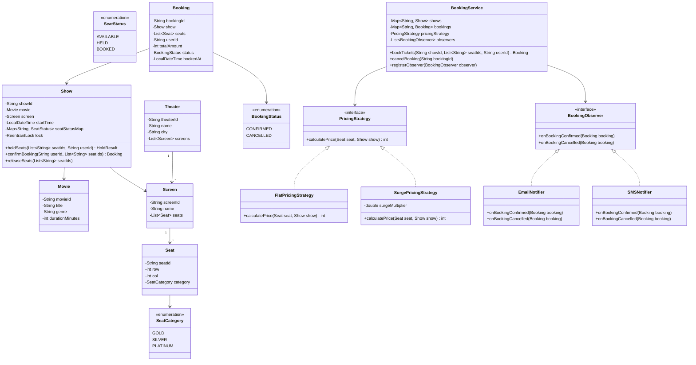

# Machine Coding: Design BookMyShow — Movie Ticket Booking (LLD)

## Quick Summary (TL;DR)
* **Goal**: Build a movie ticket booking system that manages movies, theaters, shows, seat selection, and booking — with concurrency-safe seat locking to prevent double-booking.
* **Design Patterns Used**:
  - **Strategy Pattern**: For different seat pricing strategies (flat, dynamic/surge, time-of-day).
  - **Observer Pattern**: To notify interested parties (email, SMS, analytics) when a booking is confirmed or cancelled.
  - **State Pattern**: (Optional) For booking lifecycle — `PENDING → CONFIRMED → CANCELLED`.
* **Core Principle**: The critical section is seat selection — use `synchronized` blocks or `ReentrantLock` on per-show locks to ensure exactly one user books a given seat.

---

## 🤓 Noob Jargon Buster

* **Concurrency & Double Booking**: When two users sitting in different corners of the city open their app and try to book the exact same seat (e.g., Seat A3) at the exact same millisecond. 
* **ReentrantLock (Per-Show)**: A lock assigned to a specific show. If User 1 is booking tickets for Show A (e.g., 6:00 PM Avengers), they acquire the lock for Show A. If User 2 tries to book a seat for Show A, they must wait. However, User 3 booking tickets for Show B (e.g., 9:00 PM Batman) can proceed in parallel because Show B has a completely separate lock.
* **Strategy Pattern (Pricing)**: Switching pricing rules dynamically. Weekdays might have flat rates, opening weekends might have a 1.5x surge rate, and morning shows might be discounted. Instead of using complex `if/else` logic inside our core class, we write a `PricingStrategy` interface and swap concrete implementations (`FlatPricingStrategy`, `SurgePricingStrategy`) on the fly.
* **Observer Pattern (Notifications)**: A way to send emails, SMS, and push notifications when a booking is confirmed or cancelled. Instead of our booking class calling email and SMS systems directly, it triggers a "Booking Confirmed" event. Any interested notification systems (the observers) listen for this event and run their code.
* **Atomicity**: The "all-or-nothing" rule. If you select seats A1, A2, and A3, either all three are successfully booked for you, or none are. We must never end up in a broken middle state where A1 and A2 are booked but A3 was stolen by someone else.

---

## 1. Problem Statement & Requirements

Design a movie ticket booking system that supports:
1. **Theater & Screen Management**: A city has multiple theaters; each theater has multiple screens; each screen has a fixed seat layout (rows × columns with categories like GOLD, SILVER).
2. **Show Scheduling**: Admins schedule shows — a movie on a specific screen at a specific time.
3. **Seat Selection & Booking**: Users select available seats for a show and book them. Two users must NEVER book the same seat.
4. **Pricing**: Seats have category-based pricing (GOLD = ₹350, SILVER = ₹200). Support pluggable pricing strategies.
5. **Cancellation**: Users can cancel bookings. Seats are released back to available.
6. **Notifications**: On booking/cancellation, notify the user (email, SMS — Observer pattern).

---

## 2. Class Diagram



---

## 3. Concurrency Design (The Critical Section)

The most important part of this LLD — how do we prevent double-booking?

### Approach: Per-Show ReentrantLock

```java
public class Show {
    private final Map<String, SeatStatus> seatStatusMap = new ConcurrentHashMap<>();
    private final ReentrantLock lock = new ReentrantLock();

    public List<String> holdSeats(List<String> seatIds, String userId) {
        lock.lock();
        try {
            // 1. Check ALL requested seats are AVAILABLE
            for (String seatId : seatIds) {
                if (seatStatusMap.get(seatId) != SeatStatus.AVAILABLE) {
                    throw new SeatNotAvailableException("Seat " + seatId + " is not available");
                }
            }
            // 2. Mark all as HELD atomically
            for (String seatId : seatIds) {
                seatStatusMap.put(seatId, SeatStatus.HELD);
            }
            return seatIds;
        } finally {
            lock.unlock();
        }
    }
}
```

**Why per-Show lock instead of global lock?**
A global lock means booking for Show A blocks booking for Show B — unnecessary contention. Each `Show` has its own `ReentrantLock`, so concurrent bookings to different shows proceed in parallel.

**Why not just `ConcurrentHashMap.putIfAbsent()`?**
Because a booking involves multiple seats. If a user books seats A1, A2, A3, we need ALL three to be available atomically. `putIfAbsent` on individual keys doesn't give us this all-or-nothing guarantee.

---

## 4. Key Java Implementation Classes

The runnable code is in [BookMyShowDemo.java](BookMyShowDemo.java).

### 1. Enums

```java
public enum SeatCategory { GOLD, SILVER, PLATINUM }
public enum SeatStatus   { AVAILABLE, HELD, BOOKED }
public enum BookingStatus { CONFIRMED, CANCELLED }
```

### 2. Core Domain Objects

```java
public class Seat {
    private final String seatId;
    private final int row, col;
    private final SeatCategory category;
    // Constructor, getters
}

public class Show {
    private final String showId;
    private final String movieTitle;
    private final Map<String, SeatStatus> seatStatusMap;  // seatId → status
    private final Map<String, Seat> seatMap;               // seatId → Seat object
    private final ReentrantLock lock;
    // holdSeats(), confirmBooking(), releaseSeats()
}
```

### 3. Strategy Pattern — Pricing

```java
public interface PricingStrategy {
    int calculatePrice(Seat seat, Show show);
}

public class FlatPricingStrategy implements PricingStrategy {
    private final Map<SeatCategory, Integer> priceMap;

    public FlatPricingStrategy(Map<SeatCategory, Integer> priceMap) {
        this.priceMap = priceMap;
    }

    @Override
    public int calculatePrice(Seat seat, Show show) {
        return priceMap.getOrDefault(seat.getCategory(), 0);
    }
}

public class SurgePricingStrategy implements PricingStrategy {
    private final FlatPricingStrategy base;
    private final double surgeMultiplier;

    @Override
    public int calculatePrice(Seat seat, Show show) {
        return (int) (base.calculatePrice(seat, show) * surgeMultiplier);
    }
}
```

### 4. Observer Pattern — Notifications

```java
public interface BookingObserver {
    void onBookingConfirmed(Booking booking);
    void onBookingCancelled(Booking booking);
}

public class EmailNotifier implements BookingObserver {
    @Override
    public void onBookingConfirmed(Booking booking) {
        System.out.println("[EMAIL] Booking confirmed: " + booking.getBookingId()
            + " | Seats: " + booking.getSeatIds() + " | Amount: ₹" + booking.getTotalAmount());
    }

    @Override
    public void onBookingCancelled(Booking booking) {
        System.out.println("[EMAIL] Booking cancelled: " + booking.getBookingId());
    }
}
```

### 5. BookingService (Orchestrator)

```java
public class BookingService {
    private final Map<String, Show> shows = new ConcurrentHashMap<>();
    private final Map<String, Booking> bookings = new ConcurrentHashMap<>();
    private PricingStrategy pricingStrategy;
    private final List<BookingObserver> observers = new ArrayList<>();

    public Booking bookTickets(String showId, List<String> seatIds, String userId) {
        Show show = shows.get(showId);

        // 1. Hold seats (thread-safe via ReentrantLock inside Show)
        show.holdSeats(seatIds, userId);

        // 2. Calculate total price
        int total = seatIds.stream()
            .map(show::getSeat)
            .mapToInt(seat -> pricingStrategy.calculatePrice(seat, show))
            .sum();

        // 3. Confirm booking (mark HELD → BOOKED inside Show)
        show.confirmBooking(seatIds);

        // 4. Create booking record
        Booking booking = new Booking(UUID.randomUUID().toString(),
            show, seatIds, userId, total, BookingStatus.CONFIRMED);
        bookings.put(booking.getBookingId(), booking);

        // 5. Notify observers
        observers.forEach(o -> o.onBookingConfirmed(booking));

        return booking;
    }

    public void cancelBooking(String bookingId) {
        Booking booking = bookings.get(bookingId);
        booking.setStatus(BookingStatus.CANCELLED);
        booking.getShow().releaseSeats(booking.getSeatIds());
        observers.forEach(o -> o.onBookingCancelled(booking));
    }
}
```

---

## 5. SDE-2 Interview Angles

### Question 1: "How do you prevent double-booking when two threads try to book the same seat?"

* **Answer**: "Each `Show` object has its own `ReentrantLock`. The `holdSeats()` method acquires the lock, checks all requested seats are `AVAILABLE`, and marks them `HELD` atomically. If any seat is not available, it throws an exception before modifying any state — ensuring all-or-nothing semantics. The lock is per-show, so concurrent bookings for different shows don't block each other."

### Question 2: "Why use Strategy pattern for pricing instead of just an `if-else`?"

* **Answer**: "Pricing rules change frequently — flat pricing on weekdays, surge pricing on opening weekend, discounted pricing for matinee shows. With Strategy, swapping pricing logic is a single line: `service.setPricingStrategy(new SurgePricingStrategy(1.5))`. With if-else, every pricing change requires editing the core booking logic, violating Open/Closed Principle."

### Question 3: "What if the system crashes between holdSeats() and confirmBooking()?"

* **Answer**: "In this in-memory design, a crash loses the hold — which is acceptable because holds are temporary anyway. In a production system, the hold would be persisted in Redis with a TTL. If the process crashes, the TTL auto-expires and seats are released. The Booking Service is stateless — it can restart and pick up from the database/Redis state."

### Question 4: "How would you extend this to support seat selection timeouts (7-minute hold)?"

* **Answer**: "Add a `ScheduledExecutorService` that runs a cleanup task. When `holdSeats()` is called, schedule a delayed task: `scheduler.schedule(() -> show.releaseSeats(seatIds), 7, TimeUnit.MINUTES)`. If the user confirms within 7 minutes, cancel the scheduled task. If not, the task fires and releases the seats automatically."

### Question 5: "Can you change the pricing strategy at runtime?"

* **Answer**: "Yes — that's the power of Strategy. `BookingService.setPricingStrategy()` swaps the pricing algorithm without restarting. In a real system, this could be driven by a feature flag or admin config: 'Enable surge pricing for show X'."
