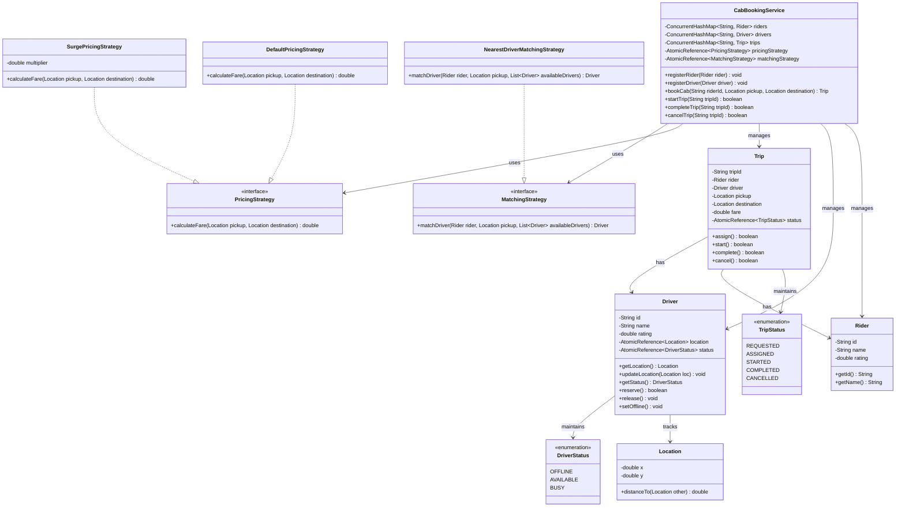

# Machine Coding: Design Cab Booking Service (LLD)

## Quick Summary (TL;DR)
This Cab Booking Service is designed to manage Riders, Drivers, and Trips dynamically. Drivers can update their real-time coordinates. The system pairs riders with the closest available driver using a dynamic **Matching Strategy**. The ride cost is calculated dynamically using a **Pricing Strategy** to support surge pricing during peak demand.

To ensure thread safety in high-concurrency environments, we use a lock-free design using Java's `AtomicReference` and `compareAndSet` (CAS) transitions for driver reservations and trip lifecycles, completely avoiding database or coarse-grained application locks that degrade matching performance.

---

## Noob Jargon Buster
*   **CAS (Compare-And-Swap):** An atomic instruction used in multithreading to achieve synchronization without using heavy locks. It updates a variable only if its current value matches our expected value.
*   **Strategy Pattern:** A design pattern that allows selecting an algorithm's behavior at runtime (e.g., swapping from standard pricing to surge pricing).
*   **State Machine / State Pattern:** A design pattern that manages valid status transitions (e.g., preventing a cancelled trip from being started or completed).
*   **Immutable Object:** An object whose state cannot be modified after it is created. Here, coordinates/locations are immutable to prevent thread interference.

---

## 1. Problem Statement & Requirements

### Core Requirements
1.  **User Management:** Register Riders and Drivers with ratings.
2.  **Location Tracking:** Dynamically update and track driver coordinates `(x, y)`.
3.  **Matching Algorithm:** Pair a rider requesting a cab with the nearest available driver.
4.  **Trip Lifecycle:** Track the ride through all states: `REQUESTED` -> `ASSIGNED` -> `STARTED` -> `COMPLETED` or `CANCELLED`.
5.  **Dynamic Surge Pricing:** Support multiple pricing algorithms (Default, Peak Hour Surge, Traffic Surge) dynamically swapped at runtime.
6.  **Concurrency:** Ensure multiple riders requesting bookings concurrently do not get assigned the same driver. State transitions must be completely thread-safe.

---

## 2. Class Diagram



---

## 3. Core Design Decisions & Internals

### The Strategy Pattern (Dynamic Pricing & Matching)
*   **PricingStrategy:** The `CabBookingService` delegates fare calculation to an implementation of `PricingStrategy`. At peak hours, the administrator swaps the strategy to `SurgePricingStrategy` via `setPricingStrategy(new SurgePricingStrategy(2.5))`. Since the reference is an `AtomicReference`, this swap is safe and instant.
*   **MatchingStrategy:** Allows routing algorithms (e.g. nearest driver, highest-rated driver) to be swapped at runtime depending on the region or tier of service.

### State Transitions (Driver & Trip Lifecycle)
*   **Lock-Free Driver Reservation:** When a rider books a cab, the service retrieves all available drivers and filters/sorts them by proximity. The service then attempts to transition the status of the candidate driver from `AVAILABLE` to `BUSY` using:
    ```java
    candidate.reserve() // calls status.compareAndSet(DriverStatus.AVAILABLE, DriverStatus.BUSY)
    ```
    If this returns `true`, the driver is reserved for this trip. If it returns `false`, another concurrent booking thread beat us to it, and we proceed to the next nearest candidate.
*   **Trip State Loop:** During cancellation, a trip might be in either `REQUESTED` or `ASSIGNED` state. We use a CAS retry loop to safely transition the trip state to `CANCELLED` and return the driver back to `AVAILABLE`.
*   **Trip Completion:** Completing a started trip updates the driver's location to the destination before returning the driver to `AVAILABLE`, so future matching uses the correct position.

---

## 4. Concurrency & Thread-Safety Design

### Comparing Synchronization Choices

| Mechanism | Pros | Cons | Decision in our Design |
| :--- | :--- | :--- | :--- |
| **Coarse-Grained Synchronization (`synchronized` methods)** | Simple to write; guarantees absolute safety. | Blocks all other threads. No two bookings can happen in parallel, creating a severe bottleneck. | **Rejected** for the core booking and matching flows. |
| **Reentrant Locks** | Supports tryLock, timeouts, and condition variables. | Complexity in avoiding deadlocks; overhead of thread suspension/scheduling. | **Rejected** for driver updates and booking matching. |
| **Lock-Free Atomic CAS (`compareAndSet`)** | Zero thread blocking; near-instant execution; high throughput under heavy concurrency. | Requires retry loops for complicated state changes. | **Selected** for `DriverStatus` updates, `TripStatus` updates, and candidate reservations. |

### Memory Visibility and Concurrent Data Structures
1.  **`ConcurrentHashMap`**: Stores `Riders`, `Drivers`, and `Trips` to support concurrent lookups and inserts without blocking the entire application.
2.  **`AtomicReference`**: Coordinates strategies and states. Read operations (e.g., finding available drivers) are completely non-blocking, and writes are guaranteed to be instantly visible across all threads.

---

## 5. Interview Corner / Follow-up Questions

### Q1: How do we prevent the "Double Booking" problem when two riders request a ride near the same driver?
**Answer:** We prevent double booking via atomic state transitions at the **Driver** level rather than locking the entire database or booking service. The booking process queries available drivers and tries to reserve the candidate via `driver.status.compareAndSet(DriverStatus.AVAILABLE, DriverStatus.BUSY)`. Only one thread can succeed in this CAS operation. The thread that fails simply retries matching with the next nearest available driver.

### Q2: How would we handle driver location updates that happen every few seconds in a real production system?
**Answer:** In a highly scaled system, storing driver locations in a relational database or memory map directly can cause excessive write bottlenecks.
*   **In-Memory Geospatial Indexes:** We use Redis Geospatial Indexes (`GEOADD`, `GEORADIUS`) or Uber's H3 Spatial Indexing.
*   **Write-Ahead Buffering:** Locations are pushed to a message broker (e.g., Apache Kafka), and processed asynchronously to update the in-memory coordinate grid.
*   **Snapshotting:** Read-only matches query the geospatial index, while actual booking confirmation still relies on a single CAS reservation on the driver's status record.

### Q3: What happens if a trip is cancelled exactly as the driver starts the trip?
**Answer:** The trip status transition rules dictate the outcomes:
*   The `cancel()` method uses a CAS loop that only transitions `REQUESTED` or `ASSIGNED` states to `CANCELLED`.
*   The `start()` method transitions `ASSIGNED` to `STARTED`.
*   Whichever thread executes its `compareAndSet` first wins. If the driver starts the trip first, the trip state becomes `STARTED`, and the rider's concurrent cancel request fails (or would need to trigger a post-ride cancellation/refund policy rather than a free pre-trip cancel).
