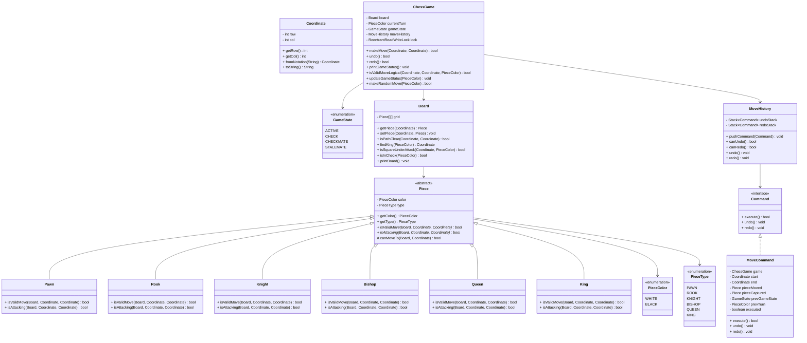

# Machine Coding: Design Chess Game (LLD)

## Quick Summary (TL;DR)
This system is a fully functional, thread-safe, 8x8 Chess Game LLD. It supports:
* **Polymorphic Movement Validation**: Each piece (`Pawn`, `Rook`, `Knight`, `Bishop`, `Queen`, `King`) validates its own geometrical moves and path obstructions.
* **Complex State Detection**: Handles `ACTIVE`, `CHECK`, `CHECKMATE`, and `STALEMATE` by simulating candidate moves to verify if they expose the friendly King to attacks.
* **Undo/Redo with Command Pattern**: Each move is encapsulated inside a `MoveCommand` that stores board snapshots to execute, undo, and redo moves.
* **Thread-Safety**: Uses a `ReentrantReadWriteLock` to allow multiple concurrent readers (e.g., spectators, engines) to query the board, while ensuring exclusive write access for move execution and undo/redo operations.

---

## Noob Jargon Buster
* **Polymorphism**: The ability of different classes (e.g., `Rook`, `Knight`) to respond to the same method call (`isValidMove()`) in their own unique ways.
* **Command Pattern**: An object-oriented design pattern that turns a request or action (like moving a piece) into a stand-alone object containing all information about the request. This lets us easily queue, execute, log, and undo actions.
* **Checkmate**: A game state where a player's King is under attack ("in check"), and there are absolutely no legal moves available to escape the attack.
* **Stalemate**: A game state where a player's King is *not* under attack, but they have no legal moves left on their turn, resulting in a draw.
* **ReentrantReadWriteLock**: A locking mechanism that allows multiple threads to read data at the same time (shared access) but only one thread to write/modify data (exclusive access), preventing data corruption.

---

## 1. Problem Statement & Requirements

### System Requirements
1. **Board Representation**: An 8x8 grid composed of files (columns `a`-`h`) and ranks (rows `1`-`8`).
2. **Players & Coordinates**: Two players (`WHITE` and `BLACK`). Moves are coordinate-based, supporting standard algebraic notation (e.g., `e2` to `e4`).
3. **Piece Polymorphism**: Each piece (`Pawn`, `Rook`, `Knight`, `Bishop`, `Queen`, `King`) has its own movement logic.
4. **Move validation**:
   * Out-of-bounds validation.
   * Path obstruction validation (e.g., Rooks, Bishops, and Queens cannot jump over other pieces).
   * Destination validation (cannot capture friendly pieces).
   * The opposing King cannot be captured; the game ends through checkmate detection.
5. **Check & Checkmate Detection**:
   * A player is in **Check** if the opponent can attack their King.
   * A player is in **Checkmate** if they are in check and have no legal moves to escape.
   * A player is in **Stalemate** if they are not in check but have no legal moves.
6. **Undo/Redo Functionality**: Ability to revert the last move and re-apply it using the Command Pattern.
7. **Thread-Safety**: Multiple players, spectators, or engine threads must be able to interact with the game instance concurrently without raising race conditions or deadlocks.

---

## 2. Class Diagram

---

## 3. Core Design Decisions & Internals

### Separation of Physical vs. Logical Moves
To prevent infinite loops during checkmate detection, movement validation is split into two phases:
1. **Physical/Geometrical Move Validation (`Piece.isValidMove`)**:
   * Does the movement match the piece's trajectory (e.g., L-shape for Knights)?
   * Is the path clear of other pieces (for Rook, Bishop, Queen)?
   * Is the target coordinate within board bounds and not occupied by a friendly piece?
2. **Logical Validation (`ChessGame.isValidMoveLogical`)**:
   * Performs physical move check.
   * Simulates the move on the board by temporarily relocating the piece.
   * Checks `board.isInCheck(color)` to verify if the move exposes their King.
   * Reverts the board state.
This design avoids infinite recursion when checking if a square is under attack.

### Checkmate & Stalemate Resolution
* The game iterates over all squares, finding all pieces of the active color.
* For each piece, it tries to find if there is at least one destination square (out of 64 options) where `isValidMoveLogical` returns `true`.
* If a player has **zero** legal moves:
  * If their King is currently in check $\rightarrow$ `CHECKMATE`.
  * If their King is not in check $\rightarrow$ `STALEMATE`.

---

## 4. Concurrency & Thread-Safety Design

### Lock Choice: ReentrantReadWriteLock vs. Synchronized
A chess server typically handles heavy read traffic (spectators loading the board, engines evaluating positions) compared to write traffic (players making moves once every few seconds).

| Lock Strategy | Pros | Cons |
| :--- | :--- | :--- |
| **Synchronized / ReentrantLock** | Simple to implement. | Blocks readers while other readers are viewing the board. Limits performance under high spectator traffic. |
| **Atomic References (CAS)** | High performance. | Chess operations require atomic mutations across multiple objects (Board grid, Turn state, Game state, Undo stacks). CAS is extremely difficult to manage safely across multiple fields. |
| **ReentrantReadWriteLock** (Chosen) | Multiple spectator threads can read the board concurrently. Exclusive lock only blocks writes. | Slightly higher lock acquisition overhead for single threads. |

### Memory Visibility & Race Conditions
* All state reads (`getGameState()`, `getCurrentTurn()`, `printGameStatus()`) acquire the `ReadLock`.
* All state writes (`makeMove()`, `undo()`, `redo()`) acquire the `WriteLock`.
* A thread-safe, synchronized `MoveHistory` stack wrapper is used to manage undo and redo operations.

---

## 5. Interview Corner / Follow-up Questions

### Q1: How would you scale this design to support millions of concurrent chess matches?
**Answer**:
We would decouple the game room sessions into an in-memory datastore (e.g., Redis or an actor model system like Akka/ProtoActor).
1. **State Partitioning**: Match ID hash-rings dictate which server node holds a specific game room in memory.
2. **WebSockets/SSE**: Long-lived connections broadcast moves in real-time.
3. **Stateless APIs**: API gateway coordinates matchmaking, but once a match starts, a designated game server handles the in-memory board state.

### Q2: How would you add support for complex chess rules like Castling and En Passant?
**Answer**:
1. **Castling**:
   * Add a `hasMoved` boolean in `King` and `Rook`.
   * In `King.isValidMove`, check if the destination is 2 squares left/right. If so, check that neither King nor the respective Rook has moved, the intermediate squares are clear, and the King does not pass through squares under attack.
2. **En Passant**:
   * Keep track of the `lastDoubleStepCol` in `Board` (reset after every turn).
   * In `Pawn.isValidMove`, if it moves diagonally onto an empty square next to the double-stepped pawn, permit the capture and remove the captured pawn from the row below/above.

### Q3: How would you implement a Time Control (Blitz, Bullet) feature?
**Answer**:
1. Add a `GameClock` class tracking remaining time (e.g., in milliseconds) for both players.
2. A background timer thread pools active games or utilizes scheduled executors.
3. Whenever a player makes a move, their elapsed time is calculated, subtracted, and the clock switches.
4. If a player's timer hits zero, the game manager changes the game state to `FORFEIT` or `OUT_OF_TIME` and awards the win to the opponent.
