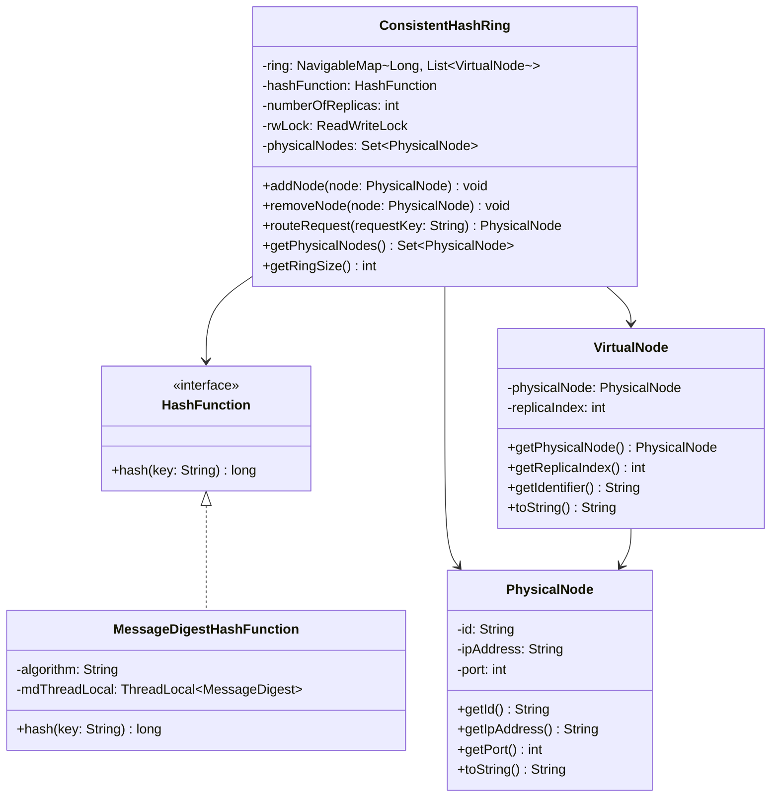

# Machine Coding: Design Consistent Hashing Ring (LLD)

## Quick Summary (TL;DR)
This design implements a thread-safe, production-ready **Consistent Hashing Ring** in Java. Consistent hashing is a technique used in distributed systems (like caches, databases, and load balancers) to distribute request keys across a dynamic set of server nodes. When server nodes are added or removed, it minimizes the number of keys that must be remapped.
To prevent "hot spots" (unbalanced data distribution), we employ **Virtual Nodes (vnodes)**. Each physical server node maps to $K$ virtual locations on the ring. The ring is represented using a sorted `TreeMap`, and thread safety is achieved using `ReentrantReadWriteLock` (for high-concurrency lookups and exclusive modifications) along with `ThreadLocal` MessageDigest instances to ensure safe and lock-free concurrent hashing.

---

## Noob Jargon Buster
*   **Consistent Hashing**: A hashing scheme where both servers and keys are mapped to a circle (ring). A key is routed to the nearest server on the ring in a clockwise direction.
*   **Virtual Nodes (vnodes)**: Instead of putting a single physical server on the ring, we put multiple copies (replicas) of it at different locations. This spreads the load evenly across all physical servers.
*   **Hash Ring**: A sorted mapping of hash values (from $0$ to $2^{64}-1$ in a 64-bit space) representing a circular address space.
*   **TreeMap**: A Java collection that keeps keys sorted. It makes it easy to find the "next clockwise" element using `ceilingEntry`.
*   **ReentrantReadWriteLock**: A lock that allows many threads to read concurrently, but only one thread to write (modify) at a time. Perfect for systems with 99% read (routing) traffic.

---

## 1. Problem Statement & Requirements

### Core Requirements
1.  **Dynamic Node Management**: Support adding and removing physical server nodes dynamically.
2.  **Virtual Nodes (vnodes)**: Support a configuration parameter $K$ representing the number of virtual nodes per physical node to ensure uniform key distribution.
3.  **Dynamic Routing**: Support hashing a string request key (using MD5 or SHA-256) to route it to the nearest server node clockwise.
4.  **Thread-Safety & Concurrency**:
    *   Multiple request routing operations must run concurrently without blocking each other.
    *   Adding or removing nodes must be safe and not cause `ConcurrentModificationException` or data corruption in the routing table.
5.  **Clean Java Implementation**: Implement using `TreeMap` with a robust `main` method simulating a multi-threaded workload.

---

## 2. Class Diagram

---

## 3. Core Design Decisions & Internals

### Hash Space Mapping
We map keys to a 64-bit integer space (using a Java `Long` hash value).
*   **Physical Node Mapping**: For a physical node `Server_A` and $K=3$, we map three virtual nodes on the ring using keys:
    *   `hash("Server_A#vnode-0")`
    *   `hash("Server_A#vnode-1")`
    *   `hash("Server_A#vnode-2")`
*   **Request Key Routing**: To route a key (e.g., `"user_123"`):
    1.  Compute `hash("user_123")`.
    2.  Find the smallest hash value in the `TreeMap` that is $\ge \text{hash("user_123")}$ using `TreeMap.ceilingEntry(hash)`.
    3.  If such a value exists, route to the first virtual node in that hash bucket.
    4.  If no such value exists (wrap around), route to the first virtual node at the first key in the `TreeMap`.

---

## 4. Concurrency & Thread-Safety Design

### Comparing Concurrency Approaches
We chose **`TreeMap` + `ReentrantReadWriteLock`** for the core ring structure. Let's compare this with other potential approaches:

| Metric | `TreeMap` + `ReentrantReadWriteLock` | `ConcurrentSkipListMap` (Lock-Free) | `SynchronizedTreeMap` |
| :--- | :--- | :--- | :--- |
| **Read Latency (Routing)** | **Very Low** (readers run concurrently and only block while a write holds the lock) | Low (Slight search overhead due to skip-lists) | High (Reads block other reads) |
| **Write Latency (Node Churn)**| Medium (Blocks readers and other writers) | **Low** (Lock-free writes via CAS) | High (Blocks all traffic) |
| **Memory Footprint** | **Low** (Standard red-black tree pointers) | High (Needs multiple forward pointers per node) | Low |
| **Ideal Scenario** | Cache/Routing rings with **99% reads & rare writes** | Highly dynamic systems with **continuous server churn** | Small, non-critical setups |

### Thread-Safe Hashing
Java's `MessageDigest` is **not thread-safe**. Creating a new instance of `MessageDigest` for every hash operation causes massive object allocation and garbage collection overhead.
*   **Solution**: We wrap the `MessageDigest` in a `ThreadLocal<MessageDigest>` container. Each thread gets its own reusable `MessageDigest` instance, preventing thread contention without requiring slow synchronization blocks or constant memory allocation.

---

## 5. Interview Corner / Follow-up Questions

### Q1: How do you handle hash collisions on the ring?
**Answer**: With a 64-bit space ($2^{64}$ possible hash values), collisions are statistically extremely rare, but the implementation preserves them instead of overwriting a vnode. Each hash maps to a small list of virtual nodes. Routing deterministically selects the first vnode in the bucket, and removal deletes only the matching vnode, leaving any colliding vnode intact.
For more even distribution in the exceptional collision case, a production system could salt and rehash a colliding vnode identifier.

### Q2: What happens if a node fails? How do you prevent data loss?
**Answer**: A consistent hashing ring only handles routing, not data storage. If a node fails, the keys mapped to it will automatically route to the next clockwise node.
To prevent data loss in database/cache setups:
1.  **Replication**: When storing a key, write it to the primary node (the first clockwise node) and copy it to the next $N-1$ unique physical nodes on the ring.
2.  **Failure Detection**: Use a gossip protocol or heartbeat checker. Once a node is declared dead, it is removed from the ring, triggering automatic re-routing of requests to the replicas.

### Q3: How do you handle Weighted Consistent Hashing (servers with different resource capacities)?
**Answer**: If `Server_A` has 4x the capacity of `Server_B`, we want `Server_A` to handle 4x the request load. We achieve this by multiplying the base virtual node count $K$ by a node-specific weight:
$$\text{Virtual Nodes for Node}_i = K \times \text{Weight}_i$$
This dynamically populates the ring with more virtual nodes for higher-capacity servers, increasing their share of the hash circle.

### Q4: How does the choice of K affect ring balance and search performance?
**Answer**:
*   **Balance**: As $K$ increases, the standard deviation of load across physical nodes drops exponentially. $K = 100 \text{ to } 500$ typically yields a highly balanced key distribution (less than 5-10% variance).
*   **Performance**: The lookup time is $O(\log (N \times K))$ where $N$ is the number of physical nodes. A larger $K$ increases the tree depth, slightly increasing search latency. In real-world systems, memory and CPU latency are balanced by selecting a moderate $K$ (e.g., $150$).
