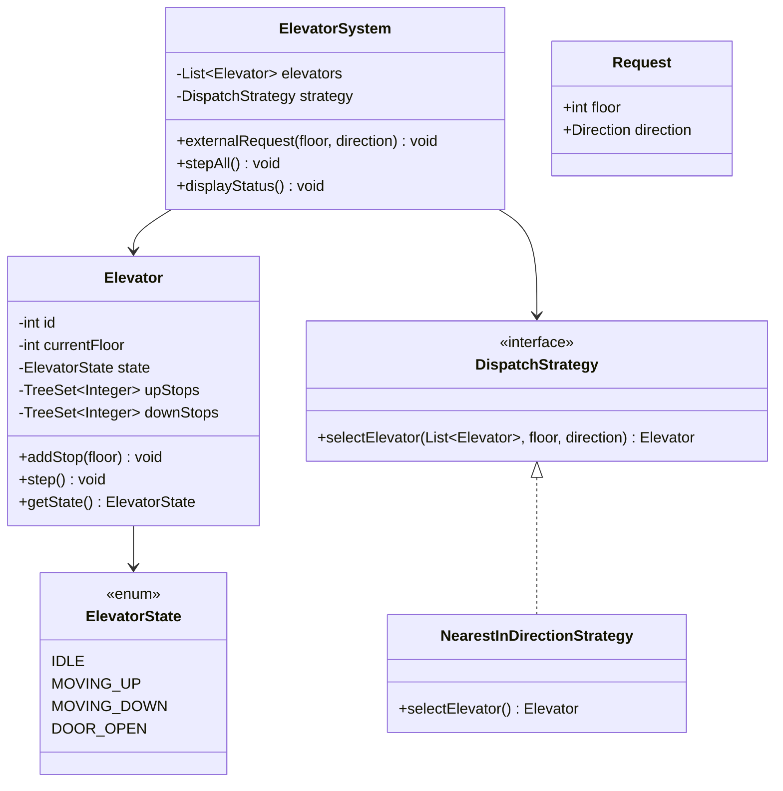

# Machine Coding: Design an Elevator System (LLD)

## Quick Summary (TL;DR)
* **Goal**: Build a multi-elevator system for an N-floor building that handles pickup requests, dispatches the optimal elevator, and moves elevators through floors in the correct direction.
* **Design Patterns Used**:
  - **State Pattern**: Each elevator has states (`IDLE`, `MOVING_UP`, `MOVING_DOWN`, `DOOR_OPEN`) with state-specific behavior.
  - **Strategy Pattern**: Pluggable dispatch algorithm to decide which elevator serves a request.
* **Core Principle**: Separate the **dispatcher** (which elevator?) from the **elevator controller** (how does it move?) — single responsibility at every layer.

---

## 🤓 Noob Jargon Buster

* **External Request (Hall Call)**: A person on floor 5 presses the UP button. This is a `(floor=5, direction=UP)` request handled by the **Dispatcher**.
* **Internal Request (Cabin Call)**: A person inside elevator 2 presses button for floor 9. This is a `(floor=9)` request handled directly by the **Elevator** itself.
* **Dispatch Algorithm**: The logic that picks which elevator should respond to an external request. LOOK algorithm serves requests in the current direction before reversing — like a disk head.
* **SCAN / LOOK Algorithm**: The elevator moves in one direction, serving all queued floors, then reverses. LOOK is SCAN without going to the physical end — it reverses at the last requested floor.
* **Destination Set**: The sorted set of floors an elevator needs to visit. Split into `upStops` (floors to visit while going up) and `downStops` (floors to visit while going down).

---

## 1. Problem Statement & Requirements

Design an elevator system that supports:
1. **N elevators** in a building with **M floors** (configurable).
2. **External requests**: A person on floor X presses UP or DOWN — the dispatcher assigns the best elevator.
3. **Internal requests**: A person inside an elevator presses a destination floor button.
4. **Movement**: Elevators move one floor at a time, stopping at requested floors.
5. **Direction**: An elevator continues in its current direction until no more stops remain, then reverses or becomes idle.
6. **Door operation**: The elevator opens doors when it arrives at a requested floor.
7. **Display**: Show the current status of all elevators (floor, direction, stops).

---

## 2. LOOK Algorithm (Elevator Scheduling)

The LOOK algorithm is the standard elevator scheduling approach:

```
Elevator at floor 5, moving UP
upStops:   {7, 10, 12}
downStops: {3, 1}

Step 1: Move UP → 7 (stop, open door)
Step 2: Move UP → 10 (stop, open door)
Step 3: Move UP → 12 (stop, open door)
Step 4: No more upStops → reverse direction to DOWN
Step 5: Move DOWN → 3 (stop, open door)
Step 6: Move DOWN → 1 (stop, open door)
Step 7: No more downStops → IDLE
```

Why LOOK over FCFS (First Come First Served)?
- FCFS: Elevator at floor 5, queue = [10, 2, 8] → goes 5→10→2→8 = 21 floors traveled
- LOOK: Same scenario → goes 5→8→10→2 = 13 floors traveled (serves 8 and 10 on the way up)

---

## 3. Dispatch Strategy (Which Elevator?)

The dispatcher selects the best elevator for an external request using a scoring system:

```
Request: floor=7, direction=UP

Elevator A: floor=3, moving UP,  upStops={5, 9}
  → Moving TOWARD floor 7 in the SAME direction → BEST (score = distance = 4)

Elevator B: floor=10, moving DOWN, downStops={6, 2}
  → Will pass floor 7 but going DOWN, request is UP → must complete DOWN sweep first → WORSE

Elevator C: floor=7, IDLE
  → Already there → BEST (score = 0)

Winner: Elevator C (score=0) beats Elevator A (score=4)
```

**Scoring formula** (Nearest-in-Direction):
1. **Same direction, approaching**: `|elevator.floor - request.floor|` (lowest score wins)
2. **Same direction, already passed**: Must complete sweep + reverse → high penalty
3. **Opposite direction**: Must finish current sweep, reverse, then come back → highest penalty
4. **Idle**: `|elevator.floor - request.floor|` (treat like best case)

---

## 4. Class Design & Architecture



---

## 5. Key Java Implementation

The runnable code is in [ElevatorSystemDemo.java](ElevatorSystemDemo.java).

### The Core: Elevator.step()

Each call to `step()` simulates one time unit — the elevator either moves one floor, opens doors, or stays idle:

```java
public void step() {
    if (state == DOOR_OPEN) {
        closeDoor();                    // was stopped, now close and continue
        return;
    }
    if (state == MOVING_UP) {
        if (!upStops.isEmpty()) {
            currentFloor++;
            if (upStops.contains(currentFloor)) {
                upStops.remove(currentFloor);
                openDoor();             // arrived at a stop
            }
        } else {
            reverseOrIdle();            // no more up stops
        }
    }
    // symmetric for MOVING_DOWN...
}
```

### The Core: Dispatch scoring

```java
// Same direction and approaching = best
if (elevator is IDLE)
    score = |elevator.floor - request.floor|

if (elevator direction == request direction && elevator is approaching)
    score = |elevator.floor - request.floor|

// All other cases get a penalty proportional to remaining sweep distance
```

### Why TreeSet for stops?

- `TreeSet<Integer>` keeps floors sorted → `first()` gives nearest in direction, `contains()` is O(log n).
- `upStops` uses natural order (ascending), `downStops` uses reverse order (descending) — so `first()` always gives the next stop in the current travel direction.

---

## 6. SDE-2 Interview Angles

### Question 1: "How do you handle concurrent requests from multiple floors?"
* **Problem**: 10 people press buttons on different floors simultaneously.
* **Fix**:
  1. Use a `BlockingQueue<Request>` for incoming external requests.
  2. A single dispatcher thread dequeues and assigns — eliminates race conditions.
  3. Each elevator has its own `synchronized` stop sets — the dispatcher writes, the elevator controller reads.
  4. In production: event-driven with an event loop (no busy-waiting).

### Question 2: "How would you handle VIP/priority floors?"
* Add a `PriorityDispatchStrategy` that overrides normal scoring.
* VIP requests get assigned to the nearest elevator and inserted as the **next** stop (preempting the current destination).
* Alternative: dedicate one elevator for VIP floors (simpler, but underutilizes capacity).

### Question 3: "What about overweight / max capacity?"
* Add a `currentLoad` and `maxCapacity` to `Elevator`.
* The elevator refuses internal requests when full (doors open but display "overweight").
* The dispatcher skips full elevators when scoring.
* Weight is checked via a sensor — simulated as `elevator.isFull()`.

### Question 4: "How do you optimize for a skyscraper (100+ floors)?"
* **Zoning**: Elevators 1-3 serve floors 1-33, elevators 4-6 serve floors 34-66, etc.
* **Express elevators**: Skip intermediate floors entirely (direct to lobby ↔ sky lobby).
* **Destination dispatch**: Instead of UP/DOWN buttons, users enter their destination floor at the lobby — system groups people going to nearby floors into the same elevator, reducing stops.

### Question 5: "State Pattern vs enum + switch for elevator states?"
* With 4 states and growing (`MAINTENANCE`, `EMERGENCY`, `OUT_OF_SERVICE`), switch-case becomes unwieldy.
* State Pattern: each state class defines what `step()`, `addStop()`, and `openDoor()` do — adding `MaintenanceState` is just a new class.
* **For interviews**: enum + switch is fine for 3-4 states (shows pragmatism). Mention State Pattern as the scalable alternative if more states are expected.
