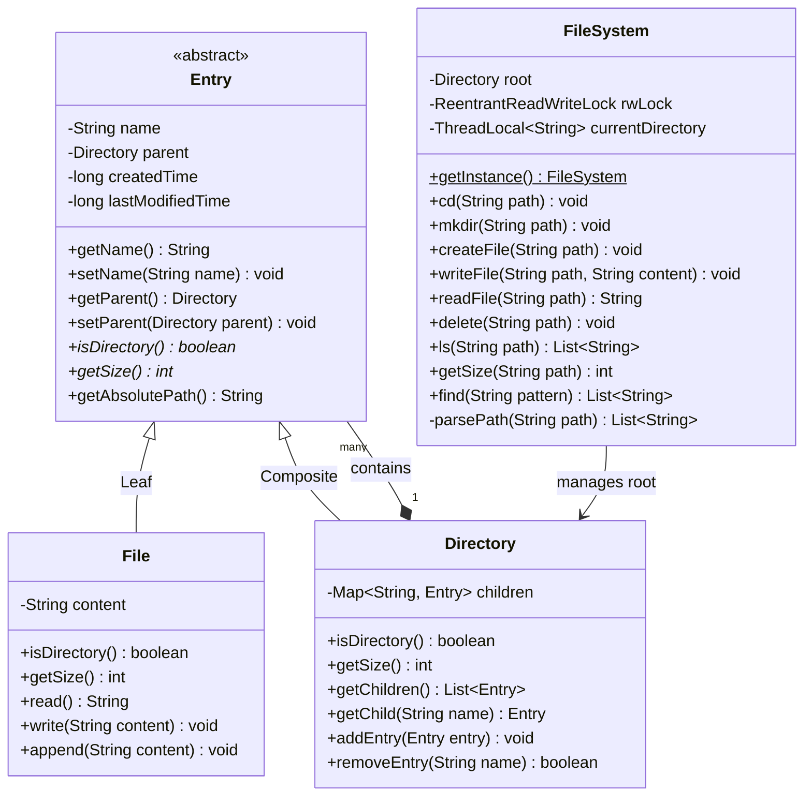

# Machine Coding: Design In-Memory File System (LLD)

## Quick Summary (TL;DR)
This is a thread-safe, in-memory File System designed to emulate core shell file operations. It models directories and files using the **Composite Design Pattern**, allowing recursive calculations for sizes and uniform handling of entries. It supports navigation through absolute and relative paths (including `.` and `..` operators) with a thread-isolated Current Working Directory (CWD).

To guarantee safety under multi-threaded read/write workloads, it utilizes Java's `ReentrantReadWriteLock` for tree synchronization and `ThreadLocal` for worker thread navigation isolation.

---

## Noob Jargon Buster
*   **Composite Pattern**: A structural design pattern that lets you compose objects into tree structures to represent part-whole hierarchies. It lets clients treat individual objects (files) and compositions of objects (directories) uniformly.
*   **ThreadLocal**: A class in Java that provides thread-local variables. Each thread accessing the variable has its own independently initialized copy, preventing cross-thread state pollution (e.g. one thread doing `cd` doesn't change another thread's CWD).
*   **Hand-Over-Hand Locking (Lock Coupling)**: A fine-grained synchronization technique for traversing linked structures where you lock a child node before releasing the lock on the parent node.

---

## 1. Problem Statement & Requirements

### System Requirements
1.  **Uniform Hierarchical Tree**: Support Files and Directories under a single root `/`.
2.  **Metadata & Content**: Track names, parent directories, size, created times, and modified times. Files hold text content.
3.  **Core Operations**:
    *   `mkdir(path)`: Create folder structures (supports creating intermediate folders).
    *   `createFile(path)`: Instantiate a new empty file.
    *   `writeFile(path, content)`: Overwrite/create files with text.
    *   `readFile(path)`: Read text content from files.
    *   `delete(path)`: Remove directories and files recursively.
    *   `ls(path)`: List child entries sorted alphabetically (folders denoted with `/`).
4.  **CWD & Navigation**:
    *   `cd(path)`: Change current directory (supports relative paths like `.` and `..`).
    *   `getCWD()`: Retrieve active thread's current working directory.
5.  **Metrics & Search**:
    *   `getSize(path)`: Compute the size recursively (files return length, directories return sum of child sizes).
    *   `find(pattern)`: Search for entries containing a string pattern recursively.
6.  **Concurrency**: Support parallel reader threads without blocking, while keeping exclusive locks for writers.

---

## 2. Class Diagram



---

## 3. Core Design Decisions & Internals

### Composite Pattern Implementation
To represent the hierarchical tree, `File` (Leaf) and `Directory` (Composite) extend `Entry` (Component).
*   **Uniform Interfaces**: When calling `getSize()` on `Entry`, a `File` returns the length of its content, whereas a `Directory` aggregates sizes of its children by traversing the composite tree.
*   **Leaf Safety**: Directory modification operations (`addEntry`, `removeEntry`) are placed exclusively in the `Directory` class to prevent runtime exceptions on files.

### CWD & Path Resolution
Relative paths are parsed and resolved using a `Stack` to process directory navigation keywords:
```java
// Logic for resolving path components
Stack<String> resolvedParts = new Stack<>();
for (String part : parts) {
    if (part.isEmpty() || part.equals(".")) continue;
    if (part.equals("..")) {
        if (!resolvedParts.isEmpty()) resolvedParts.pop();
    } else {
        resolvedParts.push(part);
    }
}
```

---

## 4. Concurrency & Thread-Safety Design

### Comparing Concurrency Approaches

| Synchronization Level | Read Throughput | Complexity | Deadlock Risk | Selection |
| :--- | :--- | :--- | :--- | :--- |
| **Fine-Grained (Per-Node locks)** | Extremely high. Read/writes on separate subtrees happen in parallel. | High. Traversal requires hand-over-hand lock coupling. | High. Parent-child loops or race conditions on path updates. | **Option for Scale** |
| **Coarse-Grained (`synchronized` methods)** | Low. Readers block other readers, restricting parallel searches/reads. | Very Low. | Zero. | **Rejected** |
| **Global Read/Write Lock (`ReentrantReadWriteLock`)** | High. Multiple readers query the filesystem concurrently without blocking. | Low. | Zero. | **Selected** |

### Thread Isolation (ThreadLocal)
In multi-user servers (like SSH or SFTP servers), different threads share the same file system tree but have their own working directory. We achieve this by mapping `currentDirectory` into a `ThreadLocal<String>`, isolating directory navigation states.

---

## 5. Interview Corner / Follow-up Questions

### Q1: How do you handle Symlinks (Soft links/shortcuts) in this design?
**Answer**:
We can add a new Leaf class `Link` extending `Entry`. It stores a string reference to the target absolute path.
1. When resolving a path, if we hit a `Link`, we retrieve its target path and restart the resolution process from that target path.
2. To prevent infinite loops (cycles created by link loops), we track the number of link redirections and throw an exception if the depth exceeds a threshold (e.g., 40 jumps, similar to Linux's `ELOOP`).

### Q2: How would you implement fine-grained locking (per-node) instead of global locking?
**Answer**:
We assign a `ReentrantReadWriteLock` to each `Entry`. 
*   **Traversal**: Use hand-over-hand locking (lock coupling). To move from parent `P` to child `C`, we read-lock `P`, lookup `C`, read-lock `C`, and then release read-lock on `P`.
*   **Modification**: To write/delete inside a directory `D`, we traverse down to `D` using read locks, acquire a write-lock on `D`, and perform the modification (add/remove children).
*   This approach is highly performant but requires careful implementation to prevent deadlocks (e.g. locking in global alphabetical or hierarchical order).

### Q3: How would you extend this File System to support Access Control Lists (ACLs)?
**Answer**:
1. Create a `Permission` class tracking owners, groups, and read/write/execute permissions (RWX).
2. Add a `Permission` field to `Entry`.
3. In `FileSystem` service, intercept operations by passing a `UserContext` and verifying if the requester has read/write permissions on the target nodes before proceeding with the operation.
