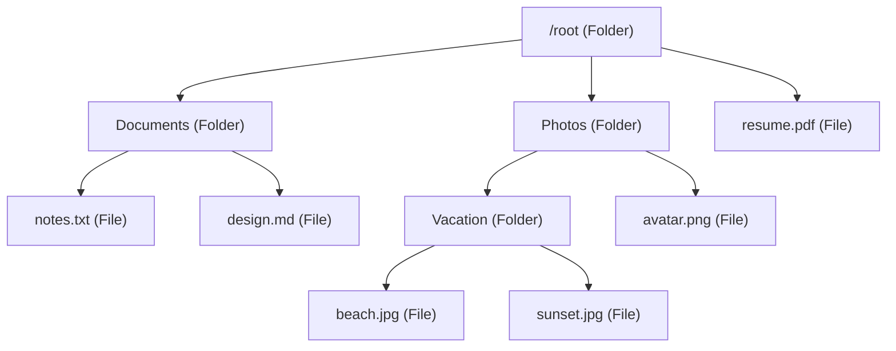
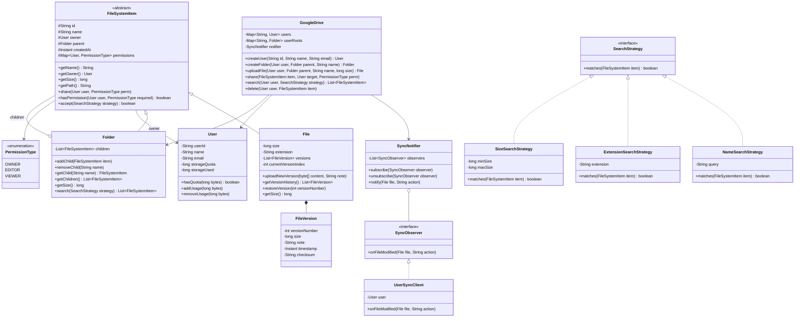

# Machine Coding: Design Google Drive — Cloud File Storage (LLD)

## Quick Summary (TL;DR)
* **Goal**: Build an in-memory cloud file storage system that supports file/folder hierarchy, file versioning, sharing with permissions, search, and sync notifications.
* **Design Patterns Used**:
  - **Composite Pattern**: Files and Folders both implement `FileSystemItem`, letting clients treat individual files and folder trees uniformly. Folders contain children recursively.
  - **Observer Pattern**: When a file is modified, shared, or deleted, all subscribed users (sync clients) are notified automatically.
  - **Strategy Pattern**: Pluggable search strategies (by name, extension, owner, date) and permission-checking strategies.
  - **Command Pattern**: Each file operation (upload, rename, move, delete) is encapsulated as a `Command` with `execute()` and `undo()` for undo/redo support.
* **Core Principle**: The Composite tree is the backbone — every operation (search, permission check, size calculation) recursively walks the tree. The Observer layer decouples file mutations from sync notifications.

---

## 🤓 Noob Jargon Buster

* **Composite Pattern (Files & Folders)**: A design pattern that lets you treat a single file and a folder (which contains files and other folders) exactly the same. Both implement a common interface (e.g., `FileSystemItem`). If you ask a File for its size, it returns its size. If you ask a Folder, it automatically sums the sizes of all its children recursively.
* **Cascading Permissions**: Setting a permission on a folder (e.g. sharing folder "Photos" with Alice as a Viewer) automatically grants Alice Viewer permission to all files and subfolders inside it, saving us from setting permissions manually on every file.
* **Metadata & Binary Separation**: In a real system, the metadata (file name, size, owner, path) is stored in a structured database, while the actual heavy binary bytes of the file are stored in cloud storage (like Amazon S3 or Google Cloud Storage). This LLD focuses on managing the metadata.
* **File Versioning**: Keeping a historical log of modifications. When a user uploads a new version of `resume.pdf`, we don't delete the old file. Instead, we append a new version entry to a list and update our pointer to the latest version, letting the user view or restore older versions.
* **Storage Quota**: The total space limit (e.g., 15GB) assigned to a user. Every time a user uploads or updates a file, we check if their total usage plus the new file size exceeds their quota before allowing the write.

---

## 1. Problem Statement & Requirements

Design a cloud file storage engine that supports:
1. **File/Folder Hierarchy**: Create files and folders. Folders can contain files and other folders recursively.
2. **File Upload with Versioning**: Upload new versions of a file. Maintain version history. Restore to any previous version.
3. **Sharing & Permissions**: Share files/folders with other users as Owner, Editor, or Viewer. Permissions cascade from parent folders to children.
4. **Search**: Search files by name, extension, owner, or size. Pluggable search strategies.
5. **Sync Notifications**: When a file is modified, all subscribed users receive a notification (simulating desktop client sync).
6. **Storage Quota**: Track per-user storage usage and enforce quota limits.

---

## 2. Composite Pattern — File/Folder Tree



When you call `root.getSize()`, it recursively sums all children — Composite pattern in action. Permission checks, search, and delete all traverse the same tree structure.

---

## 3. Class Diagram



---

## 4. Key Java Implementation Classes

The runnable code is in [GoogleDriveDemo.java](GoogleDriveDemo.java).

### 1. FileSystemItem — Composite Base

```java
abstract class FileSystemItem {
    protected final String id;
    protected String name;
    protected User owner;
    protected Folder parent;
    protected final Instant createdAt;
    protected final Map<User, PermissionType> permissions = new HashMap<>();

    // Composite: subclasses implement differently
    abstract long getSize();

    // Path built by walking up the parent chain
    String getPath() {
        if (parent == null) return "/" + name;
        return parent.getPath() + "/" + name;
    }

    // Permission check — cascades to parent if not explicitly set
    boolean hasPermission(User user, PermissionType required) {
        if (user.equals(owner)) return true;
        PermissionType perm = permissions.get(user);
        if (perm != null) return perm.ordinal() <= required.ordinal();
        if (parent != null) return parent.hasPermission(user, required);
        return false;
    }
}
```

### 2. File — Leaf Node with Versioning

```java
class File extends FileSystemItem {
    private long size;
    private String extension;
    private final List<FileVersion> versions = new ArrayList<>();
    private int currentVersionIndex;

    void uploadNewVersion(byte[] content, String note) {
        long oldSize = this.size;
        this.size = content.length;
        FileVersion version = new FileVersion(
            versions.size() + 1, content.length, note, Instant.now()
        );
        versions.add(version);
        currentVersionIndex = versions.size() - 1;
        // Update owner's storage usage
        owner.removeUsage(oldSize);
        owner.addUsage(this.size);
    }

    void restoreVersion(int versionNumber) {
        // versionNumber is 1-indexed
        currentVersionIndex = versionNumber - 1;
        this.size = versions.get(currentVersionIndex).getSize();
    }

    @Override
    long getSize() { return size; }
}
```

### 3. Folder — Composite Node

```java
class Folder extends FileSystemItem {
    private final List<FileSystemItem> children = new ArrayList<>();

    void addChild(FileSystemItem item) {
        item.parent = this;
        children.add(item);
    }

    void removeChild(String name) {
        children.removeIf(c -> c.getName().equals(name));
    }

    // Composite: recursively sum sizes of all children
    @Override
    long getSize() {
        return children.stream().mapToLong(FileSystemItem::getSize).sum();
    }

    // Recursive search using Strategy pattern
    List<FileSystemItem> search(SearchStrategy strategy) {
        List<FileSystemItem> results = new ArrayList<>();
        for (FileSystemItem child : children) {
            if (strategy.matches(child)) results.add(child);
            if (child instanceof Folder) {
                results.addAll(((Folder) child).search(strategy));
            }
        }
        return results;
    }
}
```

### 4. Strategy Pattern — Search Strategies

```java
interface SearchStrategy {
    boolean matches(FileSystemItem item);
}

// Search by file name (case-insensitive substring match)
class NameSearchStrategy implements SearchStrategy {
    private final String query;
    public boolean matches(FileSystemItem item) {
        return item.getName().toLowerCase().contains(query.toLowerCase());
    }
}

// Search by file extension
class ExtensionSearchStrategy implements SearchStrategy {
    private final String extension;
    public boolean matches(FileSystemItem item) {
        return item instanceof File &&
               item.getName().endsWith("." + extension);
    }
}
```

### 5. Observer Pattern — Sync Notifications

```java
interface SyncObserver {
    void onFileModified(File file, String action);
}

class UserSyncClient implements SyncObserver {
    private final User user;

    @Override
    public void onFileModified(File file, String action) {
        System.out.println("  [SYNC → " + user.getName() + "] " +
                           action + ": " + file.getPath());
    }
}

class SyncNotifier {
    private final List<SyncObserver> observers = new ArrayList<>();

    void subscribe(SyncObserver observer) { observers.add(observer); }

    void notify(File file, String action) {
        for (SyncObserver observer : observers) {
            observer.onFileModified(file, action);
        }
    }
}
```

---

## 5. SDE-2 Interview Angles

### Question 1: "Why Composite Pattern for the file system?"

* **Answer**: "Files and folders need to be treated uniformly — operations like `getSize()`, `delete()`, `search()`, and `getPath()` work on both. Without Composite, every caller would need `if (item instanceof File) ... else if (item instanceof Folder) ...` checks scattered everywhere. The Composite pattern lets `Folder.getSize()` recursively sum its children's sizes without knowing whether each child is a file or a nested folder. This mirrors how real file systems work — `du -sh` doesn't care about the tree structure."

### Question 2: "How do permissions cascade from folders to files?"

* **Answer**: "When checking if a user has permission on a file, we first check the file's own permission map. If the user isn't explicitly listed, we walk up the parent chain — `parent.hasPermission(user, required)`. This means sharing a folder with someone as Editor implicitly gives them Editor access to all files and subfolders inside it, without explicitly setting permissions on each one. This is how Google Drive actually works — share a folder, and everything inside is accessible. The cascading stops at the first explicit override — if a subfolder has the user as Viewer, that overrides the parent's Editor grant."

### Question 3: "How would you handle concurrent file uploads to the same file?"

* **Answer**: "In this LLD, each `uploadNewVersion()` creates a new `FileVersion` in the versions list. In a real system, you'd need optimistic concurrency control — each upload includes a `base_version` number. The server checks if `base_version` matches the current head version. If another upload completed first (head is now version 4, but you're uploading based on version 3), the server either rejects with a conflict error or creates a new version anyway and lets the user resolve the conflict. This is simpler than Google Sheets' OT because files are atomic blobs — there's no concept of merging parts of two different file versions."

### Question 4: "Why Observer instead of polling for sync?"

* **Answer**: "The desktop sync client needs to know about changes immediately — not 30 seconds later. Polling wastes bandwidth with empty responses 99% of the time and adds latency equal to half the polling interval on average. The Observer pattern decouples the file mutation logic from the notification logic. When `uploadNewVersion()` fires, the `SyncNotifier` pushes to all subscribed clients. In the HLD, this maps to WebSocket/long-polling connections from desktop clients. The Observer pattern in the LLD is the in-process equivalent of that push-based architecture."

### Question 5: "How does this LLD connect to the HLD?"

* **Answer**: "The `FileSystemItem` composite tree maps to the metadata stored in the Metadata DB (PostgreSQL) in the HLD — file names, parent-child relationships, permissions, version history. The actual file content (byte arrays in the LLD) maps to the Block Storage (S3/GCS) in the HLD — stored as content-addressable blocks. The `SyncNotifier` maps to the Notification Service that pushes change events via long polling or WebSocket. The `SearchStrategy` maps to the Search Service (Elasticsearch) that indexes file metadata. The LLD's in-memory operations become distributed service calls in the HLD."
