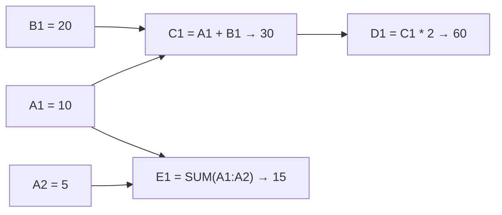
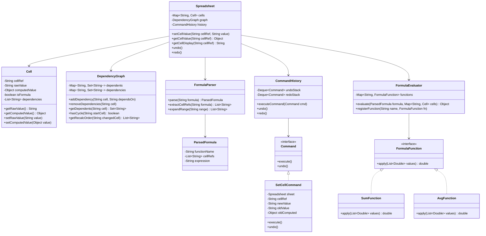

# Machine Coding: Design Google Sheets — Collaborative Spreadsheet (LLD)

## Quick Summary (TL;DR)
* **Goal**: Build an in-memory spreadsheet engine that supports cell editing, formula evaluation with dependency tracking, circular reference detection, and an undo/redo system.
* **Design Patterns Used**:
  - **Observer Pattern**: When a cell value changes, all dependent cells (formulas referencing it) are notified and recalculated automatically.
  - **Command Pattern**: Each edit is encapsulated as a `Command` object with `execute()` and `undo()`, enabling undo/redo via a command history stack.
  - **Strategy Pattern**: Pluggable formula evaluators (SUM, AVG, MIN, MAX) registered by name.
* **Core Principle**: The dependency graph (DAG) is the heart of the system. Every formula registers its dependencies, and recalculation propagates in topological order. Circular references are detected at formula-entry time via DFS.

---

## 🤓 Noob Jargon Buster

* **Dependency Graph**: A network of connections showing which cells rely on other cells. E.g., if cell `C1` contains the formula `=A1+B1`, then `A1` and `B1` are the parents (dependencies), and `C1` is the child (dependent).
* **DAG (Directed Acyclic Graph)**: A dependency graph with arrows going in one direction, and *no loops*. This is critical for spreadsheets because updates should flow in a single direction without looping forever.
* **Circular Reference**: A dependency loop. For example, if cell `A1` depends on `B1`, and `B1` depends on `A1`. If `A1` changes, it tells `B1` to update, which tells `A1` to update, creating an infinite loop. We must block this immediately.
* **Topological Sort**: A smart way to order calculations. If cell `A1` changes, and `B1` depends on `A1`, and `C1` depends on `B1`, a topological sort determines that we must calculate `A1` first, then `B1`, and then `C1` so the values are always accurate.
* **Observer Pattern (Cell Subscriptions)**: Each cell acts as a publisher. Any formulas referencing that cell become its subscribers (observers). When the publisher cell changes, it broadcasts an update, telling all its observers to recalculate.
* **Command Pattern (Undo/Redo)**: Wrapping user edits into objects (`CellEditCommand`) that know how to do an action (`execute()`) and reverse it (`undo()`). We push these onto a history stack, allowing us to roll back changes step-by-step.

---

## 1. Problem Statement & Requirements

Design a spreadsheet engine that supports:
1. **Cell Editing**: Set any cell to a raw value (number, text) or a formula (`=SUM(A1:A3)`, `=A1+B1`).
2. **Automatic Recalculation**: When cell A1 changes, all formulas depending on A1 are recalculated automatically, recursively through the dependency chain.
3. **Circular Reference Detection**: If entering a formula would create a cycle (A1 → B1 → A1), reject it and show an error.
4. **Undo / Redo**: Support undoing and redoing cell edits.
5. **Range Functions**: Support `SUM`, `AVG`, `MIN`, `MAX` over ranges like `A1:A10`.

---

## 2. Dependency Graph (The Core)



When `A1` changes from 10 to 50:
1. Look up A1's dependents: `{C1, E1}`
2. Recalculate C1 = 50 + 20 = 70. C1's dependents: `{D1}`.
3. Recalculate D1 = 70 * 2 = 140.
4. Recalculate E1 = SUM(50, 5) = 55.
5. **Topological order** ensures we never evaluate a cell before its dependencies are up-to-date.

---

## 3. Class Diagram



---

## 4. Key Java Implementation Classes

The runnable code is in [GoogleSheetsDemo.java](GoogleSheetsDemo.java).

### 1. Cell

```java
public class Cell {
    private final String cellRef;    // e.g., "A1"
    private String rawValue;         // "10" or "=A1+B1"
    private Object computedValue;    // 10 or 30.0
    private boolean isFormula;
    private List<String> dependencies = new ArrayList<>();  // cells this formula depends on
}
```

### 2. DependencyGraph — Cycle Detection + Topological Recalculation

```java
public class DependencyGraph {
    private final Map<String, Set<String>> dependents = new HashMap<>();   // A1 → {C1, E1}
    private final Map<String, Set<String>> dependencies = new HashMap<>(); // C1 → {A1, B1}

    // Detect cycles using DFS before accepting a formula
    public boolean wouldCauseCycle(String cell, List<String> newDeps) {
        // Temporarily add edges, run DFS from each newDep to see if we can reach `cell`
        for (String dep : newDeps) {
            if (dep.equals(cell) || canReach(dep, cell, new HashSet<>())) {
                return true;
            }
        }
        return false;
    }

    // BFS/DFS: get all cells to recalculate in topological order
    public List<String> getRecalcOrder(String changedCell) {
        List<String> order = new ArrayList<>();
        Queue<String> queue = new LinkedList<>();
        queue.add(changedCell);
        Set<String> visited = new LinkedHashSet<>();
        while (!queue.isEmpty()) {
            String current = queue.poll();
            for (String dep : getDependents(current)) {
                if (visited.add(dep)) {
                    order.add(dep);
                    queue.add(dep);
                }
            }
        }
        return order; // topological order for DAG
    }
}
```

### 3. Command Pattern — Undo/Redo

```java
public interface Command {
    void execute();
    void undo();
}

public class SetCellCommand implements Command {
    private final Spreadsheet sheet;
    private final String cellRef;
    private final String newValue;
    private String oldRawValue;
    private Object oldComputedValue;

    @Override
    public void execute() {
        Cell cell = sheet.getOrCreateCell(cellRef);
        this.oldRawValue = cell.getRawValue();
        this.oldComputedValue = cell.getComputedValue();
        sheet.internalSetCell(cellRef, newValue);  // Sets value + triggers recalc
    }

    @Override
    public void undo() {
        sheet.internalSetCell(cellRef, oldRawValue);  // Restore old value + recalc
    }
}

public class CommandHistory {
    private final Deque<Command> undoStack = new ArrayDeque<>();
    private final Deque<Command> redoStack = new ArrayDeque<>();

    public void executeCommand(Command cmd) {
        cmd.execute();
        undoStack.push(cmd);
        redoStack.clear();  // New action invalidates redo history
    }

    public void undo() {
        if (!undoStack.isEmpty()) {
            Command cmd = undoStack.pop();
            cmd.undo();
            redoStack.push(cmd);
        }
    }

    public void redo() {
        if (!redoStack.isEmpty()) {
            Command cmd = redoStack.pop();
            cmd.execute();
            undoStack.push(cmd);
        }
    }
}
```

### 4. Strategy Pattern — Formula Functions

```java
public interface FormulaFunction {
    double apply(List<Double> values);
}

// Register functions by name
Map<String, FormulaFunction> functions = new HashMap<>();
functions.put("SUM", values -> values.stream().mapToDouble(d -> d).sum());
functions.put("AVG", values -> values.stream().mapToDouble(d -> d).average().orElse(0));
functions.put("MIN", values -> values.stream().mapToDouble(d -> d).min().orElse(0));
functions.put("MAX", values -> values.stream().mapToDouble(d -> d).max().orElse(0));
```

---

## 5. SDE-2 Interview Angles

### Question 1: "How do you detect circular references?"

* **Answer**: "Before accepting a new formula in cell C1 that depends on `{A1, B1}`, I check if any of those dependencies can reach back to C1 through the existing dependency graph. This is a simple DFS/BFS reachability check. If `A1 → ... → C1` exists in the graph, then adding `C1 → A1` would create a cycle. I reject the formula and show `#CIRCULAR_REF!`. This check runs at formula-entry time (O(V+E)), not at evaluation time — so we never enter an infinite recalculation loop."

### Question 2: "Why Command pattern for undo instead of just storing previous values?"

* **Answer**: "Storing previous values works for simple cases, but it doesn't scale when one edit triggers cascading recalculations. If I change A1 and it causes B1, C1, D1 to recalculate, undoing A1 must also undo the cascading changes. The Command pattern encapsulates the entire operation — the `SetCellCommand.undo()` restores A1's old value AND triggers a recalculation of all dependents, which naturally restores B1, C1, D1 to their correct previous computed values."

### Question 3: "What's the time complexity of recalculation?"

* **Answer**: "When a cell changes, recalculation visits only cells downstream in the dependency DAG — not the entire sheet. The complexity is O(V + E) where V is the number of affected cells and E is the number of dependency edges among them. For a typical sheet with 500 cells and 200 formula dependencies, even a worst-case change propagates through at most ~50 cells. The topological sort (using Kahn's Algorithm based on in-degrees) ensures each cell is evaluated exactly once, and strictly *after* all its dependencies have been updated, avoiding stale value calculations."

### Question 4: "How would you handle range formulas like `=SUM(A1:A1000000)`?"

* **Answer**: "Naively, this creates 1 million dependency edges. Instead, I register a single **range dependency** `(A1:A1000000)` as a first-class concept. When any cell in the range changes, the formula is flagged for recalculation. For aggregation functions (SUM, AVG), I can optimize further with **incremental updates** — if A5 changes from 10 to 15, update the cached SUM by +5 instead of re-scanning 1M cells."

### Question 5: "How does this LLD connect to the HLD?"

* **Answer**: "This in-memory engine is exactly what runs inside the Collaboration Service in the HLD. In production, the `Spreadsheet` state is loaded from Bigtable into memory when a document is opened. The `DependencyGraph` and `FormulaEngine` run server-side so all clients see consistent computed values. The `Command` objects map to OT operations — each edit becomes an operation that can be transformed against concurrent edits from other users. The undo/redo stacks are per-user and maintained on the client side."
