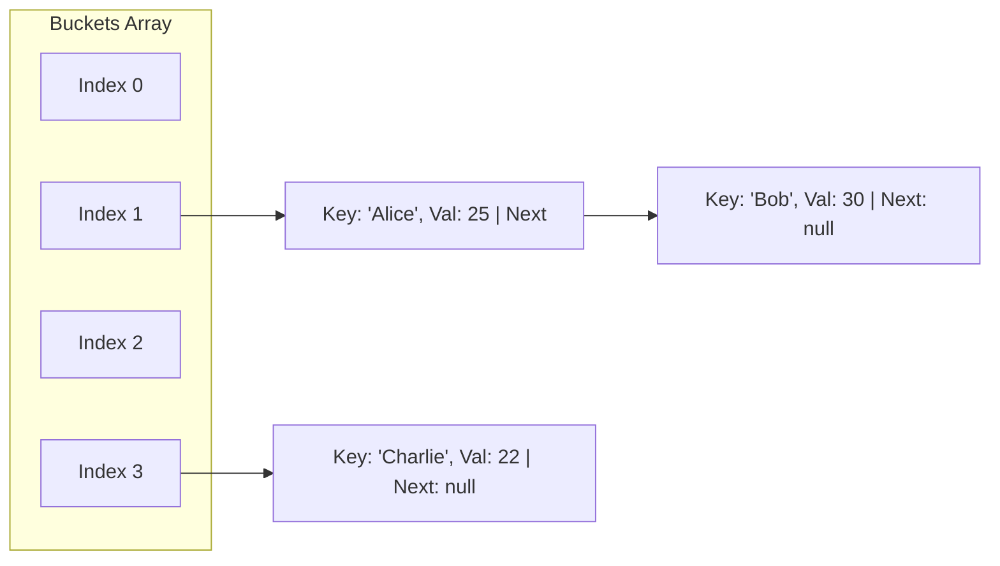

# Machine Coding: Design a Custom HashMap (LLD)

## Quick Summary (TL;DR)
* **Goal**: Implement a custom generic HashMap (`MyHashMap<K, V>`) supporting basic operations like `put()`, `get()`, and `remove()` in $O(1)$ average time complexity.
* **Collision Resolution**: **Separate Chaining** (linked list buckets) to store multiple entries sharing the same bucket index.
* **Dynamic Rehashing**: Double the bucket capacity and re-map all existing keys when the total size exceeds the `capacity * loadFactor` threshold to prevent performance degradation to $O(N)$.
* **Key Rule**: Keys must implement `hashCode()` and `equals()` correctly. Always prefer **immutable keys** (like `String` or `Integer`) to prevent hash values from changing.

---

## 🤓 Noob Jargon Buster

* **Hashing**: Converting a key (like a string `"apple"`) into a random-looking number. Think of it like assigning a unique ID number to a book so you can find it quickly on a shelf.
* **Bucket**: An index slot in our main array. If our HashMap has a capacity of 16, it has 16 buckets.
* **Collision**: When two different keys produce the same bucket index (e.g., both `"Alice"` and `"Bob"` get assigned to bucket #4).
* **Separate Chaining**: A collision-handling technique. Instead of replacing the old key, each bucket holds a LinkedList. If a collision happens, the new key-value pair is simply appended to the list at that bucket.
* **Load Factor**: The threshold (e.g., 0.75 or 75% full) that tells the HashMap when it's getting too crowded.
* **Rehashing**: When the number of entries exceeds the load factor threshold, the HashMap dynamically creates a larger array (usually double the size) and relocates all existing entries to their new bucket locations so search times stay fast ($O(1)$).

---

## 1. How a HashMap Works Under the Hood

A HashMap is built on top of a simple **Array**. 
1. **Hashing**: When you call `put(key, value)`, the map calls `key.hashCode()` to get a large integer.
2. **Index Mapping**: The large integer is compressed to fit within the array's boundaries:
   $$\text{Index} = \text{hash} \pmod{\text{Capacity}}$$
3. **Storage**: The entry is stored in the array at that specific index.

---

## 2. Collision Resolution (Separate Chaining)

A **Collision** happens when two different keys generate the same bucket index (e.g. `key1.hashCode() % capacity == key2.hashCode() % capacity`).

We resolve collisions using **Separate Chaining**. Instead of storing a single item at each array index, the array contains **Buckets** (heads of singly-linked lists). If a collision occurs, the new entry is appended to the linked list at that index.

### Visualizing Separate Chaining (Mermaid Diagram)

*Note: In index 1, "Alice" and "Bob" collided, so they are chained in a linked list.*

---

## 3. Dynamic Rehashing (Resizing)

If we keep adding items to a HashMap of size 16, the linked lists at each bucket will grow very long. The search time complexity will degrade from $O(1)$ to $O(N)$ (linear search through the list).

To prevent this, we perform **Rehashing**:
1. **Load Factor**: A threshold (default `0.75`). If the map has 16 slots, we resize when it holds $\ge 12$ items ($16 \times 0.75 = 12$).
2. **Double Capacity**: We create a new bucket array of size $2 \times \text{capacity}$ (e.g., 32).
3. **Re-map Entries**: We iterate through every node in the old array and recompute their index for the new array using `hash % new_capacity`. This spreads out the chained items across the new slots, shortening the chains back to $O(1)$ length.

### Put Operation Flowchart
```mermaid
flowchart TD
    Start[put(key, value)] --> Hash[Compute hash = Math.abs(key.hashCode())]
    Hash --> Index[Index = hash % capacity]
    Index --> FindBucket{Is bucket[index] empty?}
    
    FindBucket -- Yes --> InsertHead[Create node & insert at head of bucket] --> CheckSize
    FindBucket -- No --> Traverse[Traverse linked list at bucket]
    
    Traverse --> Match{Does key.equals(node.key) match?}
    Match -- Yes --> Update[Update node.value with new value] --> End[Exit]
    Match -- No --> NextNode{Has next node?}
    
    NextNode -- Yes --> MoveNext[Move to next node] --> Match
    NextNode -- No --> Append[Append new node to tail/head of list] --> CheckSize
    
    CheckSize{Is size >= capacity * loadFactor?}
    CheckSize -- Yes --> Resize[Double capacity & Rehash all nodes] --> End
    CheckSize -- No --> End
```

---

## 4. Key Java Implementation Classes

The runnable code is implemented in [MyHashMapDemo.java](file:///Users/rohit.kumar.4/Documents/interview-prep/lld/problems/hashmap/MyHashMapDemo.java).

### 1. The Entry Node (Linked List Node)
Each slot in our bucket array holds an `Entry<K, V>` head node:
```java
class Entry<K, V> {
    final K key;
    V value;
    Entry<K, V> next; // Chaining reference

    public Entry(K key, V value) {
        this.key = key;
        this.value = value;
    }
}
```

### 2. Hash and Index Calculation
To support generic keys, we use Java's native `.hashCode()` and handle `null` values:
```java
private int getBucketIndex(K key) {
    if (key == null) return 0; // null keys always go to index 0
    return Math.abs(key.hashCode()) % capacity;
}
```

---

## 5. SDE-2 Interview Focus Areas (Get Prepared!) 🥩

### Q1: "How does Java 8 optimize HashMap collisions?"
* **Answer**: In Java 7, if many keys collided, bucket lookup was $O(K)$ where $K$ is the chain length. 
* **Java 8 Optimization**: If the linked list length at a single bucket exceeds a threshold (**`TREEIFY_THRESHOLD = 8`**) AND the total capacity of the map is at least **64**, Java 8 converts the linked list into a **Red-Black Tree** (Self-Balancing Binary Search Tree). This improves the worst-case lookup time from $O(K)$ to **$O(\log K)$**. If the items are removed and count falls to **`UNTREEIFY_THRESHOLD = 6`**, it converts back to a linked list.

### Q2: "Why should keys in a HashMap be Immutable?"
* **Answer**: If a key's fields are modified after it is placed in the HashMap, its `hashCode()` will change. When you try to call `get(key)` later, the map will calculate a *new* index based on the *new* hash code, look in the wrong bucket, and fail to find the item (returning `null`). The original object is now trapped in the map forever (causing a **memory leak**).

### Q3: "What is the difference between Separate Chaining and Open Addressing?"
* **Separate Chaining**: Uses external linked lists (buckets). Easier to implement, handles high load factors gracefully, but wastes memory on pointers.
* **Open Addressing**: All items are stored inside the array itself. If a collision occurs, it probes for the next empty slot using:
  - **Linear Probing**: Index + 1, Index + 2... (creates primary clustering).
  - **Quadratic Probing**: Index + $1^2$, Index + $2^2$...
  - **Double Hashing**: Uses a second hash function to calculate step size.
  - *Drawback*: Degrades extremely fast when the load factor exceeds 0.7.
