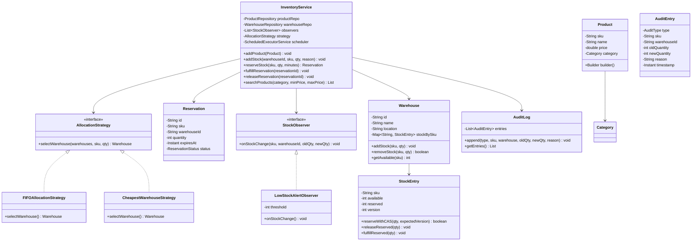

# Machine Coding: Design an Inventory Management System (LLD)

## Quick Summary (TL;DR)
* **Goal**: Build a warehouse/e-commerce inventory system that handles products, multi-warehouse stock, reservations during checkout, low-stock alerts, and a full audit trail.
* **Design Patterns Used**:
  - **Observer Pattern**: Low-stock alerts and stock-change notifications.
  - **Strategy Pattern**: Pluggable warehouse allocation policies (FIFO, nearest, cheapest).
  - **Builder Pattern**: Fluent product construction with validation.
  - **Repository Pattern**: Clean data-access abstraction over in-memory stores.
* **Core Principle**: Thread-safe stock operations via optimistic locking (version-based CAS), time-bounded reservations, and an append-only audit log for traceability.

---

## Noob Jargon Buster

* **SKU (Stock Keeping Unit)**: A unique identifier for a product variant. Think of it as a barcode — "LAPTOP-001" identifies a specific laptop model in the system. Every stock movement references a SKU.
* **Warehouse**: A physical location that stores products. An e-commerce company might have warehouses in Mumbai, Delhi, and Bangalore. Each warehouse tracks its own stock levels independently.
* **Reservation**: A temporary hold on stock during checkout. When a user adds an item to their cart and begins payment, the system "reserves" that quantity so no other buyer can claim it. If payment doesn't complete within X minutes, the reservation expires and stock is released.
* **Optimistic Locking**: A concurrency strategy where instead of locking a row, you read a version number, do your work, and at write time check that nobody else changed the version. If they did, you retry. This avoids blocking threads and scales better than `synchronized`.
* **Audit Trail**: An append-only log of every stock change — who changed it, when, why, and the before/after quantities. Critical for compliance, debugging discrepancies, and inventory reconciliation.

---

## 1. Problem Statement & Requirements

Design an inventory management system that supports:

### Functional Requirements
1. **Product Catalog**: Create products with SKU, name, price, and category. Use Builder pattern for clean construction.
2. **Multi-Warehouse**: Each warehouse has a name, location, and independent stock levels per SKU.
3. **Stock Operations**: Add stock, remove stock, transfer stock between warehouses.
4. **Reservation System**: Reserve stock for N minutes during checkout. Auto-release if not fulfilled.
5. **Order Fulfillment**: Convert a reservation into a confirmed sale (deduct reserved stock permanently).
6. **Low-Stock Alerts**: Observer pattern — notify registered listeners when stock drops below a configurable threshold.
7. **Search/Filter**: Find products by category, price range, or availability across warehouses.
8. **Audit Trail**: Log every stock change with timestamp, reason, before/after quantities.

### Non-Functional Requirements
1. **Thread Safety**: Concurrent stock updates must not cause overselling. Use optimistic locking (version + CAS).
2. **Reservation Expiry**: Background thread releases expired reservations automatically.
3. **Extensibility**: Adding a new allocation strategy or observer should not modify existing code (Open/Closed Principle).

---

## 2. Inventory Operations Flow

### Add Stock
```
Warehouse receives shipment
  |
  v
InventoryService.addStock(warehouseId, sku, quantity, reason)
  |
  v
StockEntry found? --YES--> increment quantity, bump version
                   --NO--> create new StockEntry(sku, qty, version=0)
  |
  v
AuditLog.append(ADD, sku, warehouse, oldQty, newQty, reason, timestamp)
  |
  v
Notify observers (check low-stock threshold)
```

### Reserve Stock (Checkout)
```
User clicks "Buy Now"
  |
  v
InventoryService.reserveStock(sku, quantity, durationMinutes)
  |
  v
AllocationStrategy.selectWarehouse(warehouses, sku, quantity)
  |
  +--- FIFOStrategy: pick first warehouse with enough stock
  +--- NearestWarehouseStrategy: pick warehouse closest to customer
  +--- CheapestWarehouseStrategy: pick warehouse with lowest shipping cost
  |
  v
Warehouse found? --YES--> CAS: decrement available, increment reserved
                  --NO--> throw InsufficientStockException
  |
  v
Create Reservation(id, sku, warehouse, qty, expiresAt)
  |
  v
AuditLog.append(RESERVE, sku, warehouse, oldQty, newQty, "checkout reservation")
  |
  v
ScheduledExecutorService schedules expiry check at expiresAt
```

### Fulfill Order
```
Payment confirmed
  |
  v
InventoryService.fulfillReservation(reservationId)
  |
  v
Reservation valid & not expired?
  --YES--> decrement reserved count, mark reservation FULFILLED
  --NO---> throw ReservationExpiredException
  |
  v
AuditLog.append(FULFILL, sku, warehouse, reservedQty, 0, "order confirmed")
```

### Cancel / Expire Reservation
```
Timer fires OR user cancels
  |
  v
InventoryService.releaseReservation(reservationId)
  |
  v
Increment available stock, decrement reserved count
  |
  v
AuditLog.append(RELEASE, sku, warehouse, oldQty, newQty, "reservation expired")
  |
  v
Notify observers (stock restored — might clear low-stock alert)
```

---

## 3. Class Design & Architecture



---

## 4. Key Java Implementation

The runnable code is in [InventoryManagementDemo.java](InventoryManagementDemo.java).

### 1. Product Builder
```java
class Product {
    // ... fields ...
    static class Builder {
        private String sku, name;
        private double price;
        private Category category;

        Builder sku(String s) { this.sku = s; return this; }
        Builder name(String n) { this.name = n; return this; }
        Builder price(double p) { this.price = p; return this; }
        Builder category(Category c) { this.category = c; return this; }

        Product build() {
            Objects.requireNonNull(sku, "SKU is required");
            Objects.requireNonNull(name, "Name is required");
            return new Product(sku, name, price, category);
        }
    }
}
```

### 2. Optimistic Locking on StockEntry
```java
class StockEntry {
    private int available;
    private int reserved;
    private int version; // bumped on every mutation

    synchronized boolean reserveWithCAS(int qty, int expectedVersion) {
        if (this.version != expectedVersion) return false; // CAS fail — retry
        if (this.available < qty) return false;            // not enough stock
        this.available -= qty;
        this.reserved += qty;
        this.version++;
        return true;
    }
}
```
The `synchronized` here simulates CAS. In a real DB, you'd use `UPDATE ... SET version=version+1 WHERE version=? AND available >= ?`.

### 3. Allocation Strategy
```java
interface AllocationStrategy {
    Warehouse selectWarehouse(List<Warehouse> warehouses, String sku, int qty);
}

// First warehouse with enough stock — simple, predictable
class FIFOAllocationStrategy implements AllocationStrategy { ... }

// Warehouse with the most stock — spreads load, reduces risk
class CheapestWarehouseStrategy implements AllocationStrategy { ... }
```

### 4. Observer for Low-Stock Alerts
```java
interface StockObserver {
    void onStockChange(String sku, String warehouseId, int oldQty, int newQty);
}

class LowStockAlertObserver implements StockObserver {
    private final int threshold;

    void onStockChange(String sku, String warehouseId, int oldQty, int newQty) {
        if (newQty < threshold && oldQty >= threshold) {
            System.out.println("[LOW STOCK ALERT] " + sku + " at " + warehouseId
                    + " dropped to " + newQty + " (threshold: " + threshold + ")");
        }
    }
}
```

### 5. Reservation with Auto-Expiry
```java
class Reservation {
    private final Instant expiresAt;
    private ReservationStatus status; // ACTIVE, FULFILLED, EXPIRED

    boolean isExpired() { return Instant.now().isAfter(expiresAt); }
}

// In InventoryService:
scheduler.schedule(() -> {
    if (reservation.getStatus() == ReservationStatus.ACTIVE) {
        releaseReservation(reservation.getId());
    }
}, durationMinutes, TimeUnit.MINUTES);
```

### 6. Audit Trail
```java
class AuditLog {
    private final List<AuditEntry> entries = new CopyOnWriteArrayList<>();

    void append(AuditType type, String sku, String warehouseId,
                int oldQty, int newQty, String reason) {
        entries.add(new AuditEntry(type, sku, warehouseId,
                oldQty, newQty, reason, Instant.now()));
    }
}
```
`CopyOnWriteArrayList` ensures thread-safe reads without locking. In production, this would be an append-only database table or an event log (Kafka topic).

---

## 5. SDE-2 Interview Angles

### Question 1: "How do you handle concurrent stock decrements — e.g., 100 users trying to buy the last 5 items?"

* **Problem**: Without protection, two threads read `available=5`, both decrement to `0`, and you've sold 10 items when you only had 5.
* **Three approaches**:
  1. **Pessimistic Locking** (`synchronized` / `SELECT ... FOR UPDATE`): Simple but creates a bottleneck. One thread holds the lock; everyone else waits. Works for low contention.
  2. **Optimistic Locking** (version column): Read the version, do your update, write back with `WHERE version = expectedVersion`. If someone else updated first, your write fails and you retry. Best for moderate contention — no blocking, just retries.
  3. **CAS (Compare-And-Swap)** (`AtomicInteger.compareAndSet`): Lock-free, hardware-level. Perfect for in-memory counters but doesn't translate directly to databases.
* **In our demo**: We use `synchronized` + version check to simulate optimistic locking. In production with a DB, you'd use `UPDATE stock SET available = available - ?, version = version + 1 WHERE sku = ? AND version = ? AND available >= ?`. If `rowsAffected == 0`, retry or fail.
* **Flash sale optimization**: Pre-shard the stock. Instead of one row with `available=1000`, create 10 rows with `available=100` each. Reduces lock contention by 10x.

### Question 2: "How do you handle reservation expiry — what if the user abandons checkout?"

* **Problem**: Stock is reserved but never purchased. Without cleanup, it's stuck in limbo forever.
* **Approach 1 — Scheduled Executor**: When creating a reservation, schedule a `Runnable` that fires after the TTL and calls `releaseReservation()`. Simple but doesn't survive process restarts.
* **Approach 2 — Polling sweep**: A background thread runs every 30 seconds, queries `SELECT * FROM reservations WHERE status = ACTIVE AND expires_at < NOW()`, and releases each one. Survives restarts but has up to 30s latency.
* **Approach 3 — Redis TTL**: Store the reservation in Redis with `EXPIRE`. When the key expires, a keyspace notification triggers the release. Sub-second accuracy, distributed, but adds infrastructure.
* **In our demo**: We use `ScheduledExecutorService.schedule()` for simplicity. The task checks if the reservation is still `ACTIVE` before releasing (idempotent).

### Question 3: "How do you prevent overselling during a flash sale?"

* **The fundamental issue**: Database-level contention on a single row (the hot SKU) under extreme read+write load.
* **Solution stack**:
  1. **Pre-decrement in Redis**: Maintain a counter in Redis (`DECR`). If it goes below 0, reject immediately without hitting the DB. The DB update happens asynchronously.
  2. **Stock sharding**: Split `available=10000` across 10 partitions of 1000 each. Each partition can be locked independently, giving 10x throughput.
  3. **Queue-based**: Put all purchase requests into a message queue (Kafka/SQS). A single consumer processes them sequentially — no contention at all, but adds latency.
  4. **Two-phase**: First phase (in Redis) is fast "maybe yes". Second phase (in DB) is the authoritative commit. If Redis said yes but DB says no (race), refund/apologize.
* **Key insight**: Accept that a tiny fraction of oversells may happen. Design the business process to handle it gracefully (apologize + coupon) rather than making the system 100% perfect at the cost of throughput.

### Question 4: "How do you decide which warehouse to fulfill from when stock exists in multiple locations?"

* **This is exactly what the Strategy Pattern solves**:
  - **FIFO / First-Available**: Pick the first warehouse with stock. Simplest, good for single-region setups.
  - **Nearest Warehouse**: Minimize shipping distance/time. Requires customer location as input. Best for customer experience (faster delivery).
  - **Cheapest Warehouse**: Minimize shipping cost. May sacrifice delivery speed for margin.
  - **Stock-Balancing**: Pick the warehouse with the most stock to keep inventory evenly distributed. Reduces risk of one warehouse running out.
  - **Split Fulfillment**: If no single warehouse has enough, split across multiple. Complex but maximizes fill rate.
* **In production**: This is often a weighted scoring function combining distance, cost, stock level, and warehouse capacity. The Strategy interface stays the same — only the implementation changes.

### Question 5: "How would you design the audit trail? What about event sourcing?"

* **Append-only log**: Every stock change is an `AuditEntry` with `(timestamp, type, sku, warehouse, oldQty, newQty, reason, userId)`. Never update or delete entries.
* **Event sourcing lite**: Instead of storing current state + audit log separately, you could derive current state entirely from the event log: `ADDED 100 -> RESERVED 5 -> FULFILLED 5 -> ADDED 50 = current available = 145`. This gives you time-travel (replay to any point) and perfect auditability.
* **Practical concerns**:
  - **Storage**: Append-only grows forever. Use partitioning by date or SKU. Archive old entries to cold storage.
  - **Query performance**: For "current stock level", don't replay all events. Maintain a materialized view (snapshot) and rebuild periodically.
  - **Compliance**: Financial/pharmaceutical inventory systems legally require immutable audit trails. Event sourcing is a natural fit.
* **In our demo**: We use a simple `CopyOnWriteArrayList<AuditEntry>`. In production, this would be a dedicated `audit_log` table or a Kafka topic with infinite retention.

### Question 6: "How do you scale to millions of SKUs across hundreds of warehouses?"

* **Read path**: Product catalog searches go to Elasticsearch or a read replica. The write DB (PostgreSQL) doesn't serve search queries.
* **Write path**: Shard the `stock` table by SKU hash or category. Each shard handles a subset of SKUs independently.
* **Caching**: Hot SKU stock levels are cached in Redis. Cache invalidation on every stock change (write-through or write-behind).
* **Multi-region**: Each region has its own set of warehouses. A global routing layer decides which region handles the request based on customer location.
* **Async processing**: Stock updates, audit logging, and observer notifications are published to a message queue. Consumers process them asynchronously to decouple the hot write path from downstream systems.
