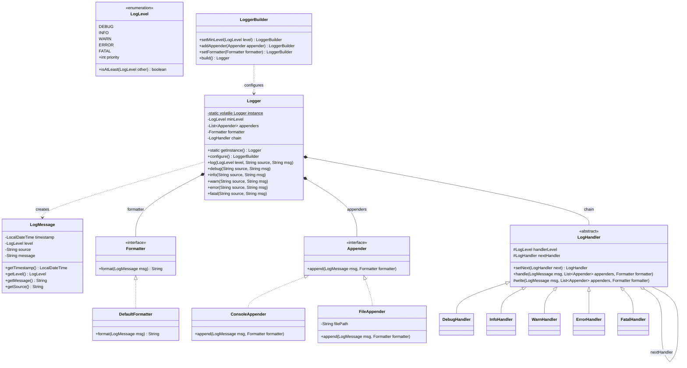

# Machine Coding: Design a Logging Framework (LLD)

## Quick Summary (TL;DR)
* **Goal**: Build a Log4j-style logging framework that supports configurable log levels, multiple output destinations (appenders), formatted messages, and a clean chain-of-responsibility pipeline for filtering.
* **Design Patterns Used**:
  - **Singleton**: Single global Logger instance — one config, one entry point.
  - **Chain of Responsibility**: Each log-level handler decides whether to process or pass on a message.
  - **Builder**: Fluent Logger configuration (set level, attach appenders, set formatter).
  - **Strategy**: Appenders are pluggable output strategies (console, file, database).
* **Core Principle**: Separate *what* to log (LogMessage) from *where* to log (Appender) and *whether* to log (LogLevel filtering via the chain).

---

## Noob Jargon Buster

* **Appender**: A destination where log output is written. `ConsoleAppender` writes to `System.out`, `FileAppender` writes to a file, `DatabaseAppender` could write to a DB table. The term comes from Log4j — it "appends" a line of output.
* **Log Level**: A severity ranking for messages. From lowest to highest: `DEBUG < INFO < WARN < ERROR < FATAL`. When you set the logger to `WARN`, only messages at `WARN`, `ERROR`, and `FATAL` are emitted — everything below is silently dropped.
* **Formatter**: Transforms a raw `LogMessage` into a printable string. E.g., `[2025-05-30 10:15:03] [ERROR] [OrderService] Payment gateway timeout` — the formatter decided the layout.
* **Handler Chain**: A linked list of handlers, one per log level. A message enters at the top and walks down the chain until it finds a handler whose level matches (or exceeds) the message level. This is the Chain of Responsibility pattern.
* **Log Rotation**: The practice of closing a log file once it hits a size or age limit and starting a new one, so you don't fill the disk with a single enormous file.

---

## 1. Problem Statement & Requirements

Design a logging framework that supports:
1. **Log Levels**: `DEBUG`, `INFO`, `WARN`, `ERROR`, `FATAL` — ordered by severity.
2. **Level Filtering**: Logger has a minimum level. Messages below that level are discarded.
3. **Multiple Appenders**: Attach one or more appenders (console, file) to the same logger. Every qualifying message is written to all appenders.
4. **Formatted Output**: Each appender uses a `Formatter` to convert a `LogMessage` into a string. Default format: `[timestamp] [LEVEL] [source] message`.
5. **Singleton Logger**: One global logger instance, configured via a Builder.
6. **Chain of Responsibility**: Internally, filtering uses a chain of level handlers — each handler processes messages at its own level and forwards to the next handler in the chain.
7. **Thread Safety**: The logger must be safe to call from multiple threads simultaneously.

---

## 2. Log Level Chain / Processing Pipeline

A log message flows through a chain of handlers. Each handler checks: "Is this message at my level?" If yes, it processes it (writes to all appenders). Regardless, it forwards the message to the next handler.

The Logger's minimum level acts as a gate *before* the chain — messages below the threshold never enter the chain at all.

```
Caller: logger.error("DB connection lost")
  |
  v
Logger.log(ERROR, "DB connection lost")
  |
  v
Level check: ERROR >= minLevel (WARN)?  --NO--> discard, return
  |
  YES
  v
Create LogMessage(timestamp, ERROR, source, "DB connection lost")
  |
  v
+---------------------+     +---------------------+     +---------------------+
| DebugHandler        | --> | InfoHandler         | --> | WarnHandler         | -->
| level == DEBUG      |     | level == INFO       |     | level == WARN       |
| msg is ERROR? skip  |     | msg is ERROR? skip  |     | msg is ERROR? skip  |
+---------------------+     +---------------------+     +---------------------+
                                                              |
      +---------------------+     +---------------------+    |
  --> | ErrorHandler        | --> | FatalHandler        |    |
      | level == ERROR      |     | level == FATAL      |
      | msg is ERROR? YES   |     | msg is ERROR? skip  |
      | -> write to all     |     +---------------------+
      |    appenders         |
      +---------------------+

Appenders (attached to Logger):
  +---> ConsoleAppender.append(logMessage)  --> System.out
  +---> FileAppender.append(logMessage)     --> app.log
```

**Why Chain of Responsibility here?** In a real framework you might want per-level behavior: ERROR messages could trigger an alert, WARN could increment a metric, DEBUG might add stack traces. Each handler encapsulates level-specific logic without if-else chains.

---

## 3. Class Design & Architecture



---

## 4. Key Java Implementation

### LogLevel enum with priority ordering

```java
enum LogLevel {
    DEBUG(1), INFO(2), WARN(3), ERROR(4), FATAL(5);

    private final int priority;
    LogLevel(int priority) { this.priority = priority; }

    public boolean isAtLeast(LogLevel other) {
        return this.priority >= other.priority;
    }
}
```

### Chain of Responsibility — abstract LogHandler

```java
abstract class LogHandler {
    protected LogLevel handlerLevel;
    protected LogHandler nextHandler;

    public LogHandler(LogLevel handlerLevel) {
        this.handlerLevel = handlerLevel;
    }

    public LogHandler setNext(LogHandler next) {
        this.nextHandler = next;
        return next;
    }

    public void handle(LogMessage msg, List<Appender> appenders, Formatter formatter) {
        if (msg.getLevel() == this.handlerLevel) {
            write(msg, appenders, formatter);
        }
        if (nextHandler != null) {
            nextHandler.handle(msg, appenders, formatter);
        }
    }

    protected void write(LogMessage msg, List<Appender> appenders, Formatter formatter) {
        for (Appender appender : appenders) {
            appender.append(msg, formatter);
        }
    }
}
```

### Singleton Logger with double-checked locking

```java
class Logger {
    private static volatile Logger instance;

    private LogLevel minLevel;
    private final List<Appender> appenders;
    private Formatter formatter;
    private LogHandler chain;

    private Logger() {
        this.appenders = new ArrayList<>();
        this.minLevel = LogLevel.DEBUG;
        this.formatter = new DefaultFormatter();
        this.chain = buildChain();
    }

    public static Logger getInstance() {
        if (instance == null) {
            synchronized (Logger.class) {
                if (instance == null) {
                    instance = new Logger();
                }
            }
        }
        return instance;
    }

    public void log(LogLevel level, String source, String message) {
        if (!level.isAtLeast(minLevel)) return;          // gate
        LogMessage msg = new LogMessage(level, source, message);
        chain.handle(msg, appenders, formatter);          // enter chain
    }
    // ... convenience methods: debug(), info(), warn(), error(), fatal()
}
```

### Builder for configuration

```java
class LoggerBuilder {
    private LogLevel minLevel = LogLevel.DEBUG;
    private final List<Appender> appenders = new ArrayList<>();
    private Formatter formatter = new DefaultFormatter();

    public LoggerBuilder setMinLevel(LogLevel level) { this.minLevel = level; return this; }
    public LoggerBuilder addAppender(Appender a)     { this.appenders.add(a); return this; }
    public LoggerBuilder setFormatter(Formatter f)   { this.formatter = f; return this; }

    public Logger build() {
        Logger logger = Logger.getInstance();
        logger.configure(this.minLevel, this.appenders, this.formatter);
        return logger;
    }
}
```

---

## 5. SDE-2 Interview Angles

### Q1: Why must the Singleton Logger be thread-safe, and what are the options?

**Problem**: Multiple threads calling `Logger.getInstance()` simultaneously could create two instances if the check-then-act is not atomic.

**Options**:
| Approach | Pros | Cons |
|----------|------|------|
| Eager initialization (`static final`) | Simple, no synchronization needed | Instance created even if never used |
| Double-checked locking (`volatile` + `synchronized`) | Lazy, minimal lock contention | Slightly more complex; `volatile` is critical (prevents instruction reordering) |
| Enum singleton (`enum Logger { INSTANCE }`) | Serialization-safe, reflection-safe, simplest | Cannot extend a class; awkward for DI frameworks |
| `Holder` idiom (inner static class) | Lazy, no `volatile`, no `synchronized` | Less well-known |

**Best for interviews**: Double-checked locking (shows you understand `volatile` and JMM) or Enum singleton (shows you know Joshua Bloch's Effective Java Item 3).

---

### Q2: How would you implement async logging?

Synchronous logging blocks the caller thread on I/O (file write, network). For high-throughput systems:

```
Caller thread                    Background consumer
     |                                  |
     +-- logger.info("msg") -->         |
     |   put into BlockingQueue   ----> |
     |   return immediately             |-- poll from queue
     |                                  |-- format + write to appenders
```

**Implementation sketch**:
- Replace direct `appender.append()` with `queue.offer(logMessage)`.
- A single daemon thread (`Thread.setDaemon(true)`) runs in a loop: `queue.take()` then writes to all appenders.
- Use `LinkedBlockingQueue` with a bounded capacity (e.g., 8192). If full, either drop (`offer` returns false) or block (`put`).
- On shutdown, flush remaining items: `queue.drainTo(list)`, process, then close appenders.

**Trade-off**: You gain throughput but lose guaranteed delivery — if the JVM crashes, buffered messages are lost. Log4j2's `AsyncAppender` uses the LMAX Disruptor ring buffer for this exact reason.

---

### Q3: How do you add a new appender (Database, Kafka) without modifying existing code? (OCP)

The `Appender` interface is the extension point:

```java
class KafkaAppender implements Appender {
    private final KafkaProducer<String, String> producer;
    private final String topic;

    @Override
    public void append(LogMessage msg, Formatter formatter) {
        String formatted = formatter.format(msg);
        producer.send(new ProducerRecord<>(topic, formatted));
    }
}
```

Then attach it:
```java
Logger.getInstance().configure()
    .addAppender(new ConsoleAppender())
    .addAppender(new KafkaAppender(producer, "app-logs"))
    .build();
```

No existing class is modified. This is the **Open/Closed Principle** — open for extension (new appenders), closed for modification (Logger, existing appenders unchanged).

---

### Q4: How would you implement log rotation?

**Size-based rotation** in `FileAppender`:

```java
class RotatingFileAppender implements Appender {
    private final String basePath;
    private final long maxSizeBytes;  // e.g., 10 * 1024 * 1024 (10 MB)
    private int fileIndex = 0;
    private long currentSize = 0;
    private PrintWriter writer;

    @Override
    public void append(LogMessage msg, Formatter formatter) {
        String line = formatter.format(msg);
        if (currentSize + line.length() > maxSizeBytes) {
            rotate();
        }
        writer.println(line);
        currentSize += line.length();
    }

    private void rotate() {
        writer.close();
        fileIndex++;
        // rename app.log -> app.log.1, open new app.log
        writer = new PrintWriter(new FileWriter(basePath, false));
        currentSize = 0;
    }
}
```

**Real-world additions**: time-based rotation (daily), compression of rotated files (`.gz`), max history (delete files older than N days), combining size + time policies.

---

### Q5: Why should string formatting be lazy (supplier-based)?

**Problem**: Even if DEBUG is disabled, the caller still pays for string concatenation:

```java
logger.debug("User " + userId + " cart: " + cart.toString());  // toString() runs even if DEBUG is off
```

**Solution**: Accept a `Supplier<String>` and only invoke it if the message will actually be logged:

```java
public void debug(String source, Supplier<String> msgSupplier) {
    if (LogLevel.DEBUG.isAtLeast(minLevel)) {
        log(LogLevel.DEBUG, source, msgSupplier.get());  // invoked only when needed
    }
}

// Usage — lambda is NOT evaluated if DEBUG is filtered out
logger.debug("CartService", () -> "User " + userId + " cart: " + cart.toString());
```

SLF4J uses parameterized messages (`log.debug("User {} cart {}", userId, cart)`) which avoids concatenation but still calls `toString()` on arguments. The `Supplier` approach defers *everything*.

---

### Q6: How does SLF4J's facade pattern differ from this design?

**SLF4J** is a **facade** — it defines an API (`org.slf4j.Logger`) but contains zero implementation. At deployment time, a binding (Logback, Log4j2) is placed on the classpath and SLF4J delegates to it via `ServiceLoader` / static binding.

| Aspect | Our Design | SLF4J + Logback |
|--------|-----------|-----------------|
| API and impl | Coupled in one framework | API (SLF4J) decoupled from impl (Logback) |
| Swapping backend | Requires code changes | Swap a JAR on the classpath, zero code changes |
| Configuration | Programmatic (Builder) | XML/YAML config files |
| Level filtering | Chain of Responsibility | Level integer comparison (simpler, faster) |
| Multiple appenders | Strategy pattern list | Same concept, XML-configured |

**Interview takeaway**: Our design demonstrates the *internal mechanics*. SLF4J shows the *architectural separation* between API and implementation — a Facade pattern on top of the same underlying ideas.
