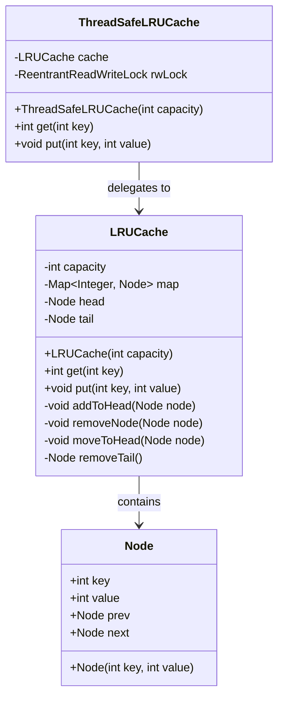

# Machine Coding: Design an LRU Cache (LLD)

## Quick Summary (TL;DR)

| Aspect | Detail |
|--------|--------|
| **Goal** | Design a fixed-capacity key-value cache that evicts the Least Recently Used entry when full |
| **Design Patterns** | Strategy (eviction policy), Proxy/Decorator (thread-safe wrapper) |
| **Core Principle** | HashMap for O(1) lookup + Doubly-Linked List for O(1) recency tracking = O(1) get/put |

---

## Noob Jargon Buster

| Term | Plain English |
|------|---------------|
| **LRU** | Least Recently Used -- the item that hasn't been touched for the longest time gets kicked out first |
| **Doubly-Linked List (DLL)** | A chain of nodes where each node knows its previous AND next neighbor, so you can unlink any node in O(1) |
| **Sentinel / Dummy node** | Fake head/tail nodes in the DLL that eliminate null-checks at boundaries |
| **Cache hit** | The key you asked for exists in the cache |
| **Cache miss** | The key isn't in the cache; you may need to fetch from a slower source |
| **Eviction** | Removing an entry to make room when the cache is at capacity |
| **ReentrantReadWriteLock** | A Java lock that allows many concurrent readers but only one writer, improving throughput over a plain `synchronized` |

---

## 1. Problem Statement & Requirements

### Functional Requirements

- `get(key)` -- Return the value if the key exists; mark it as most-recently used. Return `-1` on miss.
- `put(key, value)` -- Insert or update. If the cache is at capacity, evict the least-recently used entry first.
- Both operations must run in **O(1)** time.

### Non-Functional Requirements

- Thread-safety for concurrent access (SDE-2 expectation).
- Configurable capacity.
- Clean separation so the eviction policy could be swapped (e.g., LFU).

### Constraints (LeetCode 146 style)

```
1 <= capacity <= 3000
0 <= key, value <= 10^4
At most 2 * 10^5 calls to get and put
```

---

## 2. Core Algorithm: HashMap + Doubly-Linked List

### Why this combination?

| Need | Data Structure | Provides |
|------|---------------|----------|
| O(1) lookup by key | HashMap<Key, Node> | Instant access to any node |
| O(1) insert/remove + ordering | Doubly-Linked List | Move-to-head, remove-from-tail in constant time |

Neither structure alone gives both -- together they do.

### How it works (ASCII walkthrough)

**State after `put(1,A)`, `put(2,B)`, `put(3,C)` with capacity=3:**

```
  HashMap                   Doubly-Linked List (MRU -> LRU)
  ┌───────────┐
  │ 1 -> Node1 │            HEAD <-> [3,C] <-> [2,B] <-> [1,A] <-> TAIL
  │ 2 -> Node2 │                      MRU                  LRU
  │ 3 -> Node3 │
  └───────────┘
```

**Now `get(1)` -- move Node1 to head (most recent):**

```
  HashMap                   Doubly-Linked List
  ┌───────────┐
  │ 1 -> Node1 │            HEAD <-> [1,A] <-> [3,C] <-> [2,B] <-> TAIL
  │ 2 -> Node2 │                      MRU                  LRU
  │ 3 -> Node3 │
  └───────────┘
```

**Now `put(4,D)` -- capacity full, evict LRU (node just before TAIL):**

```
  1. Remove [2,B] from DLL (prev of TAIL)
  2. Remove key=2 from HashMap
  3. Insert [4,D] after HEAD
  4. Add key=4 to HashMap

  HashMap                   Doubly-Linked List
  ┌───────────┐
  │ 1 -> Node1 │            HEAD <-> [4,D] <-> [1,A] <-> [3,C] <-> TAIL
  │ 3 -> Node3 │                      MRU                  LRU
  │ 4 -> Node4 │
  └───────────┘
```

### Core operations on the DLL

```
addToHead(node):
    node.next = head.next
    node.prev = head
    head.next.prev = node
    head.next = node

removeNode(node):
    node.prev.next = node.next
    node.next.prev = node.prev

moveToHead(node):
    removeNode(node)
    addToHead(node)

removeTail():              // returns the evicted node
    node = tail.prev
    removeNode(node)
    return node
```

---

## 3. Class Design & Architecture



---

## 4. Key Java Implementation

### Node

```java
class Node {
    int key, value;
    Node prev, next;

    Node(int key, int value) {
        this.key = key;
        this.value = value;
    }
}
```

### LRUCache core

```java
class LRUCache {
    private final int capacity;
    private final Map<Integer, Node> map;
    private final Node head, tail; // sentinels

    LRUCache(int capacity) {
        this.capacity = capacity;
        this.map = new HashMap<>();
        head = new Node(0, 0);
        tail = new Node(0, 0);
        head.next = tail;
        tail.prev = head;
    }

    int get(int key) {
        Node node = map.get(key);
        if (node == null) return -1;
        moveToHead(node);
        return node.value;
    }

    void put(int key, int value) {
        Node existing = map.get(key);
        if (existing != null) {
            existing.value = value;
            moveToHead(existing);
        } else {
            if (map.size() == capacity) {
                Node evicted = removeTail();
                map.remove(evicted.key);
            }
            Node newNode = new Node(key, value);
            map.put(key, newNode);
            addToHead(newNode);
        }
    }
    // ... DLL helper methods (addToHead, removeNode, moveToHead, removeTail)
}
```

The sentinel nodes (`head` and `tail`) are dummy placeholders -- they never hold real data. This eliminates every `if (head == null)` / `if (tail == null)` check and makes boundary operations uniform.

### Thread-safe wrapper (ReentrantReadWriteLock)

```java
class ThreadSafeLRUCache {
    private final LRUCache cache;
    private final ReentrantReadWriteLock lock = new ReentrantReadWriteLock();

    ThreadSafeLRUCache(int capacity) {
        this.cache = new LRUCache(capacity);
    }

    int get(int key) {
        lock.writeLock().lock();  // WRITE lock, not read -- get() mutates DLL order
        try {
            return cache.get(key);
        } finally {
            lock.writeLock().unlock();
        }
    }

    void put(int key, int value) {
        lock.writeLock().lock();
        try {
            cache.put(key, value);
        } finally {
            lock.writeLock().unlock();
        }
    }
}
```

> **Why writeLock for `get()`?** Because `get()` calls `moveToHead()`, which mutates the linked list. A read lock would allow concurrent `get()` calls to corrupt the DLL pointers. This is a common interview trap.

---

## 5. SDE-2 Interview Angles

### Q1: Why not just use `LinkedHashMap`?

**Answer:** Java's `LinkedHashMap` with `accessOrder=true` and overridden `removeEldestEntry()` gives you a one-liner LRU cache:

```java
Map<Integer, Integer> lru = new LinkedHashMap<>(capacity, 0.75f, true) {
    @Override
    protected boolean removeEldestEntry(Map.Entry<Integer, Integer> eldest) {
        return size() > capacity;
    }
};
```

In an interview, mention this to show awareness, but implement the DLL+HashMap version to demonstrate you understand the underlying mechanics. `LinkedHashMap` is also **not thread-safe** and doesn't expose the eviction event for custom logic (e.g., writing back dirty entries).

### Q2: How do you make the LRU cache thread-safe?

**Answer:** Three approaches, escalating in sophistication:

| Approach | Pros | Cons |
|----------|------|------|
| `synchronized` on every method | Simple | Coarse-grained; no concurrent reads |
| `ReentrantReadWriteLock` | Allows concurrent reads (if get didn't mutate) | `get()` still needs write lock because it reorders the DLL |
| `ConcurrentHashMap` + striped locks | High throughput | Complex; need to partition the DLL or use lock striping |

The `ReentrantReadWriteLock` approach is shown in Section 4. The key insight interviewers test: **`get()` is not a pure read** -- it mutates the linked list, so it needs a write lock (or you must redesign so reads don't mutate shared state).

A production-grade alternative: use **Caffeine** (Ben Manes), which uses a concurrent, lock-free design with a write buffer and read buffer.

### Q3: How would you add TTL-based expiration?

**Answer:** Add an `expiresAt` field to each `Node`:

```java
class Node {
    int key, value;
    long expiresAt; // System.nanoTime() + ttlNanos
    Node prev, next;
}
```

**Passive expiration:** On `get()`, check `System.nanoTime() > node.expiresAt`. If expired, remove and return -1. Simple but expired entries linger until accessed.

**Active expiration:** Run a background `ScheduledExecutorService` that periodically scans and evicts expired entries. Or maintain a secondary data structure (min-heap / `DelayQueue`) ordered by expiration time.

**Hybrid (Redis-style):** Passive check on every access + active sweep of a random sample every 100ms. If >25% of the sample is expired, sweep again immediately.

### Q4: LRU vs LFU -- when to use which?

| Dimension | LRU | LFU |
|-----------|-----|-----|
| **Evicts** | Least Recently Used | Least Frequently Used |
| **Good for** | Temporal locality (recent = likely needed again) | Popularity-based access (some keys are hot forever) |
| **Bad for** | Scan pollution (one-time full scan evicts everything) | Frequency aging (old popular items never get evicted even when cold) |
| **Complexity** | O(1) get/put with DLL+HashMap | O(1) get/put with HashMap + frequency buckets (doubly-linked list per frequency) |
| **Implementation** | Simpler | More complex -- need a `minFreq` counter and frequency-to-DLL mapping |

**LFU with aging:** To fix the "old popular items" problem, decay frequencies over time (divide all counts by 2 periodically) or use a sliding window counter.

### Q5: How would you design a distributed LRU cache?

**Answer:** A single-node LRU cache doesn't scale. In a distributed setting:

1. **Consistent hashing** to partition keys across cache nodes (e.g., Memcached model). Each node runs its own LRU independently.
2. **Replication** for availability -- but now you need invalidation protocols:
   - **Write-through:** Write to cache + DB together. Strong consistency, higher write latency.
   - **Write-behind (write-back):** Write to cache, async flush to DB. Lower latency, risk of data loss.
   - **Cache-aside:** Application manages cache. Read: check cache -> miss -> read DB -> populate cache. Write: update DB -> invalidate cache.
3. **Eviction coordination** is usually not done across nodes -- each node evicts locally. Global LRU across nodes would require a centralized ordering structure, defeating the purpose of distribution.
4. **Redis** is the de facto distributed cache: single-threaded event loop, approximated LRU (random sampling), built-in TTL, replication, and clustering.

### Q6: Time and space complexity analysis

| Operation | Time | Space |
|-----------|------|-------|
| `get(key)` | O(1) -- HashMap lookup + DLL pointer ops | -- |
| `put(key, value)` | O(1) -- HashMap insert/delete + DLL pointer ops | -- |
| **Overall space** | -- | O(capacity) -- one HashMap entry + one DLL node per cached item |

The O(1) guarantee holds because:
- HashMap: amortized O(1) for `get`/`put`/`remove`
- DLL: O(1) for `addToHead`, `removeNode`, `removeTail` -- no traversal needed since we hold direct node references via the HashMap
