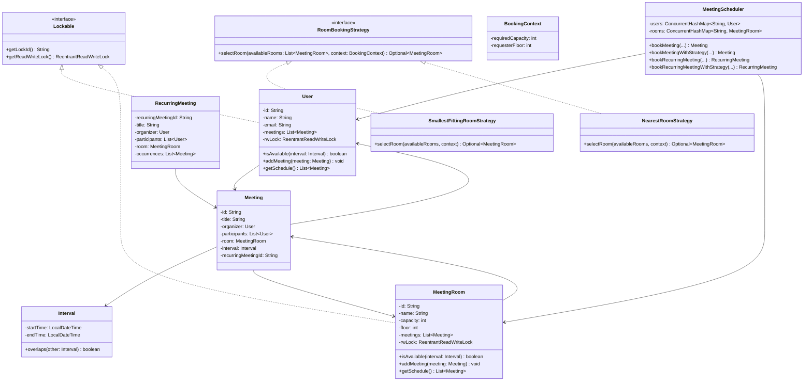

# Machine Coding: Design Meeting Scheduler (LLD)

## Quick Summary (TL;DR)
This LLD describes a highly concurrent, thread-safe, and strategy-driven **Meeting Scheduler** system (similar to Google Calendar or Microsoft Outlook). The design supports scheduling single and recurring meetings, resolving space/time conflicts, and applying booking strategies (e.g., nearest room or smallest fitting room) using the **Strategy Pattern**. It prevents deadlocks via resource lock ordering and ensures atomic bookings using fine-grained `ReentrantReadWriteLock` objects.

---

## Noob Jargon Buster

*   **Race Condition**: A situation where multiple threads try to update the same shared resource (e.g., booking the same room for the same time slot) concurrently. If not controlled, it leads to inconsistent state (like double-booking a room).
*   **Lock Ordering**: To prevent deadlocks (where Thread A holds Lock 1 and waits for Lock 2, while Thread B holds Lock 2 and waits for Lock 1), we sort the locks alphabetically by their unique ID. Both threads are forced to acquire Lock 1 before Lock 2, resolving the circular dependency.
*   **Strategy Pattern**: A design pattern that defines a family of algorithms, encapsulates each one, and makes them interchangeable. Here, we use it to swap room selection criteria (e.g., finding the nearest room vs. the smallest room) without altering the main booking code.
*   **Atomic Operation**: An operation that runs completely or not at all. If a recurring meeting scheduling fails on the 3rd occurrence, all previously created occurrences must be rolled back (or never committed) to avoid a half-booked state.
*   **Optimistic Read + Pessimistic Write Lock Validation**: Checking availability quickly without holding block-level write locks (optimistic read), selecting candidates, and then acquiring write locks and re-verifying before booking (pessimistic write).

---

## 1. Problem Statement & Requirements

### Core Requirements
1.  **Entities**: Model `Users`, `MeetingRooms`, and `Meetings`.
2.  **Conflict Detection**:
    *   Prevent a `MeetingRoom` from being booked for overlapping meetings.
    *   Prevent a `User` (organizer or participant) from attending overlapping meetings.
3.  **Booking Strategies (Strategy Pattern)**:
    *   *Smallest Fitting Room*: Finds the room with the smallest capacity that fits the participants.
    *   *Nearest Room*: Finds the room closest to the user's floor level that fits the participants.
    *   Every booking validates that the room can hold the organizer and all unique participants, including direct room bookings that do not use a strategy.
4.  **Recurring Meetings**: Allow users to schedule daily or weekly recurring meetings. The booking must be atomic (all slots booked or none).
5.  **Thread Safety**: High throughput concurrency. Prevent double booking even if hundreds of threads try to book the same room/user simultaneously.

---

## 2. Class Diagram

---

## 3. Core Design Decisions & Internals

### Interval Arithmetic
*   An `Interval` class encapsulates `startTime` and `endTime` using Java's `LocalDateTime`.
*   Two intervals `[s1, e1]` and `[s2, e2]` overlap if:
    $$\text{s1} < \text{e2} \quad \text{and} \quad \text{s2} < \text{e1}$$
*   This logic is encapsulated cleanly in `Interval.overlaps(Interval other)`.

### Strategy Pattern for Room Booking
*   `RoomBookingStrategy` is the interface defining the strategy contract.
*   `SmallestFittingRoomStrategy` filters rooms by capacity and returns the one with the minimum matching capacity.
*   `NearestRoomStrategy` filters rooms by capacity and sorts them by the absolute floor difference relative to the requester's floor.
*   The `MeetingScheduler` takes the strategy as a parameter, decouples the business logic, and makes room selection easily extendable.

### Atomic Recurring Bookings
*   For recurring meetings (Daily/Weekly), the scheduler generates all time-slot intervals first.
*   It then locks the selected room and all users, checks all slots, and books them together.
*   If a conflict occurs at any interval, the transaction fails completely, preventing partial bookings.

---

## 4. Concurrency & Thread-Safety Design

### Fine-Grained Locking vs. Single Global Lock
Using a single global lock (e.g., synchronization on `bookMeeting`) creates a severe performance bottleneck. Our solution uses **fine-grained locking**:
*   Every `User` and `MeetingRoom` implements `Lockable` and contains its own `ReentrantReadWriteLock`.
*   **Read Locks** are used when checking schedules or filtering candidate rooms, allowing multiple readers.
*   **Write Locks** are acquired only when modifying schedules during actual booking.

### Deadlock Avoidance via Lock Ordering
To book a meeting involving `Room R`, `Organizer O`, and `Participants P1, P2`:
1.  We collect all resources to lock: `[R, O, P1, P2]`.
2.  We map each resource to a globally unique String: `room_R`, `user_O`, `user_P1`, `user_P2`.
3.  We sort these resources lexicographically.
4.  We acquire write locks in that exact sorted order.
5.  We unlock them in reverse order.
*This guarantees that cyclic dependency (Deadlock) is mathematically impossible.*

### Optimistic Validation Cycle
When selecting a room via strategy:
1.  **Optimistic Filter**: Query the system's rooms and check their availability using lightweight **Read Locks**.
2.  **Strategy Selection**: Let the strategy choose/rank candidate rooms based on the snapshot.
3.  **Pessimistic Try**: Attempt to lock the selected room and participants.
4.  **Re-Validation**: Check if the room and participants are still free under the write locks.
    *   If yes: Book the meeting and release locks.
    *   If no (due to a concurrent booking): Release locks, remove the room from candidates, and try the next room.

---

## 5. Interview Corner / Follow-up Questions

### Q1: How would you extend this system to handle calendar sync across different time zones?
**Answer**:
We should store all transaction times inside the database and core logic in **UTC** (using `Instant` or `OffsetDateTime`). When rendering the schedule for a specific user, we convert the UTC timestamps into the user's localized time zone (`ZoneId`).

### Q2: What happens if a participant declines a meeting? How is the lock handled?
**Answer**:
Declining a meeting only updates the participant's attendance status and frees up their calendar slot.
*   We lock the user's schedule write lock.
*   We remove the meeting from their list of active meetings.
*   We release the lock.
Other participants and the room do not need to be locked because their schedules are unaffected by a single decline (unless the meeting is canceled entirely by the organizer).

### Q3: How would you handle a scenario where a recurring meeting has 50 occurrences, and 48 are available but 2 conflict? Can we suggest alternatives?
**Answer**:
Instead of a strict all-or-nothing policy, we can implement a **Partial Booking Strategy**:
1.  Perform the check.
2.  Book the 48 available slots.
3.  For the 2 conflicting slots, return a `PartialBookingResult` detailing the conflicts and suggesting alternative slots or rooms.
We could also run our `RoomBookingStrategy` on just those 2 conflicting slots to find alternative rooms specifically for those occurrences.

### Q4: If the database is clustered and distributed, how do we enforce thread safety?
**Answer**:
In a distributed environment, in-memory Java locks (`ReentrantReadWriteLock`) are insufficient. We must use:
1.  **Distributed Lock Manager (DLM)** (like Redis/Redisson using the Redlock algorithm, or ZooKeeper) using the same lock ordering strategy.
2.  **Database Level Locks**: `SELECT ... FOR UPDATE` on the room and user records, ordered by their primary keys to prevent database-level deadlocks.
