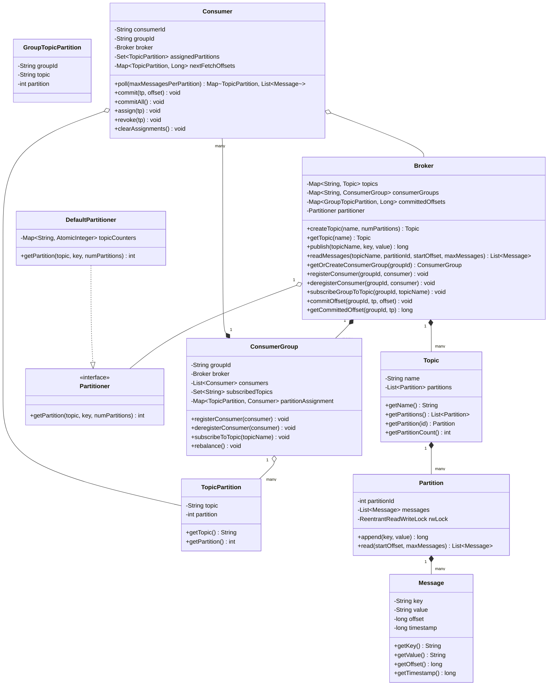

# Machine Coding: Design In-Memory Message Queue (LLD)

## Quick Summary (TL;DR)
This LLD presents a highly performant, 100% thread-safe, in-memory message broker inspired by Apache Kafka. It supports logical **Topics** split into multiple **Partitions** for horizontal scalability. Multiple **Producers** can publish messages to partitions concurrently (using round-robin or key-hash routing). Multiple **Consumers** organized into **Consumer Groups** can subscribe to topics, ensuring that each partition is processed by at most one consumer inside a group to guarantee ordering. It supports dynamic **Rebalancing** when consumers join or leave, along with **Offset Tracking (Pull/Commit mechanics)** to allow crash recovery.

---

## Noob Jargon Buster
*   **Topic**: A logical category or feed name to which messages are published (like a channel).
*   **Partition**: A physical sequence of messages within a topic. Messages in a partition are strictly ordered.
*   **Producer**: A client application that publishes (writes) messages to a topic.
*   **Consumer**: A client application that subscribes to (reads) messages from a topic.
*   **Consumer Group**: A collection of consumers that cooperate to consume messages from a set of topics. Each partition is assigned to exactly one consumer in the group to avoid duplicate processing.
*   **Offset**: A unique sequential integer assigned to each message within a partition, acting as its address.
*   **Rebalance**: The redistribution of partition assignments among active consumers in a consumer group when group membership changes.
*   **Commit**: Persisting the current offset processed by a consumer group so that if a consumer crashes, it or a replacement can resume from that point.

---

## 1. Problem Statement & Requirements
*   **Logical Hierarchy**: Support multiple `Topics`. Each `Topic` must contain one or more `Partitions`.
*   **Partition Routing**:
    *   If a message is published with a `key`, route it using key-hash partitioning (`hash(key) % totalPartitions`) to guarantee that all messages with the same key end up in the same partition (preserving chronological order).
    *   If a message key is `null`, distribute messages across partitions in a round-robin fashion.
*   **Parallel Consumption**:
    *   Support multiple independent `Consumer Groups`.
    *   Inside a consumer group, a partition can be assigned to **at most one consumer** at any time.
    *   If there are more consumers than partitions, some consumers will remain idle. If there are fewer consumers than partitions, some consumers will consume from multiple partitions.
*   **Offset Tracking**: Consumers pull messages and manually commit their processed offsets.
*   **Dynamic Membership**: Automatically trigger partition rebalancing when a consumer joins or leaves the group.
*   **Thread Safety**: Ensure the system is completely thread-safe and free from race conditions or deadlocks under highly concurrent publish and poll operations.

---

## 2. Class Diagram

---

## 3. Core Design Decisions & Internals

### Pull-Based Consumer Model
Instead of a push model where the broker pushes messages and risks overwhelming slow consumers, we use a **pull model**. Consumers poll the broker for batches of messages from their assigned partitions at their own pace.

### In-Memory Partition Indexing
Within each `Partition`, messages are stored in an `ArrayList`. Since the offsets are monotonic, sequential integers starting from `0`, the offset maps directly to the index in the list. This makes reading a range of messages starting from a specific offset an $O(1)$ random-access operation.

### Two-Phase Offset Management
1.  **Session Offset (`nextFetchOffsets` in Consumer)**: The local pointer tracking where the consumer is currently reading. This changes instantly as the consumer loops and polls.
2.  **Committed Offset (`committedOffsets` in Broker)**: The permanent progress tracker for the entire group. This is updated only when the consumer calls `commit()` after processing, ensuring that crash recovery behaves correctly.
    Committed offsets are monotonic: a late commit cannot move a group's progress backward.

### Rebalancer
When a consumer joins or leaves a group, partition assignments are recalculated using a deterministic round-robin assignment:
$$\text{consumerIndex} = \text{partitionId} \pmod{\text{totalConsumers}}$$
This assigns partitions as evenly as possible across active group members.

---

## 4. Concurrency & Thread-Safety Design

### Lock Partitioning (Fine-Grained Locking)
Instead of locking the entire `Broker` or `Topic` during read and write operations, locking is delegated to the individual `Partition` level:
*   `Partition` uses a `ReentrantReadWriteLock`.
*   **Writes** (`append`): Require a `writeLock` to append to the message list and safely increment the offset counter, guaranteeing order.
*   **Reads** (`read`): Require a `readLock`. This allows multiple consumer threads (e.g., from different consumer groups) to read from the same partition concurrently without blocking each other.

### Double-Checked Lock for Rebalancing & Polling
When a consumer group rebalances, partition ownership is modified. If a consumer is polling a partition during a rebalance:
*   The `Consumer.poll()` method uses double-checked synchronization.
*   Before fetching, it synchronizes on `this` to copy the list of assigned partitions and verify partition ownership.
*   After reading messages, it synchronizes again to confirm the partition was not revoked *before* updating `nextFetchOffsets`.
*   This prevents a thread from writing offsets for a partition it no longer owns, avoiding race conditions and duplicate consumption.

### Lock-Free Thread-Safe Collections
*   `Broker` uses `ConcurrentHashMap` for storing metadata (Topics, Consumer Groups, and Committed Offsets).
*   `ConsumerGroup` uses `CopyOnWriteArrayList` for its consumer list, preventing `ConcurrentModificationException` if a consumer joins or leaves while iteration is in progress.

---

## 5. Interview Corner / Follow-up Questions

### Q1: How would you handle backpressure or slow consumers in this in-memory system?
Because we use a **pull-based** model, backpressure is naturally handled by the consumer's polling interval. If a consumer is slow, it simply delays calling `poll()`.
However, if producers keep publishing, broker memory will increase indefinitely. To handle this, we should implement a **retention policy**:
1.  **Time-based retention**: Discard messages older than a specified duration.
2.  **Size-based retention**: Evict the oldest messages in a partition once the total message count or memory footprint exceeds a configured limit.

### Q2: What happens if a consumer worker crashes mid-processing? How is "at-least-once" delivery guaranteed?
Our design supports **manual offset commits**. A consumer polls a batch of messages, processes them, and then commits the new offsets.
If a consumer crashes before committing:
1.  The broker detects the loss of the consumer (simulated in our demo via `deregisterConsumer()`).
2.  A rebalance is triggered, and the crashed consumer's partitions are assigned to other active consumers.
3.  The newly assigned consumer asks the broker for the last committed offset, which is the offset *before* the crash.
4.  The consumer reads and processes those messages again, achieving **at-least-once** delivery guarantees.

### Q3: How would you scale this design to a distributed message queue?
To transition this in-memory LLD to a distributed system like Apache Kafka:
1.  **Clustering & Replication**: Introduce a cluster of brokers. Assign partition replicas to different brokers, designating one as the Leader (handles reads/writes) and others as Followers (replicate data).
2.  **Partition Persistence**: Swap the memory-backed `ArrayList` for segment files on disk. Append messages to a Write-Ahead Log (WAL) and build an index file linking offsets to physical byte offsets in the log.
3.  **Group Coordinator**: Dedicate one broker node as the Group Coordinator to manage consumer group heartbeats, detect client crashes, and coordinate rebalance protocols.
4.  **Consensus**: Use a consensus protocol (like Raft or ZooKeeper) to manage cluster configuration metadata, broker membership, and partition leader elections.
