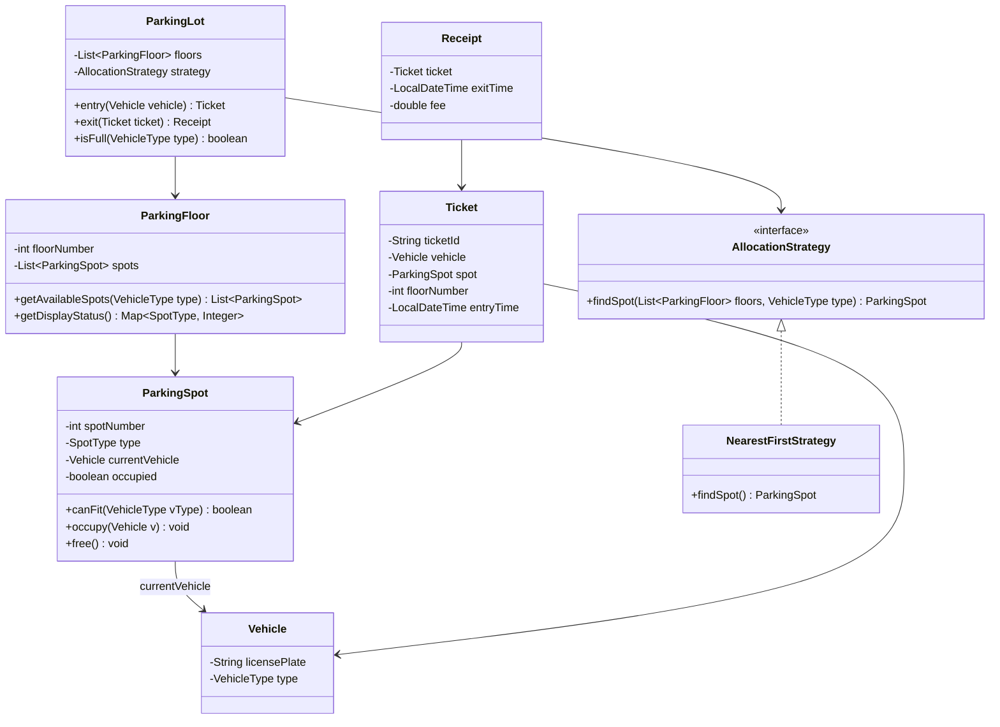

# Machine Coding: Design a Parking Lot (LLD)

## Quick Summary (TL;DR)
* **Goal**: Build a multi-floor parking lot system that handles vehicle entry/exit, spot allocation by vehicle type, ticket generation, and hourly-rate billing.
* **Design Patterns Used**:
  - **Strategy Pattern**: Pluggable spot-allocation policies (nearest-to-entrance, floor-balanced, etc.)
  - **Factory Pattern**: Create the right `ParkingSpot` subclass based on `VehicleType`.
* **Core Principle**: Model the domain with clean OOP — vehicles, spots, tickets, and floors are separate entities with single responsibilities.

---

## 🤓 Noob Jargon Buster

* **Spot Allocation Strategy**: The policy used to choose a parking spot when a vehicle enters. For example, `NearestFirstStrategy` (picks the first empty spot closest to the entrance) or `SpreadEvenlyStrategy` (distributes cars evenly across floors).
* **Factory Pattern (Spot Creation)**: Instantiating the correct subclass without exposing instantiation logic to the client. E.g., when setting up a floor, a spot factory takes a type (Compact, Large, Handicapped) and initializes the correct subclass.
* **Single Responsibility Principle (SRP)**: The rule that every class should do exactly one thing. The `Ticket` class only stores details of a booking, the `ParkingFloor` manages spots, and the `PricingStrategy` determines the cost.
* **Concurrency Gates**: Handling what happens when multiple cars try to enter/exit at the exact same millisecond. We use locks (like locking a specific floor instead of the whole parking lot) to make sure two cars aren't assigned the exact same physical spot.

---

## 1. Problem Statement & Requirements

Design a parking lot system that supports:
1. **Multiple Floors**: Each floor has a fixed set of spots of different sizes.
2. **Vehicle Types**: `MOTORCYCLE`, `CAR`, `TRUCK` — each requires a specific spot size.
3. **Spot Types**: `COMPACT` (motorcycle/car), `LARGE` (any vehicle), `HANDICAPPED` (any vehicle, priority reserved).
4. **Entry Flow**:
   - Vehicle arrives at entry gate.
   - System finds the nearest available spot that fits the vehicle.
   - A `Ticket` is issued with entry time, assigned spot, and floor.
5. **Exit Flow**:
   - Vehicle presents ticket at exit gate.
   - System calculates fee based on duration and vehicle type.
   - Spot is freed.
6. **Capacity**: If no spot is available for a vehicle type, deny entry.
7. **Display Board**: Each floor shows available spots per type (real-time count).

---

## 2. Spot Allocation Strategy

The allocation policy is pluggable via Strategy Pattern. Default: nearest spot (lowest floor, lowest spot number).

```
Vehicle arrives
  |
  v
ParkingLot.assignSpot(vehicle)
  |
  v
AllocationStrategy.findSpot(floors, vehicleType)
  |
  +--- NearestFirstStrategy: scan floors top-down, return first available fit
  +--- SpreadEvenlyStrategy: pick floor with most free spots (distributes wear)
  |
  v
Spot found? --YES--> mark occupied, issue Ticket
             --NO--> throw ParkingFullException
```

---

## 3. Class Design & Architecture



---

## 4. Key Java Implementation

The runnable code is in [ParkingLotDemo.java](ParkingLotDemo.java).

### 1. Enums
```java
enum VehicleType { MOTORCYCLE, CAR, TRUCK }
enum SpotType    { COMPACT, LARGE, HANDICAPPED }
```

### 2. Spot-to-Vehicle Compatibility
| Spot Type      | Motorcycle | Car | Truck |
|---------------|:---:|:---:|:---:|
| COMPACT        | Y | Y | N |
| LARGE          | Y | Y | Y |
| HANDICAPPED    | Y | Y | Y |

### 3. Fee Calculation
Simple hourly rate by vehicle type:
```java
// per-hour rates in cents
MOTORCYCLE -> 100   ($1/hr)
CAR        -> 200   ($2/hr)
TRUCK      -> 300   ($3/hr)
// Minimum charge = 1 hour
```

### 4. Spot Allocation (Strategy Pattern)
```java
interface AllocationStrategy {
    ParkingSpot findSpot(List<ParkingFloor> floors, VehicleType type);
}

// Default: scan floors 0..N, within each floor scan spots 0..M
class NearestFirstStrategy implements AllocationStrategy { ... }
```

---

## 5. SDE-2 Interview Angles

### Question 1: "How do you handle concurrency at entry/exit gates?"
* **Problem**: Two cars arrive simultaneously — both could be assigned the same spot.
* **Fix**:
  1. Use `synchronized` on `ParkingLot.entry()` — simple but bottleneck.
  2. Better: `ReentrantLock` per floor so multiple floors can serve in parallel.
  3. Best: `ConcurrentHashMap<SpotId, Boolean>` + `compareAndSet` for lock-free spot reservation.
  4. The `Ticket` acts as an idempotency token — even if double-assigned, only the first `exit()` succeeds.

### Question 2: "How would you scale this to a multi-building parking structure?"
* **Current design** already separates `ParkingFloor` from `ParkingLot`.
* Add a `ParkingBuilding` layer: `ParkingLot` holds `List<ParkingBuilding>`, each building holds `List<ParkingFloor>`.
* The `AllocationStrategy` interface remains unchanged — it just receives a flattened or hierarchical view.

### Question 3: "What if you need different pricing for weekends, events, or EV spots?"
* Extract pricing into a **Strategy** as well: `PricingStrategy.calculate(Ticket, exitTime)`.
* Implementations: `FlatRateStrategy`, `PeakHourStrategy`, `EventSurchargeStrategy`.
* Can be composed with a `CompositePricingStrategy` that chains multiple rules.

### Question 4: "How would you add a reservation system?"
* Add a `Reservation` entity with `(vehicleType, startTime, endTime, spotId)`.
* On `entry()`, check if the vehicle has a reservation — if yes, assign the reserved spot; if not, use the allocation strategy but skip reserved spots.
* A background job releases expired reservations (reservation that wasn't claimed within a grace period).

### Question 5: "Strategy Pattern vs simple if-else for allocation?"
* Same argument as State vs switch-case in Vending Machine.
* With Strategy: adding a `VIPPriorityStrategy` or `EVPreferredStrategy` is just a new class — zero changes to `ParkingLot`.
* With if-else: every new policy bloats `ParkingLot.entry()` and risks breaking existing logic.
