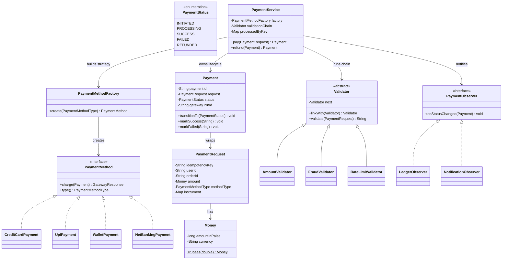
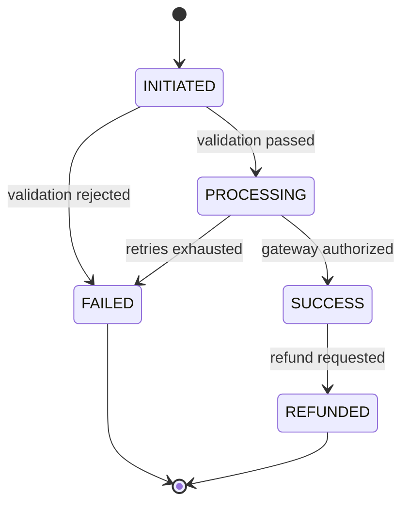

# Machine Coding: Design a Payment System / Payment Gateway (LLD)

## Quick Summary (TL;DR)
This is a thread-safe Payment Gateway that orchestrates money movement between a user and a merchant through pluggable payment instruments (Credit Card, UPI, Wallet, Net Banking). Each payment is an aggregate root driven by a **guarded State Machine** (`INITIATED → PROCESSING → SUCCESS/FAILED → REFUNDED`), so illegal transitions (like charging twice) fail loudly.

Payment methods are modeled with the **Strategy Pattern** and built via a **Factory**; pre-flight checks (amount, fraud, rate limit) run through a **Chain of Responsibility**; and downstream systems (ledger, notifications) subscribe via the **Observer Pattern**. The two hardest real-world concerns — **idempotency** (retries must never double-charge) and **retries** against a flaky gateway — are handled with idempotency keys and a bounded retry loop.

> **Companion HLD**: For the distributed architecture (double-entry ledger, Saga orchestration, PSP webhooks, reconciliation, synchronous replication), see [Payment System — HLD](../../../hld/problems/payment-system.md).

---

## Noob Jargon Buster
*   **Idempotency**: An operation you can safely repeat and get the same result. Networks drop responses, so clients retry — an idempotency key ensures the second `pay()` returns the first result instead of charging again.
*   **Minor units (paise/cents)**: Money is stored as an integer count of the smallest currency unit (paise), never as a `double`, because floating-point arithmetic silently loses precision (`0.1 + 0.2 != 0.3`).
*   **Authorization vs Capture**: *Authorize* reserves funds on the instrument; *capture* actually moves them. Many gateways split these; this design collapses them into a single `charge` for simplicity but the state machine leaves room to split later.
*   **Gateway (PSP)**: The external Payment Service Provider (Stripe, Razorpay, bank rails) that actually talks to card networks / UPI. Our system is the orchestrator in front of it.

---

## 1. Problem Statement & Requirements

### Functional Requirements
1.  **Multiple instruments**: Pay via Credit Card, UPI, Wallet, or Net Banking — each pluggable without touching the orchestrator.
2.  **Payment lifecycle**: Track a payment through `INITIATED → PROCESSING → SUCCESS/FAILED`, with `REFUNDED` reachable only from `SUCCESS`.
3.  **Validation pipeline**: Reject payments for bad amounts, fraud signals, or rate-limit breaches before hitting the gateway.
4.  **Idempotency**: The same idempotency key must return the same result and never re-charge.
5.  **Retries**: Transient gateway failures should be retried up to a bounded limit.
6.  **Refunds**: A successful payment can be refunded.
7.  **Notifications**: Ledger and notification systems are informed on every terminal state change.

### Non-Functional Requirements
*   **Correctness of money**: No floating-point money; no double-charges under retries/concurrency.
*   **Thread-safety**: Concurrent `pay()` calls must not corrupt state.
*   **Extensibility**: Adding a new instrument or a new validation rule must be an *addition*, not a modification (Open/Closed).

---

## 2. Class Diagram



---

## 3. State Machine



The transition table lives inside `Payment.isValidTransition()`. Any transition not in the table throws `IllegalStateException` — this is the safety net that turns a silent double-processing bug into a loud crash during tests.

---

## 4. Core Design Decisions & Internals

### Why Strategy + Factory for payment methods
Each instrument has different logic (card needs the PAN, UPI needs a VPA, net banking redirects to a bank), but the orchestrator only cares about "charge this payment." Modeling them as a `PaymentMethod` strategy keeps `PaymentService` closed for modification: adding `CryptoPayment` is a new class plus one line in the factory.

### Idempotency (the interview centerpiece)
```java
Payment payment = new Payment(request);
Payment existing = processedByKey.putIfAbsent(request.getIdempotencyKey(), payment);
if (existing != null) {
    synchronized (existing) {
        while (existing.getStatus() == PaymentStatus.INITIATED || existing.getStatus() == PaymentStatus.PROCESSING) {
            existing.wait();
        }
    }
    return existing;
}
```
Two layers protect against double-charge:
1.  **Service level**: Atomic `putIfAbsent` acts as a distributed-lock equivalent in-memory. Concurrent threads requesting the same key lock on the existing `Payment` object and wait until it transitions to a terminal state (`SUCCESS`/`FAILED`).
2.  **Gateway level**: `ExternalGateway.authorize()` caches successful authorizations per `idempotencyKey` so that network retries after dropped gateway responses yield the identical transaction ID rather than duplicating the charge.

### Retries without double-charge
The retry loop calls `method.charge()` up to `maxRetries` times. Because the gateway is idempotent on the key, a retry after a *dropped success response* returns the same txn id rather than charging again — the classic "did my payment go through?" problem.

> **Scope note vs the HLD**: retries here are *in-call* only. Once the bounded loop is exhausted the payment is marked `FAILED` and cached under its key, so a later `pay()` with the **same** key returns that cached failure — the client must mint a new key to try again. The HLD's DB-backed idempotency flow goes further: it distinguishes *transient* from *terminal* failure and resets a transient key back to `PROCESSING` to allow a same-key retry. That cross-call transient reset is intentionally deferred to the HLD.

### Money as integer minor units
`Money` stores `amountInPaise` (a `long`). Never use `double`/`float` for money — rounding errors compound across millions of transactions and fail reconciliation.

---

## 5. Concurrency & Thread-Safety Design

| Concern | Mechanism | Why |
| :--- | :--- | :--- |
| Idempotency store | `ConcurrentHashMap` | Lock-free concurrent reads/writes across request threads. |
| State transitions | `synchronized transitionTo()` | Serializes transitions on a single `Payment` so two threads can't both move `PROCESSING → SUCCESS`. |
| Gateway attempt counter | `AtomicInteger` per key | Accurate attempt counts without a lock. |
| Rate-limit counters | `ConcurrentHashMap<String, AtomicInteger>` | Per-user counters updated concurrently. |

In production, `processedByKey` would be a distributed store (Redis/DB) with a **unique constraint on the idempotency key** and a status column, so idempotency holds across many app instances, not just one JVM.

---

## 6. Interview Corner / Follow-up Questions

### Q1: A user's card was charged but they got a network timeout and hit "Pay" again. How do you prevent a double charge?
**Answer**: The client sends the **same idempotency key** for the retry. The service checks `processedByKey` first and returns the earlier result. Independently, the gateway keys authorization on that same key, so even a concurrent retry maps to one authorization. In a distributed setup, this is enforced by a unique DB/Redis constraint on the idempotency key with an atomic insert-or-fetch.

### Q2: How do you keep the ledger consistent with the gateway if the app crashes mid-payment?
**Answer**: Persist the `Payment` in `PROCESSING` **before** calling the gateway (write-ahead). On restart, a **reconciliation job** queries the gateway for any `PROCESSING` payments older than a threshold and moves them to `SUCCESS`/`FAILED` based on the gateway's source of truth. This is the "orphaned transaction" recovery pattern; combined with an outbox for events it avoids dual-write inconsistency.

### Q3: Why not use `double` for the amount?
**Answer**: Binary floating point can't represent many decimal fractions exactly (`0.1 + 0.2 == 0.30000000000000004`). Over millions of transactions these errors break reconciliation. Store integer minor units (paise/cents) or use `BigDecimal` with an explicit scale and rounding mode.

### Q4: How would you add a two-step Authorize → Capture flow (e.g., hotel holds)?
**Answer**: Split the state machine: `PROCESSING → AUTHORIZED → CAPTURED`. `authorize` reserves funds; a later `capture` (possibly for a partial amount) moves them. Add `VOID` from `AUTHORIZED` for releasing a hold. The Strategy interface gains `authorize()` and `capture()` while the orchestrator drives the extended state machine.

### Q5: How do you make this scale and stay resilient when a downstream gateway is slow or down?
**Answer**: (1) **Timeouts + Circuit Breaker** around each gateway so a slow PSP doesn't exhaust threads. (2) **Failover routing** in the factory to a secondary PSP. (3) **Async processing**: enqueue `PROCESSING` payments to a queue and settle via workers, returning a pending status to the client and notifying on completion via the Observer/webhook. (4) **Bulkheads** so one instrument's failures don't starve others.

### Q6: Where do webhooks fit?
**Answer**: Many gateways confirm asynchronously via webhooks. The webhook handler is just another entry point that resolves a `PROCESSING` payment to `SUCCESS`/`FAILED`, must itself be **idempotent** (gateways retry webhooks), and should **verify the signature** to prevent spoofed confirmations.

---

## 7. Running the Demo

```bash
cd lld/problems/payment_system
javac -d . PaymentSystemDemo.java
java lld.problems.payment_system.PaymentSystemDemo
```

The driver walks through: a successful UPI payment, a card payment that succeeds only after retries, an idempotent replay of that same request (no re-charge), a fraud-blocked card, an over-limit rejection, and a refund.
