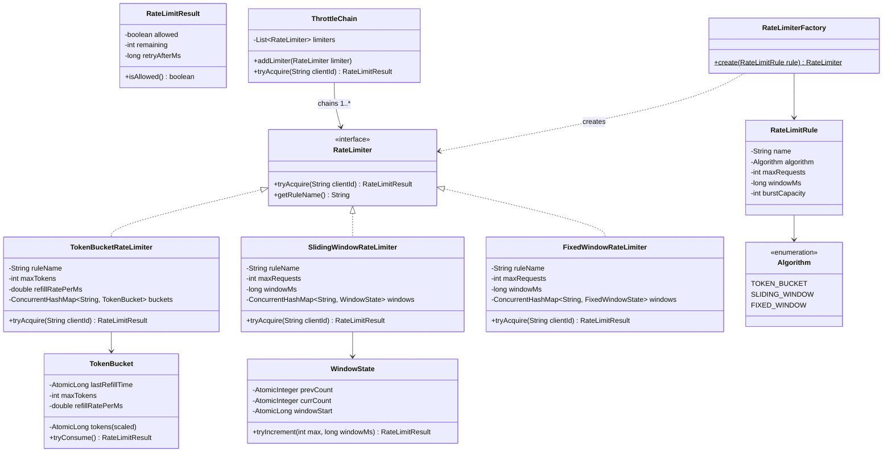

# Machine Coding: Design a Rate Limiter (LLD)

## Quick Summary (TL;DR)
* **Goal**: Build an in-memory rate limiting library that throttles requests per client using configurable algorithms and limits — with thread-safe, lock-free operations.
* **Design Patterns Used**:
  - **Strategy Pattern**: Interchangeable rate limiting algorithms (Token Bucket, Sliding Window Counter, Fixed Window Counter) behind a common interface.
  - **Factory Pattern**: Create the right `RateLimiter` implementation from a configuration object.
  - **Chain of Responsibility**: Layer multiple limiters (IP → User → Endpoint) so a request must pass ALL checks.
* **Core Principle**: Thread safety via `AtomicLong` and CAS (Compare-And-Swap) loops — no `synchronized` blocks or `ReentrantLock` needed for the hot path.

---

## 🤓 Noob Jargon Buster

* **Rate Limiter**: A tool that controls how often a user or IP can call an API. It acts like a bouncer at a club, letting you in if you're under the speed limit, and turning you away with a "slow down" error if you're clicking too fast.
* **Token Bucket**: A popular rate-limiting algorithm. Imagine a bucket that fills up with tokens (tickets) at a steady rate. Every time you make a request, you must take a token out. If the bucket is empty, your request is rejected. This allows you to make quick bursts of requests, but caps your overall rate.
* **Sliding Window**: An algorithm that tracks your request counts over a rolling window of time (e.g., the last 60 seconds) rather than a fixed calendar minute. This prevents clients from cheating the limit by making all their allowed requests right at the boundary (e.g., 59th second and 1st second).
* **Compare-And-Swap (CAS)**: A lightweight, low-level CPU instruction that lets multiple threads update a number safely without using slow blocks or locks. It works like this: "Change this number to Y, but ONLY if its current value is X. If someone else changed it, fail and I will retry."
* **Lock-Free Thread Safety**: Making sure our limiter is 100% accurate when 1,000 threads request tokens at the same millisecond, but doing so without using `synchronized` or `ReentrantLock` (which makes threads queue up and slow down). We use atomic variables like `AtomicLong` instead.
* **Chain of Responsibility**: Chaining multiple rule checks together (e.g., first check IP limit, then check API Key limit). A request must pass all links in the chain to succeed.

---

## 1. Problem Statement & Requirements

Design an in-memory rate limiting library that supports:
1. **Multiple Algorithms**: Token Bucket (burst-tolerant), Sliding Window Counter (smooth), Fixed Window Counter (simple).
2. **Per-Client Tracking**: Each client (identified by a string key like `user:123` or `ip:10.0.0.1`) has independent rate limit state.
3. **Configurable Rules**: Define limits via `RateLimitRule` — max requests, time window, algorithm choice.
4. **Rich Results**: Return not just allow/deny, but also `remaining` quota and `retryAfterMs` on denial.
5. **Multi-Layer Limiting**: Chain multiple limiters (e.g., 500 req/min per IP AND 50 req/min per endpoint) — a request must pass ALL layers.
6. **Thread Safety**: Must handle concurrent requests from multiple threads without data corruption or race conditions.
7. **Stale Entry Cleanup**: Automatically evict expired client entries to prevent memory leaks.

---

## 2. Class Diagram



---

## 3. Concurrency Design (The Critical Section)

The hot path is `tryAcquire()` — called on every incoming request. It MUST be thread-safe and fast.

### Approach: Lock-Free CAS (Compare-And-Swap)

Instead of using `synchronized` or `ReentrantLock`, we use `AtomicLong` with CAS loops. This avoids thread blocking and contention.

#### Token Bucket — CAS Loop

```java
public RateLimitResult tryConsume() {
    while (true) {
        long now = System.currentTimeMillis();
        long lastRefill = lastRefillTime.get();
        long elapsed = now - lastRefill;

        // Calculate tokens to add (scaled by 1000 for precision)
        long currentTokens = tokens.get();
        long newTokens = Math.min(
            maxTokensScaled,
            currentTokens + (long)(elapsed * refillRatePerMs * SCALE)
        );

        // CAS: try to update lastRefillTime
        if (elapsed > 0 && !lastRefillTime.compareAndSet(lastRefill, now)) {
            continue; // Another thread refilled — retry
        }

        // CAS: try to consume one token
        long afterConsume = newTokens - SCALE;
        if (afterConsume >= 0) {
            if (tokens.compareAndSet(currentTokens, afterConsume)) {
                int remaining = (int)(afterConsume / SCALE);
                return new RateLimitResult(true, remaining, 0);
            }
            // CAS failed — another thread consumed — retry
        } else {
            // No tokens available
            long waitMs = (long)((SCALE - newTokens) / (refillRatePerMs * SCALE));
            return new RateLimitResult(false, 0, Math.max(1, waitMs));
        }
    }
}
```

**Why CAS instead of locks?**

| Aspect | `synchronized` / Lock | CAS (AtomicLong) |
|--------|----------------------|-------------------|
| Blocking | Yes — threads wait | No — threads retry |
| Throughput under contention | Degrades (lock convoy) | Stays high (spin is cheap) |
| Deadlock risk | Yes (if nesting locks) | None |
| Complexity | Simple to write | Trickier (loop + retry) |
| Best for | Complex multi-step mutations | Simple atomic updates |

**For rate limiting, CAS wins**: the critical section is tiny (read + decrement), contention is brief, and throughput matters more than simplicity.

### Sliding Window — Atomic Window Rotation

```java
public RateLimitResult tryIncrement(int maxRequests, long windowMs) {
    long now = System.currentTimeMillis();
    long winStart = windowStart.get();

    // Check if window has rotated
    if (now - winStart >= windowMs) {
        // Rotate: current becomes previous
        if (windowStart.compareAndSet(winStart, now)) {
            prevCount.set(currCount.get());
            currCount.set(0);
        }
        // Re-read after rotation
        winStart = windowStart.get();
    }

    // Weighted count: prevCount * overlapFraction + currCount
    long elapsed = now - winStart;
    double overlapFraction = Math.max(0, (windowMs - elapsed)) / (double) windowMs;
    double estimated = prevCount.get() * overlapFraction + currCount.get();

    if (estimated < maxRequests) {
        int newCount = currCount.incrementAndGet();
        // Re-check after increment
        estimated = prevCount.get() * overlapFraction + newCount;
        int remaining = Math.max(0, (int)(maxRequests - estimated));
        return new RateLimitResult(true, remaining, 0);
    }

    long retryAfter = windowMs - elapsed;
    return new RateLimitResult(false, 0, Math.max(1, retryAfter));
}
```

---

## 4. Key Java Implementation Classes

The runnable code is in [RateLimiterDemo.java](RateLimiterDemo.java).

### 1. The Strategy Interface

```java
public interface RateLimiter {
    RateLimitResult tryAcquire(String clientId);
    String getRuleName();
}
```

Clean contract — all algorithms implement this. The caller doesn't know or care which algorithm is behind it.

### 2. Result Object

```java
public class RateLimitResult {
    private final boolean allowed;
    private final int remaining;
    private final long retryAfterMs;

    // Constructor, getters, toString
}
```

Richer than a bare `boolean` — gives the caller enough info to set HTTP headers (`X-RateLimit-Remaining`, `Retry-After`).

### 3. Factory Pattern — Algorithm Selection

```java
public class RateLimiterFactory {
    public static RateLimiter create(RateLimitRule rule) {
        return switch (rule.getAlgorithm()) {
            case TOKEN_BUCKET -> new TokenBucketRateLimiter(
                rule.getName(), rule.getBurstCapacity(), rule.getMaxRequests(), rule.getWindowMs());
            case SLIDING_WINDOW -> new SlidingWindowRateLimiter(
                rule.getName(), rule.getMaxRequests(), rule.getWindowMs());
            case FIXED_WINDOW -> new FixedWindowRateLimiter(
                rule.getName(), rule.getMaxRequests(), rule.getWindowMs());
        };
    }
}
```

**Why Factory?** Decouples rule configuration from implementation. In production, rules come from a YAML config or database — the factory translates config into live objects.

### 4. Chain of Responsibility — Multi-Layer Limiting

```java
public class ThrottleChain {
    private final List<RateLimiter> limiters = new ArrayList<>();

    public void addLimiter(RateLimiter limiter) {
        limiters.add(limiter);
    }

    public RateLimitResult tryAcquire(String clientId) {
        for (RateLimiter limiter : limiters) {
            RateLimitResult result = limiter.tryAcquire(clientId);
            if (!result.isAllowed()) {
                return result; // First denial stops the chain
            }
        }
        return new RateLimitResult(true, -1, 0);
    }
}
```

**Why Chain?** In production, a single request might need to pass:
1. Global IP limit: 500 req/min
2. Per-user limit: 100 req/min
3. Per-endpoint limit: 20 req/min

The chain short-circuits on the first denial — cheap checks (global) go first.

### 5. Stale Entry Cleanup

```java
// Inside each RateLimiter implementation
private final ScheduledExecutorService cleaner = Executors.newSingleThreadScheduledExecutor(r -> {
    Thread t = new Thread(r, ruleName + "-cleaner");
    t.setDaemon(true);
    return t;
});

// In constructor:
cleaner.scheduleAtFixedRate(() -> {
    long now = System.currentTimeMillis();
    buckets.entrySet().removeIf(e -> now - e.getValue().getLastAccessTime() > windowMs * 2);
}, windowMs, windowMs, TimeUnit.MILLISECONDS);
```

Without cleanup, a system handling millions of unique IPs would leak memory indefinitely. The daemon thread ensures cleanup doesn't block JVM shutdown.

---

## 5. SDE-2 Interview Angles

### Question 1: "How is Token Bucket thread-safe without locks?"

* **Answer**: "We use `AtomicLong` for both the token count and last-refill timestamp. The `tryConsume()` method runs a CAS loop: it reads current tokens, calculates the new value (refill + consume), and uses `compareAndSet()` to atomically update. If another thread modified the value between read and CAS, the CAS fails and we retry. This is lock-free — no thread ever blocks, and under low contention (the common case), the CAS succeeds on the first try."

### Question 2: "Why Strategy pattern instead of if-else in tryAcquire?"

* **Answer**: "Rate limiting algorithms have fundamentally different state shapes — Token Bucket needs tokens + refill time, Sliding Window needs two counters + window start. An if-else approach forces a god-class with fields for every algorithm. Strategy keeps each algorithm self-contained with its own state, and the factory selects the right one at configuration time. Swapping algorithms is a config change, not a code change."

### Question 3: "How do you prevent memory leaks from stale client entries?"

* **Answer**: "Each `RateLimiter` runs a `ScheduledExecutorService` daemon thread that periodically scans the `ConcurrentHashMap` and removes entries that haven't been accessed in 2x the window duration. The thread is a daemon so it won't prevent JVM shutdown. The scan uses `removeIf()` on the entry set, which is safe on `ConcurrentHashMap`."

### Question 4: "How would you extend this to a distributed system?"

* **Answer**: "Replace the in-memory `ConcurrentHashMap` with Redis. Each `tryAcquire()` call becomes a Lua script execution on Redis — Lua scripts are atomic on Redis, so they replace our CAS loops. The interface stays the same (Strategy pattern), only the implementation changes. For the Token Bucket, the Lua script reads current tokens, calculates refill, decrements, and returns the result — all in one atomic operation."

### Question 5: "What if you need both per-user AND per-endpoint limits?"

* **Answer**: "That's what `ThrottleChain` (Chain of Responsibility) handles. You create two separate `RateLimiter` instances — one keyed by `user:123`, another by `POST:/api/orders` — and chain them. The chain evaluates each limiter in order and short-circuits on the first denial. Cheap global checks go first, expensive per-endpoint checks go last. Each limiter is independent with its own algorithm and limits."

### Question 6: "Why CAS over ReentrantLock for this use case?"

* **Answer**: "The critical section is tiny — read a counter, do arithmetic, write back. Lock overhead (acquire, release, potential thread parking) dominates the actual work. CAS spins are cheaper when contention is low and the critical section is small. If the critical section were complex (multi-step mutations like BookMyShow's seat booking), I'd use a lock. For rate limiting's simple counter updates, CAS gives better throughput."
