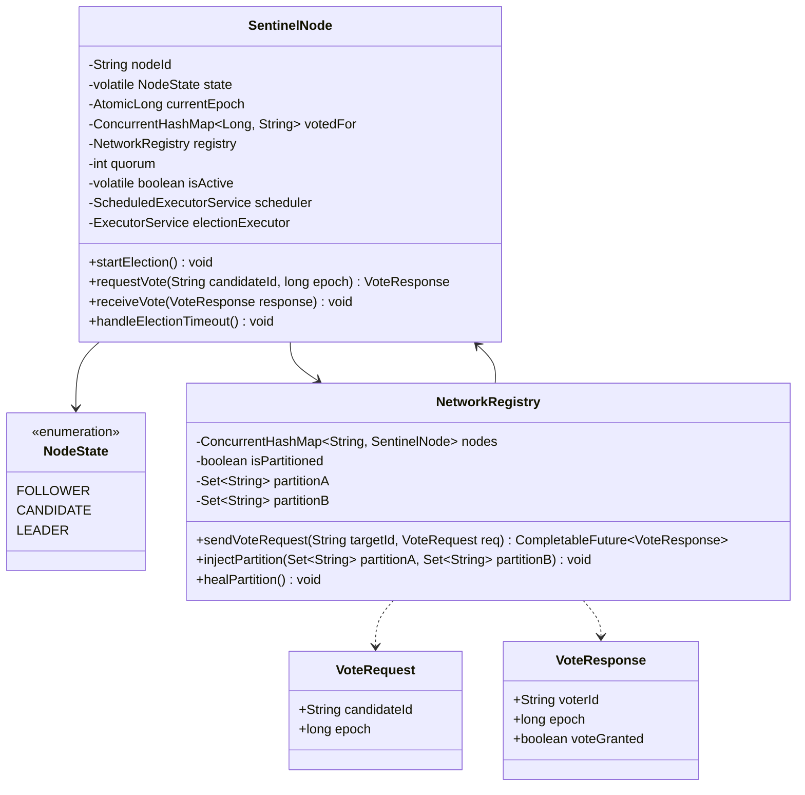

# Machine Coding: Redis Sentinel Leader Election (LLD)

## Quick Summary (TL;DR)
* **Goal**: Design and implement a thread-safe, distributed simulation of the Redis Sentinel Leader Election protocol (Raft-like epoch-based consensus) that elects a single "Leader Sentinel" to orchestrate failover when a master is flagged as `ODOWN` (Objective Down).
* **Core Requirements**:
  * **Epoch-Based consensus**: Monotonically increasing epoch counter per node.
  * **First-Come, First-Served voting**: A node can vote for at most one candidate per epoch.
  * **Quorum & Majority validation**: To win, a candidate must secure votes from a **majority of all active Sentinels** AND at least the configured **quorum**.
  * **Split-vote Handling**: Concurrent candidacies result in timeouts, epoch increments, and randomized retry backoffs.
* **Design Patterns Used**:
  * **State Pattern**: Sentinels transition between roles (`FOLLOWER`, `CANDIDATE`, `LEADER`).
  * **Mediator/Registry Pattern**: A `NetworkRegistry` simulates RPC delivery, node latency, failure injections, and network partitions.
  * **Observer/Pub-Sub Pattern**: Sentinel nodes announce state changes (`+vote-requested`, `+vote-cast`, `+leader-elected`, `+failover-start`).

---

## 🤓 Noob Jargon Buster

* **SDOWN (Subjective Down)**: A local decision made by a single Sentinel when it fails to ping the master for a certain period.
* **ODOWN (Objective Down)**: A global decision made when the number of Sentinels reporting the master as SDOWN reaches the configured **Quorum**.
* **Epoch / Term**: A monotonically increasing number acting as a logical clock in distributed systems. It prevents stale votes and ensures nodes are aligned on the same timeline.
* **Quorum**: The minimum number of Sentinels that must agree that a master is down before failover can be triggered.
* **Majority**: The minimum number of Sentinels ($N/2 + 1$, where $N$ is the total count of Sentinels) required to vote for a leader. Sentinel cannot elect a leader without a majority to prevent network partition splits (split-brain).
* **Split Vote**: When multiple Sentinels attempt to run for leader in the same epoch, dividing the votes such that no candidate achieves a majority. They must timeout and try again in the next epoch.

---

## 1. Problem Statement & Requirements

Design an in-memory low-level simulation of the Redis Sentinel leader election process satisfying:
1. **Sentinel Cluster Management**: Support dynamic node registration and configuration of $N$ nodes with a specified quorum.
2. **Epoch-Based Consensus logic**:
   - Each Sentinel tracks `currentEpoch` and a vote registry `votedFor` (mapping epoch -> candidate ID).
   - If a Sentinel receives a vote request with a higher epoch, it updates its `currentEpoch`, resets its vote for that epoch, and transitions to `FOLLOWER`.
   - If the epoch is smaller, the vote request is rejected.
   - If the epoch matches, a Sentinel votes for the candidate only if it hasn't voted for anyone else in that epoch yet.
3. **Election Trigger**:
   - Any Sentinel can trigger an election when it detects `ODOWN`. It increments its epoch, votes for itself, transitions to `CANDIDATE`, and broadcasts vote requests.
4. **RPC Simulation & Latency**:
   - Simulate asynchronous vote requests (`SENTINEL is-master-down-by-addr`) with random network latencies (10-50ms) to mirror real-world concurrency.
5. **Split-Vote Resolution**:
   - Implement randomized election timeouts (e.g., 150-300ms) for candidate nodes. If no leader is elected within the timeout, the node increments its epoch and retries.
6. **Robust Scenarios**:
   - **Happy Path**: Single candidate runs, wins majority, and becomes leader.
   - **Concurrent Candidacy**: Two nodes run at once, split the votes, timeout, and resolve it in the next epoch.
   - **Network Partition**: Simulate a partition splitting the cluster into two segments. Verify that only the segment containing a majority can elect a leader, while the minority segment repeatedly times out.
   - **Node Failures**: Simulate active vs dead Sentinels. Ensure elections fail if too many nodes are down to form a majority.

---

## 2. Class Diagram



---

## 3. Core Design Decisions

### 1. RPC Layer Simulation via CompletableFuture
To emulate network requests without blocking execution threads, we leverage `CompletableFuture` combined with a scheduled delay executor. This allows vote requests to execute asynchronously and complete after a simulated latency, mimicking real network round-trip times (RTT).

### 2. Lock-free State and Logical Clocks
To ensure thread-safety during concurrent vote requests and election timeouts:
* `currentEpoch` is backed by an `AtomicLong`.
* Vote tracking uses a thread-safe `ConcurrentHashMap` mapping `Epoch -> VotedCandidateId`.
* State transitions are managed using volatile reads/writes and atomic checks to prevent double-voting or stale-term updates.

### 3. Randomized Timeout (Anti-Entropy)
If two candidates run for election simultaneously, they might split the votes. To break the tie:
* When a node transitions to `CANDIDATE`, it schedules an election timeout.
* The timeout duration is randomized (e.g., `150 + random(0, 150) ms`).
* The node that times out first increments its epoch, resets its vote, and starts the next election round, quickly claiming the majority while the other node is still waiting out its longer timeout.

---

## 4. Multi-Threaded Safety & Concurrency

The design handles extreme concurrency scenarios:
* **Simultaneous Vote Requests**: If two threads concurrently call `requestVote` on a Sentinel for the same epoch, the `ConcurrentHashMap.putIfAbsent` guarantees that only the first request is granted a vote.
* **Stale Epoch Rejection**: If a node receives a late `VoteResponse` from a past epoch, it is discarded by comparing the response epoch with the node's current epoch.
* **Epoch Jumping**: When a follower receives a request with a higher epoch, it updates its `currentEpoch` atomically using a loop check (`compareAndSet` or synchronized block) and resets its voted candidate state to prevent old election data from poisoning the new epoch.

---

## 5. How to Run the Demo

### Prerequisites
* Java 11 or higher installed.

### Compilation & Execution
1. Save `SentinelLeaderElectionDemo.java` to `lld/problems/redis_sentinel/SentinelLeaderElectionDemo.java`.
2. Open terminal and run:
   ```bash
   javac lld/problems/redis_sentinel/SentinelLeaderElectionDemo.java
   java -cp lld/problems/redis_sentinel SentinelLeaderElectionDemo
   ```

---

## 6. Extensions & Production Enhancements

In a production system (like Redis Sentinel source in C), several additional safeguards exist:
1. **Configuration Epoch Consistency**: The winner of the leader election broadcasts its win with the new epoch. Followers update their metadata and save it to `sentinel.conf` using `fsync`.
2. **Gossip Protocol Integration**: Sentinels discover each other and exchange master status via Redis Pub/Sub channels (e.g. `__sentinel__:hello`).
3. **Failover Execution Limits**: The leader Sentinel coordinates replica promotion. If the failover fails or stalls, the epoch expires, and a new leader election is triggered.
