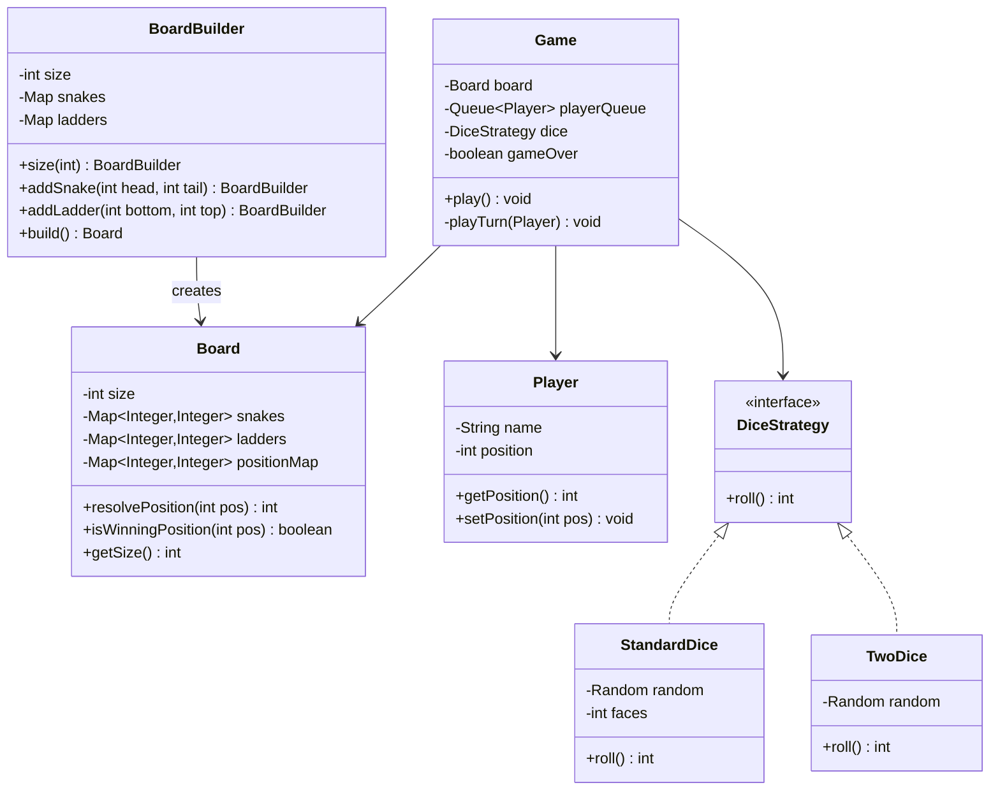

# Machine Coding: Design Snake & Ladder (LLD)

## Quick Summary (TL;DR)

| Aspect | Detail |
|--------|--------|
| **Goal** | Model a Snake & Ladder board game with clean OOP — support configurable boards, multiple players, and extensible rules |
| **Design Patterns Used** | Strategy (Dice), Builder (Board configuration), Queue (Turn management), Template Method (Game loop) |
| **Core Principle** | The board is a 1D array of cells; snakes and ladders are simply **position mappings** (from -> to). The game loop dequeues a player, rolls dice, resolves position, checks win condition, and enqueues the player back. |

---

## Noob Jargon Buster

| Term | Meaning |
|------|---------|
| **Position Mapping** | A snake or ladder maps one cell number to another. Snake: higher -> lower. Ladder: lower -> higher. Internally they are identical data structures. |
| **Game Loop** | The repeating cycle: pick next player -> roll dice -> move -> check snakes/ladders -> check win -> next player. |
| **Turn Queue** | A FIFO queue of players. After a player's turn, they go to the back of the queue (unless they won). |
| **Strategy Pattern** | Encapsulate dice-rolling logic behind an interface so you can swap in different dice variants (single die, two dice, loaded dice) without changing the game. |
| **Builder Pattern** | Construct a complex Board object step-by-step — add size, snakes, ladders — and validate constraints before building. |
| **Seeded Random** | A `Random` initialized with a fixed seed so it produces the same sequence every run — essential for deterministic testing. |

---

## 1. Problem Statement & Requirements

### Functional Requirements

1. Board of configurable size (default 100 cells, numbered 1-100).
2. Multiple players (2+), each starting at position 0 (off-board).
3. Configurable snakes (head > tail) and ladders (bottom < top).
4. A single six-sided die (extendable to multiple dice or custom faces).
5. Players take turns in order. On each turn:
   - Roll the die.
   - Move forward by the rolled amount.
   - If the new position has a snake head, slide down to the tail.
   - If the new position has a ladder bottom, climb up to the top.
   - If the new position exceeds the board size, the player stays put.
6. First player to reach exactly the last cell wins.
7. Print each move with details (roll, snakes bitten, ladders climbed).

### Non-Functional / Extensibility

- Support undo (move history stack).
- Support special dice (Strategy pattern).
- Detect infinite loops (snake at top of a ladder that leads to same snake).
- Thread-safe for potential async/multiplayer extensions.

---

## 2. Game Flow

### Turn Lifecycle

```
  +------------------+
  |  Dequeue Player   |
  +--------+---------+
           |
           v
  +------------------+
  |    Roll Dice      |
  +--------+---------+
           |
           v
  +------------------+
  |  Compute New Pos  |
  |  = current + roll |
  +--------+---------+
           |
           v
  +------------------+     YES
  | newPos > boardSize| ----------> Stay at current position
  +--------+---------+
           | NO
           v
  +------------------+
  | Check Snake/Ladder|---> Resolve chain (snake->ladder->snake...)
  +--------+---------+
           |
           v
  +------------------+     YES
  | newPos == boardSize| ---------> WINNER! End game.
  +--------+---------+
           | NO
           v
  +------------------+
  | Enqueue Player    |
  +------------------+
```

### Sample Board (10x10, cells 1-100)

```
  100  99  98  97  96  95  94  93  92  91
   81  82  83  84  85  86  87  88  89  90
   80  79  78  77  76  75  74  73  72  71
   61  62  63  64  65  66  67  68  69  70
   60  59  58  57  56  55  54  53  52  51
   41  42  43  44  45  46  47  48  49  50
   40  39  38  37  36  35  34  33  32  31
   21  22  23  24  25  26  27  28  29  30
   20  19  18  17  16  15  14  13  12  11
    1   2   3   4   5   6   7   8   9  10

  Snakes:  99->10, 65->25, 52->11, 36->6
  Ladders: 3->38, 14->57, 42->84, 67->96
```

### Position Resolution (Chained)

A cell can have a ladder whose top lands on a snake head. Resolution must chain:

```
  Player lands on 3  --> Ladder to 38
  38 has no mapping   --> Final position = 38

  Player lands on 99 --> Snake to 10
  10 has no mapping   --> Final position = 10
```

To prevent infinite loops, track visited positions during resolution (see Interview Angles).

---

## 3. Class Design & Architecture



### Key Design Decisions

| Decision | Rationale |
|----------|-----------|
| `positionMap` merges snakes + ladders into one lookup | Simplifies resolution — just check one map. Also makes chaining trivial. |
| `DiceStrategy` interface | Open/Closed principle — add new dice types without modifying Game. |
| `Queue<Player>` for turns | Natural FIFO order. Easy to add/remove players (e.g., skip turn, elimination). |
| Builder for Board | Validates constraints at build time (snake head > tail, ladder bottom < top, no overlap, no out-of-bounds). |
| Position 0 = off-board | Avoids confusion with cell 1. Players start at 0 and enter the board on their first roll. |

---

## 4. Key Java Implementation

### Board with Position Resolution

```java
class Board {
    private final int size;
    private final Map<Integer, Integer> positionMap; // merged snakes + ladders

    int resolvePosition(int position) {
        Set<Integer> visited = new HashSet<>();
        while (positionMap.containsKey(position)) {
            if (!visited.add(position)) {
                throw new IllegalStateException("Infinite loop at position " + position);
            }
            int next = positionMap.get(position);
            String type = next > position ? "LADDER" : "SNAKE";
            System.out.printf("    %s! %d -> %d%n", type, position, next);
            position = next;
        }
        return position;
    }
}
```

### Dice Strategy

```java
interface DiceStrategy {
    int roll();
}

class StandardDice implements DiceStrategy {
    private final Random random;
    private final int faces;

    StandardDice(int faces, Random random) {
        this.faces = faces;
        this.random = random;
    }

    @Override
    public int roll() {
        return random.nextInt(faces) + 1;
    }
}
```

### Game Loop

```java
class Game {
    void play() {
        while (!gameOver) {
            Player current = playerQueue.poll();
            playTurn(current);
            if (!gameOver) {
                playerQueue.offer(current);
            }
        }
    }

    private void playTurn(Player player) {
        int roll = dice.roll();
        int newPos = player.getPosition() + roll;

        if (newPos > board.getSize()) {
            System.out.printf("%s rolled %d — can't move (would exceed %d)%n",
                player.getName(), roll, board.getSize());
            return;
        }

        System.out.printf("%s rolled %d — moves %d -> %d%n",
            player.getName(), roll, player.getPosition(), newPos);

        newPos = board.resolvePosition(newPos);
        player.setPosition(newPos);

        if (board.isWinningPosition(newPos)) {
            System.out.printf("*** %s WINS! ***%n", player.getName());
            gameOver = true;
        }
    }
}
```

### Board Builder with Validation

```java
class BoardBuilder {
    BoardBuilder addSnake(int head, int tail) {
        if (head <= tail) throw new IllegalArgumentException("Snake head must be > tail");
        if (head > size || tail < 1) throw new IllegalArgumentException("Out of bounds");
        if (ladders.containsKey(head)) throw new IllegalArgumentException("Conflict at " + head);
        snakes.put(head, tail);
        return this;
    }

    Board build() {
        Map<Integer, Integer> merged = new HashMap<>();
        merged.putAll(snakes);
        merged.putAll(ladders);
        return new Board(size, merged, Map.copyOf(snakes), Map.copyOf(ladders));
    }
}
```

---

## 5. SDE-2 Interview Angles

### Q1: How do you detect infinite loops (e.g., snake at top of a ladder)?

**Answer**: During `resolvePosition`, maintain a `Set<Integer> visited`. Before following a mapping, check if the position is already in the set. If yes, throw an `IllegalStateException`. This detects cycles like: cell 20 (ladder) -> 40, cell 40 (snake) -> 20.

Better yet, validate at **build time**: run DFS/BFS on the position map and detect cycles before the game starts. This is a compile-time guarantee vs. a runtime check.

```java
// Build-time validation in BoardBuilder.build()
for (int pos : merged.keySet()) {
    Set<Integer> visited = new HashSet<>();
    int current = pos;
    while (merged.containsKey(current)) {
        if (!visited.add(current)) {
            throw new IllegalArgumentException("Cycle detected involving position " + pos);
        }
        current = merged.get(current);
    }
}
```

---

### Q2: How do you extend to multiplayer with proper turn management?

**Answer**: Use a `Queue<Player>` (LinkedList or ArrayDeque). The game loop dequeues the front player, processes their turn, and enqueues them at the back.

This naturally supports:
- **Skip turn**: Don't enqueue the player back for one round (use a skip counter).
- **Extra turn on 6**: Re-add the player to the front of the queue (`offerFirst` with Deque).
- **Player elimination**: Simply don't re-enqueue.
- **Dynamic join/leave**: Offer new players into the queue at any time.

```java
Deque<Player> turnQueue = new ArrayDeque<>();

// Extra turn on rolling 6
if (roll == 6) {
    turnQueue.offerFirst(currentPlayer); // goes again
} else {
    turnQueue.offerLast(currentPlayer);  // normal rotation
}
```

---

### Q3: How do you support special dice variants (two dice, loaded dice)?

**Answer**: Apply the **Strategy pattern**. Define a `DiceStrategy` interface with a single `roll()` method. Inject the strategy into the `Game` class.

| Variant | Implementation |
|---------|---------------|
| Single die (1-6) | `random.nextInt(6) + 1` |
| Two dice (2-12) | Sum of two `nextInt(6) + 1` |
| Loaded die | Weighted random using cumulative probability array |
| Crooked die (odd only) | `random.nextInt(3) * 2 + 1` -> produces 1, 3, 5 |

```java
class LoadedDice implements DiceStrategy {
    private final int[] weights; // cumulative weights
    private final Random random;

    public int roll() {
        int r = random.nextInt(weights[weights.length - 1]);
        for (int i = 0; i < weights.length; i++) {
            if (r < weights[i]) return i + 1;
        }
        return weights.length;
    }
}
```

---

### Q4: How do you make the board configurable (Builder pattern)?

**Answer**: Use a `BoardBuilder` that:
1. Sets board size (default 100).
2. Adds snakes with validation (head > tail, in bounds, no conflict with existing ladder at same cell).
3. Adds ladders with validation (bottom < top, in bounds, no conflict with existing snake at same cell).
4. Validates no cycles in the merged position map.
5. Ensures no snake/ladder at position 1 (start) or position N (finish).
6. Returns an **immutable** `Board` object.

```java
Board board = new BoardBuilder()
    .size(100)
    .addSnake(99, 10)
    .addSnake(65, 25)
    .addLadder(3, 38)
    .addLadder(14, 57)
    .build(); // validates everything here
```

This separates construction from representation and makes board creation testable and reusable (e.g., load from JSON/config file).

---

### Q5: How do you implement undo functionality?

**Answer**: Maintain a `Stack<Move>` where `Move` records the player, previous position, new position, and dice roll. On undo, pop the stack and restore the player's position.

```java
record Move(Player player, int fromPos, int toPos, int diceRoll) {}

Stack<Move> moveHistory = new Stack<>();

// After each move:
moveHistory.push(new Move(player, oldPos, newPos, roll));

// Undo:
Move last = moveHistory.pop();
last.player().setPosition(last.fromPos());
// Also need to rotate the player queue back
```

For a full undo, you also need to restore the turn queue state. Consider using the **Memento pattern** — snapshot the entire game state (all player positions + queue order) and push that onto the stack.

---

### Q6: How do you test a game with randomized dice?

**Answer**: Inject a **seeded `Random`** into the dice. With a fixed seed, the sequence of rolls is deterministic and reproducible.

```java
// Test with known sequence
Random seeded = new Random(42L);
DiceStrategy dice = new StandardDice(6, seeded);
// dice.roll() will always produce the same sequence: 1, 4, 3, 2, 6, ...

// Or use a mock/stub dice for exact control:
class FixedDice implements DiceStrategy {
    private final int[] rolls;
    private int index = 0;

    FixedDice(int... rolls) { this.rolls = rolls; }

    public int roll() { return rolls[index++]; }
}

// Test: player lands on snake
FixedDice dice = new FixedDice(5); // player at 0, moves to 5
// If snake at 5->2, assert player position == 2
```

This is a textbook example of **Dependency Injection** enabling testability. The `Game` class never creates its own `Random` — it receives a `DiceStrategy` from the caller.
