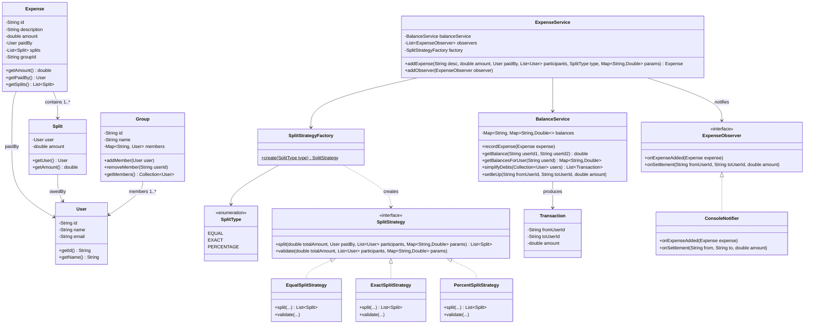

# Machine Coding: Design Splitwise (LLD)

## Quick Summary (TL;DR)
* **Goal**: Build an in-memory expense-splitting system that lets users create groups, add expenses with flexible split strategies, track balances, and simplify debts using a greedy min-transactions algorithm.
* **Design Patterns Used**:
  - **Strategy Pattern**: Interchangeable split algorithms (Equal, Exact, Percentage) behind a common `SplitStrategy` interface.
  - **Observer Pattern**: Notify users when expenses are added or debts are settled.
  - **Factory Pattern**: Create the right `SplitStrategy` from a `SplitType` enum.
* **Core Algorithm**: Debt simplification via greedy matching — compute net balances, then repeatedly match the largest debtor with the largest creditor to minimize total transactions.

---

## 🤓 Noob Jargon Buster

* **Split Strategy**: A rule for dividing up a bill. E.g., `EqualSplit` (everyone pays the exact same share), `ExactSplit` (everyone specifies a precise dollar amount they owe), or `PercentageSplit` (everyone owes a specific percentage like 30%, 70%).
* **Net Balance**: The overall financial standing of a user. It is calculated as `(All money owed to me) - (All money I owe others)`. If it is positive, you are owed money (a creditor). If it is negative, you owe money (a debtor). If it's zero, you are completely settled up.
* **Debt Simplification**: Reducing the total number of payments needed to settle up. E.g., if User A owes User B $10, and User B owes User C $10, we can simplify this so User A just pays User C $10 directly (cutting 2 transactions down to 1).
* **Greedy Matching**: The algorithm used to simplify debts. We calculate everyone's net balance, sort them, and repeatedly pair the person who owes the absolute most (largest debtor) with the person who is owed the absolute most (largest creditor) until everyone is settled.

---

## 1. Problem Statement & Requirements

Design an expense-splitting system (like Splitwise) that supports:
1. **User Management**: Create users with unique IDs.
2. **Group Management**: Create groups, add/remove members.
3. **Flexible Splitting**: Split expenses equally, by exact amounts, or by percentages.
4. **Balance Tracking**: Track per-pair balances across all expenses (who owes whom and how much).
5. **Debt Simplification**: Reduce N*(N-1)/2 possible debts to the minimum number of transactions needed to settle all balances.
6. **Notifications**: Notify participants when an expense is added or a debt is settled.
7. **Validation**: Reject invalid splits (e.g., exact amounts that don't sum to the total, percentages that don't sum to 100).

---

## 2. Class Diagram



---

## 3. Core Algorithm: Debt Simplification

The naive approach tracks O(N^2) pairwise debts. Simplification reduces this to at most N-1 transactions.

### Step 1: Compute Net Balances

For each user, sum up all amounts owed to them and all amounts they owe. The difference is their net balance:
- **Positive** = net creditor (owed money)
- **Negative** = net debtor (owes money)

### Step 2: Greedy Matching

```
While there are unsettled balances:
  1. Find the user with the LARGEST negative balance (max debtor)
  2. Find the user with the LARGEST positive balance (max creditor)
  3. Transfer min(|debtor_balance|, creditor_balance) from debtor to creditor
  4. Update both balances (one or both become zero)
```

### Why Greedy Works

The sum of all net balances is always zero (money is conserved). Each greedy step zeros out at least one user's balance, so it terminates in at most N-1 steps. While not always globally optimal (that's NP-hard for minimum transactions), the greedy approach is optimal for most practical cases and runs in O(N log N) with a priority queue.

### Implementation

```java
public List<Transaction> simplifyDebts(Collection<User> users) {
    // Step 1: Compute net balances
    Map<String, Double> netBalance = new HashMap<>();
    for (User user : users) {
        double net = 0;
        Map<String, Double> userBalances = balances.getOrDefault(user.getId(), Map.of());
        for (double val : userBalances.values()) {
            net += val;  // positive = owed to me, negative = I owe
        }
        if (Math.abs(net) > 0.01) {
            netBalance.put(user.getId(), net);
        }
    }

    // Step 2: Greedy matching with two heaps
    PriorityQueue<double[]> debtors = new PriorityQueue<>((a, b) -> Double.compare(a[1], b[1]));  // min-heap (most negative first)
    PriorityQueue<double[]> creditors = new PriorityQueue<>((a, b) -> Double.compare(b[1], a[1])); // max-heap (most positive first)

    for (var entry : netBalance.entrySet()) {
        if (entry.getValue() < -0.01) debtors.offer(new double[]{hash(entry.getKey()), entry.getValue()});
        else if (entry.getValue() > 0.01) creditors.offer(new double[]{hash(entry.getKey()), entry.getValue()});
    }

    List<Transaction> result = new ArrayList<>();
    while (!debtors.isEmpty() && !creditors.isEmpty()) {
        // Match max debtor with max creditor
        double[] debtor = debtors.poll();
        double[] creditor = creditors.poll();
        double amount = Math.min(-debtor[1], creditor[1]);

        result.add(new Transaction(unhash(debtor[0]), unhash(creditor[0]), amount));

        debtor[1] += amount;     // debtor's debt decreases
        creditor[1] -= amount;   // creditor's credit decreases

        if (debtor[1] < -0.01) debtors.offer(debtor);
        if (creditor[1] > 0.01) creditors.offer(creditor);
    }
    return result;
}
```

**Simplified version used in the demo** (ArrayList-based, O(N^2) but clearer):

```java
public List<Transaction> simplifyDebts(Collection<User> users) {
    Map<String, Double> netBalance = new HashMap<>();
    for (User u : users) {
        Map<String, Double> ub = balances.getOrDefault(u.getId(), Collections.emptyMap());
        double net = ub.values().stream().mapToDouble(Double::doubleValue).sum();
        if (Math.abs(net) > 0.01) netBalance.put(u.getId(), net);
    }

    List<String> ids = new ArrayList<>(netBalance.keySet());
    List<Transaction> result = new ArrayList<>();

    while (!ids.isEmpty()) {
        // Find max debtor and max creditor
        String maxDebtor = null, maxCreditor = null;
        double minVal = 0, maxVal = 0;
        for (String id : ids) {
            double val = netBalance.get(id);
            if (val < minVal) { minVal = val; maxDebtor = id; }
            if (val > maxVal) { maxVal = val; maxCreditor = id; }
        }
        if (maxDebtor == null || maxCreditor == null) break;

        double amount = Math.min(-minVal, maxVal);
        result.add(new Transaction(maxDebtor, maxCreditor, round(amount)));

        netBalance.put(maxDebtor, round(minVal + amount));
        netBalance.put(maxCreditor, round(maxVal - amount));

        ids.removeIf(id -> Math.abs(netBalance.get(id)) < 0.01);
    }
    return result;
}
```

---

## 4. Key Java Implementation Classes

The runnable code is in [SplitwiseDemo.java](SplitwiseDemo.java).

### 1. The Strategy Interface

```java
interface SplitStrategy {
    List<Split> split(double totalAmount, User paidBy,
                      List<User> participants, Map<String, Double> params);
    void validate(double totalAmount, List<User> participants,
                  Map<String, Double> params);
}
```

Clean contract — each split algorithm implements this. `params` is a flexible map: empty for EQUAL, `{userId: amount}` for EXACT, `{userId: percentage}` for PERCENTAGE.

### 2. Equal Split Strategy

```java
class EqualSplitStrategy implements SplitStrategy {
    public void validate(double totalAmount, List<User> participants,
                         Map<String, Double> params) {
        if (participants.isEmpty())
            throw new IllegalArgumentException("Need at least one participant");
    }

    public List<Split> split(double totalAmount, User paidBy,
                             List<User> participants, Map<String, Double> params) {
        validate(totalAmount, participants, params);
        double perPerson = totalAmount / participants.size();
        return participants.stream()
            .map(u -> new Split(u, round(perPerson)))
            .collect(Collectors.toList());
    }
}
```

### 3. Exact Split Strategy

```java
class ExactSplitStrategy implements SplitStrategy {
    public void validate(double totalAmount, List<User> participants,
                         Map<String, Double> params) {
        double sum = participants.stream()
            .mapToDouble(u -> params.getOrDefault(u.getId(), 0.0))
            .sum();
        if (Math.abs(sum - totalAmount) > 0.01)
            throw new IllegalArgumentException(
                "Exact amounts (" + sum + ") must sum to total (" + totalAmount + ")");
    }

    public List<Split> split(double totalAmount, User paidBy,
                             List<User> participants, Map<String, Double> params) {
        validate(totalAmount, participants, params);
        return participants.stream()
            .map(u -> new Split(u, params.get(u.getId())))
            .collect(Collectors.toList());
    }
}
```

### 4. Percentage Split Strategy

```java
class PercentSplitStrategy implements SplitStrategy {
    public void validate(double totalAmount, List<User> participants,
                         Map<String, Double> params) {
        double totalPct = participants.stream()
            .mapToDouble(u -> params.getOrDefault(u.getId(), 0.0))
            .sum();
        if (Math.abs(totalPct - 100.0) > 0.01)
            throw new IllegalArgumentException(
                "Percentages (" + totalPct + ") must sum to 100");
    }

    public List<Split> split(double totalAmount, User paidBy,
                             List<User> participants, Map<String, Double> params) {
        validate(totalAmount, participants, params);
        return participants.stream()
            .map(u -> new Split(u, round(totalAmount * params.get(u.getId()) / 100.0)))
            .collect(Collectors.toList());
    }
}
```

### 5. Balance Tracking (Adjacency Map)

```java
class BalanceService {
    // balances[A][B] = +50 means "B owes A $50"
    // balances[B][A] = -50 means "A is owed $50 by B" (always mirrors)
    private final Map<String, Map<String, Double>> balances = new HashMap<>();

    public void recordExpense(Expense expense) {
        String payerId = expense.getPaidBy().getId();
        for (Split split : expense.getSplits()) {
            String owerId = split.getUser().getId();
            if (owerId.equals(payerId)) continue; // skip self

            // ower owes payer
            addBalance(payerId, owerId, split.getAmount());   // payer is owed
            addBalance(owerId, payerId, -split.getAmount());   // ower owes
        }
    }

    private void addBalance(String userId, String otherUserId, double amount) {
        balances.computeIfAbsent(userId, k -> new HashMap<>())
                .merge(otherUserId, amount, Double::sum);
    }
}
```

**Why an adjacency map instead of a single flat map?**

| Approach | Lookup "what does user A owe?" | Memory |
|----------|-------------------------------|--------|
| `Map<Pair<A,B>, Double>` | Scan all pairs — O(N^2) | O(N^2) |
| `Map<A, Map<B, Double>>` | Direct — O(1) per pair, O(N) for all of A's debts | O(N^2) but structured |

The adjacency map gives O(1) per-pair lookups and O(N) per-user balance queries, which is exactly what the UI needs ("show me all balances for user X").

### 6. Observer Pattern — Notifications

```java
interface ExpenseObserver {
    void onExpenseAdded(Expense expense);
    void onSettlement(String fromUserId, String toUserId, double amount);
}

class ConsoleNotifier implements ExpenseObserver {
    public void onExpenseAdded(Expense expense) {
        System.out.println("[NOTIFY] " + expense.getPaidBy().getName()
            + " paid " + expense.getAmount() + " for '" + expense.getDescription() + "'");
        for (Split s : expense.getSplits()) {
            if (!s.getUser().getId().equals(expense.getPaidBy().getId())) {
                System.out.println("  -> " + s.getUser().getName() + " owes " + s.getAmount());
            }
        }
    }

    public void onSettlement(String from, String to, double amount) {
        System.out.println("[SETTLE] " + from + " paid " + to + " $" + amount);
    }
}
```

**Why Observer here?** In production Splitwise, expense creation triggers push notifications, emails, in-app alerts, and activity feed updates. The Observer pattern decouples the expense logic from delivery mechanisms — adding SMS notification is a new class, not a code change.

---

## 5. How the Pieces Fit Together

```
User creates expense
        |
        v
ExpenseService.addExpense(desc, amount, paidBy, participants, EQUAL, {})
        |
        ├── SplitStrategyFactory.create(EQUAL) -> EqualSplitStrategy
        |
        ├── strategy.validate(amount, participants, params)  // throws if invalid
        |
        ├── strategy.split(amount, paidBy, participants, params) -> List<Split>
        |
        ├── new Expense(desc, amount, paidBy, splits)
        |
        ├── balanceService.recordExpense(expense)  // update adjacency map
        |
        └── observers.forEach(o -> o.onExpenseAdded(expense))  // notify
```

```
User requests simplified debts
        |
        v
balanceService.simplifyDebts(group.getMembers())
        |
        ├── Compute net balance per user (sum of adjacency row)
        |
        ├── Greedy: match max debtor with max creditor
        |
        └── Return List<Transaction> — minimal set of transfers
```

---

## 6. SDE-2 Interview Angles

### Question 1: "Why Strategy pattern for splits instead of a switch-case?"

* **Answer**: "Each split type has different validation rules — EXACT checks if amounts sum to the total, PERCENTAGE checks if percentages sum to 100, EQUAL just needs at least one participant. A switch-case in `addExpense()` would mix validation logic for all types into one method. Strategy gives each split type its own `validate()` and `split()` methods. Adding a new split type (e.g., SHARES-based where you specify ratios like 2:3:5) is a new class, not modifying existing code — Open/Closed Principle."

### Question 2: "How does debt simplification work? Is it optimal?"

* **Answer**: "I compute net balances first — sum all amounts owed to/from each user into a single number. Then I greedily match the largest debtor with the largest creditor, transferring `min(|debt|, credit)`. Each step zeros out at least one person, so it takes at most N-1 transactions. Finding the true minimum number of transactions is NP-hard (it reduces to the subset sum problem — you'd need to find subsets whose net balances sum to zero). The greedy approach is optimal for most practical cases (3-5 people in a group) and runs in O(N^2) or O(N log N) with heaps."

### Question 3: "How do you handle floating-point precision in money calculations?"

* **Answer**: "In this demo, I use `double` with rounding to 2 decimal places via `Math.round(val * 100.0) / 100.0` and a 0.01 epsilon for comparisons. In production, I'd use `BigDecimal` with `RoundingMode.HALF_UP` or — better — store amounts in cents as `long` to avoid floating-point entirely. The validation checks use epsilon-based comparison (`Math.abs(sum - total) > 0.01`) rather than exact equality."

### Question 4: "How would you handle concurrent expense additions?"

* **Answer**: "The `BalanceService.recordExpense()` method modifies the adjacency map, which isn't thread-safe with `HashMap`. Two options:
  1. **Synchronized**: Wrap `recordExpense()` in a `synchronized` block. Simple, works for moderate concurrency.
  2. **ConcurrentHashMap + merge()**: Use `ConcurrentHashMap` for the outer map and `ConcurrentHashMap.merge()` for atomic balance updates. The `merge()` function is atomic for a given key, so concurrent updates to the same pair won't corrupt data. This is the approach I'd use — it gives per-pair granularity without a global lock."

### Question 5: "How would you persist balances across restarts?"

* **Answer**: "The adjacency map maps directly to a `balances` table: `(user_id, other_user_id, amount)` with a composite primary key. `recordExpense()` becomes a SQL `UPDATE balances SET amount = amount + ? WHERE user_id = ? AND other_user_id = ?` wrapped in a transaction (updating both directions atomically). The expense itself goes in an `expenses` table with a `splits` join table. The balance table is denormalized — it's derivable from expenses but avoids re-computing on every read."

### Question 6: "Why Observer for notifications? Wouldn't an event bus be better?"

* **Answer**: "For this in-memory demo, the Observer pattern is sufficient — the `ExpenseService` directly calls observers. In production, yes — I'd publish an `ExpenseCreated` event to a message broker (Kafka/SQS). This decouples the expense write path from notification delivery, allows retries, and lets notification services scale independently. The Observer pattern here models the same concept at a smaller scale — the migration to events is mechanical."

### Question 7: "How does Splitwise handle the 'settle up' flow?"

* **Answer**: "Settling up is recording a reverse expense. If A owes B $50, then A 'pays' B $50 — I call `settleUp(A, B, 50)` which subtracts from `balances[B][A]` and `balances[A][B]`. It's not a new expense — it's a direct balance adjustment. The Observer fires `onSettlement()` to notify both parties. Partial settlements are allowed — A can settle $20 of the $50, leaving $30 outstanding."
