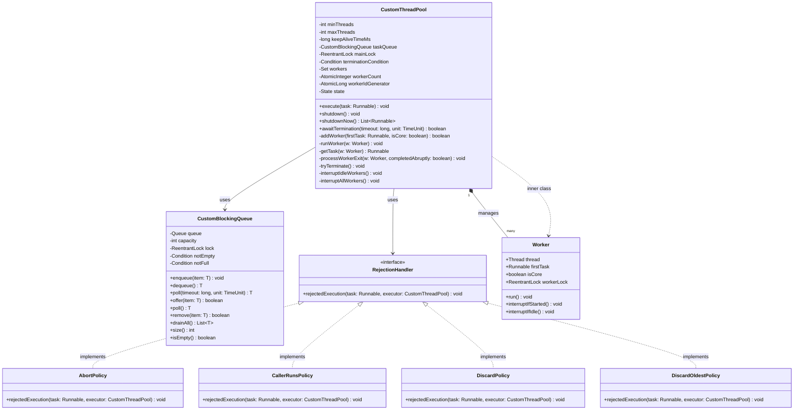

# Machine Coding: Design Custom Thread Pool (LLD)

## Quick Summary (TL;DR)
A **Custom Thread Pool** is an implementation of an execution service from scratch, bypassing Java's built-in `Executor` framework. It manages a thread-safe task queue (Custom Blocking Queue) and a set of worker threads that pull and execute tasks.
Key highlights of this design:
- **Dynamic Worker Sizing**: Threads scale up from `minThreads` (core) to `maxThreads` based on queue saturation and scale back down after a `keepAliveTime` of idle polling.
- **Custom Blocking Queue**: Engineered from scratch using `ReentrantLock` and dual `Condition` variables (`notEmpty`, `notFull`) to safely handle concurrent enqueue/dequeue operations.
- **Rejection Policies**: Standard strategies like `AbortPolicy`, `CallerRunsPolicy`, `DiscardPolicy`, and `DiscardOldestPolicy` are implemented to deal with saturated queues.
- **Graceful & Abrupt Shutdown**: `shutdown()` runs all queued tasks and rejects new ones, whereas `shutdownNow()` halts executing threads immediately and returns all unprocessed tasks.

---

## Noob Jargon Buster
- **Thread Pool**: A managed pool of reusable worker threads. Instead of creating and destroying a system thread for every task, we assign tasks to pre-warmed threads.
- **Blocking Queue**: A thread-safe queue that blocks a producer trying to insert elements when full, and blocks a consumer trying to take elements when empty.
- **Core (Min) Threads**: The minimum number of worker threads kept alive in the pool, even if they are completely idle.
- **Max Threads**: The maximum number of threads allowed to run concurrently in the pool under heavy load (when the task queue is completely saturated).
- **Keep-Alive Time**: The maximum duration that idle non-core worker threads will wait for a task before shutting down.
- **Rejection Policy**: The callback action triggered when a new task is submitted but the queue is full and worker count has reached `maxThreads`.
- **Compare-And-Swap (CAS)**: An atomic CPU instruction used to manage state changes (like thread counts) lock-free, preventing race conditions.

---

## 1. Problem Statement & Requirements

### Problem Statement
In high-concurrency systems, thread creation is expensive due to memory allocation, kernel context switching, and resource limits. We need a robust, custom implementation of a Thread Pool to manage task scheduling efficiently, avoiding Java's built-in executor libraries (`java.util.concurrent.Executors`).

### Core Requirements
1. **Thread-Safe Bounded Task Queue**: Implement a custom thread-safe blocking queue of fixed capacity.
2. **Worker Lifecycle Management**: Maintain a set of active worker threads. Worker threads must continuously pull tasks from the queue and execute them.
3. **Dynamic Thread Scaling**:
   - Spawn new threads up to `minThreads` as tasks arrive.
   - Queue tasks when `minThreads` are busy.
   - If the queue fills up, scale up to `maxThreads` by spawning non-core workers.
   - Scale back down to `minThreads` by terminating idle non-core workers if they poll the queue and time out (using `keepAliveTime`).
4. **Shutdown Support**:
   - `shutdown()`: Reject new tasks, allow queued tasks to complete.
   - `shutdownNow()`: Interrupt running tasks, clear queue, and return remaining tasks.
   - `awaitTermination(...)`: Block the calling thread until the pool has fully terminated.
5. **Configurable Rejection Policies**: Provide implementations for:
   - `Abort`: Throw an exception.
   - `CallerRuns`: Execute the task in the submitter's thread.
   - `Discard`: Silently drop the task.
   - `DiscardOldest`: Evict the oldest queued task and retry.

---

## 2. Class Diagram



---

## 3. Core Design Decisions & Internals

### Custom Blocking Queue Implementation
The `CustomBlockingQueue<T>` encapsulates standard queue manipulation behind a `ReentrantLock`. It uses:
- **`notEmpty` Condition**: Suspends consumer workers when the queue contains zero elements.
- **`notFull` Condition**: Suspends producers (submitters) if the queue has reached its maximum capacity.
- **`poll(long timeout, TimeUnit unit)`**: Uses `Condition.awaitNanos()` to block for a specified duration, supporting worker thread keep-alive timeouts.

### Worker Execution Loop (`runWorker`)
Each `Worker` thread runs in a continuous loop:
1. It executes its initial task (`firstTask`), if provided.
2. It fetches subsequent tasks by calling `getTask(w)` which polls the custom blocking queue.
3. If no tasks are available and `workerCount > minThreads`, `getTask(w)` uses a timed poll. If it times out, the worker exits the loop, decreasing the pool size safely.

### Thread Synchronization Lifecycle
```
Task Submitted -> Execute()
       |
       |----> [Active Threads < minThreads?] --(Yes)--> Spawn Core Worker Thread
       |
       |----> [No] -> [Is Queue Bounded Capacity Available?] --(Yes)--> Add Task to Queue
       |
       |----> [No] -> [Active Threads < maxThreads?] --(Yes)--> Spawn Non-Core Worker Thread
       |
       |----> [No] -> Saturation! Trigger RejectionHandler
```

---

## 4. Concurrency & Thread-Safety Design

### Comparing Concurrency Primitives

| Feature / Primitive | `ReentrantLock` & `Condition` | `AtomicInteger` (CAS) | `volatile` |
| :--- | :--- | :--- | :--- |
| **Used For** | Task Queue coordination & thread state transitions | Safe tracking of active worker thread count | Low-overhead state check (`State` enum) |
| **Why Chosen** | Essential for blocking waiting threads on conditions without busy spinning. | Allows lock-free modification of thread counts during fast-path task submission. | Guarantees that updates to the pool's execution state are visible to all workers instantly. |

### How Thread-Safety is Guaranteed
1. **Double-Check State Pattern**: During task execution submission, the pool state is verified multiple times. If the state transitions to `SHUTDOWN` after queueing a task, we safely remove the task and reject it.
2. **Worker Status Tracking**: In `runWorker`, each worker acquires its own internal `workerLock` while running a task. When the manager calls `shutdown()`, it attempts `workerLock.tryLock()`. If successful, the worker is known to be idle (waiting in the blocking queue), and can be safely interrupted.
3. **Atomic Counter Updates**: Spawning workers requires a thread-safe increment of `workerCount` using CAS (`compareAndSet`). If the pool configuration limits are reached concurrently, only the winning threads succeed in spawning.

---

## 5. Interview Corner / Follow-up Questions

### Q1: How do you prevent thread leaks when user tasks throw runtime exceptions?
**Answer:** The task execution in `runWorker` is wrapped in a `try-catch` block catching all `Throwable` exceptions. If an exception occurs, `completedAbruptly` remains `true`, and the worker terminates. In the `finally` block, `processWorkerExit` is invoked. It decrements the thread counter and spawns a replacement worker thread to maintain pool health (unless the pool is actively shut down).

### Q2: What is the purpose of `workerLock` within the `Worker` class? Why not rely on standard thread interrupts alone?
**Answer:** Without `workerLock`, it is difficult to distinguish a worker thread that is actively processing a critical business task from one that is idle and blocked waiting for a task in the queue.
- During `shutdown()`, we only want to interrupt idle workers (so they stop polling the queue and exit). Attempting to acquire `workerLock.tryLock()` ensures we only interrupt threads that are not currently running a task.
- During `shutdownNow()`, we interrupt all workers unconditionally to halt execution.

### Q3: Why does `getTask()` check the worker count and compare it to `minThreads` dynamically?
**Answer:** Workers are not statically flagged as "core" or "non-core". Instead, the pool dynamically shrinks whenever the active worker count exceeds `minThreads`.
If `workerCount > minThreads`, any worker polling the queue will switch from blocking indefinitely (`dequeue()`) to timed blocking (`poll()`). This dynamic design ensures that *any* worker thread that remains idle for longer than `keepAliveTime` will safely terminate, scaling down the pool resources seamlessly.

### Q4: Why does `shutdown()` not clear the task queue, while `shutdownNow()` does?
**Answer:** This aligns with the semantics of graceful vs. immediate shutdown:
- **`shutdown()`** signifies that the application is terminating but wishes to complete all tasks currently scheduled. New submissions are rejected, but the threads drain the queue fully.
- **`shutdownNow()`** signifies an emergency or immediate halt. It clears the queue (returning the unprocessed runnables to the caller so they can be logged or re-queued later) and actively interrupts running worker threads.
